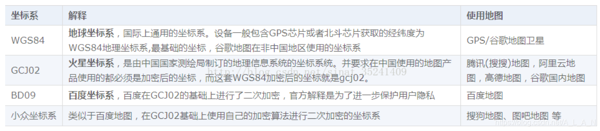
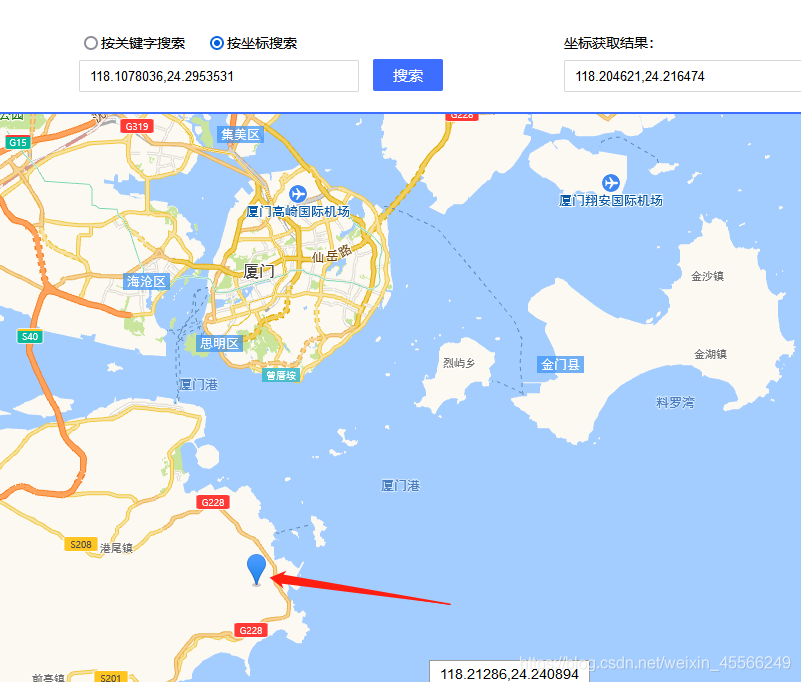
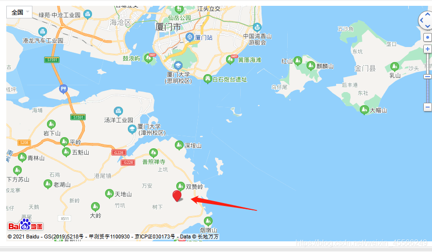

# 지도 측위 오차

[toc]

## 머리말

腾讯, 高德地图가 사용하는 좌표와 상위 컴퓨터의 좌표는 다릅니다. 우리의 상위 컴퓨터는 天地图의 API(WGS-84 표준)를 호출하기 때문에 변환된 데이터에 차이가 생깁니다. GPS/北斗 측위 정보를 획득한 후, GPS/北斗의 측위 정보를 天地图(WGS-84 표준)의 좌표로 변환한 다음 다시 변환해야 합니다.

## 자주 사용되는 좌표계 소개

    WGS-84(GPS)
    국제 표준. 일반적으로 국제 표준 GPS 기기에서 획득하는 좌표는 WGS-84이며, 국제 지도 제공자가 사용하는 좌표계입니다.
    
    GCJ-02
    중국 표준. 국가측량국이 02년에 발표한 좌표계입니다. ‘화성 좌표’라고도 합니다. 중국에서는 지리 위치에 대해 최소한 ‘GCJ-02’로 최초 암호화를 해야 합니다. 예를 들어 谷歌中国, 高德, 腾讯 등이 이 좌표계를 사용하고 있습니다.
    
    BD-09
    百度 표준. ‘GCJ-02’를 기반으로 2차 암호화를 수행합니다.



## 北斗 측위 시스템 좌표

北斗 측위 시스템과 연동해 본 적이 있는 분이라면 한 가지 문제를 발견할 수 있을 것입니다. 北斗 좌표의 위도 경도가 모두 100배 된 것처럼 보이지 않나요?

$GNRMC,083735.000,A,2429.53531,N,11810.78036,E,0.54,171.11,190621,A*7E

이것이 우리 北斗 측위 시스템이 수신한 좌표값입니다. 북위는 2429.53531, 동경은 11810.78036임을 알 수 있습니다. 만약 이 위도 경도를 그대로 100으로 나누면 북위 24.2953531, 동경 118.1078036이 되어, 百度 또는 高德地图에서 좌표 편차가 심하게 납니다.

高德地图 측위:


百度地图 측위:



둘 모두의 거리가 수십 킬로미터씩 어긋나 있음을 알 수 있습니다. 그 원인은 국내에서는 高德이든 百度든 그들이 사용하는 위도 경도 값이 암호화된 후의 값이며, GPS의 실제 위도 경도를 직접 사용하여 측위하는 것이 아니기 때문입니다. 따라서 北斗 측위 시스템의 좌표계를 상용 지도에서 사용하고자 한다면, 해당하는 암호화 변환 처리를 거쳐야만 올바르게 사용할 수 있습니다.

## 좌표계의 상호 변환

먼저 한 가지 강조하고자 합니다. 사실 우리 北斗 측위의 좌표계 값은 단순한 100배 관계가 아니라, 한 번 도분초 변환을 해야 합니다. 즉 우리가 획득한 北斗 좌표값, 북위 2429.53531, 동경 11810.78036은 다음과 같이 계산해야 합니다: 24+(29.53531/60)≈ 24.49225517 118+(10.78036/60)≈118.17967267

이 두 값이 바로 우리가 변환 공식에 대입해야 하는 좌표값입니다. 만약 100배 관계의 값을 직접 사용하여 변환하면 측위 역시 어긋납니다. 따라서 먼저 gps84 표준의 좌표값으로 변환해야 합니다.

```python
def str_To_Gps84(self, in_data1, in_data2):
    len_data1 = len(in_data1)
    str_data2 = "%05d" % int(in_data2)
    temp_data = int(in_data1)
    symbol = 1
    if temp_data < 0:
        symbol = -1
    degree = int(temp_data / 100.0)
    str_decimal = str(in_data1[len_data1-2]) + str(in_data1[len_data1-1]) + '.' + str(str_data2)
    f_degree = float(str_decimal)/60.0
    # print("f_degree:", f_degree)
    if symbol > 0:
        result = degree + f_degree
	else:
		result = degree - f_degree
	return result
```

WGS-84를 GCJ-02로 변환:


```python
def gps84_to_gcj02(self, lat, lon):
    if (self.outOfChina(lat, lon)):
        return [0, 0]
    dLat = self.transformLat(lon - 105.0, lat - 35.0)
    dLon = self.transformLon(lon - 105.0, lat - 35.0)
    radLat = lat / 180.0 * self.PI
    magic = math.sin(radLat)
    magic = 1 - self.EE * magic * magic
    sqrtMagic = math.sqrt(magic)
    dLat = (dLat * 180.0)/((self.A * (1 - self.EE))/(magic * sqrtMagic) * self.PI)
    dLon = (dLon * 180.0) / (self.A / sqrtMagic * math.cos(radLat) * self.PI)
    mgLat = lat + dLat
    mgLon = lon + dLon
    return [mgLat, mgLon]
```

GCJ-02를 BD-09로 변환:

```python
def gcj02_to_bd09(self, gg_lat, gg_lon):
    x = gg_lon
    y = gg_lat
    z = math.sqrt(x * x + y * y) + 0.00002 * math.sin(y * self.PI)
    theta = math.atan2(y, x) + 0.000003 * math.cos(x * self.PI)
    bd_lon = z * math.cos(theta) + 0.0065
    bd_lat = z * math.sin(theta) + 0.006
    return [bd_lat, bd_lon]
```

기타 중간에 필요한 함수와 변수:

```python
self.PI = 3.1415926535897932384626
self.A = 6378245.0
self.EE = 0.00669342162296594323

def outOfChina(self, lat, lon):
    if (lon < 72.004 or lon > 137.8347):
        return True
    if (lat < 0.8293 or lat > 55.8271):
        return True
    return False
    
def transform(self, lat, lon):
    if (self.outOfChina(lat, lon)):
        return [lat, lon]
    dLat = self.transformLat(lon - 105.0, lat - 35.0)
    dLon = self.transformLon(lon - 105.0, lat - 35.0)
    radLat = lat / 180.0 * self.PI
    magic = math.sin(radLat)
    magic = 1 - self.EE * magic * magic
    sqrtMagic = math.sqrt(magic)
    dLat = (dLat * 180.0) / ((self.A * (1 - self.EE)) / (magic * sqrtMagic) *self.PI)
    dLon = (dLon * 180.0) / (self.A / sqrtMagic * math.cos(radLat) * self.PI)
    mgLat = lat + dLat
    mgLon = lon + dLon
    return [mgLat, mgLon]
    
def transformLat(self, x, y):
    ret = -100.0 + 2.0 * x + 3.0 * y + 0.2 * y * y + 0.1 * x * y + 0.2 * math.sqrt(abs(x))
    ret += (20.0 * math.sin(6.0 * x * self.PI) + 20.0 * math.sin(2.0 * x * self.PI)) * 2.0 / 3.0
    ret += (20.0 * math.sin(y * self.PI) + 40.0 * math.sin(y / 3.0 * self.PI)) * 2.0 / 3.0
    ret += (160.0 * math.sin(y / 12.0 * self.PI) + 320 * math.sin(y * self.PI / 30.0)) * 2.0 / 3.0
    return ret
    
def transformLon(self, x, y):
    ret = 300.0 + x + 2.0 * y + 0.1 * x * x + 0.1 * x * y + 0.1 * math.sqrt(abs(x))
    ret += (20.0 * math.sin(6.0 * x * self.PI) + 20.0 * math.sin(2.0 * x * self.PI)) * 2.0 / 3.0
    ret += (20.0 * math.sin(x * self.PI) + 40.0 * math.sin(x / 3.0 * self.PI)) * 2.0 / 3.0
    ret += (150.0 * math.sin(x / 12.0 * self.PI) + 300.0 * math.sin(x / 30.0 * self.PI)) * 2.0 / 3.0
    return ret
```

高德地图에는 GCJ-02 좌표계 변환 결과를 사용하고, 百度 좌표계에는 BD-09 좌표계 변환 결과를 사용하십시오.

## 정리

谷歌地图 등은 WGS-84 좌표계를 사용하므로, 北斗 측위 시스템이 제공한 좌표값은 한 번 도분초 변환을 해야 하며, 변환 후가 84 좌표입니다. 高德地图 등은 GCJ-02 화성 좌표계를 사용하므로 먼저 한 번 GCJ-02 암호화를 해야 좌표계를 高德地图에서 사용할 수 있으며, 百度地图의 경우 한 번 더 BD-09 암호화를 해야 합니다.

<RelatedProducts slugs="gps-beidou-module" />
