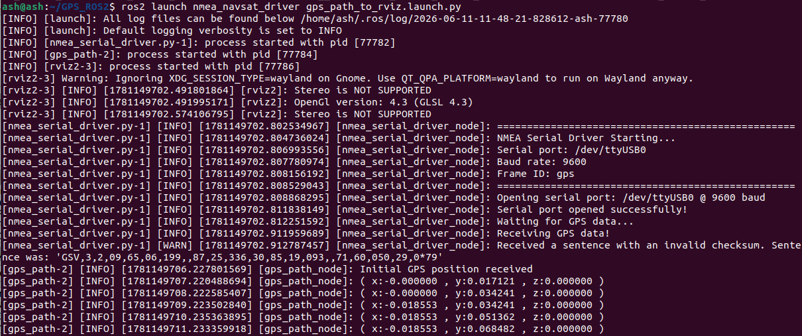
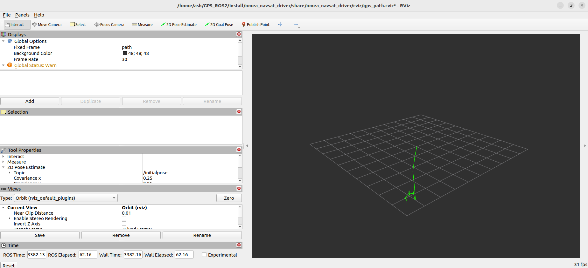

# ROS: GPS 궤적 그리기

**이 기능은 실시간 GPS 데이터 정보를 그리고 rviz2에서 표시합니다.**

#### 1、구현 원리

GPS 정보를 직접 시각화하는 것은 불가능합니다. 좌표계를 변환해야 하며, GPS 궤적을 위도 경도 WGS-84 좌표에서 실제 세계 xyz 좌표계로 변환합니다. 실제 세계의 xyz 좌표가 있으면 rviz2를 통해 경로를 표시하여 GPS의 궤적을 모사할 수 있습니다. 궤적이란 각 gps 좌표와 첫 번째 좌표의 상대 위치를 누적하고, 이를 더해가면 얻을 수 있는 것입니다.

#### 2、시작 단계

터미널에 입력하고,

```
ros2 launch nmea_navsat_driver gps_path_to_rviz.launch.py
```



rviz2에 표시되는 화면에서는 녹색 선이 점점 천천히 연장되는 것을 확인할 수 있습니다. 아래 그림과 같습니다.



#### 3、launch 코드 분석

```python
from launch import LaunchDescription
from launch.actions import DeclareLaunchArgument
from launch.substitutions import LaunchConfiguration
from launch_ros.actions import Node
from ament_index_python.packages import get_package_share_directory
import os

def generate_launch_description():
    port_arg = DeclareLaunchArgument('port', default_value='/dev/myserial')
    baud_arg = DeclareLaunchArgument('baud', default_value='9600')
    frame_id_arg = DeclareLaunchArgument('frame_id', default_value='gps')
    time_ref_source_arg = DeclareLaunchArgument('time_ref_source', default_value='gps')
    useRMC_arg = DeclareLaunchArgument('useRMC', default_value='False')

    port = LaunchConfiguration('port')
    baud = LaunchConfiguration('baud')
    frame_id = LaunchConfiguration('frame_id')
    time_ref_source = LaunchConfiguration('time_ref_source')
    useRMC = LaunchConfiguration('useRMC')

    nmea_serial_driver_node = Node(
        package='nmea_navsat_driver',
        executable='nmea_serial_driver',
        name='nmea_serial_driver_node',
        output='screen',
        parameters=[{
            'port': port,
            'baud': baud,
            'frame_id': frame_id,
            'time_ref_source': time_ref_source,
            'useRMC': useRMC
        }]
    )

    gps_path_node = Node(
        package='nmea_navsat_driver',
        executable='Draw_GPS_Path',
        name='gps_path_node',
        output='screen'
    )

    rviz_config = os.path.join(
        get_package_share_directory('nmea_navsat_driver'),
        'rviz',
        'gps_path.rviz'
    )

    rviz_node = Node(
        package='rviz2',
        executable='rviz2',
        name='rviz2',
        arguments=['-d', rviz_config]
    )

    return LaunchDescription([
        port_arg,
        baud_arg,
        frame_id_arg,
        time_ref_source_arg,
        useRMC_arg,
        nmea_serial_driver_node,
        gps_path_node,
        rviz_node
    ])
```

세 개의 노드가 시작되었으며, 각각 nmea_serial_driver_node가 GPS 데이터를 읽고, gps_path_node가 GPS 데이터 궤적을 그리고, rviz2 노드가 표시합니다.

그중 gps_path_node라는 노드의 소스 코드 gps_path.cpp는 nmea_navsat_driver/src 아래에 있습니다. 한번 살펴보십시오.

<RelatedProducts slugs="gps-beidou-module" />
