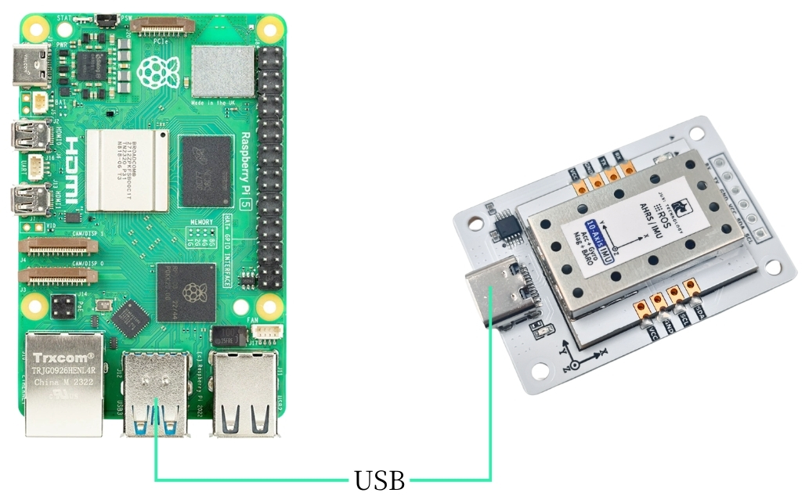
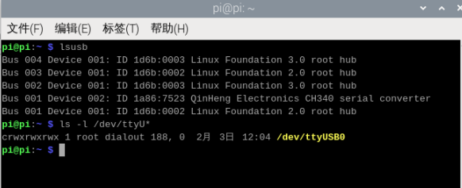
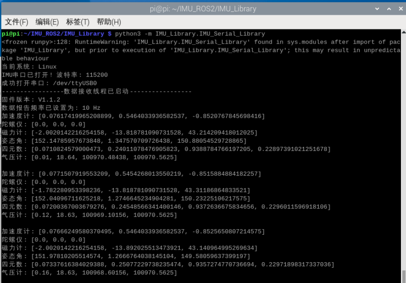

# 라즈베리파이

## 1. 장치 연결

본 튜토리얼은 라즈베리파이 5 마더보드의  이미지를 예로 듭니다.

IMU 자세 센서를 Type-C 케이블로 호스트의 USB에 꽂습니다.



## 2. 장치 상태 확인

장치 ID 확인

```PowerShell
lsusb
```

장치 번호 확인

```PowerShell
ls -l /dev/ttyU*
```

포트 매핑 설정

```Bash
# 防止插拔后端口变更，请设置端口映射
sudo gedit /etc/udev/rules.d/99-serial-imu.rules
# 如出现没有gedit命令相关内容，请先下载安装
sudo apt install gedit
# 填写映射内容
KERNEL=="ttyUSB*", ATTRS{idVendor}=="1a86", ATTRS{idProduct}=="7523", MODE:="0777", SYMLINK+="imu-serial"
# 参数说明
`--mode`: 通信模式，可选值为`serial`(串口)或`i2c`
`--port`: 串口名(如`/dev/ttyUSB0`)或I2C端口号(如`7`)
`--rate`: 数据打印频率(Hz)，默认10Hz
`--debug`: 启用调试模式，显示详细信息
# 保存退出，运行命令使规则生效
sudo udevadm trigger
sudo service udev reload
sudo service udev restart
# 验证
ll /dev/imu-serial
# 输出示例
lrwxrwxrwx 1 root root 7 1月 22 10:00 /dev/imu-serial -> ttyUSB0
```

## 3. 드라이버 라이브러리 설치

3.1 **코드에 필요한 python 라이브러리 설치**

```PowerShell
sudo apt update
sudo apt install -y python3-serial
sudo apt install -y python3-smbus2
```

3.2 **파일 전송**

IMU_ROS2.zip

MobaXterm을 사용한 파일 전송이 아직 익숙하지 않은 분은 아래 페이지에서 MobaXterm의 자세한 설치 및 사용 방법을 확인하세요: [文件远程传输](https://juxitech.feishu.cn/wiki/KB0Jw2o6Wis9f0ksyeFceVmgnfd)

MobaXterm 소프트웨어로 압축 해제한 파일을 라즈베리파이 5에 드래그합니다.



## 4. imu 데이터 확인

**~/IMU_Library 디렉터리로 이동하여 IMU_Serial_Library.py 파일 실행**

```PowerShell
cd ~/IMU_ROS2/IMU_Library
# 运行 IMU 数据打印文件
python3 -m IMU_Library.IMU_Serial_Library
```


주의: 위는 10축 IMU 데이터 읽기입니다. 6축은 자기력계(Magnetometer)와 기압계(Barometer) 데이터가 없고, 9축은 기압계(Barometer) 데이터가 없습니다.

## **5. IMU 캘리브레이션**

**~/IMU_Library 디렉터리로 이동하여 imu_calibration_tool.py 파일 실행**

```PowerShell
cd ~/IMU_Library
# 运行 IMU 校准代码文件 --串口通讯校准
# 执行所有校准（整体、磁力计、温度）
python3 -m IMU_Library.imu_calibration_tool --mode serial --port /dev/imu-serial
# 仅整体校准
python3 -m IMU_Library.imu_calibration_tool --mode serial --port /dev/imu-serial --calibrate imu
# 仅磁力计校准
python3 -m IMU_Library.imu_calibration_tool --mode serial --port /dev/imu-serial --calibrate mag
# 仅温度校准
python3 -m IMU_Library.imu_calibration_tool --mode serial --port /dev/imu-serial --calibrate temp
```



## 6. 주의사항

장치 ID는 확인할 수 있지만 장치 번호를 확인할 수 없는 경우, 아래 명령으로 ch34x 드라이버를 설치하세요

```PowerShell
sudo apt remove brltty
git clone https://github.com/clhchan/CH341SER.git
cd CH341SER
make -j6
sudo make install
sudo modprobe ch34x
```
