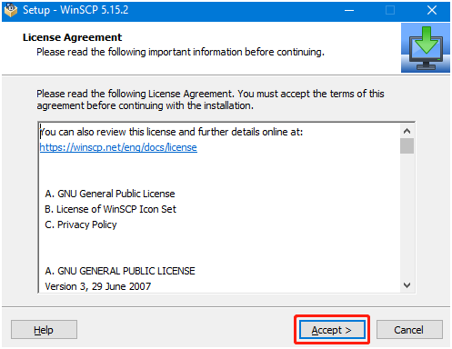
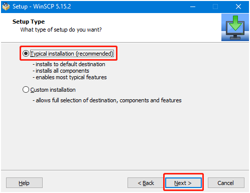
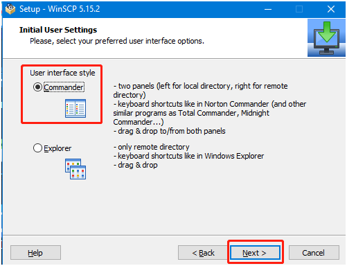
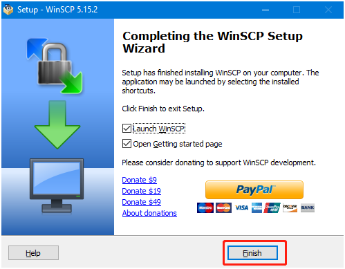
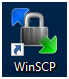
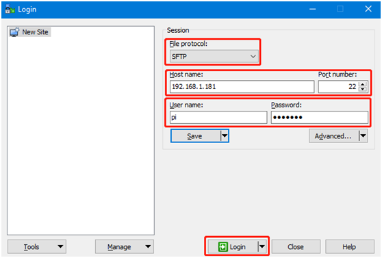
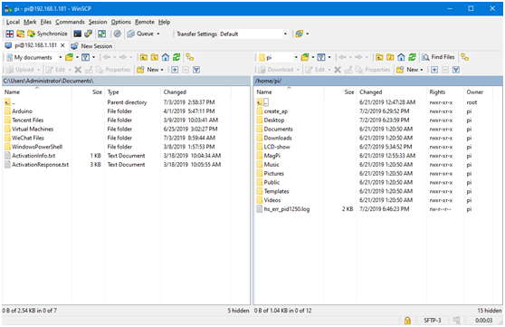
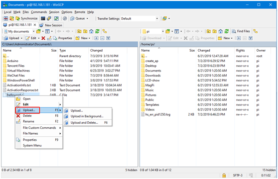
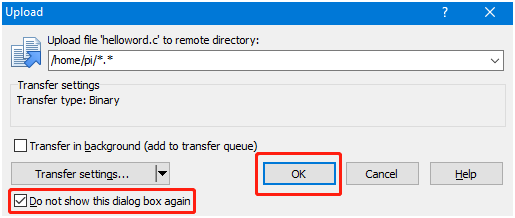
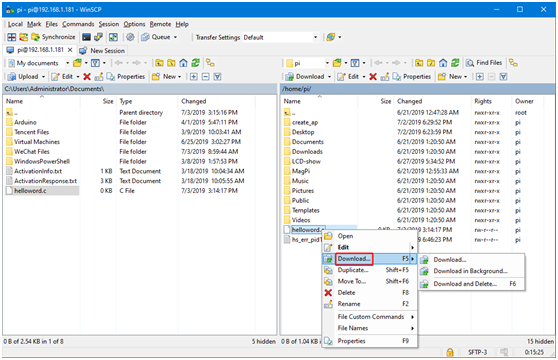

# SSH 파일 전송

## 1. WinSCP 프로그램 설치

원격 로그인 소프트웨어.zip

다운로드하고 압축을 푼 후, 프로그램을 더블 클릭하여 열고 설치를 시작합니다. Accept를 클릭하여 약관에 동의한 다음, 안내에 따라 설치하면 됩니다.







Finish를 클릭하여 설치를 완료합니다.



바탕 화면에 WinSCP 아이콘이 하나 더 생긴 것을 확인할 수 있습니다



## 2. SSH 원격 파일 전송

WinSCP 소프트웨어를 열면 다음 로그인 화면이 나타납니다.

File protocol：파일 프로토콜은 SFTP 선택, Host name：IP 주소, Port number：기본 22면 됩니다, User name：사용자 이름, Password：로그인 비밀번호.

올바른 정보를 입력한 후 Save를 클릭하여 입력한 정보를 저장할 수 있으며, 다음 로그인 시 다시 입력할 필요가 없습니다.



Login을 클릭하여 로그인에 성공하면 다음 화면이 표시됩니다. 왼쪽은 win 컴퓨터의 폴더이고, 오른쪽은 nano의 폴더입니다.



파일 전송에는 세 가지 방법이 있습니다. 첫 번째는 파일을 왼쪽에서 오른쪽으로, 또는 오른쪽에서 왼쪽으로 직접 끌어다 놓는 방법으로, 시스템이 자동으로 파일을 복사하여 전송합니다.

두 번째는 마우스로 파일을 선택한 후 F5 키를 한 번 누르면 선택한 파일이 다른 쪽으로 복사됩니다.

세 번째는 파일을 선택하고 마우스 오른쪽 버튼을 클릭하는 방법으로, win 컴퓨터에서 nano로 전송하는 경우 upload를 클릭합니다,



프롬프트가 표시되면 다시 표시하지 않기를 선택할 수 있으며, OK를 클릭하면 파일이 자동으로 전송됩니다.



nano에서 win 컴퓨터로 파일을 전송하는 경우 마우스 오른쪽 버튼으로 파일을 선택하고 Download를 선택합니다



주의：파일 전송은 컴퓨터와 보드가 같은 로컬 네트워크에 있어야 하고, Raspberry Pi의 SSH 서비스가 활성화되어 있어야 가능합니다. 파일 전송이 실패하는 경우는 일반적으로 보드 측 권한이 부족하기 때문이며, 최고 권한을 부여하기만 하면 됩니다.

```Plain Text
chmod 777 目录名 
```


