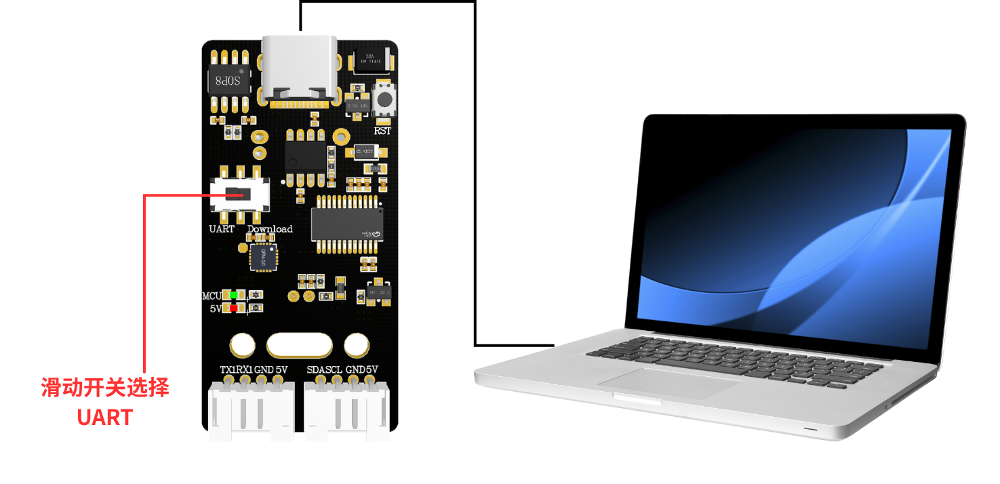
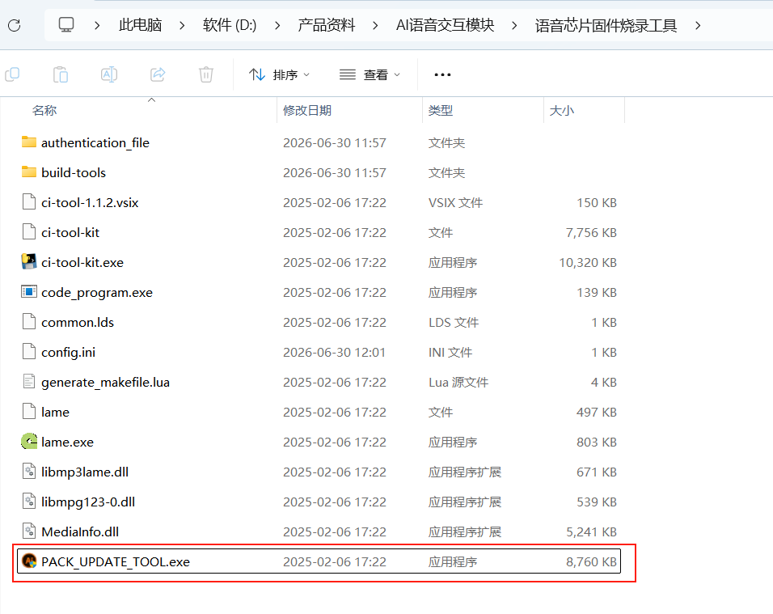
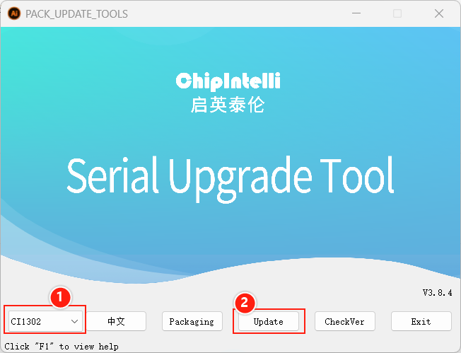
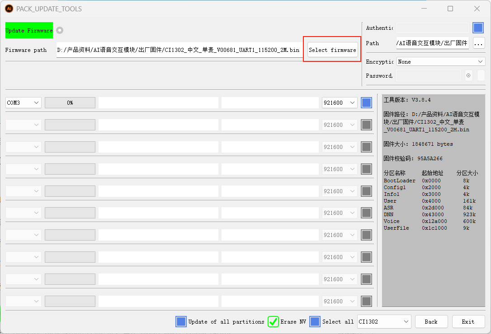
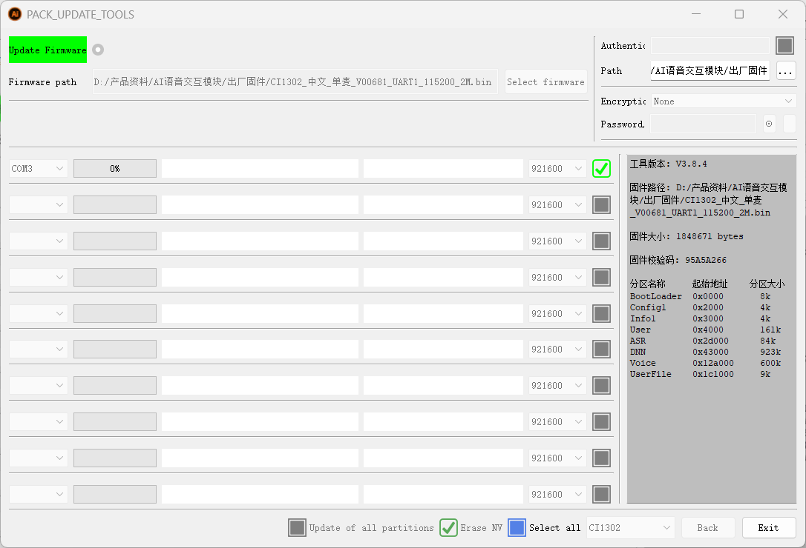
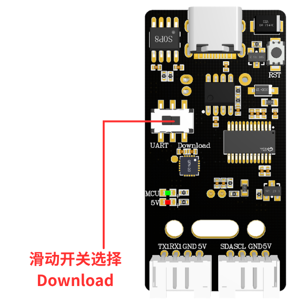
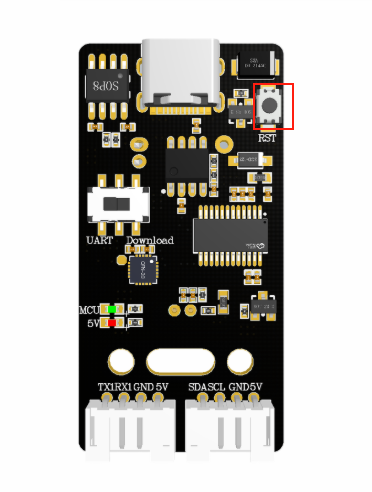
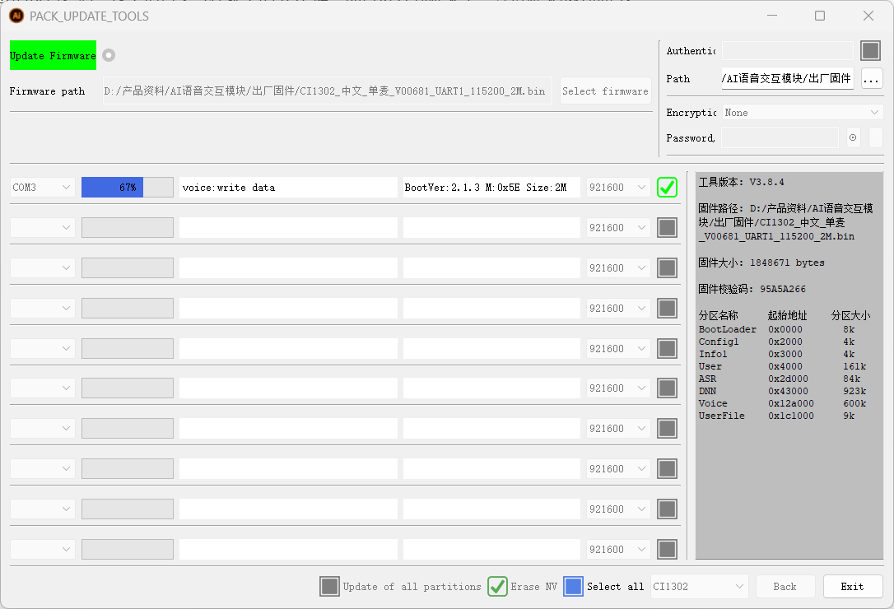
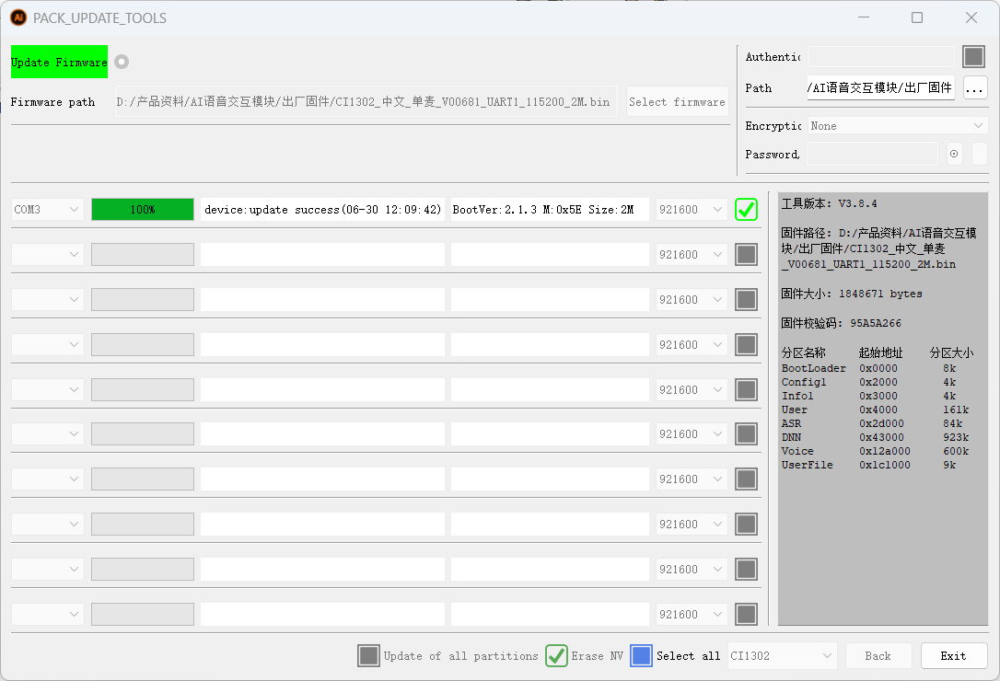

# Gravação do firmware do módulo

## Método de gravação do firmware do módulo

## 1.Passos para gravar o chip de voz

## 1.1 Conexão do dispositivo

## 1.2. Abrir o software de gravação

Abra a pasta "Ferramenta de gravação de firmware do chip de voz" nos anexos e clique em ”PACK_UPDATE_TOOL.exe“

Selecione o chip CI1302 e clique em “Atualização de firmware”

Entre na interface de atualização de firmware; pressione "F1" para ver a ajuda

Clique para selecionar o firmware recém-criado e localize o firmware “CI1302中文单麦_V00681_UART1_115200_2M” de fábrica nos anexos.

Selecione o firmware, localize o número da porta serial correspondente e clique na caixa de seleção para marcá-la

Mova a chave deslizante para a posição Download; Download significa gravar o firmware no chip de voz (ou seja, o lado direito)

Depois de mover para a posição correspondente, pressione o botão RST no módulo de interação por voz para entrar no modo de gravação; aguarde a gravação ser concluída com sucesso e clique em “Sair”.

<RelatedProducts slugs="ai-voice-module" />
