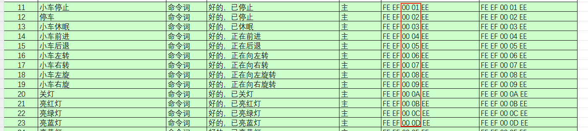
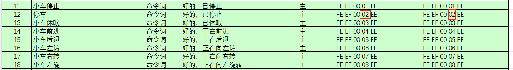
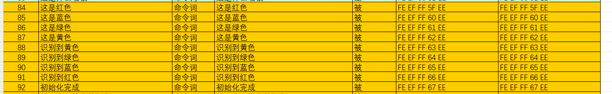
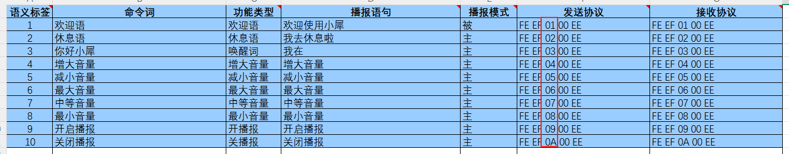
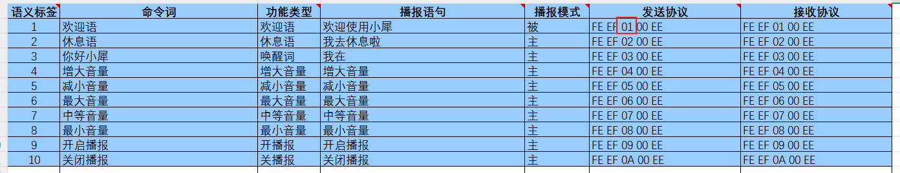
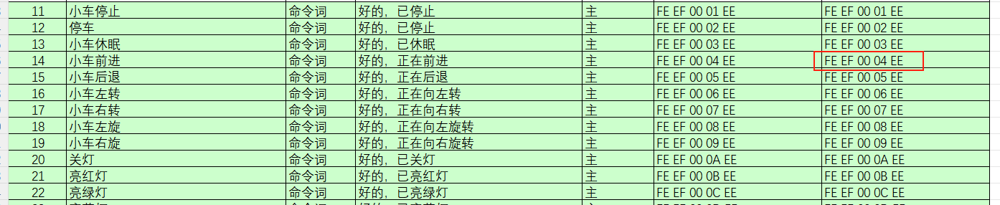

# Protocolo IIC

Atenção: a fonte de alimentação do dispositivo host e a do módulo de interação por voz podem ser diferentes, mas na conexão é obrigatório haver aterramento em comum para fornecer um nível de comunicação estável

## 1.Módulo de interação por voz como escravo

Receber e interpretar os sinais enviados pelo host:

Aguardar a interrupção do sinal IIC; se houver dados recebidos pelo IIC, chamar a função correspondente conforme as informações de endereço do registrador recebidas pelo IIC.

Processamento e retorno dos dados:

Quando o módulo de interação por voz recebe um comando de leitura de registrador, é preciso chamar a função de envio correspondente para enviar os dados reconhecidos ao dispositivo host.

## 2.Endereço do dispositivo IIC e funções dos registradores

O endereço de dispositivo do escravo IIC do módulo de interação por voz é 0x2A.

## 3.Obter as entradas de palavras de comando.

Abra o arquivo 命令词播报词协议列表V1_中文 nos anexos; você verá que o protocolo de comunicação começa com 0xFE, 0xED e termina com 0xEE, com 2 bytes no meio, que são, respectivamente, o tipo de função e o número de ID.

Quando o módulo de interação por voz reconhece a palavra de comando “停车”, ele responde “好的，已停止”; o controlador host pode ler 0x02 (um byte de dados) no registrador de resultado de reconhecimento (0xDA), e esse dado é igual ao 4º byte do protocolo de envio de “停车”.

## 4.Entradas de frases de reprodução

As entradas de frases de reprodução não são reproduzidas ativamente; é preciso que o controlador host as configure pelo IIC para que a reprodução ocorra (a frase de reprodução de uma entrada de palavra de comando também pode ser reproduzida).

O controlador host grava, pelo IIC, um byte no endereço do registrador de reprodução (0xD1); esse byte é o número de ID da palavra de comando, e o módulo de reprodução de voz reproduz a frase correspondente; 0xFF é uma frase de reprodução comum.

Por exemplo:

Quando o usuário precisa reproduzir “这是红色”, o controlador host deve gravar, pelo IIC, “0x5F” no registrador de reprodução (0xD1), e o módulo de interação por voz reproduzirá “这是红色”.

## 5.Reprodução de entradas de palavras de função

As entradas de palavras de função podem ser reproduzidas quando uma palavra de comando é reconhecida, ou pela gravação de bytes específicos via IIC.

O controlador host grava, pelo IIC, um byte no endereço do registrador de reprodução (0xD2); esse byte é o número de ID da palavra de comando, e o módulo de reprodução de voz reproduz a frase correspondente; 0xFF é uma frase de reprodução comum.

Por exemplo:

Quando o usuário precisa reproduzir “这是红色”, o controlador host deve gravar, pelo IIC, “0x01” no registrador de reprodução (0xD2), e o módulo de interação por voz reproduzirá “欢迎使用小犀”.

## 5.Reprodução de entradas de palavras de comando

As entradas de palavras de comando podem ser reproduzidas quando uma palavra de comando é reconhecida, ou pela gravação de bytes específicos via IIC.

O controlador host grava, pelo IIC, um byte no endereço do registrador de reprodução (0xD3); esse byte é o número de ID da palavra de comando, e o módulo de reprodução de voz reproduz a frase correspondente; 0xFF é uma frase de reprodução comum.

Por exemplo:

Quando o usuário precisa reproduzir “好的，正在前进”, o controlador host deve gravar, pelo IIC, “0x04” no registrador de reprodução (0xD3), e o módulo de interação por voz reproduzirá “好的，正在前进”.

<RelatedProducts slugs="ai-voice-module" />
