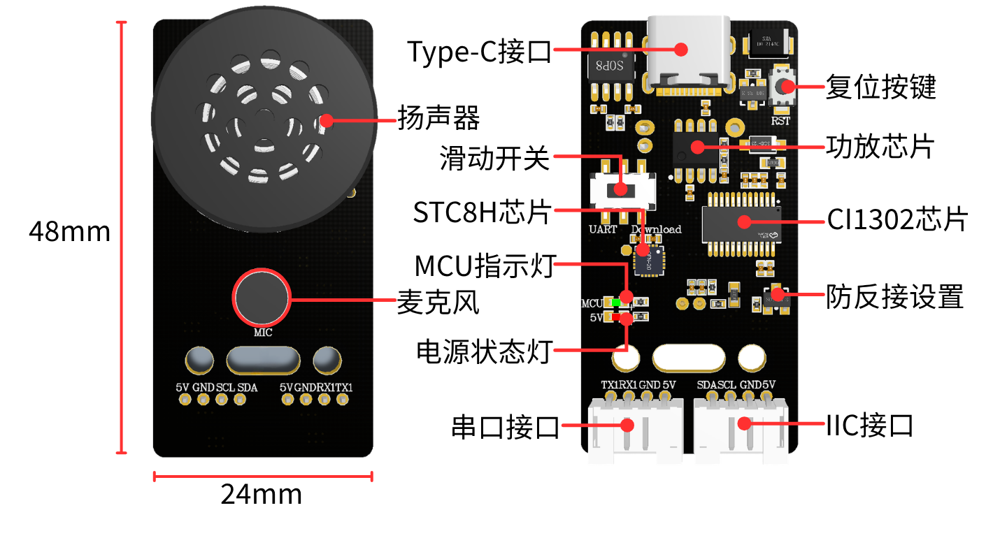

# Informações do produto

## 1.Introdução ao módulo de interação por voz

CI1302 é um chip de voz inteligente com rede neural de alto desempenho de nova geração desenvolvido pela Chipintelli, que integra o processador de rede neural cerebral BNPU V3, desenvolvido pela própria Chipintelli, e um núcleo de CPU. A frequência principal do sistema pode atingir 220MHz, com até 640KByte de SRAM integrada; integra uma unidade de gerenciamento de energia PMU e um oscilador RC, além de um Audio Codec de canal duplo de alto desempenho e baixo consumo e diversas interfaces de controle periférico, como UART, IIC, IIS, PWM, GPIO e PDM. O chip precisa apenas de poucos componentes periféricos, como resistores e capacitores, para implementar soluções de hardware para diversos produtos de voz inteligente, com custo-benefício extremamente alto.

Adota a tecnologia de hardware BNPU de 3ª geração e oferece suporte a redes neurais como DNN\\TDNN\\RNN\\CNN e a operações vetoriais paralelas, permitindo funções como reconhecimento de fala, reconhecimento de voz (voiceprint), autoaprendizagem de palavras de comando, detecção de voz e redução de ruído por aprendizado profundo. A solução do chip também oferece suporte a diversos idiomas globais, como chinês, inglês e japonês, podendo ser amplamente aplicada em áreas como eletrodomésticos, iluminação, brinquedos, dispositivos vestíveis, indústria e automóveis, viabilizando interação e controle por voz e diversas aplicações de soluções de voz inteligente.

O chip CI1302 possui um núcleo de processador de rede neural cerebral (BNPU), oferece suporte a computação acelerada de NN offline e aceleração de hardware para processamento de sinais de voz, tem frequência de CPU de até 220MHz, consegue realizar reconhecimento de fala de campo distante offline, possui 2MB de armazenamento FLASH integrado e pode suportar 300 palavras de comando.

## 2.Características do produto

- Mais de 110+ comandos de voz predefinidos, com suporte a palavras de comando personalizadas em chinês e inglês.

Os usuários podem modificar as palavras de comando pela página web que fornecemos, gerar um novo arquivo de firmware e gravar o firmware no módulo com o software de PC; assim, o módulo passa a reconhecer os novos comandos. Com 2M de espaço de armazenamento integrado, é possível gravar até cerca de 120 palavras de comando.

- Alto-falante de alta fidelidade e microfone de alto desempenho integrados.

Ele integra algoritmos avançados e tecnologia de redução de ruído em nível de circuito, conseguindo filtrar com eficácia o ruído de fundo do ambiente e atingindo taxa de reconhecimento de até 99% em um raio de 5 metros, o que possibilita conversação natural e cancelamento de eco. Ele proporciona saída de áudio nítida e reproduz com precisão os detalhes da voz.

- Coprocessador integrado na placa e interfaces IIC/porta serial/Type-C.

Ele integra o chip STC8H, que converte automaticamente os dados de voz para o formato de dados da porta serial ou IIC, simplificando o processo de comunicação com dispositivos host externos. Diversos cabos de conexão são fornecidos gratuitamente, permitindo que os usuários o conectem a placas de desenvolvimento MCU e dispositivos host embarcados para estabelecer comunicação e criar seus próprios projetos DIY.

- Tutoriais de uso baseados em diversas placas de desenvolvimento

São fornecidas informações sobre placas de desenvolvimento, como STM32, ESP32, MSPM0, Raspberry Pi, a série de placas Jetson, RDK etc. Também são fornecidos arquivos SDK para os sistemas ROS1 e ROS2.

## 3.Princípio de funcionamento

O módulo utiliza ativação por modo de comando: o usuário precisa dizer a palavra de ativação configurada para primeiro ativar o módulo de interação por voz e, após a ativação, o reconhecimento de fala pode ser realizado. A palavra-chave de ativação padrão do firmware de fábrica é “你好，小犀”. Se nenhuma fala for reconhecida após 15 segundos, o módulo entra no modo de suspensão e precisa ser ativado novamente antes do próximo uso.

Depois que o chip CI1302 reconhece a entrada de voz correspondente, ele a envia pela porta serial ou pela interface IIC e fornece retorno por reprodução; o chip IIC armazena o comando de voz recebido e o envia por meio do protocolo de escravo IIC.

O módulo oferece suporte à modificação da palavra de ativação, à modificação de palavras de comando e a entradas personalizadas. Você pode aprender como fazer isso nos tutoriais "[Modificar a palavra de ativação e as palavras de comando](https://juxitech.feishu.cn/wiki/Po6bw8OtLiDNonklg7ZcBbGknyc)" e "[Criação de entradas de protocolo personalizadas](https://juxitech.feishu.cn/wiki/CIHLwo8qNiVBtKkhuTtcZIeNnAb)".

## 4.Avisos

1、Use alimentação de 5V; ultrapassar 5V danificará o módulo

2、O ambiente de uso deve ser silencioso; ambientes barulhentos afetam o desempenho de reconhecimento

3、Ao falar uma entrada, a voz deve ser alta e a velocidade da fala não deve ser rápida demais; recomenda-se manter-se a menos de 5 metros do módulo

## 5.Descrição da interface de hardware

