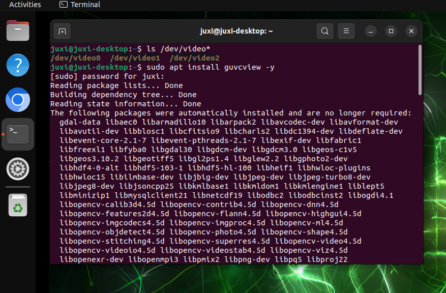
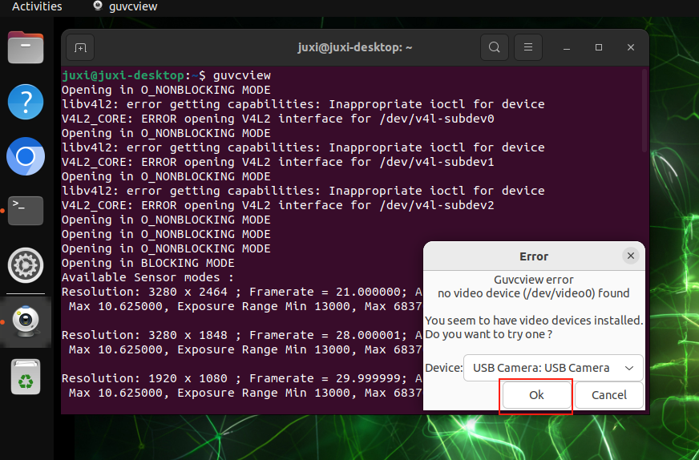
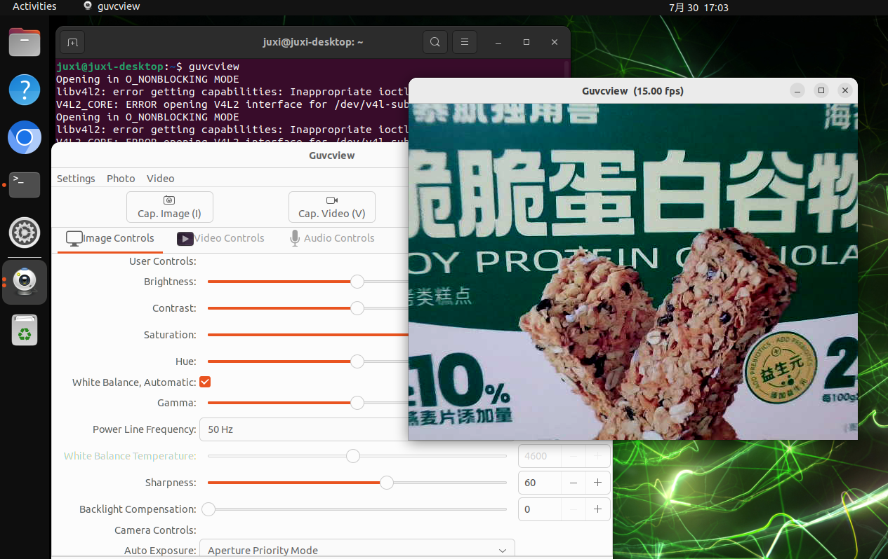
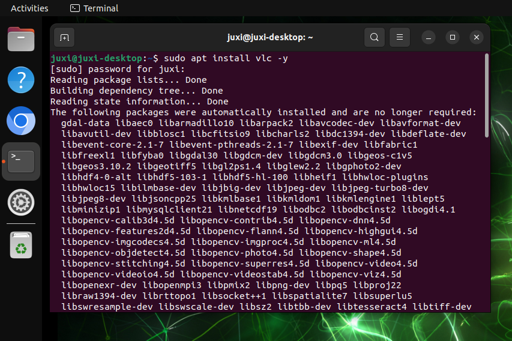
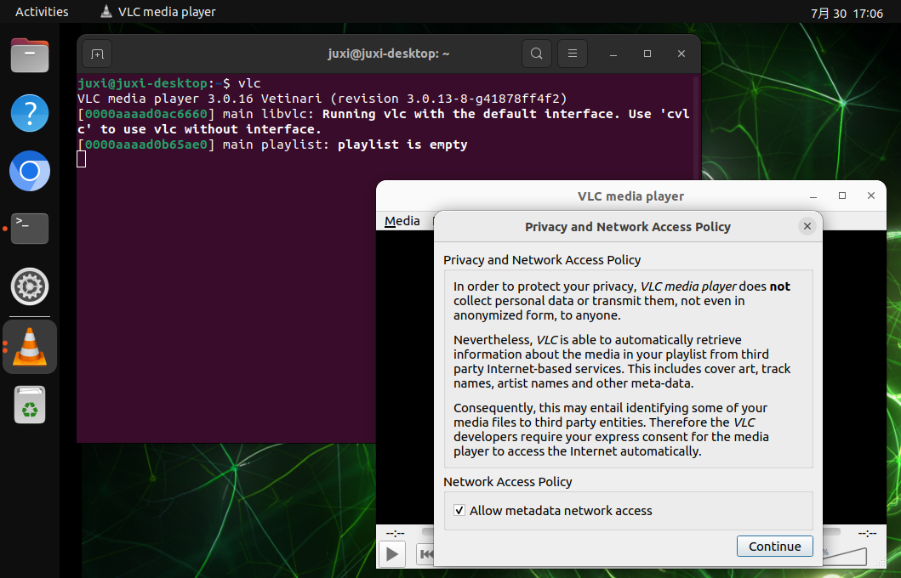
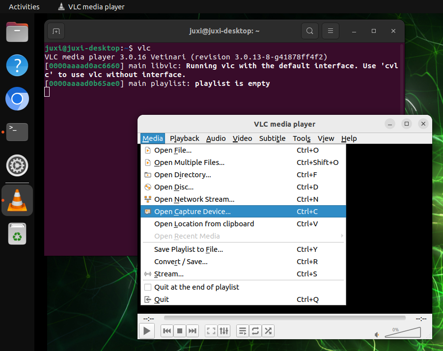
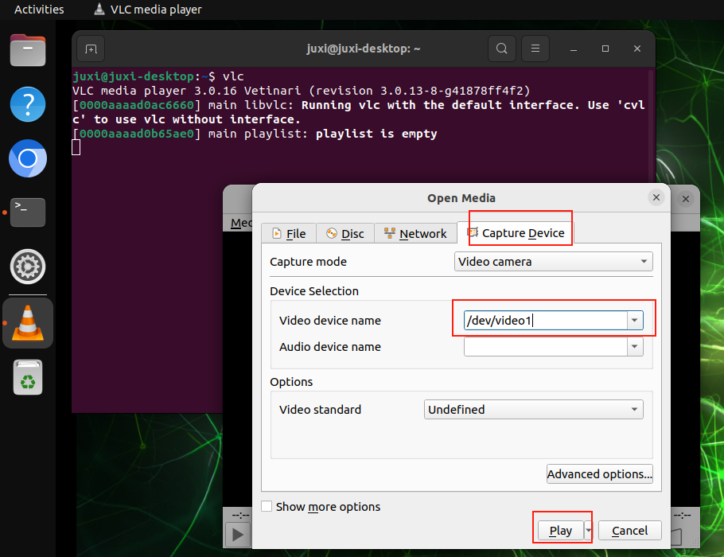
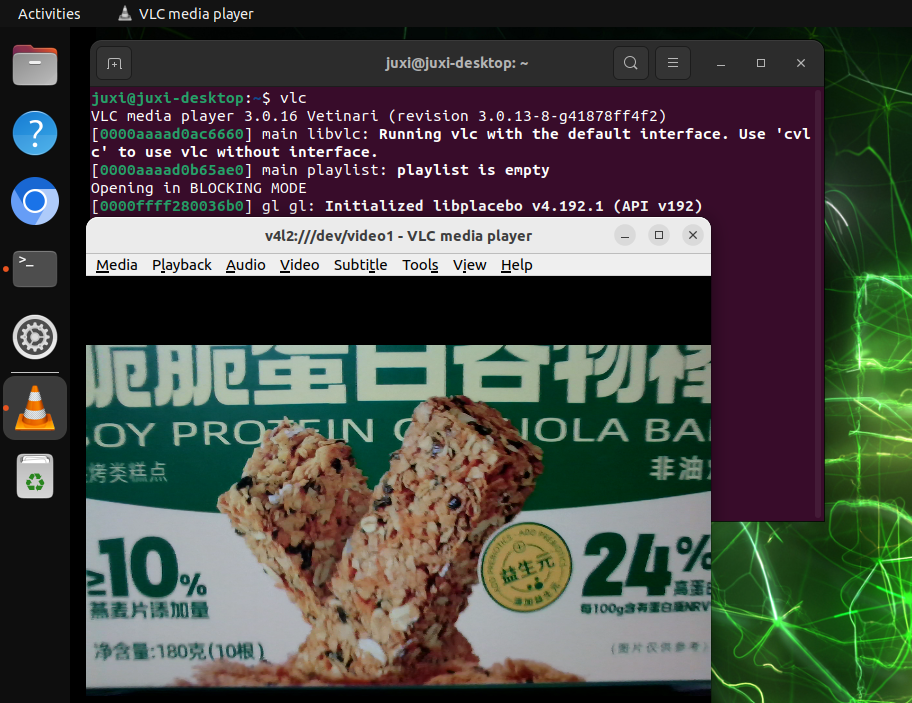

# 02. Uso da câmera com foco automático

## 1. Verificar os dispositivos de vídeo

```Plain Text
ls /dev/video*
```

O resultado da imagem corresponde a duas câmeras CSI e uma câmera USB conectadas: normalmente uma câmera CSI exibe um dispositivo `video`, e uma câmera USB exibe dois dispositivos `video`; para a câmera USB, escolha o `/dev/video2`, recém-adicionado e de número menor, para chamar (ao conectar a câmera USB, o sistema adiciona os números de dispositivo `/dev/video2` e `/dev/video3`)


## 2. GUVCView

O GUVCView é um software de código aberto para o sistema Linux, usado para capturar e gravar vídeos e imagens, principalmente para webcams.

### 2.1. Instalação do GUVCView

```Plain Text
sudo apt update
sudo apt install guvcview -y
```



### 2.2. Uso do GUVCView

No menu de aplicações, clique no ícone `guvcview`, ou digite o comando de inicialização no terminal: escolha a câmera USB, pois a câmera CSI não tem imagem de visualização

```Plain Text
guvcview
```





## 3. VLC

O VLC media player é um reprodutor multimídia livre e de código aberto, que suporta vários formatos de áudio e vídeo, além de DVD, CD de áudio, VCD e vários protocolos de streaming.

### 3.1. Instalação do VLC

```Plain Text
sudo apt update
sudo apt install vlc -y
```



### 3.2. Uso do VLC

No menu de aplicações, clique no ícone `VLC media player`, ou digite o comando de inicialização no terminal: escolha a câmera USB, pois a câmera CSI não tem imagem de visualização

```Plain Text
vlc
```





Selecione o número de dispositivo correspondente à câmera USB:






