# 03. Uso do Jupyter Lab

## 1. Instalação do Jupyter Lab

### 1.1. Jupyter Lab

Use o comando abaixo para instalar o Jupyter Lab: se o download do Jupyter Lab estiver lento, pode usar uma fonte específica para a instalação

```Plain Text
sudo apt update
sudo apt install python3-pip -y
sudo pip3 install --upgrade pip
```

```Plain Text
sudo pip3 install jupyterlab
# Fonte Tsinghua: pip3 install jupyterlab -i https://pypi.tuna.tsinghua.edu.cn/simple
# Fonte Alibaba Cloud: sudo pip3 install jupyterlab -i https://mirrors.aliyun.com/pypi/simple/
```

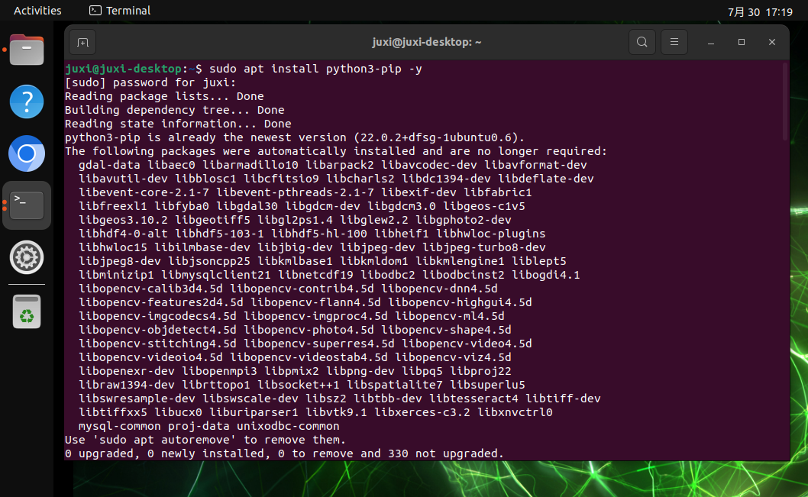

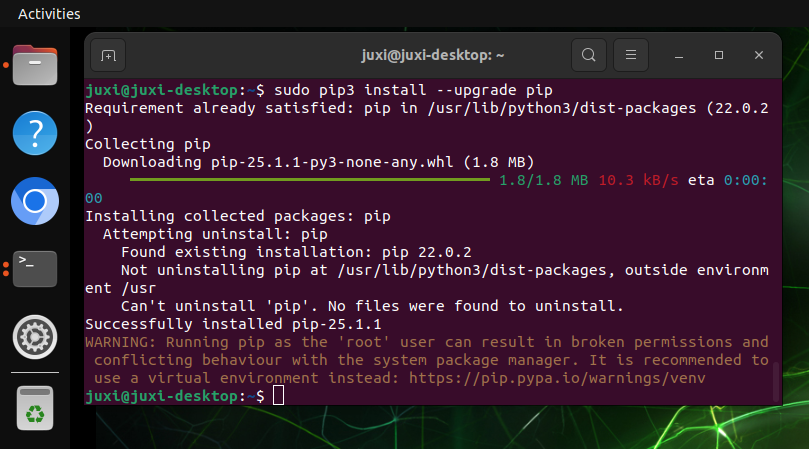

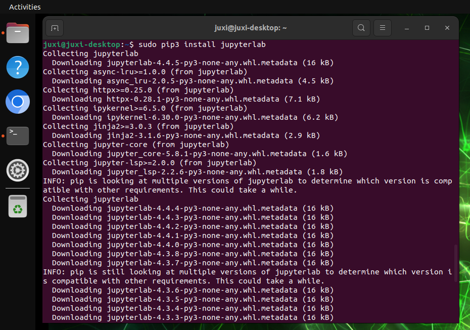

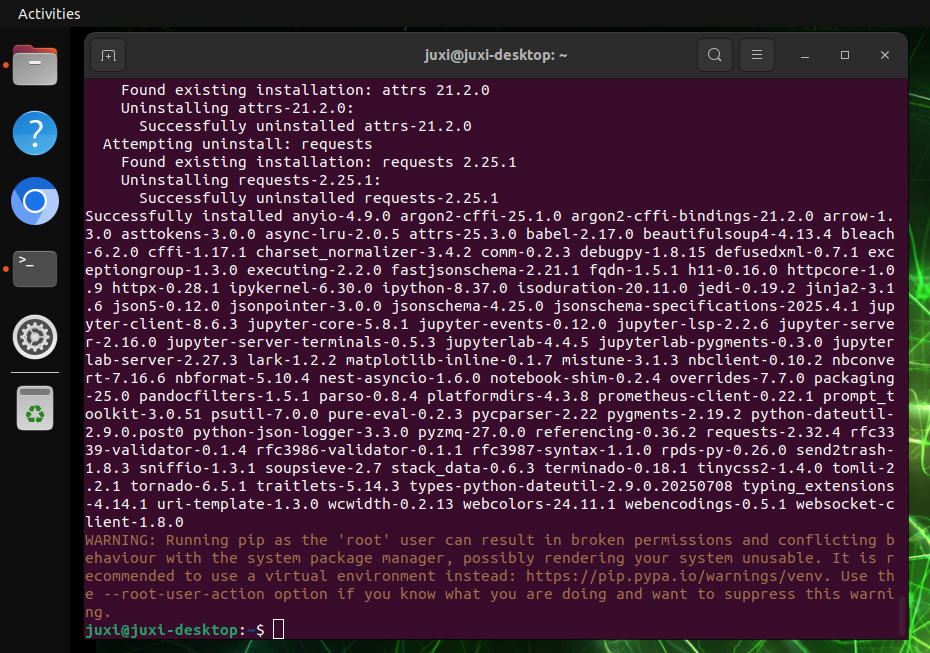

### 1.2. Node.js

Use o comando abaixo para instalar a versão mais recente do Node.js:

```Plain Text
sudo apt install curl -y
sudo curl -fsSL https://deb.nodesource.com/setup_22.x | sudo -E bash -
sudo apt install nodejs -y
```

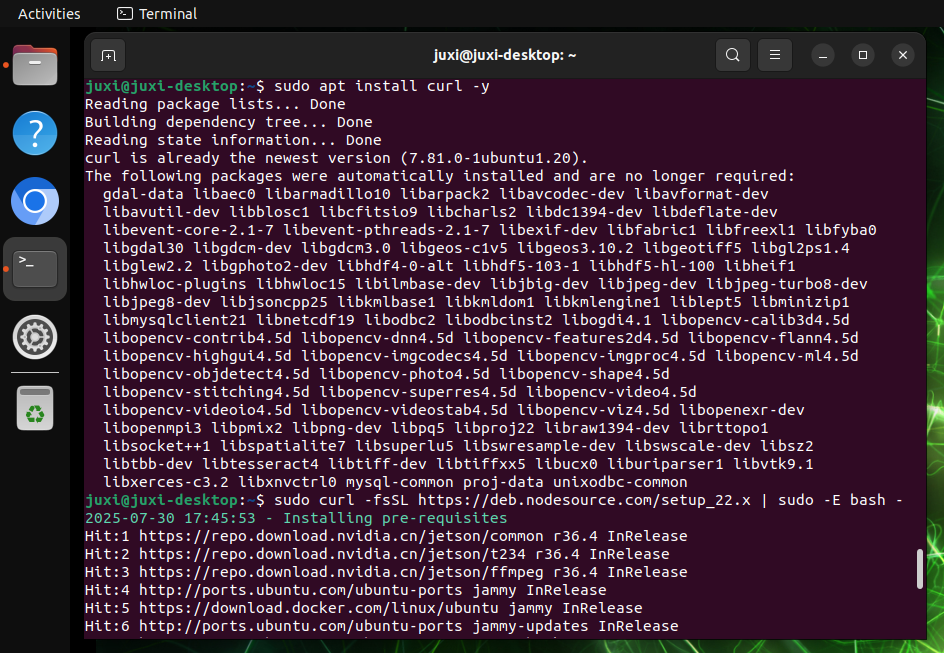

Verificar a versão:

```Plain Text
node -v && npm -v
```

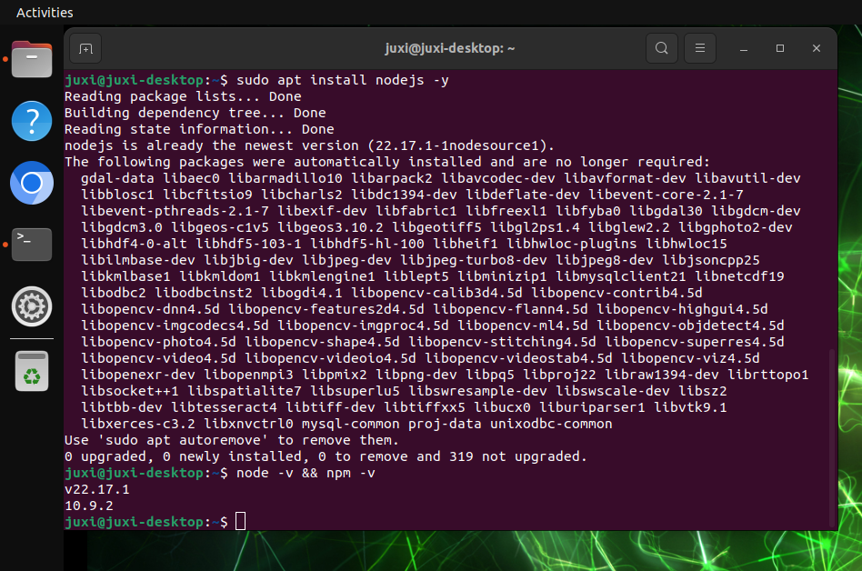

## 2. Inicialização do Jupyter Lab

Antes de iniciar o Jupyter Lab, é necessário definir o navegador padrão do sistema, caso contrário, aparecerão algumas mensagens no terminal.

### 2.1. Definir o navegador padrão

Abra o navegador Chromium do sistema e escolha definir como navegador padrão:


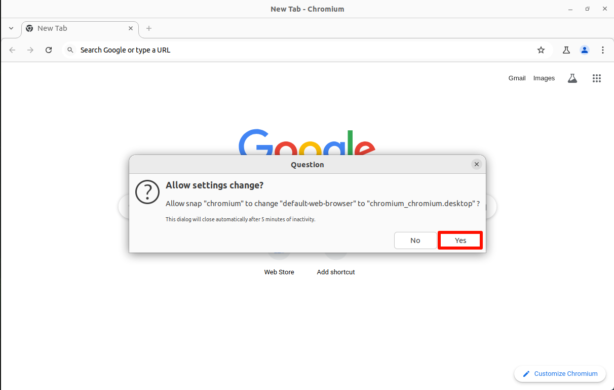

### 2.2. Iniciar o Jupyter Lab

```Plain Text
jupyter lab
# Iniciar sem navegador jupyter lab --no-browser
# Iniciar como administrador sudo jupyter lab --allow-root
```

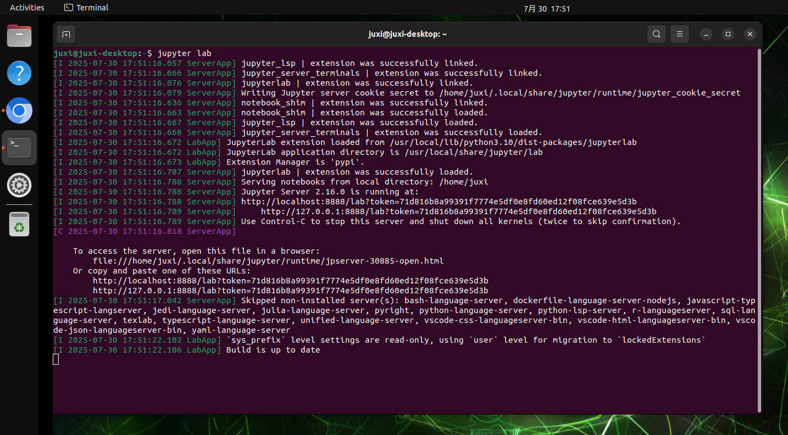


### 2.3. Acesso pela máquina host

A máquina host refere-se ao acesso a partir do sistema da placa-mãe Jetson; acesse diretamente através de [http://localhost:8888/](http://localhost:8888/):

`http://localhost:8888/`

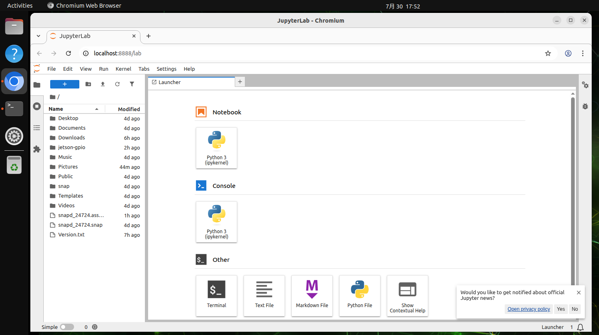

## 3. Configuração do Jupyter Lab

Configure no Jupyter Lab o acesso pela rede local, a senha de acesso, a inicialização automática, entre outras operações.

### 3.1. Acesso pela rede local

Configure os dispositivos na mesma rede local para acessarem digitando IP:8888 no navegador!

**Atenção: geralmente não é possível acessar pela rede local de uma rede de campus; pode testar trocando para o hotspot de um notebook/celular**

Por exemplo, IP da placa-mãe: 192.168.0.105; podemos acessar o Jupyter Lab da placa-mãe digitando 192.168.0.105:8888 no navegador de um dispositivo na mesma rede local

#### 3.1.1. Criar o arquivo de configuração

```Plain Text
sudo jupyter lab --generate-config
```

Local do arquivo de configuração gerado automaticamente: Writing default config to: /root/.jupyter/jupyter_lab_config.py

#### 3.1.2. Modificar o arquivo de configuração

```Plain Text
sudo gedit /root/.jupyter/jupyter_lab_config.py
```

Modificar o conteúdo: após a modificação, clique em salvar e feche o arquivo.

Atenção se há ou não o símbolo \# antes do código, para garantir que a configuração tenha efeito

```Plain Text
# Permitir que solicitações de qualquer origem acessem o servidor Jupyter Lab
c.ServerApp.allow_origin = '*'
# 0.0.0.0 indica vincular todas as interfaces de rede disponíveis, permitindo o acesso a partir de qualquer endereço
c.ServerApp.ip = '0.0.0.0'
# Permitir iniciar o servidor Jupyter Lab como usuário root
c.ServerApp.allow_root = True
# Modificar a porta padrão para evitar conflitos
c.ServerApp.port = 8888
```

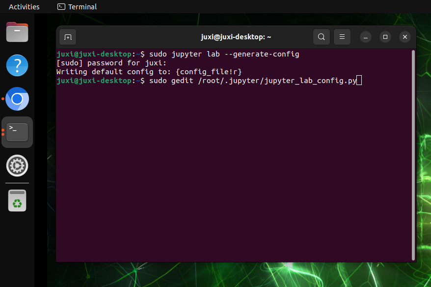

### 3.2. Configurar a senha de acesso

No terminal, insira o comando para definir a senha; é necessário inserir duas vezes, e o conteúdo digitado não será exibido ao inserir a senha\!

```Plain Text
sudo jupyter lab password
```

Local do arquivo de configuração gerado automaticamente: [JupyterPasswordApp] Wrote hashed password to /root/.jupyter/jupyter_server_config.json

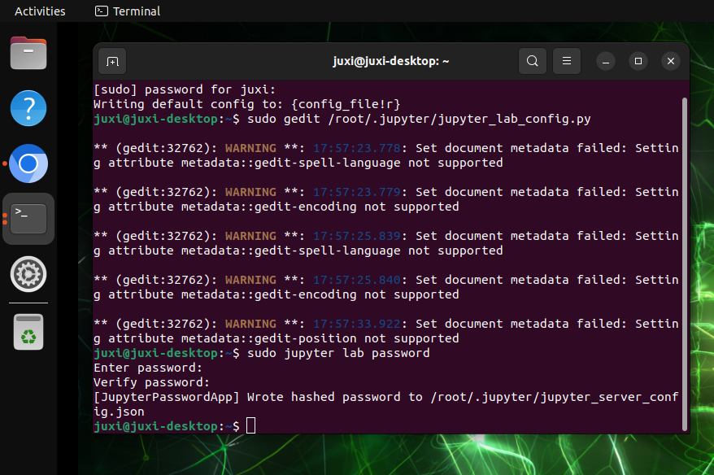

### 3.3. Serviço de inicialização automática

#### 3.3.1. Editar o arquivo de serviço

```Plain Text
sudo gedit /etc/systemd/system/jupyterlab.service
```

Adicionar o conteúdo: após adicionar, clique em salvar e feche o arquivo

```Plain Text
[Unit]
Description=jupyterlab
After=network.target
[Service]
Type=simple
ExecStart=/usr/local/bin/jupyter-lab
config=/root/.jupyter/jupyter_lab_config.py --no-browser
User=root
Group=root
WorkingDirectory=/home/jetson/
Restart=always
RestartSec=10
[Install]
WantedBy=multi-user.target
```

root: o nome de usuário do sistema

ExecStart: o comando para iniciar o Jupyter lab, altere para o caminho de instalação do JupyterLab

config: altere para o caminho do arquivo de configuração do JupyterLab

WorkingDirectory: o diretório de trabalho aberto ao iniciar o Jupyter-lab, pode ser alterado conforme necessário (recomenda-se alterar para o diretório do usuário)

`Verificar o caminho de instalação do Jupyter-lab: which jupyter-lab`

`Caminho do arquivo de configuração: consulte o caminho do arquivo de configuração gerado acima`

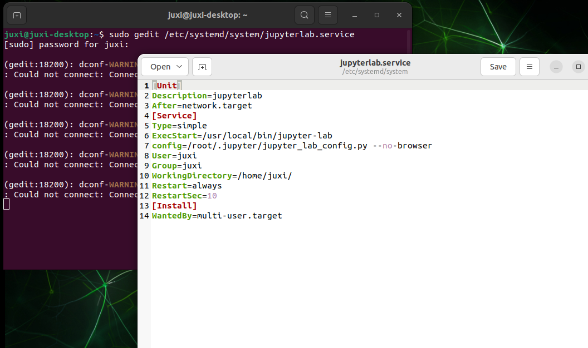

#### 3.3.2. Definir o serviço de inicialização automática

##### Serviço de inicialização automática

```Plain Text
sudo systemctl enable jupyterlab
# Desativar a inicialização automática systemctl disable jupyterlab
```

##### **Iniciar o serviço**

```Plain Text
sudo systemctl start jupyterlab
# Parar o serviço sudo systemctl stop jupyterlab
```

##### **Verificar o estado do serviço**

```Plain Text
systemctl status jupyterlab
```

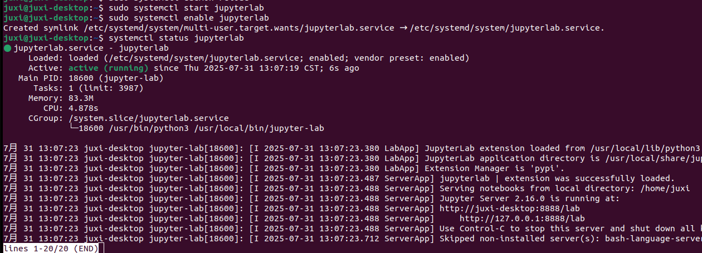

##### Verificar a inicialização automática

Após reiniciar o sistema, de acordo com o IP do sistema, acesse o IP da placa-mãe:8888 usando um dispositivo na mesma rede local.

> No primeiro acesso, é necessário inserir a senha; a senha é a informação definida nas etapas anteriores;
> 
> No momento da captura, o IP da placa-mãe era 192.168.0.105, portanto dispositivos na mesma rede local podem acessar 192.168.0.105:8888
> 
> 

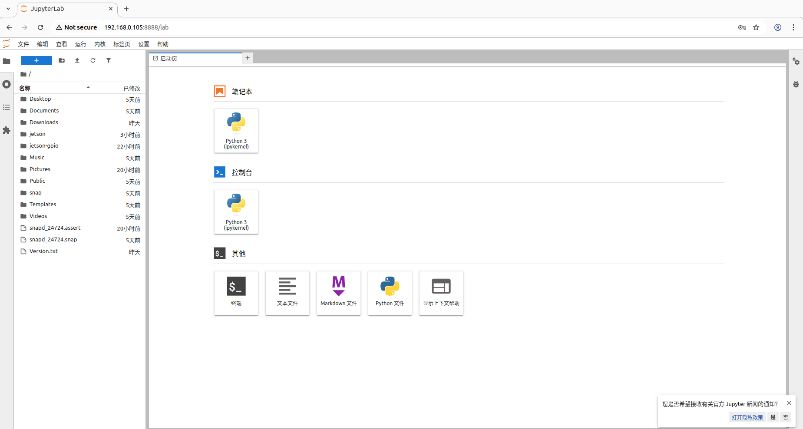

## 4. Uso do Jupyter Lab

### 4.1. Kernel

Recomenda-se reiniciar o kernel e limpar as informações de saída de todas as células sempre que executar o programa ou quando o programa apresentar anomalias:

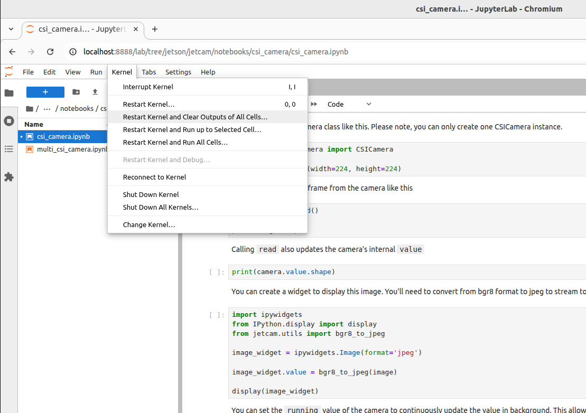

### 4.2. Executar o programa

Abra pelo Jupyter Lab o arquivo do programa que deseja executar; ao executar o programa, as células são executadas em ordem, de cima para baixo:

#### 4.2.1. Em execução

O [\*] exibido no canto superior esquerdo da célula indica que está em execução:

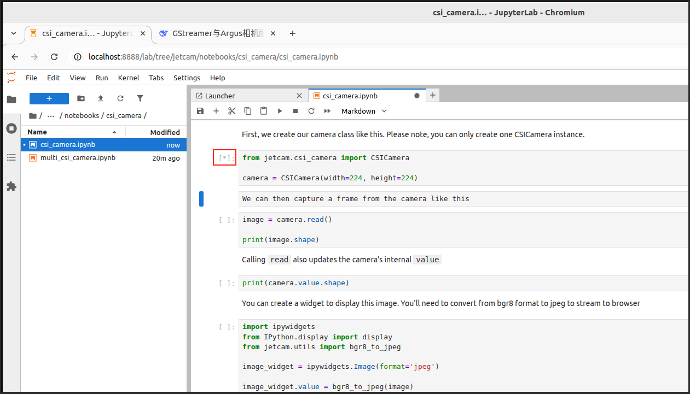

#### 4.2.2. Execução concluída

O [número] exibido no canto superior esquerdo da célula representa a ordem de execução: por exemplo, [1] → o programa executou o código dessa célula na primeira vez

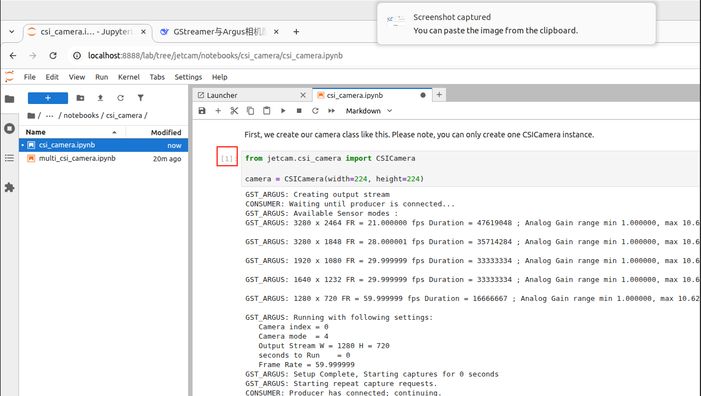


