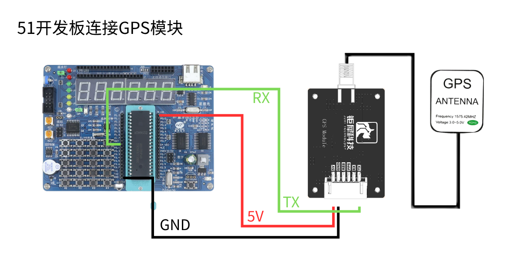
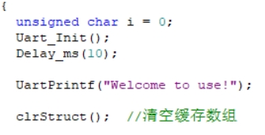
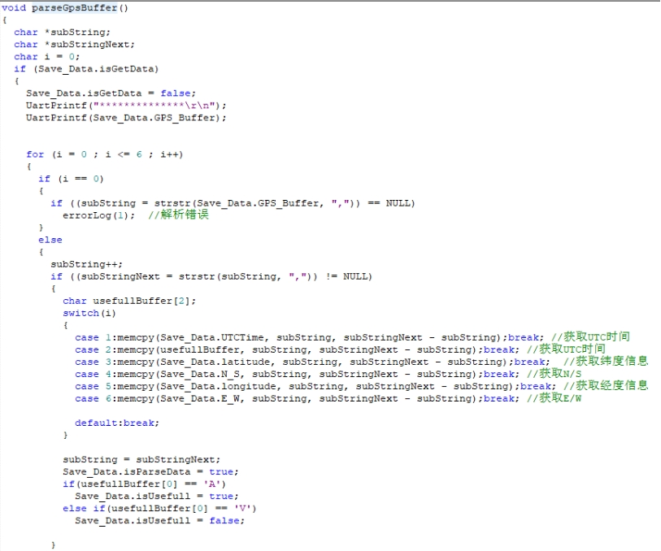
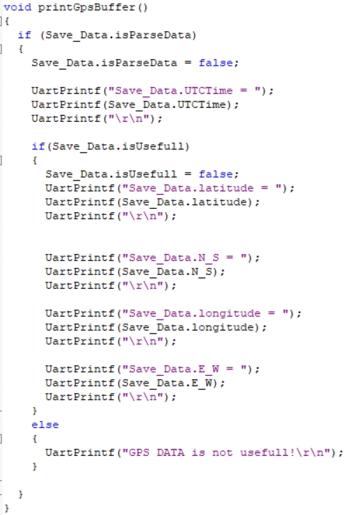
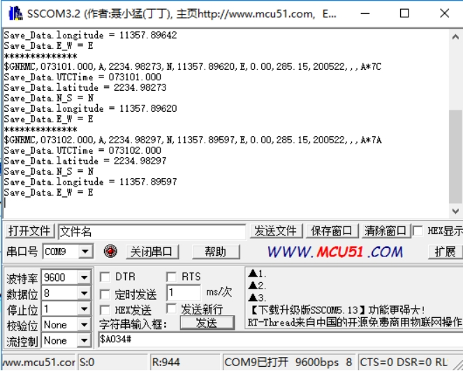

# 51 MCU: análise GPS

**1. Objetivos de aprendizagem**

Nesta lição, vamos aprender principalmente a usar o microcontrolador 51 do modelo STC89C52RC e o módulo GPS para implementar a função de análise de informações de posição.

**2. Preparação prévia**

O módulo GPS utiliza comunicação UART e USB; aqui usamos a porta UART do C51 para ler as informações, conectando o TX do módulo ao pino P3.0 da placa 51. O VCC e o GND são conectados a 5V e GND, respectivamente.

**3.** **Programa**

Inicializar a porta serial e o array de dados

 

Ler e analisar os dados recebidos.

 

Imprimir os dados recebidos através da porta serial.

 

**4****. Fenómeno do experimento**

Após o módulo ser energizado, ele leva cerca de 32s para iniciar; depois disso, a luz de status da porta serial no módulo continuará piscando, momento em que os dados podem ser recebidos normalmente.

Após baixar o programa, execute-o, abra o software de porta serial e defina a taxa de transmissão como 9600; a porta serial imprimirá ciclicamente as informações de posição atuais.

 

Atenção: a antena do módulo precisa estar em ambiente externo, caso contrário pode não conseguir buscar o sinal de GPS.

<RelatedProducts slugs="gps-beidou-module" />
