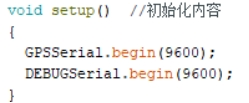
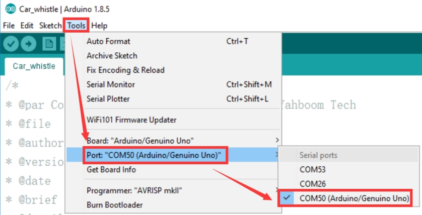
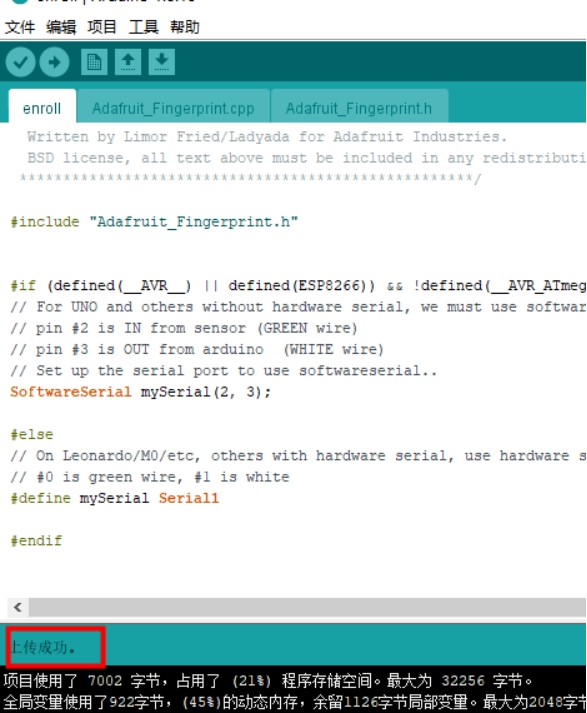
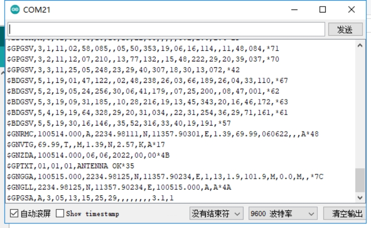

# Arduino: leitura de posição

**1. Objetivos de aprendizagem**

Nesta lição, vamos aprender principalmente a usar o arduino e o módulo GPS para implementar a função de leitura de informações de posição.

**2. Preparação prévia**

O módulo GPS utiliza comunicação UART e USB; aqui usamos a porta UART do arduino UNO para ler as informações, conectando o TX do módulo ao pino D0 da placa arduino UNO. O VCC e o GND são conectados a 5V e GND, respectivamente.

**3.** **Programa**

Inicializar a porta serial.

 

Imprimir os dados recebidos.

**4. Compilar e carregar o programa**

4.1 Precisamos usar o software Arduino IDE para abrir o arquivo, depois clicar no “√” na barra de menu para compilar o programa e aguardar até aparecer “Compilação bem-sucedida” no canto inferior esquerdo.

 

4.2 Na barra de menu do Arduino IDE, precisamos selecionar 【Ferramentas】---【Porta】---selecionar o número da porta que acabou de aparecer no Gerenciador de Dispositivos, como mostra a figura abaixo.

 

4.3 Após concluir a seleção, clique em “→” na barra de menu para enviar o código para a placa UNO. Quando aparecer “Upload concluído” no canto inferior esquerdo, significa que o programa foi enviado com sucesso para a placa UNO, como mostra a figura abaixo.

 

 

**5. Fenómeno do experimento**

Após o módulo ser energizado, ele leva cerca de 32s para iniciar; depois disso, a luz de status da porta serial no módulo continuará piscando, momento em que os dados podem ser recebidos normalmente.

Após baixar o programa, execute-o, abra a janela de monitor serial, abra o software de porta serial e defina a taxa de transmissão como 9600; a porta serial imprimirá ciclicamente as informações de posição atuais. Essas informações são dados brutos não processados; consulte  CASIC多模卫星导航接收机协议规范.pdf  para ver o conteúdo específico de cada informação.

 

Atenção: a antena do módulo precisa estar em ambiente externo, caso contrário pode não conseguir buscar o sinal de GPS.

<RelatedProducts slugs="gps-beidou-module" />
