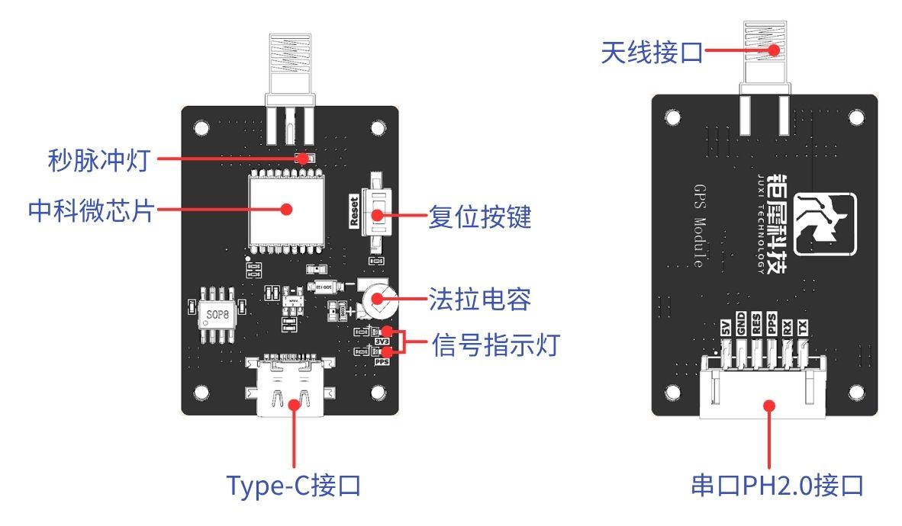

# Informações do módulo

​		O módulo GPS é um módulo de posicionamento e navegação BDS/GNSS de alto desempenho baseado no ATGM336H-5N. O módulo suporta vários sistemas de navegação por satélite, incluindo todos os satélites do BeiDou-2 e do BeiDou-3 da China, o GPS dos Estados Unidos, o GLONASS da Rússia e o QZSS do Japão, podendo receber simultaneamente os sinais de satélite dos sistemas de navegação acima e realizar posicionamento, navegação e sincronização de tempo combinados. O módulo possui vantagens como alta sensibilidade, baixo consumo de energia e baixo custo, sendo adequado para navegação veicular, posicionamento portátil e dispositivos vestíveis.

**I. Características do módulo:**

- Suporta todos os satélites do BeiDou-2 e do BeiDou-3, de 1 a 63

- Suporta posicionamento com sistema único dos sistemas de navegação por satélite BDS/GPS/QZSS, bem como posicionamento combinado multi-sistema em qualquer combinação.

- Suporta A-GNSS

- Sensibilidade de captura em inicialização a frio: -148dBm

- Sensibilidade de rastreamento: -162dBm

- Precisão de posicionamento: 2,5 metros (CEP50)

- Tempo de primeiro posicionamento: 32 segundos

- Baixo consumo de energia: funcionamento contínuo 25mA@3.3V

- Detecção de antena integrada e função de proteção contra curto-circuito da antena

**II. Descrição da interface do módulo GPS:**

**III. Protocolo de comunicação**

Consulte o protocolo de comunicação detalhado em   CASIC多模卫星导航接收机协议规范.pdf .

<RelatedProducts slugs="gps-beidou-module" />
