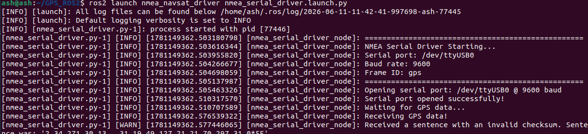
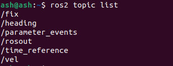
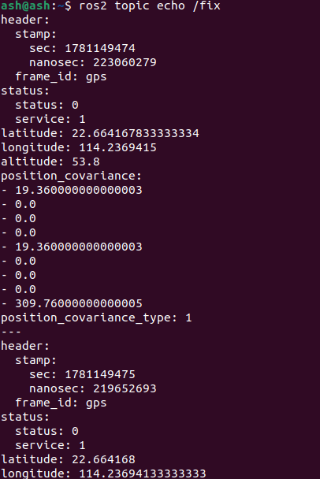
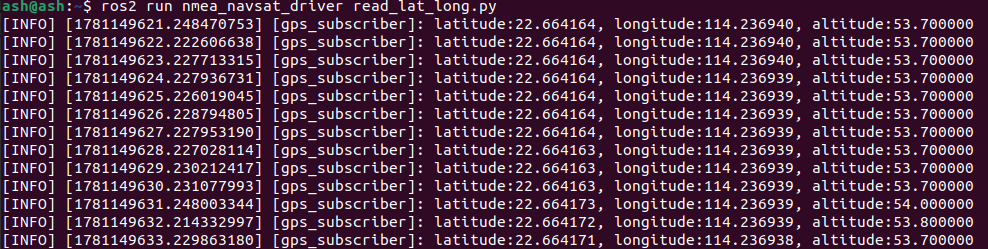

# ROS: leitura de dados GPS

**Esta função lê os dados do módulo GPS através do terminal e analisa os dados de GPS para obter os dados de latitude, longitude e altitude.**

#### 1. Ler dados de GPS através do terminal

No terminal, digite,

```
ros2 launch nmea_navsat_driver nmea_serial_driver.launch.py
```



Em seguida, vamos verificar os dados do tópico; no terminal, digite,

```
ros2 topic list
```



Sobre os dados desses tópicos de GPS, aqui vai uma explicação,

| Tópico            | Tipo                       | Descrição                                |
| --------------- | -------------------------- | ----------------------------------- |
| /extend_fix     | gps_common/GPSFix          | A mensagem GPSFix contém o status dos satélites de GPS e informações de posicionamento |
| /fix            | sensor_msgs/NavSatFix      | Informações de posicionamento de GPS |
| /time_reference | sensor_msgs/TimeReferencd  | Informações de tempo do GPS |
| /vel            | geometry_msgs/TwistStamped | Informações de velocidade do GPS |

Os tipos de mensagem de cada tópico podem ser consultados nos seguintes sites oficiais,

[Documentação de sensor_msgs/NavSatFix (ros.org)](http://docs.ros.org/en/api/sensor_msgs/html/msg/NavSatFix.html)

[Documentação de sensor_msgs/TimeReference (ros.org)](http://docs.ros.org/en/api/sensor_msgs/html/msg/TimeReference.html)

[Documentação de geometry_msgs/TwistStamped (ros.org)](http://docs.ros.org/en/api/geometry_msgs/html/msg/TwistStamped.html)

Podemos imprimir essas mensagens de tópico no terminal; o que se obtém são os dados de GPS. Tomando a impressão de /fix como exemplo, no terminal, digite

```
ros2 topic echo /fix
```

O terminal imprimirá os seguintes dados,



Entre eles, latitude, longitude e altitude representam, respectivamente, a latitude, a longitude e a altitude.

#### 2. Ler a latitude, longitude e altitude dos dados de GPS

Execute no terminal,

```
ros2 launch nmea_navsat_driver nmea_serial_driver.launch.py
```

Em outro terminal, execute,

```
ros2 run nmea_navsat_driver read_lat_long.py 
```



Os dados impressos no terminal são a latitude, longitude e altitude atuais do módulo GPS. Vejamos o código-fonte, read_lat_long.py

```python
#! /usr/bin/env python3
# -*- coding: utf-8 -*-
import rclpy
from rclpy.node import Node
from sensor_msgs.msg import NavSatFix

class GPSSubscriber(Node):
    def __init__(self):
        super().__init__('GPS_subscriber')
        self.subscription = self.create_subscription(
            NavSatFix,
            '/fix',
            self.gps_callback,
            10)
        self.subscription

    def gps_callback(self, msg):
        self.get_logger().info(f"latitude:{msg.latitude:.6f}, longitude:{msg.longitude:.6f}, altitude:{msg.altitude:.6f}")

def main(args=None):
    rclpy.init(args=args)
    gps_subscriber = GPSSubscriber()
    rclpy.spin(gps_subscriber)
    gps_subscriber.destroy_node()
    rclpy.shutdown()

if __name__ == '__main__':
    main()
```

O programa assina os dados do tópico /fix e, em seguida, realiza a análise dentro da função de callback, imprimindo finalmente no terminal.

<RelatedProducts slugs="gps-beidou-module" />
