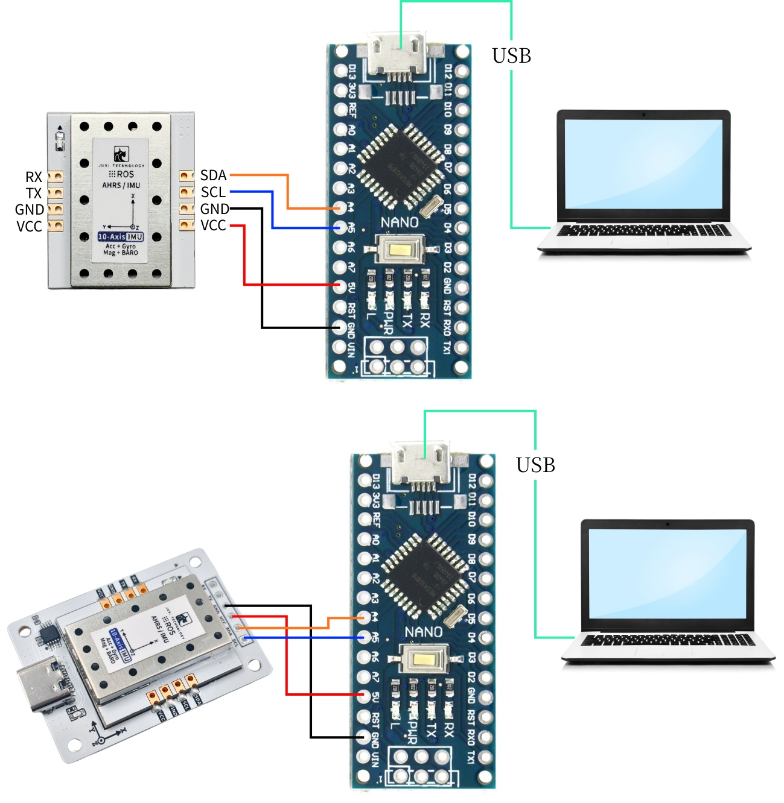
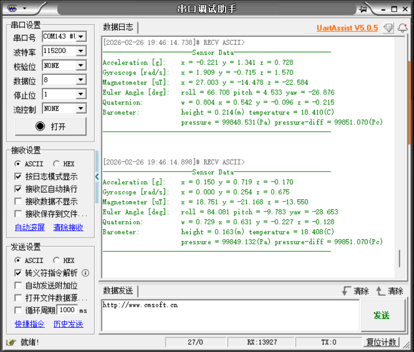

# Arduino

Este exemplo usa uma placa de desenvolvimento Arduino Nano, um computador Windows, alguns fios Dupont e um sensor de atitude IMU. 

[Arduino.rar](/downloads/Arduino.rar)

## 1. Conectar o dispositivo




## 2. Análise do Código Principal

Consulte o código-fonte nos materiais para ver o código específico.

```C++
/**
 * @brief 通用读取传感器数据的辅助函数
 *        Generic helper function to read sensor data
 */
static int read_sensor_data(uint8_t reg, uint8_t *buffer, uint16_t length, float out[], uint8_t out_size, float scale_factor, bool is_float)
{
    if (read_register(reg, buffer, length) != 0) {
        return -1;
    }
    
    if (out != NULL) {
        if (is_float) {
            // 处理浮点数数据
            for (uint8_t i = 0; i < out_size; i++) {
                out[i] = to_float(&buffer[i * 4]);
            }
        } else {
            // 处理整数数据并应用缩放因子
            for (uint8_t i = 0; i < out_size; i++) {
                out[i] = to_int16(&buffer[i * 2]) * scale_factor;
            }
        }
    }
    return 0;
}

/**
 * @brief 读取加速度数据（单位 g）
 *        Read acceleration in g.
 */
int IMU_I2C_ReadAccelerometer(float out[3])
{
    uint8_t register_data[6];
    return read_sensor_data(IMU_FUNC_RAW_ACCEL, register_data, 6, out, 3, ACCEL_SCALE_FACTOR, false);
}

/**
 * @brief 读取角速度（单位 rad/s）
 *        Read angular velocity in rad/s.
 */
int IMU_I2C_ReadGyroscope(float out[3])
{
    uint8_t register_data[6];
    return read_sensor_data(IMU_FUNC_RAW_GYRO, register_data, 6, out, 3, GYRO_SCALE_FACTOR, false);
}

/**
 * @brief 读取磁场强度（单位 uT）
 *        Read magnetic field strength in micro tesla.
 */
int IMU_I2C_ReadMagnetometer(float out[3])
{
    uint8_t register_data[6];
    return read_sensor_data(IMU_FUNC_RAW_MAG, register_data, 6, out, 3, MAG_SCALE_FACTOR, false);
}

/**
 * @brief 读取四元数
 *        Read quaternion (w, x, y, z).
 */
int IMU_I2C_ReadQuaternion(float out[4])
{
    uint8_t register_data[16];
    return read_sensor_data(IMU_FUNC_QUAT, register_data, 16, out, 4, 1.0f, true);
}

/**
 * @brief 读取欧拉角（弧度）
 *        Read Euler angles (rad).
 */
int IMU_I2C_ReadEuler(float out[3])
{
    uint8_t register_data[12];
    int result = read_sensor_data(IMU_FUNC_EULER, register_data, 12, out, 3, 1.0f, true);
    
    // 转换为度数
    if (result == 0 && out != NULL) {
        out[0] *= RAD2DEG;
        out[1] *= RAD2DEG;
        out[2] *= RAD2DEG;
    }
    
    return result;
}
/**
 * @brief 读取气压相关数据：高度、温度、气压、气压差
 *        Read barometric data: height, temperature, pressure, delta.
 */
int IMU_I2C_ReadBarometer(float out[4])
{
    uint8_t register_data[16];
    if (read_register(IMU_FUNC_BARO, register_data, 16) != 0) {
        return -1;
    }
    if (out != NULL) {
        out[0] = to_float(&register_data[0]);
        out[1] = to_float(&register_data[4]);
        out[2] = to_float(&register_data[8]);
        out[3] = to_float(&register_data[12]);
    }
    return 0;
}

```

read_sensor_data(): Uma função auxiliar genérica para ler dados do sensor

IMU_I2C_ReadAccelerometer(): Lê os dados de aceleração (unidade: g)

IMU_I2C_ReadGyroscope(): Lê a velocidade angular (unidade: rad/s)

IMU_I2C_ReadQuaternion(): Lê o quatérnio

IMU_I2C_ReadEuler(): Lê os ângulos de Euler (radianos)

IMU_I2C_ReadBarometer(): Lê os dados relacionados ao barômetro: altitude, temperatura, pressão barométrica e diferença de pressão

## 3. Ler os dados do IMU

Depois que o programa é gravado no Arduino, abra o assistente de porta serial (configure os parâmetros conforme mostrado na figura abaixo) e você verá que os dados do módulo IMU são impressos continuamente. Quando mudamos a atitude do módulo IMU, os dados mudam. 



Observação: O acima é a leitura de dados de um IMU de 10 eixos. O de 6 eixos não possui dados de magnetômetro e barômetro, e o de 9 eixos não possui dados de barômetro.

