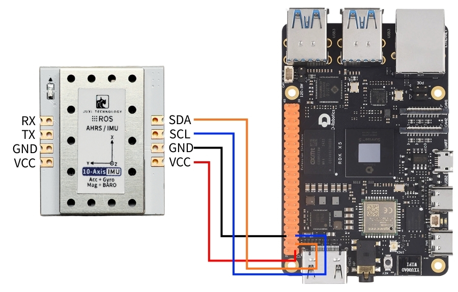
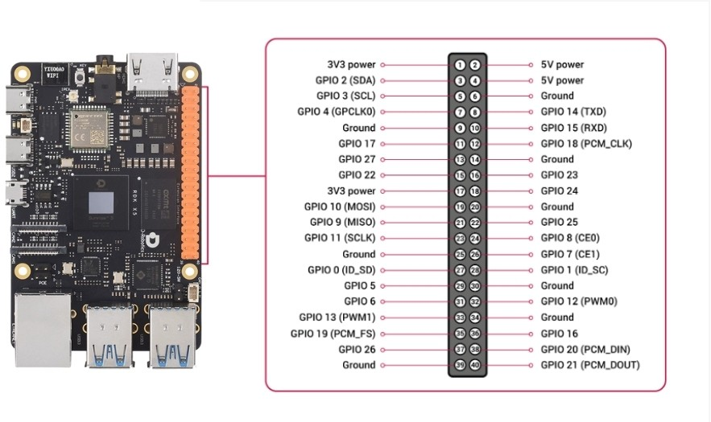
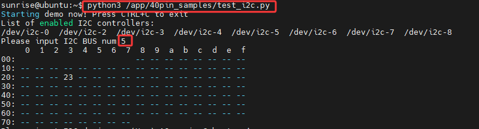
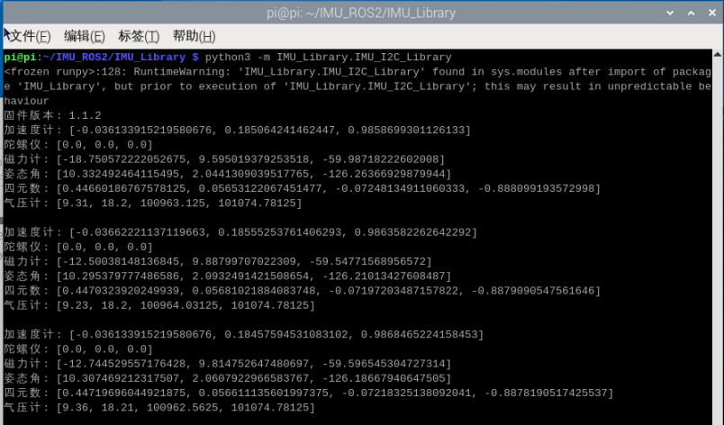
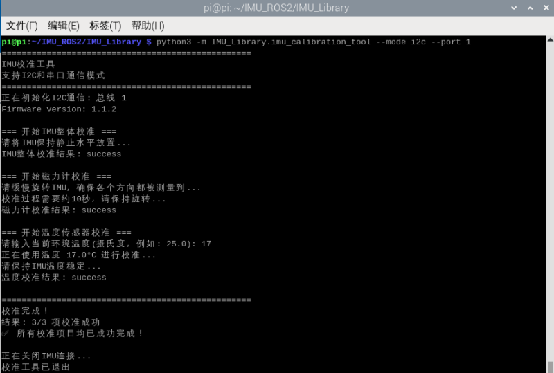
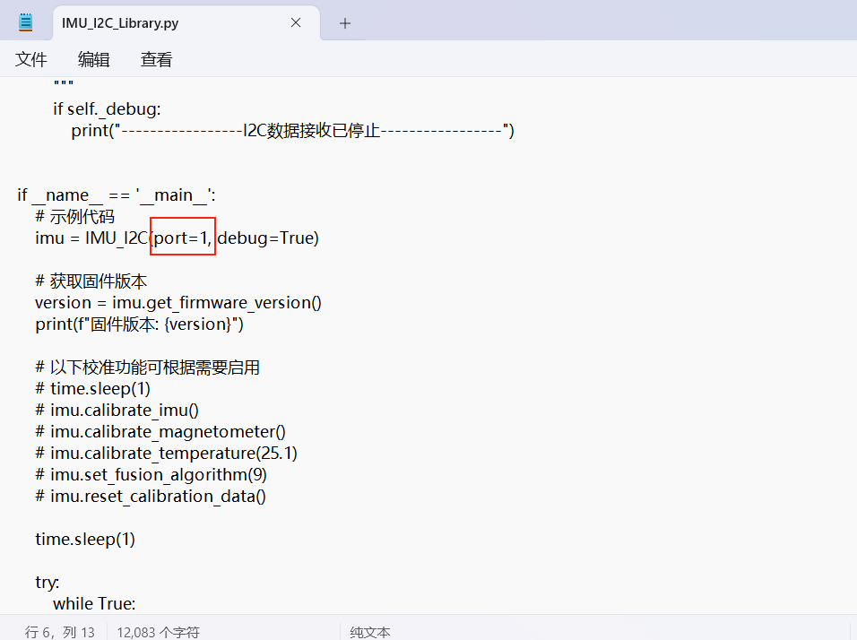

# RDK

## Etapa 1 Conectar dispositivos

Este tutorial usa a imagem da versão ? da placa-mãe RDK X5 como exemplo. 

Conecte o sensor de atitude IMU à interface I2C do RDK X5 conforme mostrado abaixo.





## 2. Verificar o status do dispositivo

Visualizar Dispositivos I2C 

```PowerShell
python3 /app/40pin_samples/test_i2c.py
```



## 3. Instalar a biblioteca do driver

3.1** Instalar as bibliotecas Python necessárias para o código**

```PowerShell
sudo apt update
sudo apt install -y python3-serial
sudo apt install -y python3-smbus2
```

3.2 Transferir Arquivos

IMU_ROS2.zip

Amigos que ainda não estão familiarizados com o uso do MobaXterm para transferir arquivos, consultem a página a seguir para obter instruções detalhadas de instalação e operação do MobaXterm:[文件远程传输](https://juxitech.feishu.cn/wiki/KB0Jw2o6Wis9f0ksyeFceVmgnfd)

Arraste os arquivos descompactados para o Raspberry Pi 5 por meio do software MobaXterm. 


## 4. Visualizar os dados do IMU

**Entre no diretório ~/IMU_Library e execute o arquivo IMU_Serial_Library.py**

```PowerShell
cd ~/imu_ros1/src/IMU_ROS1/IMU_Library
# ou
cd ~/imu_ros2/src/IMU_ROS2/IMU_Library

# Executar o arquivo de impressão de dados da IMU
python3 -m IMU_Library.IMU_I2C_Library
```



Atenção: O acima é a leitura de dados de um IMU de 10 eixos; o de 6 eixos não possui dados de magnetômetro e barômetro, e o de 9 eixos não possui dados de barômetro.

## **5. Calibração do IMU**

**Entre no diretório ~/IMU_Library e execute o arquivo imu_calibration_tool.py**

```PowerShell
cd ~/IMU_Library

# Executar o arquivo de código de calibração da IMU --calibração por comunicação I2C
# Executar todas as calibrações (completa, magnetômetro, temperatura)
python3 -m IMU_Library.imu_calibration_tool --mode i2c --port 0

# Somente calibração completa
python3-m IMU_Library.imu_calibration_tool --mode i2c --port 0 --calibrate imu

# Somente calibração do magnetômetro
python3-m IMU_Library.imu_calibration_tool --mode i2c --port 0 --calibrate mag

# Somente calibração de temperatura
python3-m IMU_Library.imu_calibration_tool --mode i2c --port 0 --calibrate temp
```



## 6. Precauções

Ao usar a placa principal RDK X5, é necessário modificar o número do barramento I2C de acordo com a situação real. A posição de modificação é mostrada na figura abaixo. Normalmente, é o barramento número 0.





