# Transferência remota de arquivos

## 1. MobaXterm

O MobaXterm é uma ferramenta remota poderosa que integra ferramentas remotas como SHH, VNC e FTP.

## 2. Instalação do MobaXterm

Site oficial: [https://mobaxterm.mobatek.net/](https://mobaxterm.mobatek.net/)

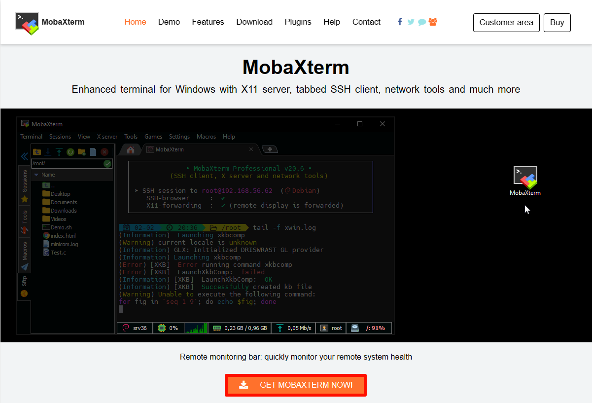

### 2.1. Baixar o MobaXterm

Escolha a versão gratuita para baixar:

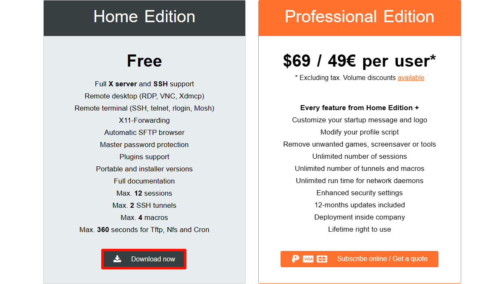

Escolha a versão de instalação para baixar:

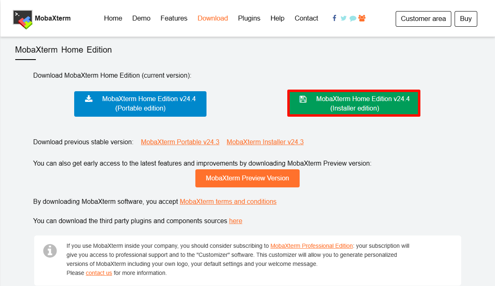

### 2.2. Instalação do MobaXterm

Descompacte o pacote compactado baixado do site oficial e abra o arquivo `MobaXterm_installer_24.4.msi` para instalar:

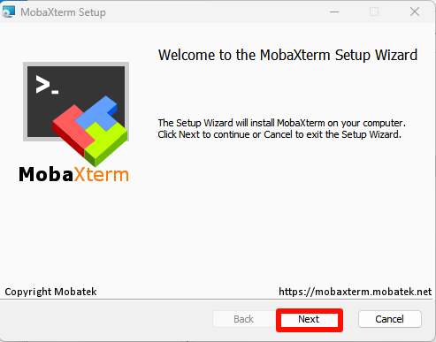

Aceitar o acordo:

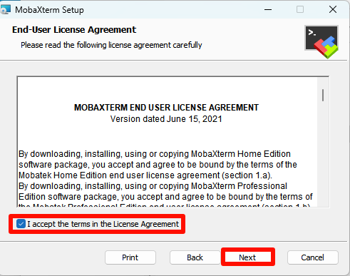

Escolha o local de instalação do software: recomenda-se o local padrão

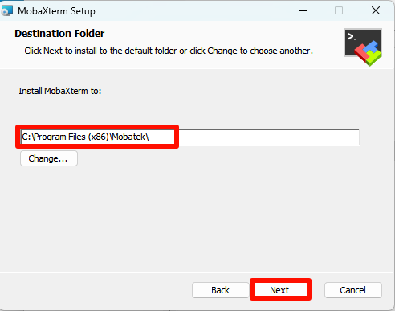

Instalação propriamente dita:

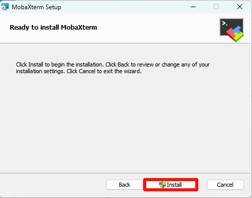

Concluir a instalação:

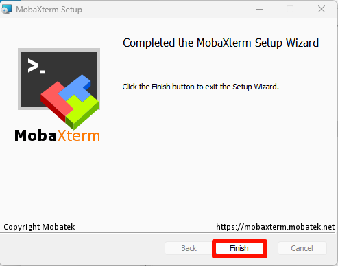

## 3. Uso do MobaXterm

Encontre o ícone do `MobaXterm` na área de trabalho e abra-o:

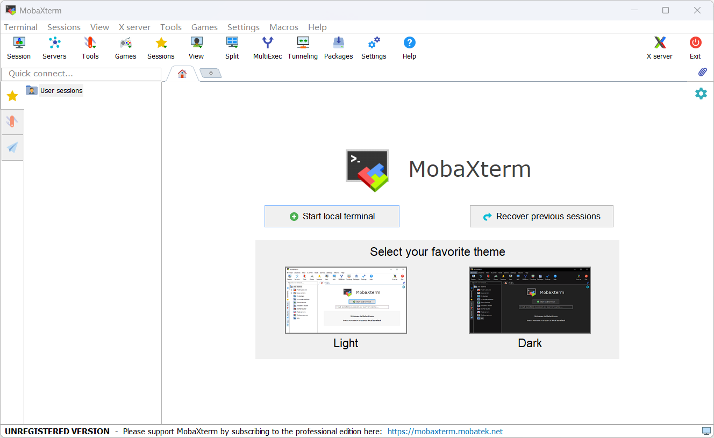

## 4. MobaXterm: SSH remoto

Selecione `Session` → `SSH`: preencha o IP e o nome de usuário do dispositivo remoto

Por exemplo:

Informações padrão da placa Jetson:

Nome de usuário: juxi

Senha: juxi

Atenção: ao usar SSH remoto no MobaXterm, o login remoto via SFTP será feito automaticamente na barra lateral

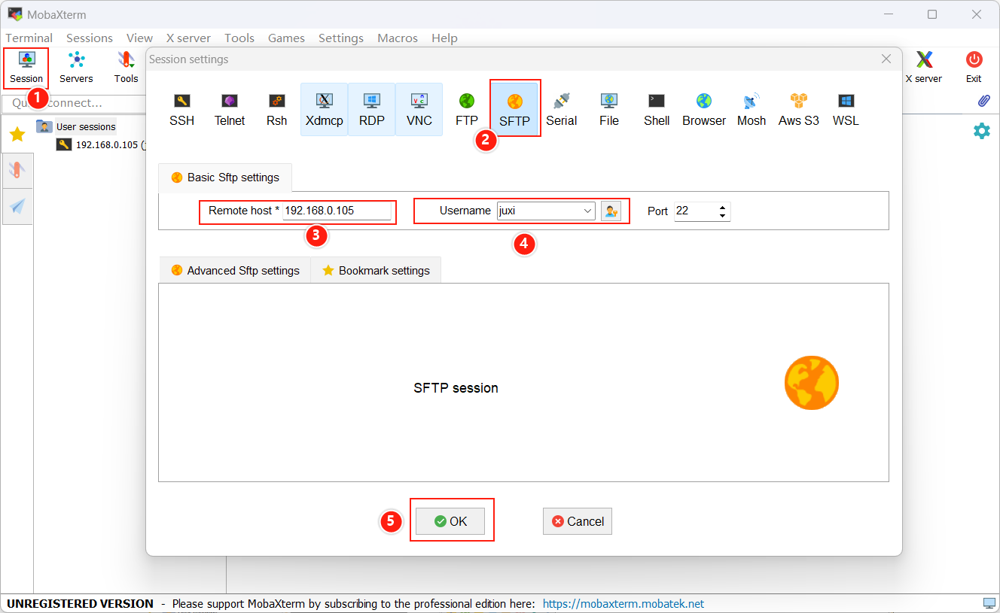

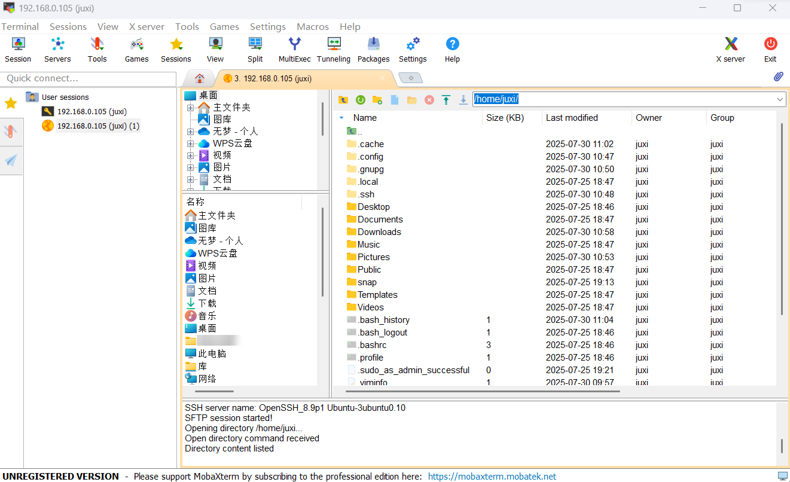

