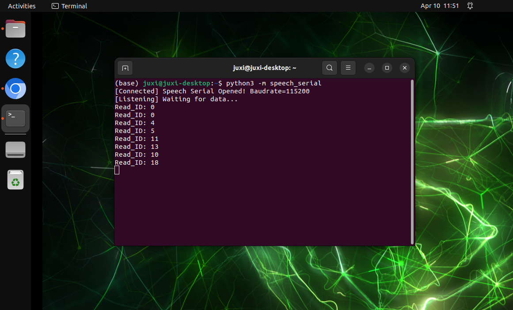

# Comunicação Serial Jetson Nano

Nota: o módulo de interação por voz precisa ser gravado com o firmware de fábrica. Se o chip de voz ainda não tiver sido gravado com firmware após o recebimento, não é necessário gravá-lo. 

## 1. Verificar a porta

Conecte à placa-mãe do Jetson Nano pela interface USB. 

Ao digitar no terminal, o aparecimento do dispositivo ttyUSB0 indica reconhecimento normal (geralmente é ttyUSB0, mas pode ser outro número de dispositivo) 

```Plain Text
ls /dev/ttyUSB*
```


## 2. Implementação do código

Descarregue speech_serial.py para o diretório correspondente

```Python
#!/usr/bin/env python3
# -*- coding: utf-8 -*-

import time
import serial
from typing import Optional, Tuple


class SpeechModule:
    """
    Controlador de comunicação série para o módulo de voz
    Encapsula a lógica de interação com o módulo de voz
    """
    
    # Constantes de configuração da porta série
    DEFAULT_PORT = "/dev/ttyUSB0"
    DEFAULT_BAUDRATE = 115200
    
    # Definição das palavras de comando (palavras de reprodução/ID de função)
    CMD_THIS_RED = 0x60
    CMD_THIS_GREEN = 0x61
    CMD_THIS_YELLOW = 0x62
    CMD_RECOGNIZE_YELLOW = 0x63
    CMD_RECOGNIZE_GREEN = 0x64
    CMD_RECOGNIZE_BLUE = 0x65
    CMD_RECOGNIZE_RED = 0x66
    CMD_INIT = 0x67

    def __init__(self, port: str = DEFAULT_PORT, baudrate: int = DEFAULT_BAUDRATE):
        self._port = port
        self._baudrate = baudrate
        self._serial_conn: Optional[serial.Serial] = None

    def connect(self) -> bool:
        """Establish serial connection"""
        try:
            self._serial_conn = serial.Serial(self._port, self._baudrate, timeout=0.1)
            if self._serial_conn.is_open:
                print(f"[Connected] Speech Serial Opened! Baudrate={self._baudrate}")
                return True
            return False
        except serial.SerialException as e:
            print(f"[Error] Speech Serial Open Failed: {e}")
            return False

    def send_command(self, cmd_id: int) -> None:
        """
        Enviar trama de comando
        Formato do protocolo: 0xAA 0x55 0xFF [Data] 0xFB
        """
        if not self._serial_conn or not self._serial_conn.is_open:
            return

        # Construir a trama de dados completa
        frame = bytes([0xAA, 0x55, 0xFF, int(cmd_id), 0xFB])
        
        self._serial_conn.write(frame)
        time.sleep(0.005)
        self._serial_conn.reset_input_buffer()  # Equivalente a flushInput

    def read_response(self) -> Optional[int]:
        """
        Ler e analisar os dados devolvidos
        Devolve: Read_ID (dados do 6.º byte)
        """
        if not self._serial_conn or not self._serial_conn.is_open:
            return None

        # Verificar a quantidade de dados no buffer
        bytes_available = self._serial_conn.in_waiting
        if bytes_available <= 0:
            return None

        raw_data = self._serial_conn.read(bytes_available)
        hex_str = raw_data.hex()

        # Verificar o cabeçalho da trama 'aa55'
        if hex_str.startswith('aa55'):
            try:
                # Lógica simples de extração do índice (consistente com a lógica do código original)
                # Nota: aqui assume-se que o comprimento dos dados é suficiente; em código industrial recomenda-se adicionar uma verificação do comprimento
                # byte1 = hex_str[4:6] # Manter o 5.º byte da lógica original, mas sem o utilizar
                byte2 = hex_str[6:8] # Extrair o 6.º byte
                
                read_id = int(byte2, 16)
                
                self._serial_conn.reset_input_buffer()
                time.sleep(0.005)
                print(f"Read_ID: {read_id}")
                return read_id
            except (IndexError, ValueError):
                pass
        
        return None

    def run(self):
        """Main run loop"""
        if not self.connect():
            return

        # Inicializar o módulo
        self.send_command(self.CMD_INIT)
        time.sleep(0.005)

        print("[Listening] Waiting for data...")
        try:
            while True:
                self.read_response()
        except KeyboardInterrupt:
            print("\n[Stopped] Program interrupted by user.")
        finally:
            if self._serial_conn and self._serial_conn.is_open:
                self._serial_conn.close()
                print("[Disconnected] Serial port closed.")


if __name__ == "__main__":
    module = SpeechModule()
    module.run()

```

## 3. Efeito da implementação

O conteúdo da transmissão pode ser visualizado de acordo com o protocolo do ficheiro \<Lista de Protocolos de Palavras de Comando e Anúncio V1_Arquivo Chinês\> fornecido no anexo. 

Entre eles, o primeiro e o segundo bytes AA 55 representam o cabeçalho do protocolo, o terceiro byte 00 representa a função de transmissão, o quarto é o ID do conteúdo transmitido, onde podemos ver que "o carro avança" é 0x07 em hexadecimal, portanto enviar 0x07 para o registrador 0x03 no programa transmitirá o conteúdo correspondente. O quinto byte é o quadro final. 


Digite o seguinte comando no terminal para executar o programa 

```Plain Text
python3 -m speech_serial
```

Após dizer a palavra de ativação "Wake", o Console responderá com o Read_ID recebido: 0 

diga "Desligar a luz", e o Console responderá com Read_ID recebido: 13 



Neste momento, você pode abrir o anexo "Lista de Protocolos de Palavras de Comando e Anúncio V1_Arquivo Chinês" para consultar o protocolo de "Desligar a luz" 


Entre eles, o primeiro e o segundo bytes AA 55 representam o cabeçalho do protocolo, o terceiro byte representa o ID das dez palavras funcionais do chip, o quarto é o ID da palavra de comando, onde podemos ver que "desligar a luz" é 0D em hexadecimal e 13 em decimal. O quinto byte é o quadro final.

Se você disser outras palavras de comando, o Console também imprimirá o ID da palavra de comando correspondente. Você pode testar por conta própria. 


