# Chaveador KVM

> **[Comprar na loja](https://www.juxitech.com/products/4-in-1-kvm-switch-hub-ttl-serial-bluetooth-docking-station)**

O switch KVM inclui funcionalidade de HUB, porta serial TTL e módulo Bluetooth

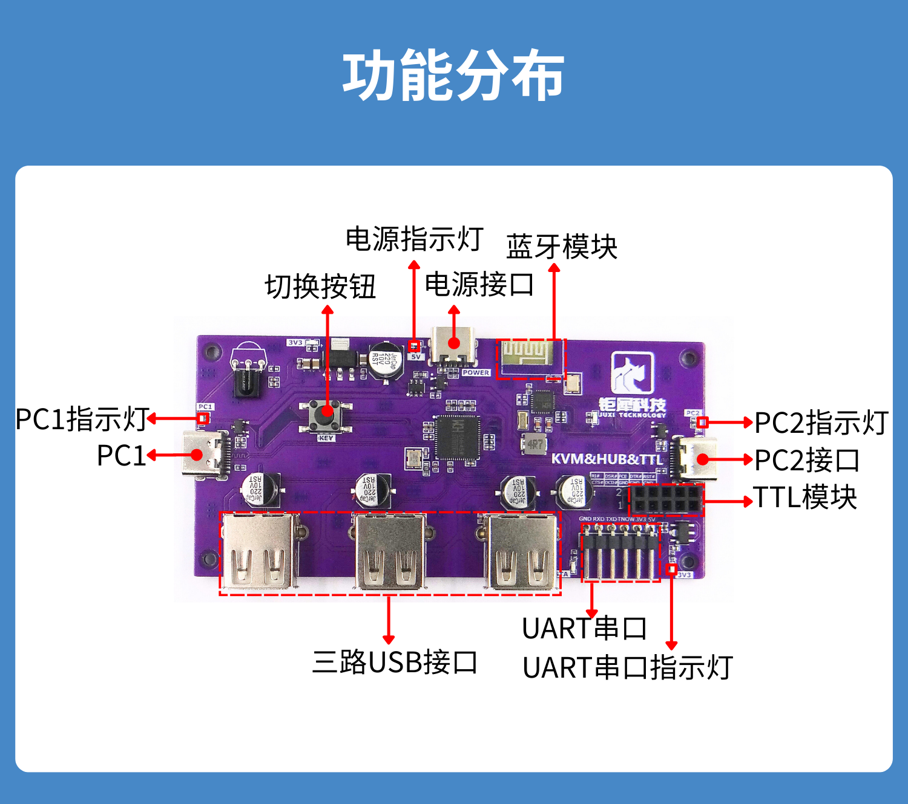

## Funcionalidade dos módulos individuais

### 1. Função de HUB

Um único cabo USB-TypeC pode expandir uma porta USB em três portas USB

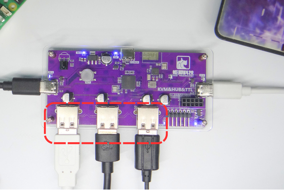

### 2. Porta serial TTL

Os pinos, da esquerda para a direita, são GND, RXD, TXD, TNOW, 3V3 e 5V, respectivamente.

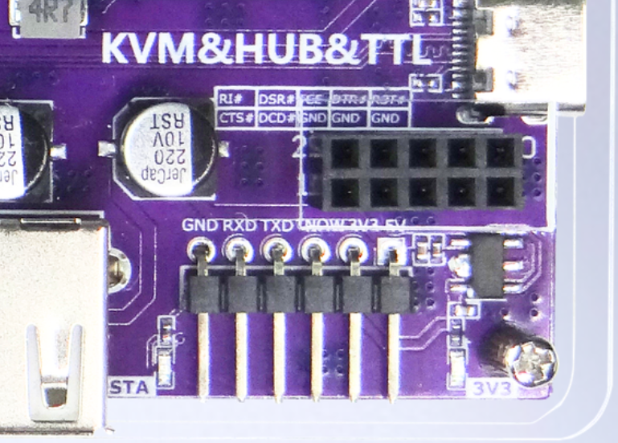

### 3. Módulo Bluetooth

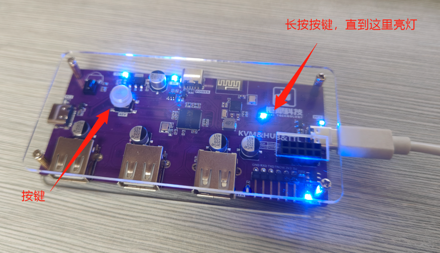

Conecte a usar comandos AT, ou alterne para o modo escravo, e o telemóvel deve se conectar pelo protocolo 4.2

## Comutação de duas extremidades

### 1. Dispositivo A + Dispositivo B (ambas as extremidades com monitores)

Botão de comutação &amp; Controle remoto por infravermelho

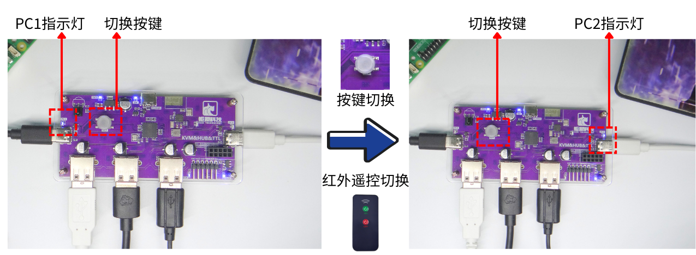

### 2. Placa-mãe (sem monitor) + Host (com monitor)

Basta usar adicionalmente um dispositivo de captura HDMI 4K HD conectado ao host e, em seguida, **no host, usar softwares como OBS e Potplayer para capturar o ecrã**

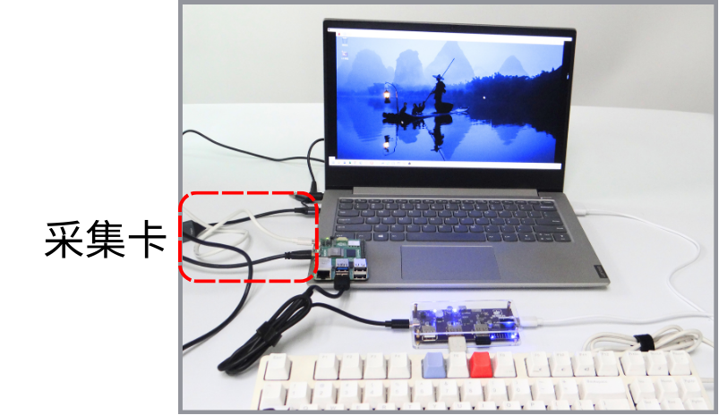

**Operação de fiação do dispositivo de captura HDMI 4K HD**

De acordo com a interface da placa-mãe, existem as três operações de fiação a seguir:

**Interface HDMI** ——\> Cabo HDMI ——\> Interface HDMI do coletor ——\> USB/Type-C ——\> Ecrãs como notebooks, computadores, all-in-one, telemóveis/tablets, etc.

**Interface Micro HDMI** ——\> Adaptador Micro para HDMI ——\> Cabo HDMI ——\> Interface HDMI do coletor ——\> USB/Type-C ——\> Ecrãs como notebooks, computadores, all-in-one, telemóveis/tablets, etc.

**Interface DP** ——\> Adaptador DP para HDMI ——\> Cabo HDMI ——\> Interface HDMI do coletor ——\> USB/Type-C ——\> Ecrãs como notebooks, computadores, all-in-one, telemóveis/tablets, etc.

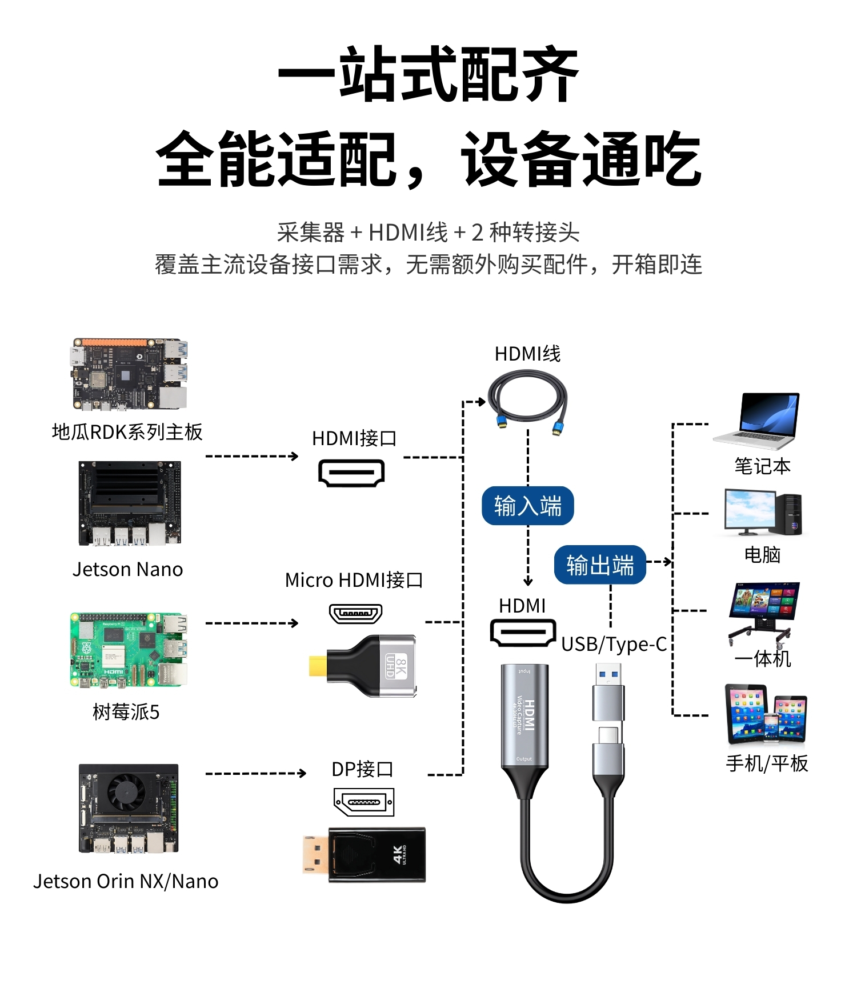

**Guia de operação do OBS**

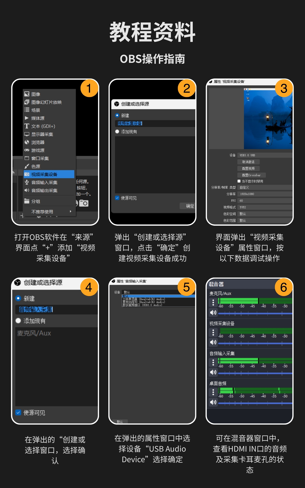

**Guia de operação do Potplayer**

Exemplo de diagrama de pinos

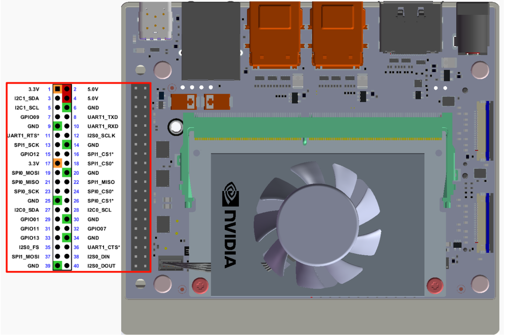

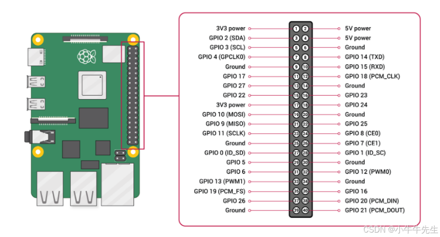

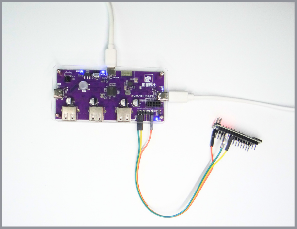
