# Tutorial de Depuração da Mão Hábil (servo TTL)

> **[Comprar na loja](https://www.juxitech.com/products/amazinghand)**

Primeiro, descarregue o pacote compactado "[Amazing Debugging.zip](https://juxitech.feishu.cn/wiki/I4K0w3W0Ri7u7EkY1qfcVoGon6e)". Após a descompactação, você pode usar o documento "Processo de depuração da mão hábil com programa Arduino (servo TTL)" para definir o ID do servo, calibrar, calibrar o ponto médio e executar o programa de demonstração, ou consultar o [código oficial open source](https://github.com/pollen-robotics/AmazingHand/tree/main/ArduinoExample).

**Sem desmontar o produto pronto** (as definições de ID de fábrica dos servos, a calibração e a calibração da posição neutra já foram ajustadas), você pode ir direto para o **[Ponto 6 "Executar '02 Demo Program'"](https://juxitech.feishu.cn/docx/OmmSdaXt7oZXBUxIwUacAI3Jnrc#doxcn2d0kH1XOXx1SlxvsF1x5df)** e o Ponto 7 **[Rastreamento de mão](https://juxitech.feishu.cn/docx/OmmSdaXt7oZXBUxIwUacAI3Jnrc#doxcnjsmqox3aQVF6pVKanOCRng)**.

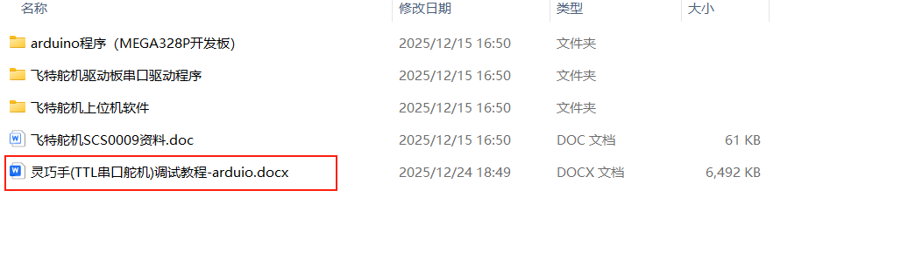

## 1. Método de cabeamento para depuração da mão hábil

Uma forma é usar um computador para executar softwares de host, como Python; por exemplo, o software de host de servos Feite ou a execução de código Python 

Outra é usar microcontroladores como o MEGA328P, ou placas de desenvolvimento adquiridas separadamente ou controladores principais, etc.

O método de cabeamento é o seguinte: 

(1) Método de cabeamento durante a depuração com Python (conecte apenas a placa de acionamento de servos): 

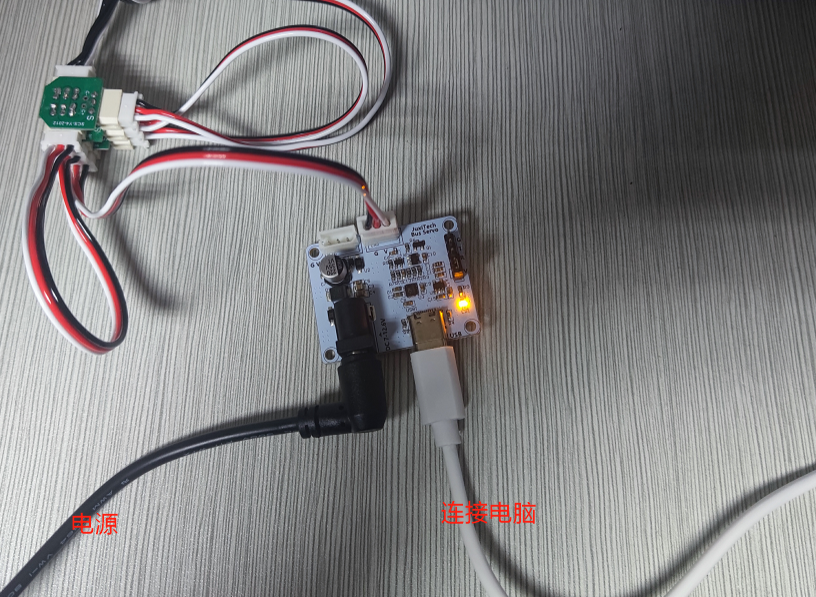

(2) Método de cabeamento durante a depuração com a placa de desenvolvimento MEGA328P (placa de acionamento de servos + placa de desenvolvimento 328P):

**Observe bem as posições dos pinos da placa de desenvolvimento MEGA328P! **

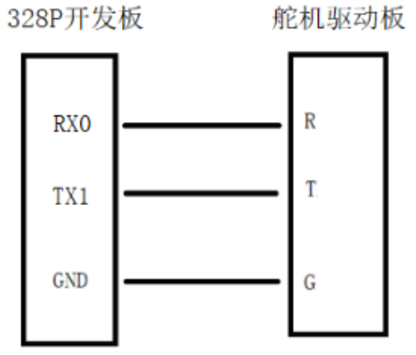

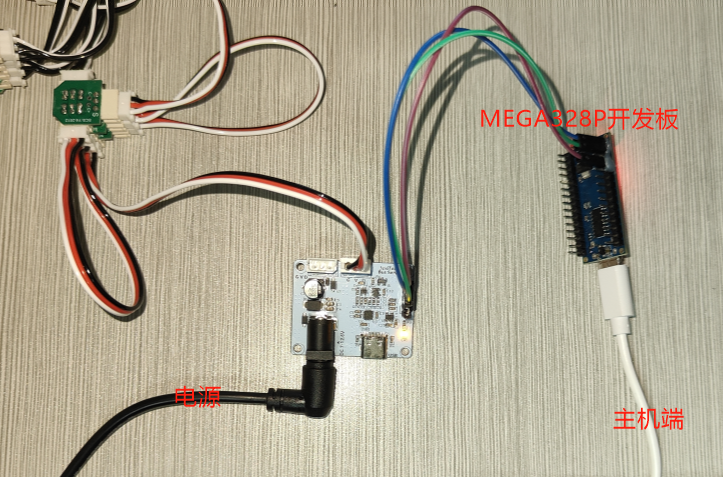

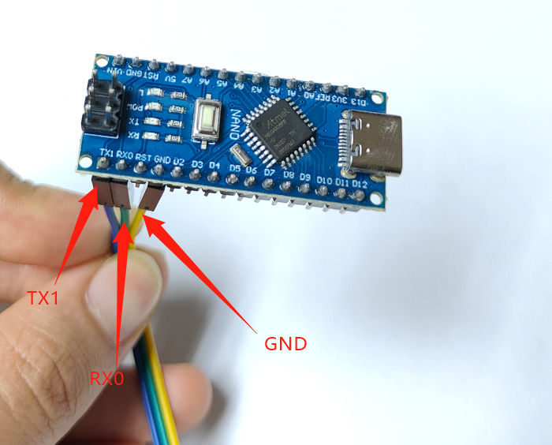

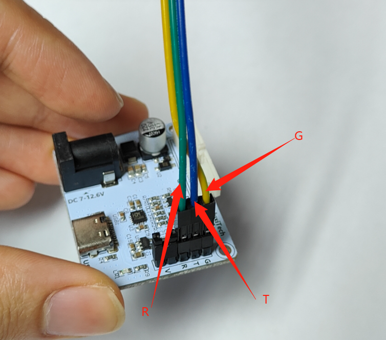

A seguir, descrevemos o processo de depuração a usar um microcontrolador. O próprio microcontrolador executará o programa de demonstração em loop contínuo, e ele pode ser interrompido simplesmente desconectando o cabo de dados. 

## 2. Definir o ID do servo

Uma mão hábil usa um total de 8 servos; os IDs da mão direita devem ser definidos de 1 a 8 e os da mão esquerda de 11 a 18 

Calibração do ponto médio — padrão do produto pronto: mão direita [451,571,451,571,451,571,451,571], mão esquerda [571,451,571,451,571,451,571,451] 

1. Cabeamento: conecte o motor servo **individual** à placa de acionamento de servos, em sequência.

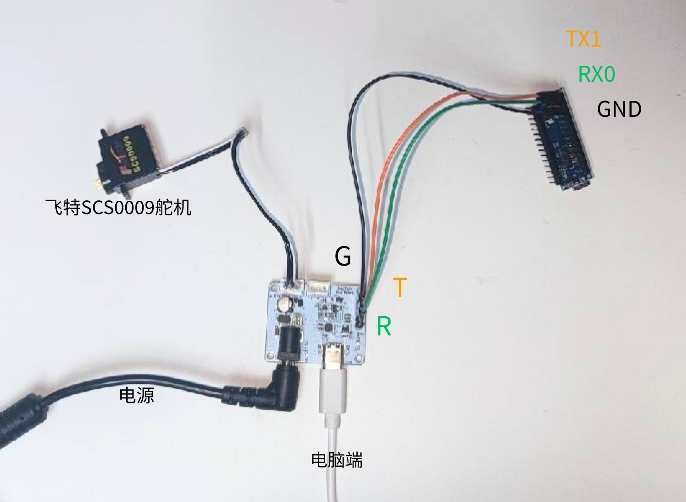

2. Use o software de host FD1.9.8.2 fornecido pelo fabricante do servo para a configuração

FD.rar

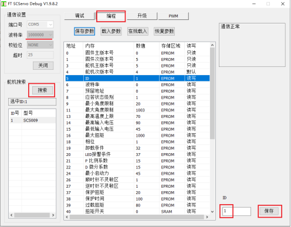

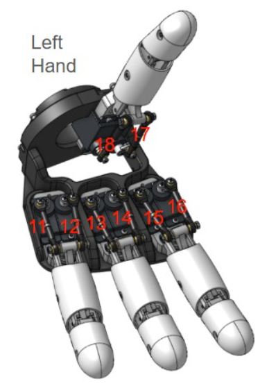

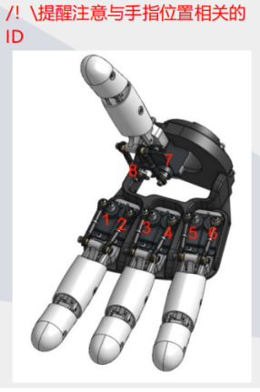

## 3. **Fixar a palheta do servo**

1. Envie para a placa de desenvolvimento o programa "usado na instalação da palheta branca do servo"

Função deste programa: posicionar a engrenagem do servo motor em uma posição aproximadamente central; todos os ângulos de movimento posteriores são baseados nessa posição central.

(1) Instale o software Arduino por conta própria e consulte o [tutorial de instalação](https://blog.csdn.net/weixin_35509395/article/details/156188274) de acordo com o seu sistema. Para compilar e descarregar o programa Arduino, você precisa instalar antes as bibliotecas FTServo e SCServo no Gerenciador de Bibliotecas.

(2) Seleção do tipo de placa de desenvolvimento: selecione "Arduino Nano" 

2. Depure os servos 1 e 2

(1) Edição: altere as posições a seguir de acordo com o ID do servo a ser depurado. Por exemplo, se você quiser depurar o dedo indicador, defina os IDs como 1 e 2.

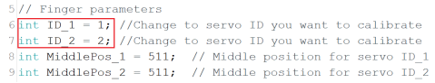

(2) Envie o programa para a placa de desenvolvimento 

(3) Cabeamento: conecte a placa de desenvolvimento à placa de acionamento de servos, **servos nº 1 e 2** — você ouvirá as engrenagens dos servos girar um determinado ângulo e depois parar.

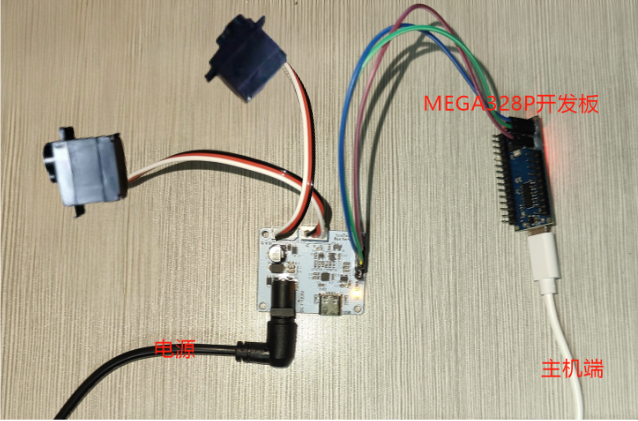

(4) Instale a palheta do servo na engrenagem, mantendo a posição o mais paralela possível.

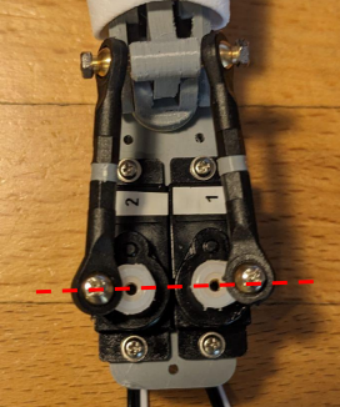

3. Depure os servos 3 e 4

(1) **Desconecte o cabeamento entre a placa de desenvolvimento 328P e a placa de acionamento de servos (caso contrário, não será possível enviar o programa)**

(2) Edição: defina os IDs como 3 e 4

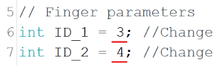

(3) Envie o programa para a placa de desenvolvimento 

(4) Conexão: conecte a placa de desenvolvimento à placa de acionamento de servos, **servos 3 e 4** — você ouvirá a engrenagem do servo girar um determinado ângulo e parar.

(5) Instale a palheta do servo na engrenagem, mantendo a posição o mais paralela possível

4. Depure os servos 5 e 6

Os passos são os mesmos acima 

5. Depure os servos 7 e 8

Os passos são os mesmos acima 

## 4. **Ajuste fino dos valores intermediários**

1. Envie para a placa de desenvolvimento o programa "01 — Usado no ajuste fino do valor MiddlePos"

2. Quando o dedo estiver na posição fechada, interrompa imediatamente o programa (basta desconectar o cabo de dados) e verifique se a palheta do servo está alinhada corretamente (como mostra a figura abaixo). Se não estiver alinhada, ajuste os valores de MiddlePos_1 e MiddlePos_2 no programa até alinhar. Registe esses valores (8 valores correspondentes aos 8 servos), que serão usados no programa final.

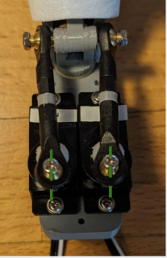

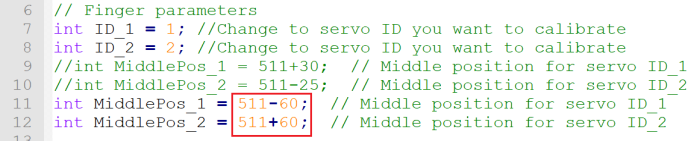

## 5. **Execute o programa de teste**

1. Preencha o array a seguir com os valores de MiddlePos_1 e MiddlePos_2 salvos acima e, em seguida, descarregue o programa.

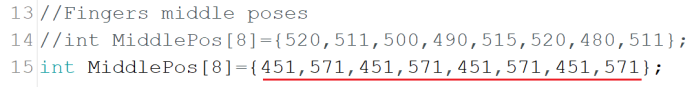

## 6. **Execute "02 Demo Program"**

(1) Instale o software Arduino por conta própria, a seguir o [tutorial de instalação de acordo com o seu sistema](https://blog.csdn.net/weixin_35509395/article/details/156188274)

(2) No diretório ` Dexterous Hand Debugging \00 TTL Serial Servo \ Arduino Program (MEGA328P Development Board) \02 Demo Program `, abra o ficheiro .ino correspondente, conforme seja a mão esquerda ou a mão direita 

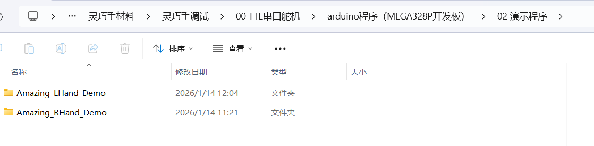

(3) Para enviar o programa Arduino à placa de desenvolvimento, você precisa instalar as bibliotecas FTServo e SCServo no Gerenciador de Bibliotecas

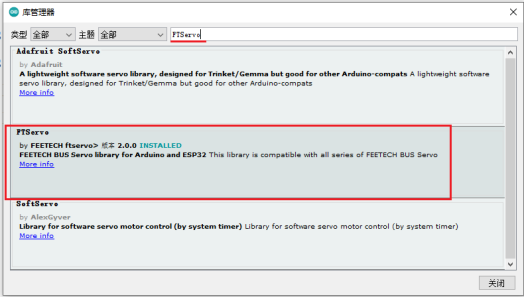

(4) Selecione o tipo de placa de desenvolvimento: escolha "Arduino Nano"

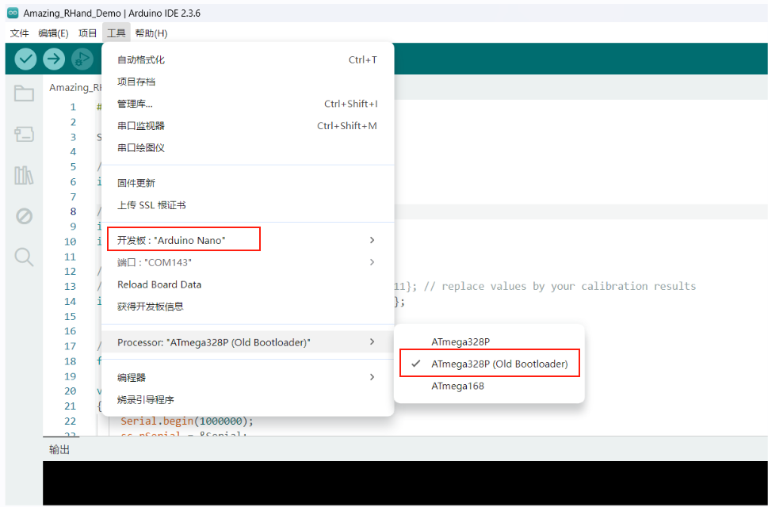

(5) Compile e envie

Observe que, neste momento, o computador está conectado apenas à placa de desenvolvimento, e a placa de desenvolvimento não está conectada à placa de acionamento de servos (ou seja, não está conectada à mão hábil) por enquanto.

Após o envio bem-sucedido, conecte a placa de desenvolvimento à placa de acionamento de servos por meio de três jumpers e conecte o servo à placa de acionamento de servos, a seguir o método de cabeamento em [Depuração com a placa de desenvolvimento MEGA328P](https://juxitech.feishu.cn/docx/OmmSdaXt7oZXBUxIwUacAI3Jnrc#doxcniHLi7JvMCniati2Mrgr6ne)

A mão hábil executará em loop contínuo o **"02 Demo Program"**

Os resultados da execução são os seguintes 

## [7. Rastreamento de mão](https://juxitech.feishu.cn/wiki/ZpHmwYARQiN2fwkqFJecqUFZnQg)

