# Tutorial do Braço Robótico LeRobot

> Esta página é a versão resumida. O [curso completo de LeRobot](/pt-pt/tutorials/robot-arms/so-arm101/lerobot/) detalha os oito passos para cada sistema — comece por aí se for a primeira vez.

> **[Comprar na loja](https://www.juxitech.com/products/so-arm101-developers-kit)**


Este tutorial foi atualizado até 15 de dezembro. Você pode optar por seguir a [versão mais recente da documentação oficial](https://github.com/huggingface/lerobot/tree/main). Para o tutorial específico na documentação oficial, consulte [este link](https://zihao-ai.feishu.cn/wiki/TS6swApHbinx01kHDi5cf5n5n8c). Se precisar de ficheiros como URDF, consulte [este link](https://github.com/TheRobotStudio/SO-ARM100). Para a versão antiga de 15 de setembro, consulte este [link](https://juxitech.feishu.cn/docx/DJkBdcwzooBqamxl0kgcvVUbngh?from=from_copylink). Os códigos de execução do SO-ARM101 e do SO-ARM100 são mutuamente compatíveis. 

## A. Instruções do tutorial

**O braço ativo preto da versão Pro usa um adaptador de energia 5V6A, enquanto o braço passivo branco usa um adaptador de energia 12V5A! **

A instalação dos servos e a calibração dos ângulos devem ser concluídas antecipadamente; você pode consultar o [tutorial oficial de montagem](https://huggingface.co/docs/lerobot/so101), que não é abordado neste tutorial! 

Consulte o tutorial de montagem para obter os detalhes: [Tutorial de montagem do SO-ARM101 LeRobot](https://juxitech.feishu.cn/wiki/L3oEwxXQqiLWIfkPu4BcWbxlnKg)

Se o servo não estiver configurado ou o braço robótico não estiver montado, siga primeiro as instruções deste [README](https://github.com/TheRobotStudio/SO-ARM100). Ele inclui a lista de materiais, links para obter as peças, instruções para a impressão 3D das peças e sugestões caso você esteja imprimindo pela primeira vez ou não tenha uma impressora 3D. 

Vamos começar pela instalação do ambiente do LeRobot.

## B. Preparação do ambiente

Para Ubuntu X86:

- Ubuntu 22.04

- CUDA 12+

- Python 3.10

- Torch 2.6+

Para Jetson Orin:

- Jetson Jetpack 6.0+

- Python 3.10

- Torch 2.5.0a0+872d972e41

[Guia de instalação e construção da câmara de profundidade RealSense série D400](https://dev.realsenseai.com/docs/installation)

[Ficha técnica da câmara de profundidade RealSense série D400](https://realsenseai.com/wp-content/uploads/2025/08/Intel-RealSense-D400-Series-Datasheet-August-2025.pdf)

### Instalar o ambiente LeRobot 

#### 1. [Instalar o ambiente Miniconda](https://docs.anaconda.com/miniconda/install/#quick-command-line-install):

Você precisa instalar ambientes como pytorch e torchvision de acordo com a sua versão do CUDA. 

1. Para Jetson: 

```Bash
wget https://repo.anaconda.com/miniconda/Miniconda3-latest-Linux-aarch64.sh
chmod +x Miniconda3-latest-Linux-aarch64.sh
bash ~/Miniconda3-latest-Linux-aarch64.sh
source ~/.bashrc
```

Alternativamente, para X86 Ubuntu 22.04:

```Bash
mkdir -p ~/miniconda3
cd miniconda3
wget https://repo.anaconda.com/miniconda/Miniconda3-latest-Linux-x86_64.sh -O ~/miniconda3/miniconda.sh
bash ~/miniconda3/miniconda.sh -b -u -p ~/miniconda3
rm ~/miniconda3/miniconda.sh
source ~/miniconda3/bin/activate
conda init --all
```

#### 2. No diretório onde você deseja implantar (crie, por exemplo: lerobot), crie e ative um novo ambiente conda para o lerobot: 

> Não crie nem importe o projeto lerobot no diretório ~/miniconda3
> 
> 

```PowerShell
conda create -y -n lerobot python=3.10
```

#### 3. Em seguida, ative seu ambiente `conda` (você precisa fazer isso toda vez que abrir o terminal para usar o lerobot!):

```PowerShell
conda activate lerobot
```

#### 4. Clone o LeRobot:

```PowerShell
git clone https://github.com/Juxi-Technology/lerobot.git
```

Você pode optar por seguir a versão mais recente: https://github.com/huggingface/lerobot.git  

Observação: os comandos da versão mais recente podem variar!

#### 5. Instale o ffmpeg no seu ambiente:

Ao usar `miniconda`, instale `ffmpeg` no seu ambiente:

```PowerShell
conda install ffmpeg -c conda-forge
```

Normalmente isso instala o ffmpeg 7.X compilado com o codificador libsvtav1 para a sua plataforma. Se o libsvtav1 não for suportado (você pode verificar os codificadores suportados com `ffmpeg -encoders`), você pode: 

【Para todas as plataformas】Instale explicitamente o ffmpeg 7.X:

`conda install ffmpeg=7.1.1 -c conda-forge`

Sem dependências gráficas (gdk-pixbuf, librsvg), use este comando para instalar:

`conda install ffmpeg=7.1.1 -c conda-forge --no-deps`

[Somente Linux] Instale as dependências de compilação do ffmpeg e compile o ffmpeg com suporte a libsvtav1 a partir do código-fonte, garantindo que o executável ffmpeg usado seja o correto, o que pode ser confirmado com `which ffmpeg`.

Se você encontrar o seguinte erro, também pode usar o comando acima para resolvê-lo. 

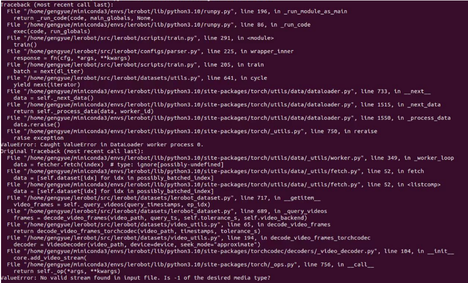

#### 6. Entre no diretório lerobot e instale o LeRobot com as dependências de motores feetech: 

```PowerShell
cd ~/lerobot && pip install -e ".[feetech]"
```

Para dispositivos Jetson Jetpack 6.0+ (certifique-se de que o Pytorch-gpu e o Torchvision foram instalados conforme o passo 5 do [tutorial deste link](https://github.com/Seeed-Projects/reComputer-Jetson-for-Beginners/tree/main/3-Basic-Tools-and-Getting-Started) antes de executar este passo):

```Plain Text
conda install -y -c conda-forge "opencv>=4.10.0.84"  # Install OpenCV and other dependencies via conda, only applicable to Jetson Jetpack 6.0 and above
conda remove opencv   # Uninstall OpenCV
pip3 install opencv-python==4.10.0.84  # Install the specified version of OpenCV using pip3
conda install -y -c conda-forge ffmpeg
conda uninstall numpy
pip3 install numpy==1.26.0  # This version needs to be compatible with torchvision
```

#### 7. Verifique o PyTorch e o Torchvision

Como a instalação do ambiente lerobot via pip desinstala o PyTorch e o Torchvision originais e instala a versão para CPU, é necessário fazer uma verificação no Python.

```Plain Text
import torch
print(torch.cuda.is_available())
```

Se o resultado for False, você precisa reinstalar o PyTorch e o Torchvision a seguir o [tutorial do site oficial](https://pytorch.org/). 

Se você estiver a usar um dispositivo Jetson, siga [este tutorial](https://github.com/Seeed-Projects/reComputer-Jetson-for-Beginners/tree/main/3-Basic-Tools-and-Getting-Started) para instalar o PyTorch e o Torchvision. 

[Problema de incompatibilidade do PyTorch no Jetson Orin](https://juxitech.feishu.cn/wiki/ZwArw2EFhiEktlk4ipscl69WnCc)

#### 8. Instalação do ambiente de dependências do SDK da câmara de profundidade Intel RealSense (se houver uma câmara de profundidade Intel RealSense disponível)

Se você precisar usar a câmara de profundidade RealSense, instale o pyrealsense2 em `lerobot/src/lerobot/`: 

```Plain Text
pip install pyrealsense2
```

## C. Controle do braço

### Autorização de porta

Conecte o cabo de energia (o braço ativo preto usa um adaptador de energia 5V6A e o braço passivo branco usa um adaptador de energia 12V5A); a placa de acionamento de servos é conectada ao computador host por meio de um cabo de dados 

Primeiro, entre no diretório `lerobot/src/lerobot/`

```Plain Text
cd ~/lerobot/src/lerobot/
```

Em seguida, ative seu ambiente `conda` (você precisa fazer isso toda vez que abrir o terminal para usar o lerobot!): 

```Plain Text
conda activate lerobot
```

#### 1. Execute o script para encontrar a porta

Encontre a porta USB correspondente ao braço robótico. Para encontrar a porta correta de cada braço robótico, execute o script de utilitário duas vezes: 

```Plain Text
lerobot-find-port
```

#### 2. Exemplo de saída

Exemplo de saída ao identificar a porta do braço robótico Leader (por exemplo, `/dev/tty.usbmodem575E0031751` no Mac ou `/dev/ttyACM0` no Linux): 

```PowerShell
Finding all available ports for the MotorBus.
['/dev/ttyACM0', '/dev/ttyACM1']
Remove the usb cable from your MotorsBus and press Enter when done.

[...Disconnect corresponding leader or follower arm and press Enter...]

The port of this MotorsBus is /dev/ttyACM1
Reconnect the USB cable.
```

Exemplo de saída ao identificar a porta do braço mecânico Follower (por exemplo, `/dev/tty.usbmodem575E0032081` ou, no Linux, `/dev/ttyACM1`):

```PowerShell
Finding all available ports for the MotorBus.
['/dev/ttyACM0', '/dev/ttyACM1']
Remove the usb cable from your MotorsBus and press Enter when done.

[...Disconnect corresponding leader or follower arm and press Enter...]

The port of this MotorsBus is /dev/ttyACM0
Reconnect the USB cable.
```

Lembre-se de desconectar o conector USB; caso contrário, a interface não será detectada.

#### 3. Solução de problemas

No Linux, você precisa conceder acesso à porta USB a executar o seguinte comando:

```PowerShell
sudo chmod 666 /dev/ttyACM0
```

```Plain Text
sudo chmod 666 /dev/ttyACM1
```

### Calibrar o braço robótico

A seguir, você precisa conectar a fonte de alimentação e o cabo de dados ao seu robô SO-10x para a calibração, garantindo que as informações de posição do braço robótico Leader e do braço robótico Follower sejam consistentes quando estiverem no mesmo local físico. Esse processo de calibração é fundamental, pois permite que a rede neural treinada em um robô SO-10x funcione corretamente em outro robô. Se você precisar recalibrar o braço robótico, exclua completamente os ficheiros em `~/.cache/huggingface/lerobot/calibration/robots` ou `~/.cache/huggingface/lerobot/calibration/teleoperators` e recalibre o braço robótico. Caso contrário, aparecerá uma mensagem de erro. As informações do braço robótico calibrado serão armazenadas no ficheiro JSON nesse diretório. 

#### 1. Calibração manual do braço mecânico Follower

Conecte as interfaces dos 6 servos do robô pelo conector de 3 pinos, conecte o servo do chassis à placa de acionamento de servos e execute os comandos ou exemplos de API a seguir para calibrar o braço robótico:

Tomando como exemplo um PC (Linux) e placas Jetson: o primeiro dispositivo inserido na interface USB será mapeado para `ttyACM0` e o segundo dispositivo inserido na interface USB será mapeado para `ttyACM1`.

Antes de executar o código, observe a interface de mapeamento entre o líder e o seguidor. 

#### 2. Autorização de interface

Primeiro, você precisa conceder as permissões de interface e executar o seguinte comando:

```Bash
sudo chmod 666 /dev/ttyACM*
```

#### 3. Em seguida, calibre o braço robótico Follower

Em seguida, calibre o braço escravo a executar o seguinte comando Python:

```Python
lerobot-calibrate \
    --robot.type=so101_follower \
    --robot.port=/dev/ttyACM0 \
    --robot.id=my_awesome_follower_arm
```

Primeiro, mova o robô para uma posição em que todas as articulações estejam no meio de sua faixa de movimento e mantenha o braço robótico parado. Em seguida, após pressionar Enter, você deve mover cada articulação por toda a sua faixa de movimento; o ficheiro de calibração registrará os valores de mediana, máximo e mínimo da faixa de movimento e os salvará no diretório `~/.cache/huggingface/lerobot/calibration/robots` ou `~/.cache/huggingface/lerobot/calibration/teleoperators`, em um ficheiro JSON. 

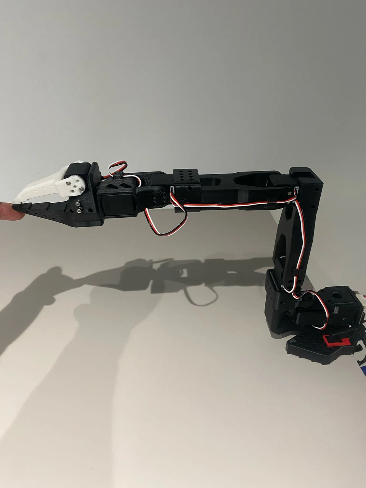

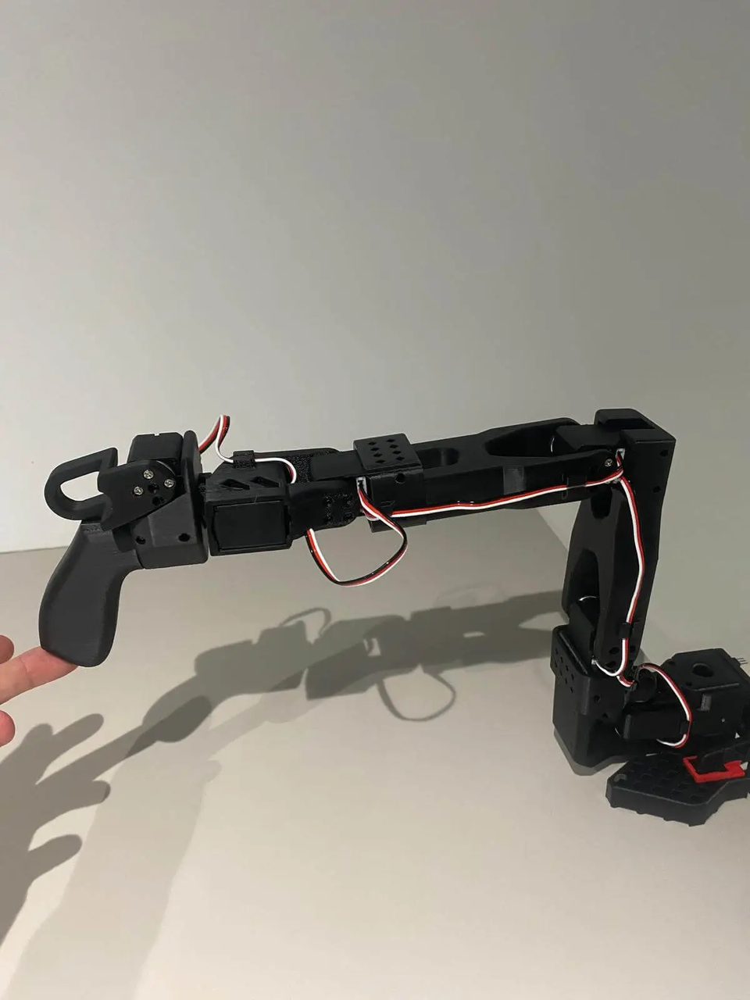

#### **4. Calibre o braço robótico Leader**

Os passos para calibrar o braço robótico principal são os mesmos descritos acima. Execute os comandos ou exemplos de API a seguir: 

```Python
lerobot-calibrate \
    --teleop.type=so101_leader \
    --teleop.port=/dev/ttyACM1 \
    --teleop.id=my_awesome_leader_arm
```

机械臂中位校准视频.mp4

### Teleoperação

#### **1. Teleoperação simples**

Então, você já pode se preparar para teleoperar seu robô! Execute este script simples (ele não conecta nem exibe a câmara): 

Observe que o **ID associado ao robô é usado para armazenar os ficheiros de calibração. Ao realizar operações remotas, gravações e avaliações com as mesmas configurações, é fundamental usar o mesmo**.

Primeiro, conceda as permissões à porta serial: 

```Bash
sudo chmod 666 /dev/ttyACM*
```

Execute a teleoperação:

```Python
lerobot-teleoperate \
    --robot.type=so101_follower \
    --robot.port=/dev/ttyACM0 \
    --robot.id=my_awesome_follower_arm \
    --teleop.type=so101_leader \
    --teleop.port=/dev/ttyACM1 \
    --teleop.id=my_awesome_leader_arm
```

O comando de controle remoto executará automaticamente os seguintes passos: 

1. Identificar eventuais ficheiros de calibração ausentes e iniciar o procedimento de calibração. 

2. Conectar o robô e o dispositivo de controle remoto e iniciar a operação de controle remoto. 

#### 2. Operação remota com exibição da câmara

Para instanciar a câmara, você precisa de um identificador de câmara. Esse identificador pode mudar quando você reinicia o computador ou desconecta e reconecta a câmara, o que depende principalmente do seu sistema operacional.

Para encontrar o índice da câmara conectada ao seu sistema, execute o seguinte script:

```Python

lerobot-find-cameras realsense # or realsense for Intel Realsense cameras
```

O terminal exibirá as informações relevantes da câmara. 

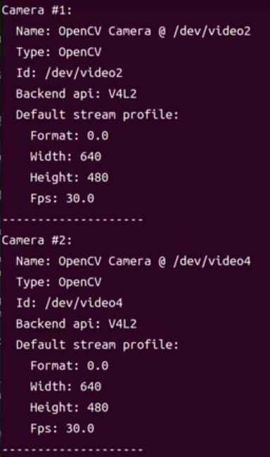

Você pode encontrar as imagens capturadas por cada câmara no diretório `~/lerobot/outputs/captured_images`.

Ao usar uma câmara Intel RealSense no **macOS**, você pode encontrar o erro **"Error finding RealSense cameras: failed to set power state"**. Isso pode ser resolvido a executar o mesmo comando com privilégios `sudo`. Observe que o uso de uma câmara RealSense no **macOS** é instável. 

Depois disso, você pode exibir o feed da câmara no seu computador durante a operação remota a executar simplesmente o código a seguir. Isso é muito útil para preparar sua configuração antes de registar o primeiro dataset. 

```Python
lerobot-teleoperate \
    --robot.type=so101_follower \
    --robot.port=/dev/ttyACM0 \
    --robot.id=my_awesome_follower_arm \
    --robot.cameras="{ front: {type: opencv, index_or_path: 0, width: 640, height: 480, fps: 30, fourcc: "MJPG"}}" \
    --teleop.type=so101_leader \
    --teleop.port=/dev/ttyACM1 \
    --teleop.id=my_awesome_leader_arm \
    --display_data=true
```

Imagens no formato `fourcc: "MJPG"` são imagens comprimidas. Você pode tentar uma resolução maior e, claro, pode tentar imagens no formato `YUYV`, mas isso fará a resolução da imagem e o FPS diminuírem, deixando o braço robótico com atraso. Atualmente, o formato `MJPG` suporta `3` câmaras com resolução `1920*1080` mantendo `30FPS`, mas ainda não é recomendado conectar 2 câmaras ao computador host pelo mesmo hub USB 

Se você tiver mais câmaras, pode adicioná-las alterando o parâmetro `--robot.cameras`. Preste atenção ao formato de `index_or_path`, que é determinado pelo último dígito do ID da câmara exibido pelo comando `python -m lerobot.find_cameras opencv`. 

Por exemplo, se você quiser adicionar uma câmara:

```Python
lerobot-teleoperate \
    --robot.type=so101_follower \
    --robot.port=/dev/ttyACM0 \
    --robot.id=my_awesome_follower_arm \
    --robot.cameras="{ front: {type: opencv, index_or_path: 0, width: 640, height: 480, fps: 30, fourcc: "MJPG"}, side: {type: opencv, index_or_path: 2, width: 640, height: 480, fps: 30, fourcc: "MJPG"}}" \
    --teleop.type=so101_leader \
    --teleop.port=/dev/ttyACM1 \
    --teleop.id=my_awesome_leader_arm \
    --display_data=true
```

Se você quiser adicionar uma câmara de profundidade RealSense, primeiro execute `python -m lerobot.find_cameras realsense` para obter o ID e substitua o parâmetro serial_number_or_name: "323622271780" do robot.cameras neste comando pelo ID da sua própria câmara de profundidade; use `use_depth: true` para habilitar o fluxo de profundidade: 

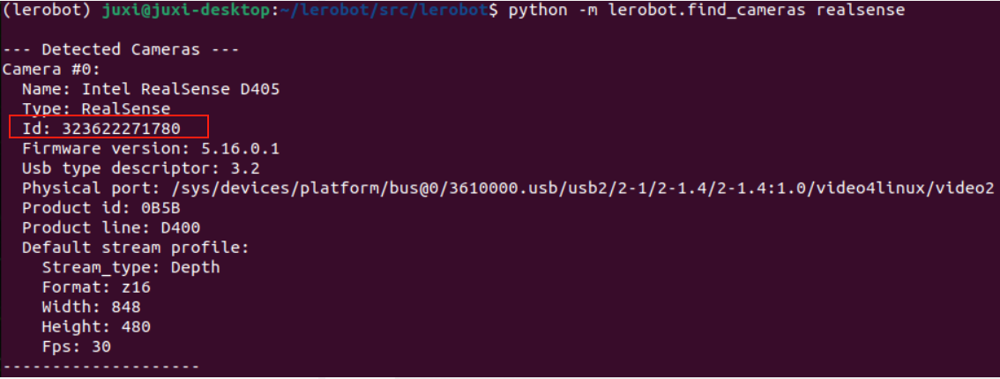


```Python
lerobot-teleoperate \
    --robot.type=so101_follower \
    --robot.port=/dev/ttyACM0 \
    --robot.id=my_awesome_follower_arm \
    --robot.cameras="{ front: {type: opencv, index_or_path: 0, width: 640, height: 480, fps: 30, fourcc: "MJPG"}, side: {type: intelrealsense, serial_number_or_name: "323622271780", width: 1280, height: 720, fps: 30, use_depth: true}}" \
    --teleop.type=so101_leader \
    --teleop.port=/dev/ttyACM1 \
    --teleop.id=my_awesome_leader_arm \
    --display_data=true
```

## D. Coleta de dados

### Registrar um dataset

- Se você quiser guardar o dataset localmente, pode executar diretamente: 

```Python
lerobot-record \
    --robot.type=so101_follower \
    --robot.port=/dev/ttyACM0 \
    --robot.id=my_awesome_follower_arm \
    --robot.cameras="{ front: {type: opencv, index_or_path: 0, width: 640, height: 480, fps: 30, fourcc: "MJPG"}, side: {type: opencv, index_or_path: 2, width: 640, height: 480, fps: 30, fourcc: "MJPG"}}" \
    --teleop.type=so101_leader \
    --teleop.port=/dev/ttyACM1 \
    --teleop.id=my_awesome_leader_arm \
    --display_data=true \
    --dataset.repo_id=juxi/test \
    --dataset.num_episodes=5 \
    --dataset.single_task="Put the blue cube on the black box" \
    --dataset.push_to_hub=false \
    --dataset.episode_time_s=30 \
    --dataset.reset_time_s=30 
```

Entre eles, `dataset.repo_id` e `dataset.single_task` podem ser personalizados e alterados; com `push_to_hub=false`, o dataset será salvo no diretório `~/.cache/huggingface/lerobot` do diretório home, onde será criada a pasta `juxi/test` mencionada acima. [Se uma câmara de profundidade RealSense for usada, o comando pode ser modificado por você.](https://juxitech.feishu.cn/docx/PsgFdioh2olGRmxgAqCcQM9znCc#doxcneJ9aHVAmVZh4YzfvrAktEb)

- Se você quiser usar o recurso do Hugging Face Hub para enviar seu dataset e ainda não fez isso antes, certifique-se de estar conectado com um token que tenha permissão de escrita, o qual pode ser gerado nas [configurações do Hugging Face](https://huggingface.co/settings/tokens): 

```Bash
huggingface-cli login --token ${HUGGINGFACE_TOKEN} --add-to-git-credential
```

Nas versões mais recentes do `huggingface_hub`, o comando equivalente é `hf auth login`: 

```Bash
hf auth login
```

Guarde o nome do seu repositório do Hugging Face em uma variável para executar o seguinte comando: 

```Bash
hf auth whoami

# Guardar o nome de utilizador numa variável
HF_USER=$(hf auth whoami | head -n 1)
echo $HF_USER
```

Registe 5 rodadas e envie seu dataset para o Hub: 

```Python
lerobot-record \
    --robot.type=so101_follower \
    --robot.port=/dev/ttyACM0 \
    --robot.id=my_awesome_follower_arm \
    --robot.cameras="{ front: {type: opencv, index_or_path: 0, width: 640, height: 480, fps: 30, fourcc: "MJPG"}, side: {type: opencv, index_or_path: 2, width: 640, height: 480, fps: 30, fourcc: "MJPG"}}" \
    --teleop.type=so101_leader \
    --teleop.port=/dev/ttyACM1 \
    --teleop.id=my_awesome_leader_arm \
    --display_data=true \
    --dataset.repo_id=${HF_USER}/record-test \
    --dataset.num_episodes=5 \
    --dataset.single_task="Put the blue cube on the black box" \
    --dataset.push_to_hub=true \
    --dataset.episode_time_s=30 \
    --dataset.reset_time_s=30 
```

Você verá dados semelhantes aos seguintes:

```Bash
INFO 2024-08-10 15:02:58 ol_robot.py:219 dt:33.34 (30.0hz) dtRlead: 5.06 (197.5hz) dtWfoll: 0.25 (3963.7hz) dtRfoll: 6.22 (160.7hz) dtRlaptop: 32.57 (30.7hz) dtRphone: 33.84 (29.5hz)
```

**Descrição dos parâmetros**

- episode_time_s: representa o tempo de cada recolha de dados.

- reset_time_s: é o tempo de preparação entre cada recolha de dados.

- num_episodes: indica quantos conjuntos de dados se espera recolher.

- push_to_hub: determina se os dados serão enviados ao Hugging Face Hub.

|Botão|Ação|
|---|---|
|Seta direita →|Encerra a rodada/reset atual antes do tempo; passa para a próxima. |
|Seta esquerda ←|Cancela a rodada atual; regrava. |
|ESC|Interrompe imediatamente a sessão, codifica o vídeo e envia o dataset. |


**Técnicas de recolha de dados**

- **Sugestão de tarefa**: agarre objetos em posições diferentes e coloque-os na caixa.

- **Quantidade**: registe ≥ 50 episódios (10 episódios por posição). 

- **Consistência**: 

    - Mantenha a câmara fixa. 

    - Mantenha o mesmo comportamento de preensão.

    - Garanta que o objeto manipulado esteja visível no quadro da câmara. 

- **Avance gradualmente**: 

    - Comece com preensões confiáveis e depois adicione variações (novas posições, técnicas de preensão, ajustes de câmara). 

    - Evite um aumento brusco de complexidade para evitar falhas. 

💡 **Regra prática**: use apenas o feed da câmara como guia e controle o braço robótico para concluir as tarefas somente com base nas imagens de vídeo exibidas na ecrã.

Se você quiser se aprofundar nesse tópico importante, confira nossa [postagem no blog](https://huggingface.co/blog/lerobot-datasets#what-makes-a-good-dataset) sobre o que torna um dataset bom. 

- Nos capítulos a seguir, você treinará sua rede neural. Depois de obter um desempenho confiável de preensão, você pode introduzir mais variações durante a recolha de dados, como adicionar posições de preensão, técnicas diferentes de preensão e alterar as posições da câmara. 

- Evite adicionar muitas mudanças de uma vez, pois isso pode prejudicar seus resultados. 

- Se você quiser guardar os dados localmente (`--dataset.push_to_hub=false`), substitua `--dataset.repo_id=${HF_USER}/so101_test` por um nome de pasta local personalizado, por exemplo `--dataset.repo_id=juxi/so101_test`. Os dados serão armazenados em `~/.cache/huggingface/lerobot`, no diretório home do sistema.

- Se você enviou seu dataset ao Hugging Face Hub via `--dataset.push_to_hub=true`, pode visualizá-lo [online](https://huggingface.co/spaces/lerobot/visualize_dataset) basta copiar e colar o ID do seu repositório. 

- A qualquer momento durante a gravação da rodada, pressionar a seta direita → pode interrompê-la antes do tempo e entrar no estado de reset. Da mesma forma, durante o processo de reset, ele pode ser interrompido antes do tempo para iniciar a próxima rodada de gravação. 

- Durante a gravação ou o reset, pressione a seta esquerda ← a qualquer momento para interromper a rodada atual antes do tempo e regravar. 

- Durante a gravação, pressione ESCAPE ESC a qualquer momento para encerrar a sessão antes do tempo e ir direto para a codificação do vídeo e o envio do dataset. 

- A gravação pode ser retomada a executar o mesmo comando novamente e adicionando `--resume=true`. ⚠️ **Observação importante**: ao retomar, defina `--dataset.num_episodes` como o número de episódios adicionais a registar (não o número total de episódios alvo do dataset). Se você quiser começar a gravação do zero, exclua manualmente o diretório do dataset.

- No Linux, se as teclas de seta esquerda e direita e a tecla Esc não tiverem efeito durante a gravação de dados, certifique-se de ter definido a variável de ambiente $DISPLAY. Consulte as [limitações do pynput](https://pynput.readthedocs.io/en/latest/limitations.html#linux).

Se o seu teclado não responder após pressionar uma tecla, talvez seja necessário fazer downgrade da versão do pynput; por exemplo, instale a versão 1.6.8. 

`pip install pynput==1.6.8`

### Visualizar um dataset (opcional, pode ser tentado) 

```Python
echo ${HF_USER}/so101_test  
```

Se preferir, também pode visualizá-lo numa página HTML local com o seguinte comando: 

```Bash
python lerobot/scripts/visualize_dataset_html.py \
  --repo-id ${HF_USER}/so101_test \
  --local-files-only 1
```

Se você não usou `--dataset.push_to_hub=false` e enviou os dados, também pode visualizá-los localmente com o seguinte comando: 

```Python
lerobot-dataset-viz \
  --repo-id ${HF_USER}/so101_test
```

Se você usou `--dataset.push_to_hub=false` e não enviou os dados, também pode visualizá-los localmente com o seguinte comando: 

```Python
lerobot-dataset-viz \
  --repo-id juxi/test \
```

Aqui, `juxi` é o nome personalizado do `repo_id` durante a recolha de dados. 

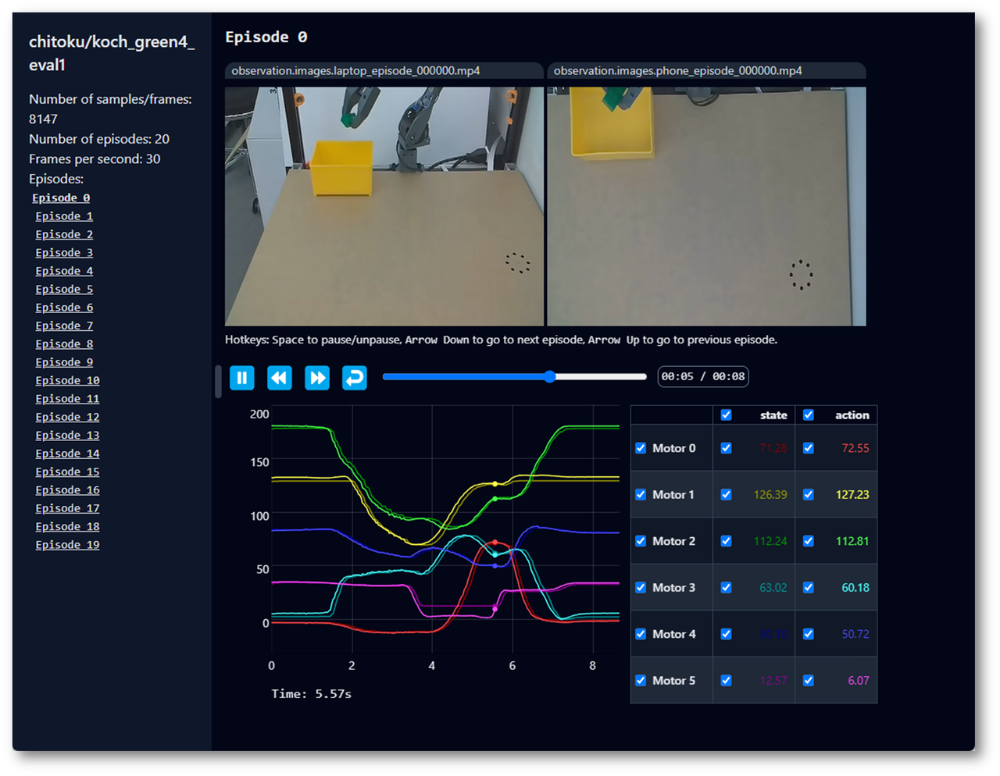

### Reproduzir um trecho (opcional, pode ser tentado)

Agora, tente reproduzir o primeiro dataset no seu robô: 

```Python
lerobot-replay \
    --robot.type=so101_follower \
    --robot.port=/dev/ttyACM0 \
    --robot.id=my_awesome_follower_arm \
    --dataset.repo_id=${HF_USER}/record-test \
    --dataset.episode=0
```

Nesse momento, o robô deve executar as mesmas ações da operação remota e da gravação.

Em alternativa, pode reproduzir um episódio através do comando de gravação com `--replay=true`: 

```Python
lerobot-record \
  --robot.type=so101_follower \
  --robot.port=/dev/ttyACM0 \
  --robot.id=my_awesome_follower_arm \
  --robot.cameras="{ front: {type: opencv, index_or_path: 0, width: 640, height: 480, fps: 30, fourcc: "MJPG"}, side: {type: opencv, index_or_path: 2, width: 640, height: 480, fps: 30, fourcc: "MJPG"}}" \
  --dataset.repo_id=${HF_USER}/so101_test \
  --dataset.single_task="Put the blue cube on the black box" \
  --dataset.num_episodes=1 \
  --dataset.episode_time_s=30 \
  --dataset.reset_time_s=30 \
  --dataset.push_to_hub=true \
  --replay=true
```

## E. Treinamento e avaliação do dataset

### ACT

Consulte o tutorial oficial [ACT](https://huggingface.co/docs/lerobot/act)

**Treinamento**

Para treinar uma política de controle do seu robô, use o script `python -m lerobot.scripts.train`. Alguns parâmetros são obrigatórios. Aqui está um comando de exemplo:

```Python
lerobot-train \
  --dataset.repo_id=${HF_USER}/so101_test \
  --policy.type=act \
  --output_dir=outputs/train/act_so101_test \
  --job_name=act_so101_test \
  --policy.device=cuda \
  --wandb.enable=false \
  --steps=300000 
```

**Se você quiser treinar com um dataset local, certifique-se de que o `repo_id` corresponda ao nome usado na recolha de dados e adicione `--policy.push_to_hub=false`.** 

```Python
lerobot-train \
  --dataset.repo_id=juxi/test \
  --policy.type=act \
  --output_dir=outputs/train/act_so101_test \
  --job_name=act_so101_test \
  --policy.device=cuda \
  --wandb.enable=false \
  --policy.push_to_hub=false\
  --steps=300000 
```

Explicação dos comandos

- **Especificação do dataset**: fornecemos o dataset pelo parâmetro `--dataset.repo_id=${HF_USER}/so101_test`.

- **Passos de treino**: alteramos os passos de treino com `--steps=300000`. O valor padrão do algoritmo é 800000. Ajuste-o observando a perda durante o treino, de acordo com a dificuldade da sua tarefa.

- **Tipo de política**: usamos `policy.type=act` para fornecer a política. Da mesma forma, você pode mudar para outras políticas, como [act, diffusion, pi0, pi0fast, pi0.5, sac, smolvla], que carregarão a configuração de `configuration_act.py`. Importante: essa política se adapta automaticamente ao estado do motor, à ação do motor e ao número de câmaras do seu robô (por exemplo, `laptop` e `phone`), que foram salvos no seu dataset.

- **Seleção de dispositivo**: usamos `policy.device=cuda` porque estamos treinando em uma GPU Nvidia, mas você pode usar `policy.device=mps` para treinar em Apple Silicon.

- **Ferramenta de visualização**: usamos `wandb.enable=true` para usar o [Weights and Biases](https://docs.wandb.ai/quickstart) na visualização dos gráficos de treino. Isso é opcional, mas, se você usar, certifique-se de ter feito login a executar `wandb login`.

Se você encontrar o seguinte erro: 

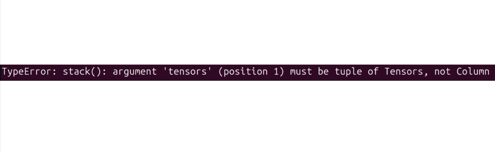

Tente executar o seguinte comando para resolver: 

```Bash
pip install datasets==2.19
```

O treino pode levar várias horas. Você encontrará os ficheiros de pesos do treino no diretório `outputs/train/act_so101_test/checkpoints`.

Para retomar o treino a partir de um ficheiro de pesos específico, o seguinte é um comando de exemplo para retomar o treino a partir do último ficheiro de pesos da política `act_so101_test`:

```Bash
lerobot-train \
  --config_path=outputs/train/act_so101_test/checkpoints/last/pretrained_model/train_config.json \
  --resume=true
```

**Avaliação**

Você pode usar o comando [`rollout`](https://github.com/huggingface/lerobot/blob/main/src/lerobot/scripts/lerobot_rollout.py), mas precisa usar o ficheiro de pesos dos resultados do treino da política como entrada. Por exemplo, execute o seguinte comando para registar 10 rodadas de avaliação:

```Python
lerobot-rollout \
  --strategy.type=episodic \
  --robot.type=so101_follower \
  --robot.port=/dev/ttyACM0 \
  --robot.cameras="{ front: {type: opencv, index_or_path: 0, width: 640, height: 480, fps: 30, fourcc: "MJPG"},   side: {type: opencv, index_or_path: 2, width: 640, height: 480, fps: 30,fourcc: "MJPG"}}" \
  --robot.id=my_awesome_follower_arm \
  --teleop.type=so101_leader \
  --teleop.port=/dev/ttyACM1 \
  --teleop.id=my_awesome_leader_arm \
  --display_data=false \
  --dataset.repo_id=juxi/rollout_test123 \
  --dataset.single_task="Put the blue cube on the black box" \
  --dataset.episode_time_s=30 \
  --dataset.reset_time_s=30 \
  --dataset.num_episodes=5 \
  --policy.path=outputs/train/act_so101_test/checkpoints/last/pretrained_model \
  --dataset.push_to_hub=false
```

1. O parâmetro `--policy.path` indica o caminho para o ficheiro de pesos do treino da sua política (por exemplo, `outputs/train/act_so101_test/checkpoints/last/pretrained_model`). Se você enviou o ficheiro de pesos do treino para o Hub, também pode usar o repositório do modelo (por exemplo, `${HF_USER}/act_so101_test`). 

2. O nome do dataset `dataset.repo_id` começa com `rollout_`; essa operação grava separadamente o vídeo e os dados durante a avaliação, que serão salvos em uma pasta que começa com rollout_, por exemplo `juxi/rollout_test123`. 

3. Se na fase de avaliação aparecer `File exists: 'home/xxxx/.cache/huggingface/lerobot/xxxxx/juxi/rollout_xxxx'`, exclua primeiro a pasta que começa com `rollout_` e execute o programa novamente. 

4. Ao encontrar `mean is infinity. You should either initialize with stats as an argument or use a pretrained model`, observe que as palavras-chave como front e side no parâmetro --robot.cameras devem ser estritamente as mesmas usadas na recolha do dataset. 

### Smolvla

Consulte o tutorial oficial [SmolVLA](https://huggingface.co/docs/lerobot/smolvla)

```Bash
pip install -e ".[smolvla]"
```

**Treinamento**

```Bash
lerobot-train \
  --policy.path=lerobot/smolvla_base \
  --dataset.repo_id=${HF_USER}/mydataset \
  --batch_size=64 \
  --steps=20000 \
  --output_dir=outputs/train/my_smolvla \
  --job_name=my_smolvla_training \
  --policy.device=cuda \
  --wandb.enable=true
```

**Verificação**

```Bash
lerobot-rollout \
  --strategy.type=episodic \
  --robot.type=so101_follower \
  --robot.port=/dev/ttyACM0 \
  # <- Use your robot id
  --robot.id=my_awesome_follower_arm \
  --robot.cameras="{ front: {type: opencv, index_or_path: 0, width: 640, height: 480, fps: 30, fourcc: "MJPG"},   side: {type: opencv, index_or_path: 2, width: 640, height: 480, fps: 30,fourcc: "MJPG"}}" \
  --dataset.single_task="Put the blue cube on the black box" \
  --dataset.repo_id=juxi/rollout_test123 \
  --dataset.episode_time_s=30 \
  --dataset.reset_time_s=30 \
  --dataset.num_episodes=5 \
  --policy.path=HF_USER/FINETUNE_MODEL_NAME # <- Use your fine-tuned model
  # <- Teleop optional if you want to teleoperate in between episodes
  # --teleop.type=so101_leader
  # --teleop.port=/dev/ttyACM0
  # --teleop.id=my_awesome_leader_arm
```

### Pi0

Consulte o tutorial oficial [Pi0](https://huggingface.co/docs/lerobot/pi0)

```Bash
pip install -e ".[pi]"
```

**Treinamento**

```Bash
lerobot-train \
  --policy.type=pi0 \
  --dataset.repo_id=juxi/eval_test123 \
  --job_name=pi0_training \
  --output_dir=outputs/pi0_training \
  --policy.pretrained_path=lerobot/pi0_base \
  --policy.compile_model=true \
  --policy.gradient_checkpointing=true \
  --policy.dtype=bfloat16 \
  --steps=20000 \
  --policy.device=cuda \
  --batch_size=32 \
  --wandb.enable=false 
```

**Verificação**

```Bash
lerobot-rollout \
  --strategy.type=episodic \
  --robot.type=so101_follower \
  --robot.port=/dev/ttyACM0 \
  --robot.cameras="{ front: {type: opencv, index_or_path: 0, width: 640, height: 480, fps: 30, fourcc: "MJPG"},   side: {type: opencv, index_or_path: 2, width: 640, height: 480, fps: 30,fourcc: "MJPG"}}" \
  --robot.id=my_awesome_follower_arm \
  --display_data=false \
  --dataset.repo_id=juxi/rollout_test123 \
  --dataset.single_task="Put the blue cube on the black box" \
  --policy.path=outputs/pi0_training/checkpoints/last/pretrained_model
```

### Pi0.5

Consulte o tutorial oficial [Pi0.5](https://huggingface.co/docs/lerobot/pi05)

```Bash
pip install -e ".[pi]"
```

**Treinamento**

```Bash
lerobot-train \
    --dataset.repo_id=juxi/eval_test123 \
    --policy.type=pi05 \
    --output_dir=outputs/pi05_training \
    --job_name=pi05_training \
    --policy.pretrained_path=lerobot/pi05_base \
    --policy.compile_model=true \
    --policy.gradient_checkpointing=true \
    --wandb.enable=false \
    --policy.dtype=bfloat16 \
    --steps=3000 \
    --policy.device=cuda \
    --batch_size=32
```

**Verificação**

```Bash
lerobot-rollout \
  --strategy.type=episodic \
  --robot.type=so101_follower \
  --robot.port=/dev/ttyACM0 \
  --robot.cameras="{ front: {type: opencv, index_or_path: 0, width: 640, height: 480, fps: 30, fourcc: "MJPG"},   side: {type: opencv, index_or_path: 2, width: 640, height: 480, fps: 30,fourcc: "MJPG"}}" \
  --robot.id=my_awesome_follower_arm \
  --display_data=false \
  --dataset.repo_id=juxi/rollout_test123 \
  --dataset.single_task="Put the blue cube on the black box" \
  --policy.path=outputs/pi05_training/checkpoints/last/pretrained_model
```

### GR00T N1.5

Consulte o tutorial oficial [GR00T N1.5](https://huggingface.co/docs/lerobot/groot)

## F. Treinamento em servidor na nuvem, implantação e exportação do modelo

Tomando como exemplo a nuvem de poder computacional AutoDL, www.autodl.com: cadastre-se, faça login e recarregue o saldo

#### **1. Clique em "Mercado de poder computacional", selecione a placa de vídeo desejada e tente escolher uma com mais núcleos.**

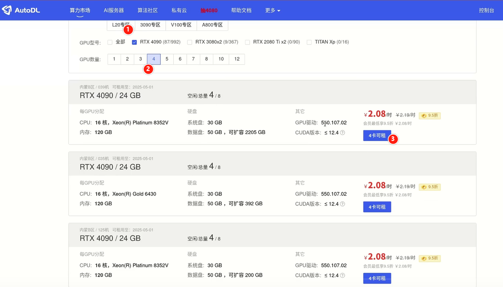

#### **2. Selecione "Pagamento por uso", escolha "Miniconda/conda3/3.8(ubuntu20.04)/11.8" como imagem base e clique em "Criar agora".**

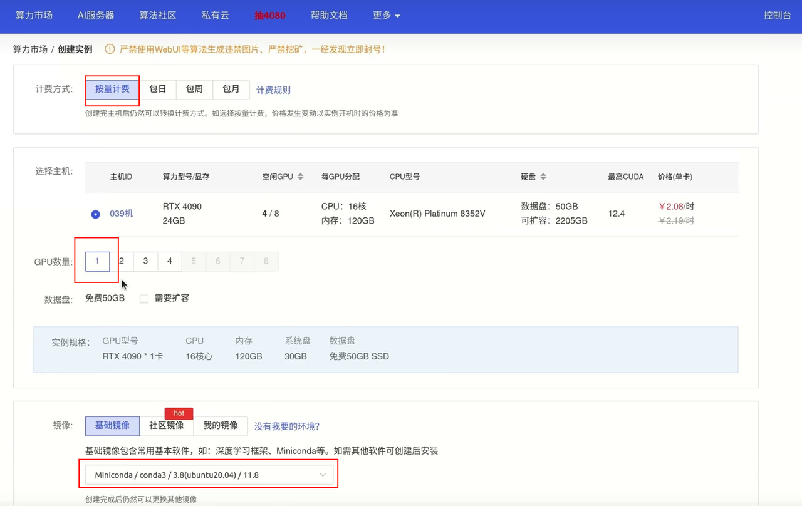

#### **3. Clique em "JupyterLab" para entrar na interface de controle e abrir o terminal**

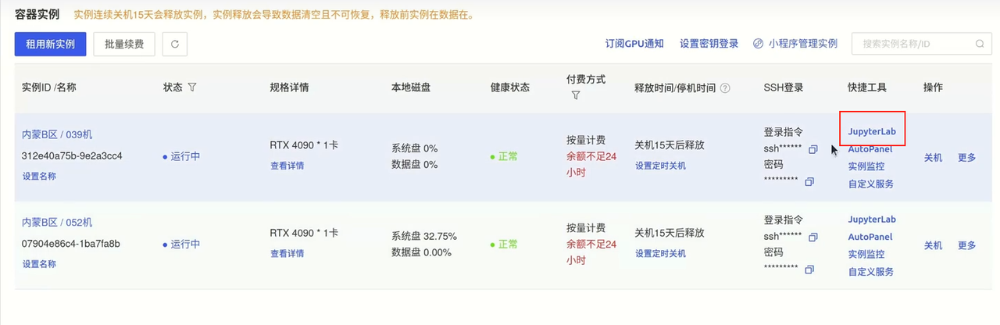

#### **4. Inicialize o ambiente conda**

```Plain Text
conda env list
```

```Plain Text
conda activate base
```

```Plain Text
conda init
```

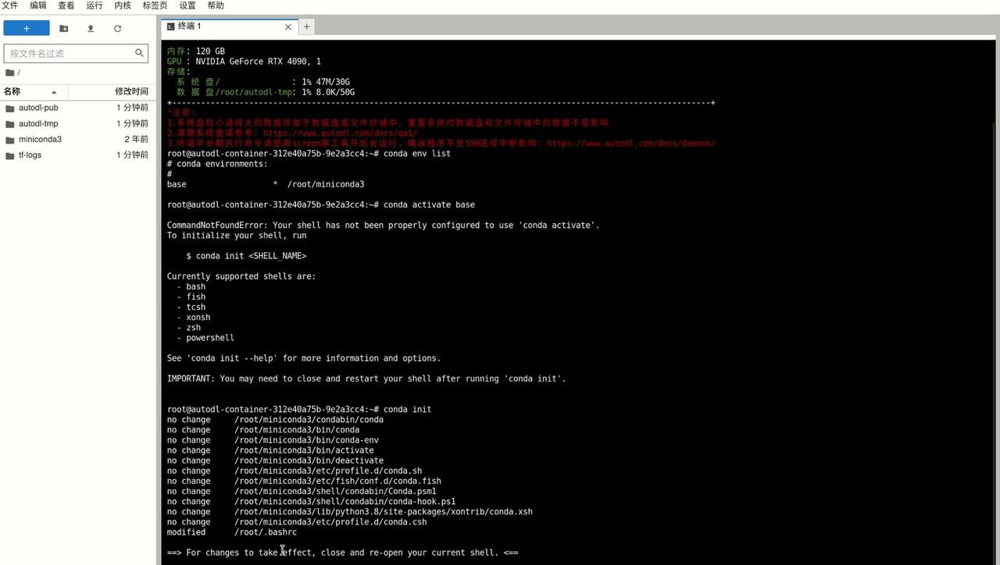

#### **5. Feche este terminal e abra um novo terminal**

Referência: https://www.autodl.com/docs/network_turbo/

```Plain Text
source /etc/network_turbo
```

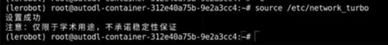

#### **6. Crie o ambiente lerobot**

```PowerShell
conda create -y -n lerobot python=3.10
```

```PowerShell
conda activate lerobot
```

```PowerShell
git clone https://github.com/Juxi-Technology/lerobot.git
```

Você pode optar por seguir a versão mais recente: https://github.com/huggingface/lerobot.git  

Observação: os comandos da versão mais recente podem variar!

```PowerShell
conda install ffmpeg -c conda-forge
```

#### **7. Entre no diretório lerobot em src e instale o LeRobot com as dependências de motores feetech:**

```PowerShell
cd ~/lerobot && pip install -e ".[feetech]"
```

#### **8. Importe o dataset para o servidor na nuvem**

Há dois cenários: um é quando o dataset foi enviado ao banco de dados do Hugging Face durante a recolha de dados, e o outro é quando o dataset está apenas armazenado localmente no seu computador.

**① Se o dataset foi enviado ao Hugging Face durante a recolha de dados, ele pode ser obtido com a chave gerada na configuração da conta do Hugging Face.**

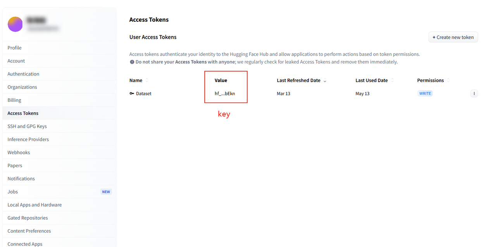

```Plain Text
huggingface-cli login --token ${HUGGINGFACE_TOKEN} --add-to-git-credential
```

```Plain Text
HF_USER=$(huggingface-cli whoami | head -n 1)
```

```Plain Text
echo $HF_USER
```

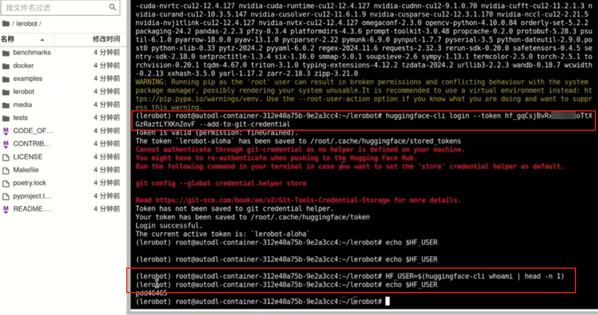

```Plain Text
export HYDRA_FULL_ERROR=1
```

**② Envie datasets locais pelo FileZilla; consulte** https://www.autodl.com/docs/filezilla/

A forma mais simples de instalar no Linux: 

```Python
sudo apt install filezilla
```

```Python
filezilla
```

Abra o FileZilla, clique em "Ficheiro", selecione "Gerenciador de sites", crie um "Novo site" e selecione "Protocolo SFTP" 

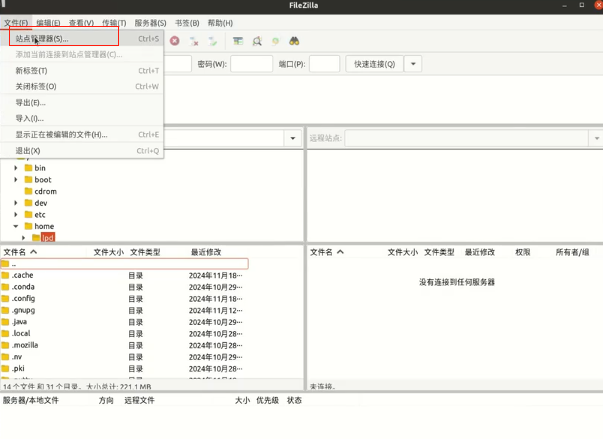

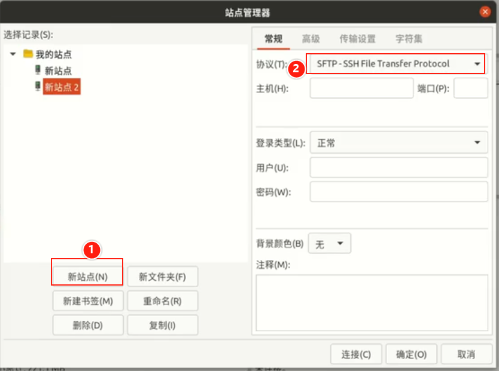

Volte à nuvem de poder computacional AutoDL, copie o "Comando de login", cole-o em um local de fácil visualização, preencha as informações correspondentes e clique em "Conectar" 

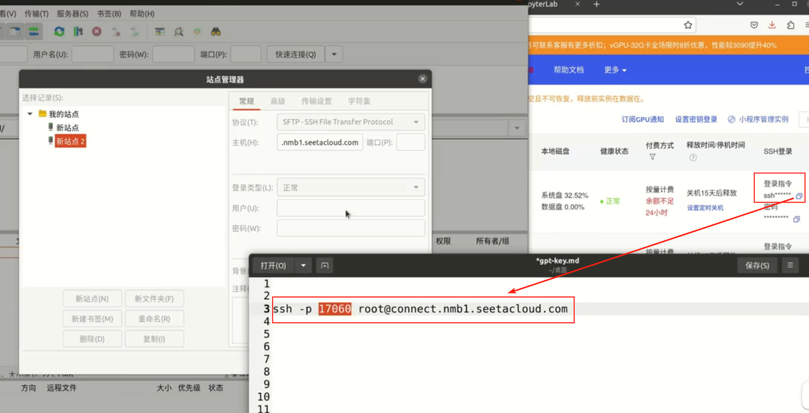

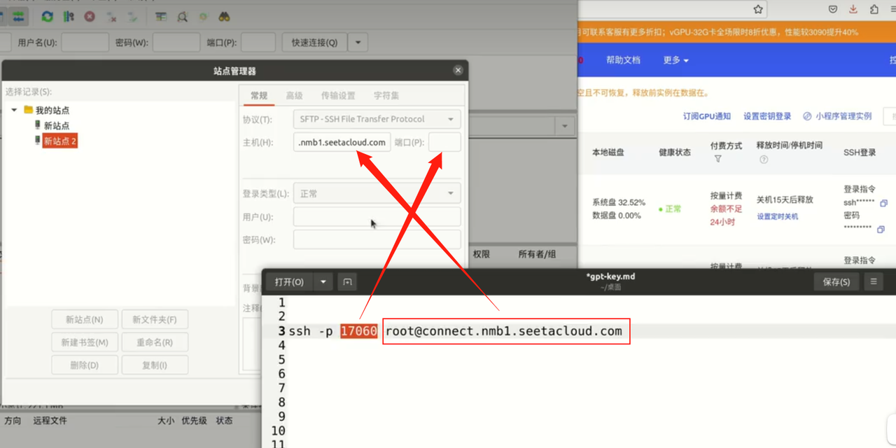

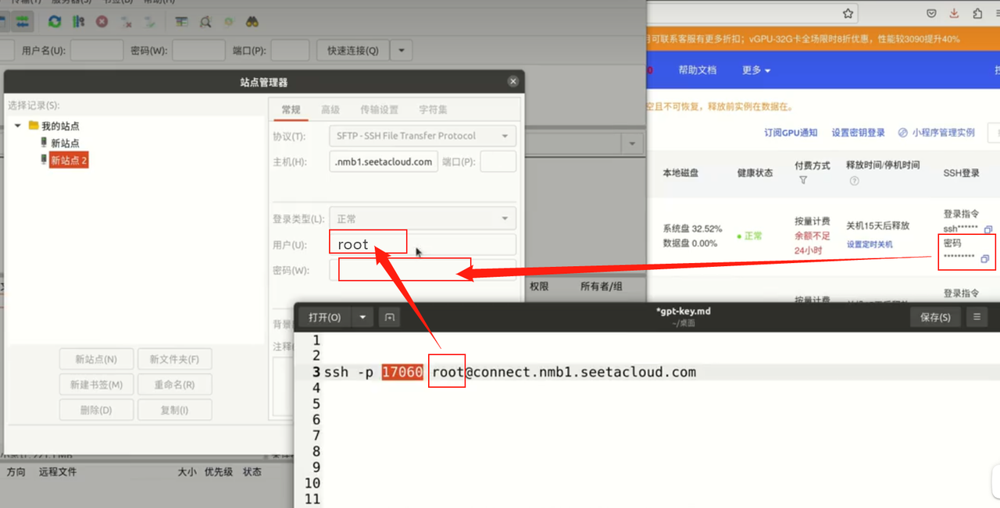

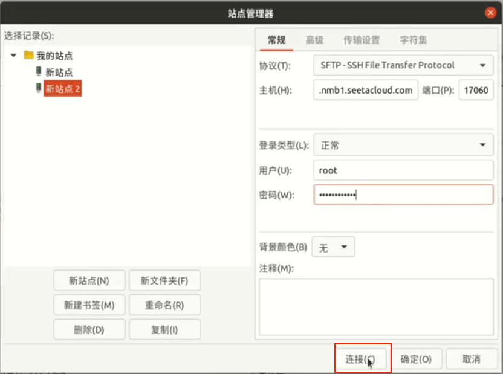

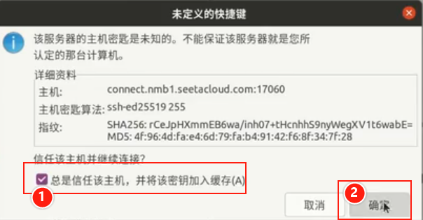

Crie uma pasta data no diretório lerobot do servidor na nuvem

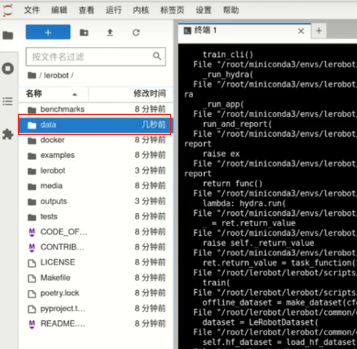

Arraste a pasta do dataset para o lado direito para transferir e aguarde a transferência terminar 

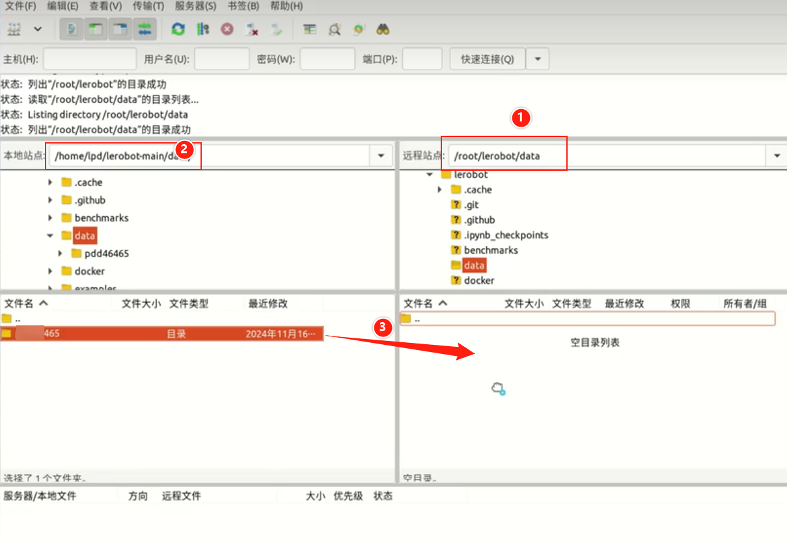

#### 9. Treinamento do dataset

Consulte [E. Treinamento e avaliação do dataset](https://juxitech.feishu.cn/docx/PsgFdioh2olGRmxgAqCcQM9znCc#doxcnHPqbNP74wfV6gZqtbPVytb) neste tutorial e execute o comando de treino no servidor na nuvem

#### 10. Exportação do ficheiro do modelo

Após a conclusão do treino, exporte o modelo treinado correspondente na pasta train 

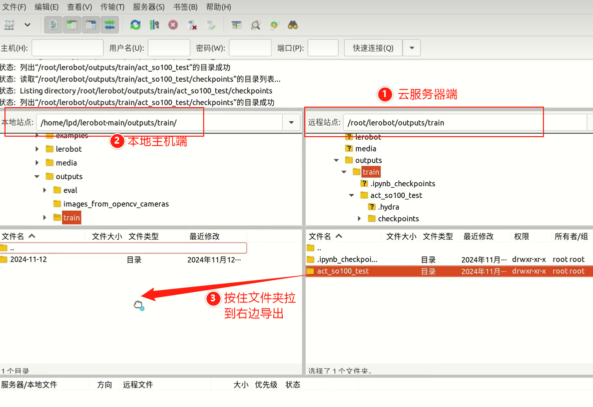

## G. Perguntas frequentes

Se você usar este tutorial, faça git clone do repositório GitHub recomendado neste documento:  https://github.com/Juxi-Technology/lerobot.git

O repositório recomendado neste documento é uma versão estável verificada, enquanto o repositório oficial do LeRobot é a versão mais recente, atualizada em tempo real, que pode apresentar alguns problemas imprevisíveis, como versões diferentes de dataset, instruções diferentes etc. 

- [Se você usar uma câmara de profundidade RealSense, pode consultar e modificar os comandos de execução por conta própria](https://juxitech.feishu.cn/docx/PsgFdioh2olGRmxgAqCcQM9znCc#doxcneJ9aHVAmVZh4YzfvrAktEb)

- Em dispositivos Jetson, se o número de rodadas e o tempo da rodada não forem definidos após executar o comando de avaliação, o processo só pode ser interrompido com ctrl+z, o que causará a desconexão do braço robótico e da câmara; todas as portas mudarão após a reconexão 

Adicione ao comando os parâmetros de número de rodadas de avaliação e duração da rodada 

Por exemplo: 

```Python
lerobot-rollout \
  --strategy.type=episodic \
  --robot.type=so101_follower \
  --robot.port=/dev/ttyACM0 \
  --robot.cameras="{ front: {type: opencv, index_or_path: 0, width: 640, height: 480, fps: 30, fourcc: "MJPG"},   side: {type: opencv, index_or_path: 2, width: 640, height: 480, fps: 30,fourcc: "MJPG"}}" \
  --robot.id=my_awesome_follower_arm \
  --teleop.type=so101_leader \
  --teleop.port=/dev/ttyACM1 \
  --teleop.id=my_awesome_leader_arm \
  --display_data=false \
  --dataset.repo_id=juxi/rollout_test123 \
  --dataset.single_task="Put the blue cube on the black box" \
  --dataset.episode_time_s=30 \
  --dataset.reset_time_s=30 \
  --dataset.num_episodes=5 \
  --policy.path=outputs/train/act_so101_test/checkpoints/last/pretrained_model \
  --dataset.push_to_hub=false
```

- Se você encontrar problemas ao calibrar o ID do servo 

```Bash
`Motor 'gripper' was not found, Make sure it is connected`
```

Verifique com cuidado se o cabo de comunicação está conectado corretamente ao servo motor e se a fonte de alimentação está fornecendo a tensão correta.

- Se você encontrar 

```Bash
Could not connect on port "/dev/ttyACM0"
```

E, se você vir que o ACM0 existe com `ls /dev/ttyACM*`, significa que esqueceu de conceder as permissões da porta serial. Basta digitar `sudo chmod 666 /dev/ttyACM*` no terminal.

- Se você encontrar 

```Bash
No valid stream found in input file. Is -1 of the desired media type?
```

Instale o ffmpeg 7.1.1: `conda install ffmpeg=7.1.1 -c conda-forge`.


- Se você encontrar 

```Bash
ConnectionError: Failed to sync read 'Present_Position' on ids=[1,2,3,4,5,6] after 1 tries. [TxRxResult] There is no status packet!
```

É necessário verificar se o braço robótico correspondente ao número da porta está ligado, se o cabo de dados do servo do barramento está solto ou desconectado e, se a luz de um servo não estiver acesa, significa que o cabo do servo anterior está solto. 

- Se você encontrar problemas ao calibrar o braço robótico 

```Bash
Magnitude 30841 exceeds 2047 (max for sign_bit_index=11)
```

Desligue e religue o braço robótico e tente calibrá-lo novamente. Se o ângulo MAX atingir valores na casa dos milhares durante a calibração, esse método também pode ser usado. Se não funcionar, os servos motores correspondentes precisam ser recalibrados, incluindo a calibração do ponto médio e a gravação do ID. 

- Se ocorrer durante a fase de avaliação 

```Bash
File exists: 'home/xxxx/.cache/huggingface/lerobot/xxxxx/juxi/eval_xxxx'
```

Exclua primeiro a pasta que começa com `rollout_` e execute o programa novamente.

- Se ocorrer durante a fase de avaliação 

```Bash
`mean` is infinity. You should either initialize with `stats` as an argument or use a pretrained model
```

Observe que as palavras-chave como "front" e "side" no parâmetro "robot.cameras" devem ser estritamente as mesmas usadas durante a recolha de dados. 

- Se você reparou ou substituiu peças do braço robótico, exclua completamente os ficheiros em `~/.cache/huggingface/lerobot/calibration/robots` ou `~/.cache/huggingface/lerobot/calibration/teleoperators` e recalibre o braço robótico. Caso contrário, aparecerá uma mensagem de erro. As informações do braço robótico calibrado serão armazenadas no ficheiro JSON nesse diretório. 

- O tempo necessário para treinar 50 conjuntos de dados ACT em um notebook 3060 de 8GB é de aproximadamente 6 horas; em um computador com 4090 ou A100, leva cerca de 2 a 3 horas. 

- Durante a recolha de dados, é necessário garantir a estabilidade da posição e do ângulo da câmara e da iluminação ambiente, e reduzir a captura de fundos instáveis e de pedestres em excesso. Caso contrário, mudanças excessivas no ambiente farão o braço robótico falhar na preensão. 

- O num_episodes do comando de recolha de dados deve garantir recolha suficiente e não deve ser pausado manualmente no meio do processo, pois a média e a variância dos dados só serão calculadas após a conclusão da recolha, e são dados necessários para o treino. 

- Se o programa indicar que não consegue ler os dados de imagem da câmara USB, garanta que a câmara USB não esteja conectada a um hub. A câmara USB deve ser conectada diretamente ao dispositivo para garantir uma taxa rápida de transmissão de imagem. 

Se você encontrar problemas de software ou de dependências de ambiente que não consiga resolver, além de consultar a seção de perguntas frequentes no final deste tutorial, reporte-os prontamente na [plataforma LeRobot](https://github.com/huggingface/lerobot) ou no [canal do LeRobot no Discord](https://discord.gg/8TnwDdjFGU). 

## Encontrar o servo no Windows (software de depuração de servos Feite)

Para depuração, qualquer PC Windows pode programar, depurar ou testar o servo por conexão USB. Para isso, descarregue o [software Feetech](https://www.feetechrc.com/software.html). Para sistemas Ubuntu, você pode usar a [ferramenta FT_SCServo_Debug_Qt](https://github.com/Kotakku/FT_SCServo_Debug_Qt). 

fddebug-master.zip

Selecione o número da porta, defina a taxa de baud como 1000000, abra e clique em "Pesquisar"

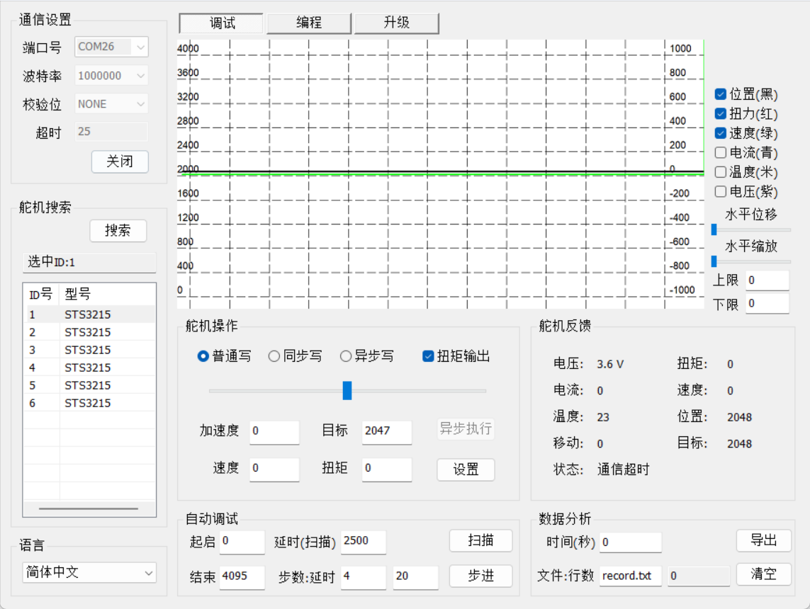


## Controle de simulação ROS2 (pode ser implementado de forma independente)

https://github.com/holmsslk/so-arm-moveit-hardware


## Definir o ID do servo e a calibração do ponto médio pela Web

https://bambot.org/feetech.js?lang=zh

1. Digite 0 ou 1 de acordo com o modelo do servo e clique em "Conectar".

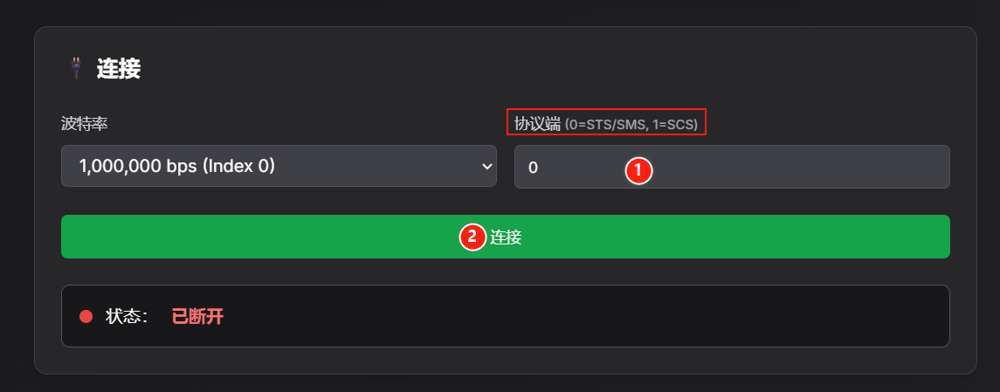

2. Faça a varredura dos servos com IDs de 1 a 6; o servo do ID correspondente pode ser confirmado pelo FOUND nos resultados da varredura. Por exemplo, o servo ID 1 da figura já foi encontrado na varredura.

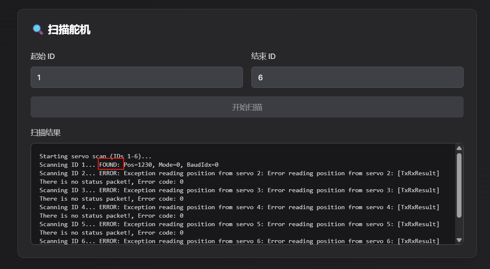

3. Definição do ID e calibração do ponto médio

① O ID de servo atual informado é o ID do servo que foi encontrado na varredura 

② Digite um número em "Gestão de ID" e clique em "Alterar ID" para definir o ID 

③ Calibração do ponto médio (o valor central do servo STS3215 é 2047 e o do servo SCS0009 é 511)

Servo STS: digite 2047 em "Controle de posição" e clique em "Definir"

Servo SCS: digite 511 em "Controle de posição" e clique em "Definir". 

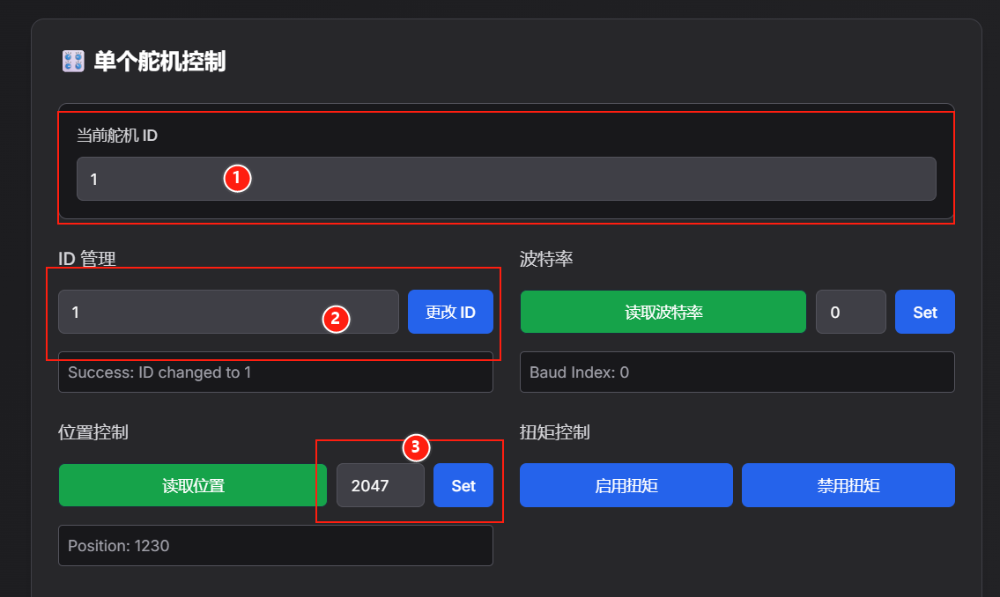

<RelatedProducts slugs="so-arm101,robot-vision-kit,tpu-flexible-gripper" />
