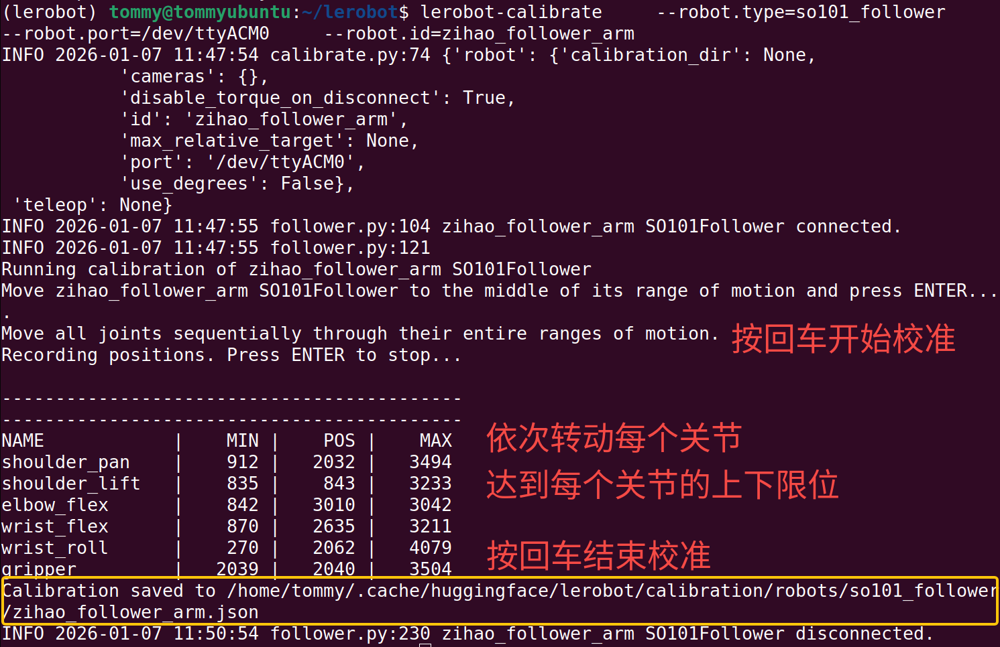

# Etapa 3: Calibrar o braço robótico (Ubuntu)

## Dar permissões às portas

Permitir que todos os utilizadores tenham permissão de leitura e escrita nestes dispositivos de porta série

```Shell
sudo chmod 666 /dev/ttyACM*
```

## Calibrar o braço seguidor Follower

```Shell
lerobot-calibrate \
    --robot.type=so101_follower \
    --robot.port=/dev/ttyACM0 \
    --robot.id=my_follower_arm
```



## Calibrar o braço líder Leader

```Shell
lerobot-calibrate \
    --teleop.type=so101_leader \
    --teleop.port=/dev/ttyACM1 \
    --teleop.id=my_leader_arm
```


## Ver o ficheiro de configuração de calibração

```Shell
sudo nano /home/<utilizador>/.cache/huggingface/lerobot/calibration/robots/so101_follower/my_follower_arm.json
```


## Notas

### ① Um dos braços para de se mover depois de atingir o limite

É necessário recalibrar

[wx_camera_1768098182808.mp4](/downloads/wx_camera_1768098182808.mp4)

### ② Não se encontra o servo


O servo não tem a alimentação ligada

<RelatedProducts slugs="so-arm101" />
