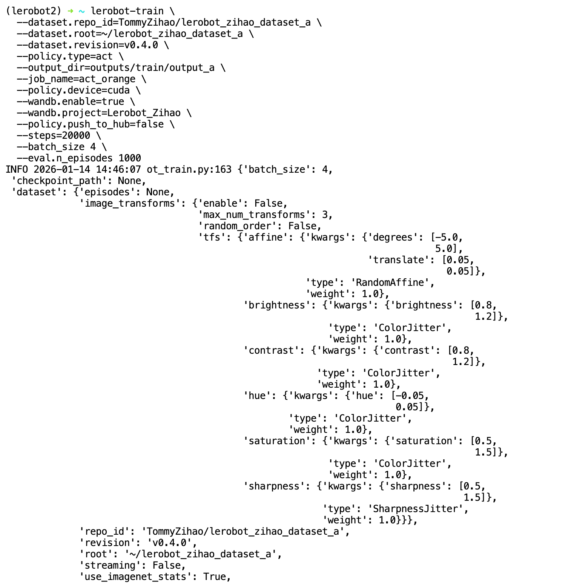
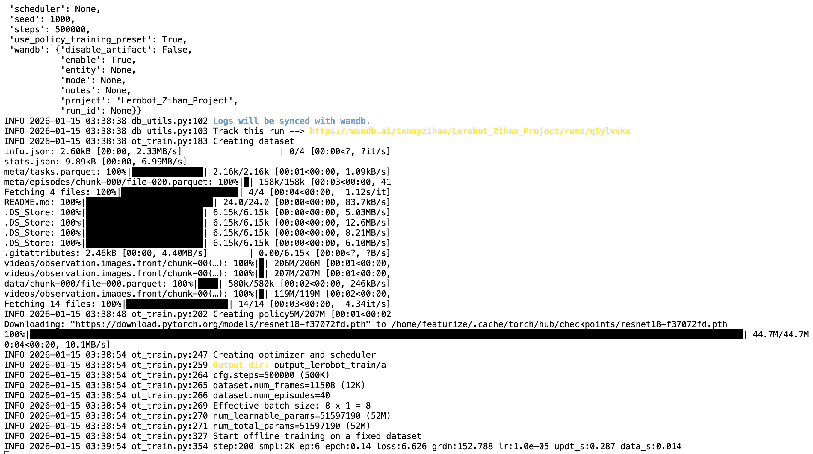
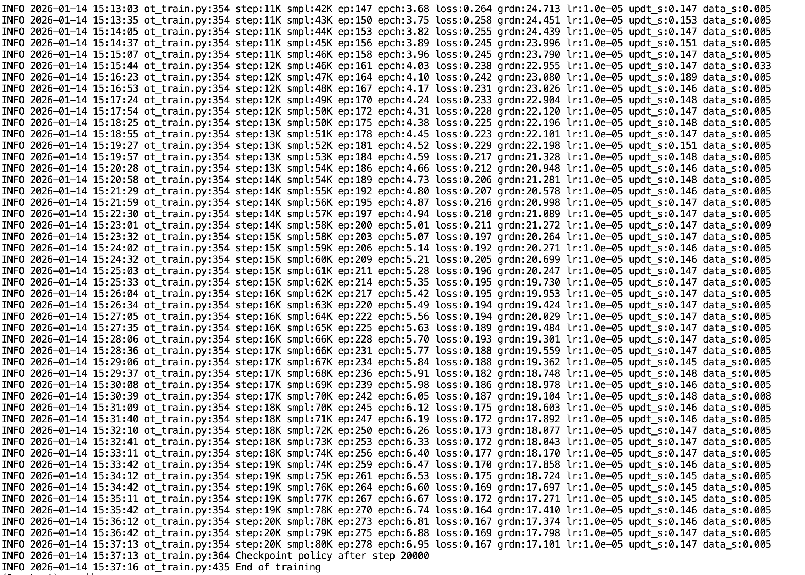

# Etapa 7: Comando de treino ACT

## Antes de executar

- **Ambiente**: primeiro é preciso instalar o ambiente e enviar o dataset para a GPU na nuvem conforme [Configuração do ambiente de treino em GPU na nuvem](/pt-pt/tutorials/robot-arms/so-arm101/lerobot/07-Training/Cloud-GPU). O ACT já vem com o ambiente básico do LeRobot, sem necessidade de instalação adicional
- **Dataset**: o `--dataset.root=~/lerobot_my_dataset_shake_hands` do comando aponta para o dataset de aperto de mão recolhido na etapa 6. Se estiver a treinar uma tarefa própria, substitua pelo nome do seu próprio dataset
- **Diretório de saída**: se o `--output_dir` já existir, é apresentado diretamente um `FileExistsError`; mude para um novo nome de diretório, ou acrescente `--resume=true` para continuar o treino
- **Durante o treino pode acompanhar as curvas no wandb a qualquer momento**; consulte [Visualizar as curvas de treino em tempo real com o wandb](/pt-pt/tutorials/robot-arms/so-arm101/lerobot/07-Training/WandB-Curves)

## Documentação de referência

https://github.com/huggingface/lerobot/blob/46e19ae579f80ce66211afafd1c3c649c569131f/docs/source/act.mdx

https://github.com/huggingface/lerobot/blob/main/src/lerobot/scripts/lerobot_train.py

https://github.com/huggingface/lerobot/blob/main/src/lerobot/configs/train.py

## Porquê começar pelo algoritmo ACT

O ACT é o primeiro modelo mais recomendado para treinar no LeRobot, com as seguintes vantagens:

- O modelo é muito leve, com apenas oitenta milhões de parâmetros treináveis

- A convergência do treino é muito rápida, e a inferência também é rápida

- Numa única GPU, uma hora de treino já mostra resultados

- O modelo ACT em si é pequeno, com um pacote comprimido de cerca de 200MB, muito fácil de armazenar e transportar. O pacote comprimido do modelo produzido pelo treino tem cerca de 300MB (ver no final deste artigo)

- Recolher 30 episódios de dados no dataset é basicamente suficiente

- Pode ser implantado para inferência num computador Ubuntu, Mac ou Windows, e até num Raspberry Pi

- O resultado da inferência no robô real é bastante bom, suficiente para tarefas simples como apanhar objetos, apertar mãos e colocar canetas

- O algoritmo ACT já vem incluído no ambiente básico da biblioteca LeRobot, sem necessidade de instalar outras bibliotecas

## Linha de comando

```Shell
lerobot-train \
  --dataset.repo_id=<utilizador>/lerobot_my_dataset_shake_hands \
  --dataset.root=~/lerobot_my_dataset_shake_hands \
  --dataset.revision=v0.1.0 \
  --dataset.streaming=false \
  --policy.type=act \
  --output_dir=~/output_lerobot_train/shake/act/ \
  --job_name=shake_act_a \
  --policy.device=cuda \
  --wandb.enable=true \
  --wandb.project=Lerobot_my_Project \
  --policy.push_to_hub=false \
  --steps=20000 \
  --batch_size=8
```

## Descrição da linha de comando

Antes do caractere de quebra de linha `` só pode haver um espaço, e depois não pode haver espaço

|Parâmetro da linha de comando|Descrição|
|---|---|
|--dataset.repo_id|O Repo_ID do dataset no HuggingFace, no formato `nome de utilizador/nome do dataset`|
|--dataset.root|Caminho local do dataset. Quando o dataset já foi descarregado para o local, deve apontar para o diretório real|
|--dataset.revision|Versão do dataset, especificada quando o dataset foi enviado para o HuggingFace|
|--dataset.streaming|Se a leitura é em streaming. Quando o dataset está local, defina como `false`, pois não é necessária leitura em streaming|
|--policy.type|O algoritmo a treinar, como act, smolvla, diffusion, pi0, pi05, pi0_fast, wall_x|
|--output_dir|Diretório onde a saída do treino é guardada|
|--job_name|O nome desta tarefa de treino|
|--policy.device|Dispositivo de computação|
|--wandb.enable|Ativa a visualização do wandb|
|--wandb.project|Nome do projeto no wandb|
|--policy.push_to_hub|Envia o modelo treinado para a nuvem do HuggingFace|
|--steps|Número de passos de treino|
|--batch_size|Quantidade de dados de entrada por passo; se a VRAM não for suficiente, deve ser reduzida|

## Processo de treino







O pacote comprimido do modelo tem cerca de 300MB

<RelatedProducts slugs="so-arm101" />
