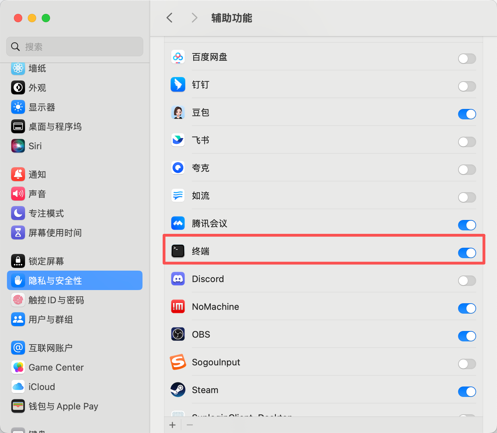
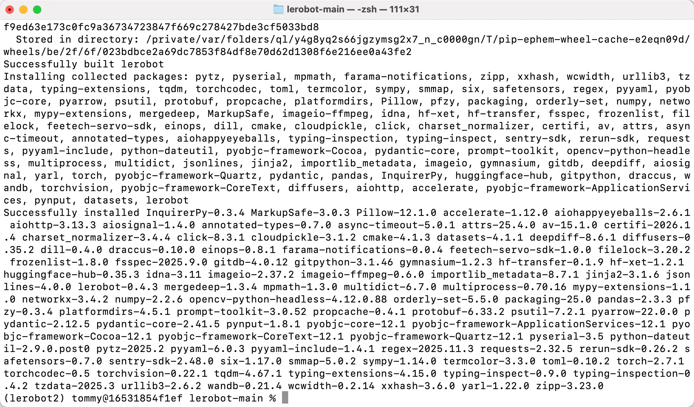
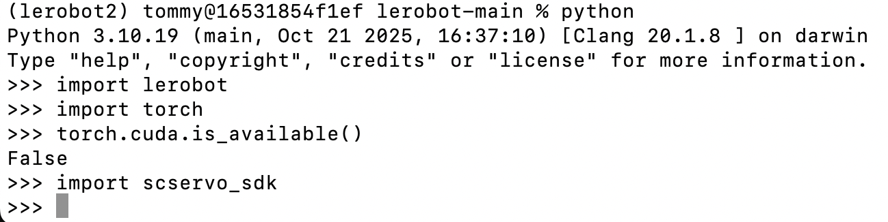

# Configuração (macOS)

O braço líder preto utiliza um adaptador de alimentação de 5V6A

O braço seguidor branco utiliza um adaptador de alimentação de 12V5A

## Conceder permissões



## Instalar o Miniconda

https://www.anaconda.com/download

## Alterar a fonte do pip

```Shell
pip config set global.index-url https://mirrors.aliyun.com/pypi/simple
```

## Alterar a fonte do conda

```Shell
# Limpar a configuração .condarc existente (opcional, para evitar conflitos)
echo "" > ~/.condarc

# Escrever a configuração da fonte Tsinghua
cat << EOF > ~/.condarc
channels:
  - defaults
show_channel_urls: true
default_channels:
  - https://mirrors.tuna.tsinghua.edu.cn/anaconda/pkgs/main
  - https://mirrors.tuna.tsinghua.edu.cn/anaconda/pkgs/r
  - https://mirrors.tuna.tsinghua.edu.cn/anaconda/pkgs/msys2
custom_channels:
  conda-forge: https://mirrors.tuna.tsinghua.edu.cn/anaconda/cloud
  msys2: https://mirrors.tuna.tsinghua.edu.cn/anaconda/cloud
  bioconda: https://mirrors.tuna.tsinghua.edu.cn/anaconda/cloud
  menpo: https://mirrors.tuna.tsinghua.edu.cn/anaconda/cloud
  pytorch: https://mirrors.tuna.tsinghua.edu.cn/anaconda/cloud
  pytorch-lts: https://mirrors.tuna.tsinghua.edu.cn/anaconda/cloud
  simpleitk: https://mirrors.tuna.tsinghua.edu.cn/anaconda/cloud
EOF

# Limpar a cache para aplicar a configuração
conda clean -i
```

## Criar o ambiente virtual

```Shell
conda create -y -n lerobot python=3.12
```

## Entrar no ambiente virtual

```Shell
conda activate lerobot
```

## Instalar o ffmpeg

```Shell
conda install *ffmpeg*=7.1.1 *-c* conda-forge -y
```

Verifique se a instalação foi bem-sucedida

```Shell
ffmpeg
```


## Transferir o LeRobot

- Transferir o repositório de código oficial do LeRobot

```Shell
git clone https://github.com/huggingface/lerobot.git
```

## Instalar o repositório de código

```Shell
# cd lerobot-main
cd lerobot
pip install -e ".[feetech]"
```




## Verificar se a instalação foi bem-sucedida

```Shell
lerobot-info

python

import lerobot
import torch
torch.cuda.is_available()
import scservo_sdk
```




<RelatedProducts slugs="xlerobot" />
