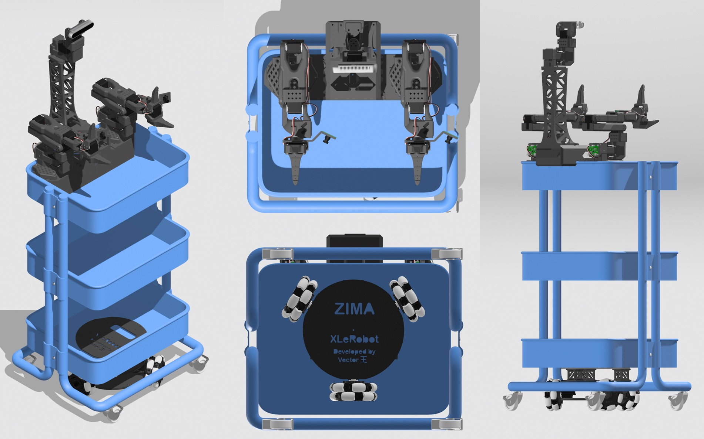
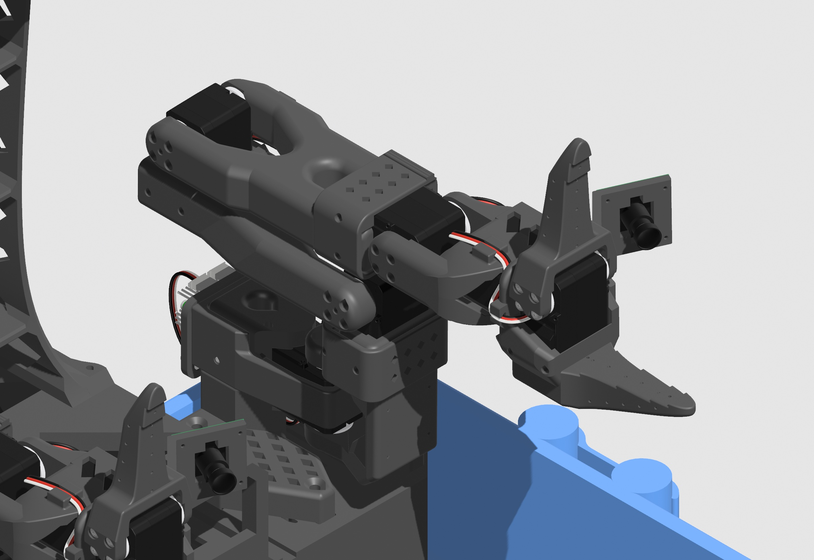
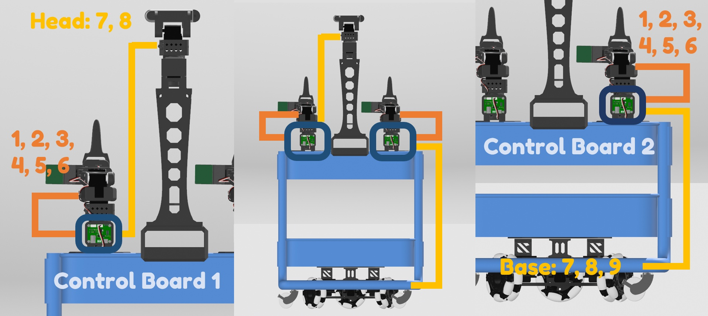
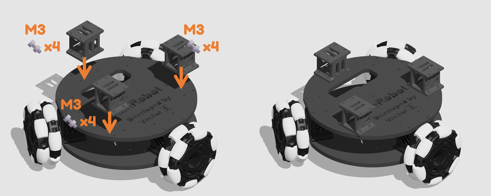
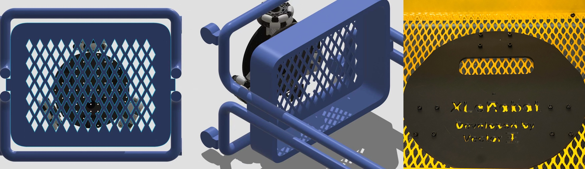
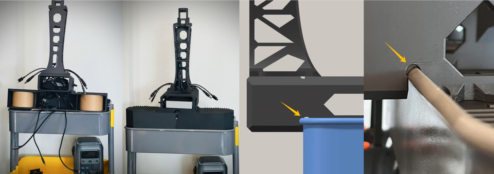
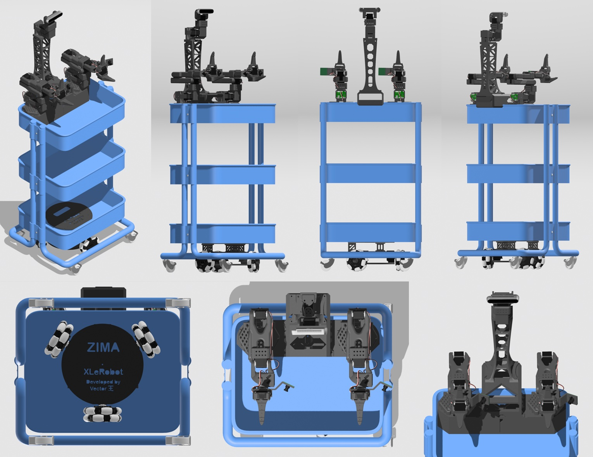
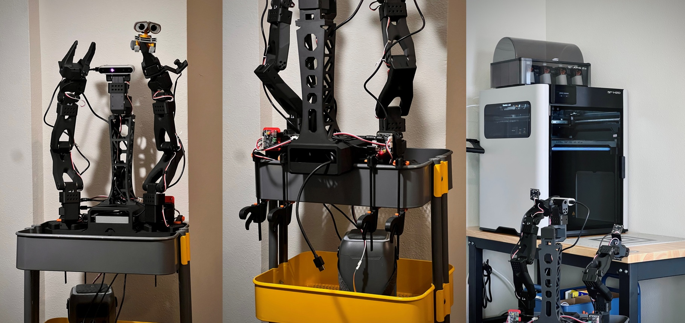

# Montagem do kit em peças



Dica

Se preferir dispensar o prazer de apertar parafusos, também pode comprar o [kit pré-montado](https://item.taobao.com/item.htm?ft=t&id=1002551208989&spm=a21dvs.23580594.0.0.47b32c1bwUlxLA&skuId=6088534920039) dos braços seguidores SO101 compatíveis com o Xlerobot.


## 🦾 Braço robótico SO101



> Se já tem 2 braços robóticos SO101 montados com os servos configurados, pode ignorar esta secção.
> 
> 

- Monte 2 braços robóticos SO101 seguindo as [instruções de montagem passo a passo do SO101](https://juxitech.feishu.cn/wiki/HllBwhjJ1iayMdkUTGgcyKbgn8g), fazendo 2 braços seguidores idênticos, equipados com 2 conjuntos de servos (todos previamente com ID 1-6) para as 2 placas de controlo dos servos.

- Adicione a câmara de pulso seguindo este [guia de instalação](https://juxitech.feishu.cn/wiki/LjJywf5ILihuwkkOboGcFx1Qnkc).

- Se tiver almofadas antiderrapantes, pode colá-las na garra.

## 一、Configurar os servos

||Quantidade|ID do servo|Utilização|
|---|---|---|---|
|Servo Feetech STS3215-C018|3|7、8、9|Chassis de rodas omnidirecionais|
|Servo Feetech STS3215-C018|2|7、8|Kit do membro superior-torre da câmara|
|Cabo de extensão de servo de 90CM|2||Ligar o chassis e a torre da câmara à placa de controlo dos servos|



> Uma vez que o repositório de código oficial do lerobot atualmente não suporta configurações de servos para além do braço robótico, utilizamos o [Bambot](https://bambot.org/) em alternativa (funciona em Windows e Mac; no Linux é necessário executar primeiro sudo chmod 666 /dev/ttyACM0).
> 
> 

```Plain Text
sudo chmod 666 /dev/ttyACM0
```

- Ligue os servos que pretende configurar (um a um) à placa de controlo dos servos e ligue diretamente a placa de controlo dos servos ao seu computador.

- Navegue até à [página de configuração de servos do Bambot](https://bambot.org/feetech.js), estabeleça a ligação e faça a leitura dos seus servos. 


- Altere o ID dos servos de acordo com as instruções abaixo. 


- Para além dos braços robóticos SO101, também precisa de configurar dois conjuntos de servos para as 2 placas de controlo dos servos:

    - um conjunto para a **torre da câmara** (IDs dos servos: 7, 8)

    - o outro conjunto para o **chassis de rodas omnidirecionais** (IDs dos servos: 7, 8, 9).

- Dica: use um marcador para escrever os números nos servos e distinga os servos de placas diferentes (por exemplo, L1-L8 e R1-R9).

## 🛒 Carrinho

- Caso tenha deitado fora o manual por engano, [aqui está uma cópia](https://github.com/Vector-Wangel/XLeRobot/blob/main/others/Manuals_raskog_utility_cart.pdf).


## 🧑🦼➡ Base com rodas

> Se já tem uma base Lekiwi, retire a bateria, os suportes dos servos, etc. A placa inferior só precisa de 3 servos com rodas instalados (mantenha a cablagem).
> 
> 


**Nota**

Não escolha a placa errada; cada placa tem uma ordem específica.

- Instale as rodas omnidirecionais na placa de acordo com a figura acima.

    - Os IDs de servo específicos devem ser instalados em conformidade.

- Note que os conectores das rodas omnidirecionais necessitam de 3 parafusos M4.

- Faça a cablagem normal dos servos de acordo com o [tutorial](https://github.com/SIGRobotics-UIUC/LeKiwi/blob/main/Assembly.md#2-bottom-plate-assembly); depois, não ligue os cabos dos servos à placa de controlo dos servos, mas utilize o **cabo de extensão de servo de 90CM** para o ligar à placa de controlo dos servos.


- Instale a placa superior de acordo com a figura acima.

- Deixe o **cabo de extensão de servo de 90CM** pendurado; por agora, não o puxe para fora do orifício da placa superior.



- Instale 3 conectores (elevadores) na placa superior de acordo com a figura acima.

Dica

Coloque a base Lekiwi com conectores debaixo do carrinho e veja se exerce pressão suficiente sobre o carrinho para que as quatro rodas continuem a tocar no chão. Se não, tente modificar o modelo 3D do conector ajustando ligeiramente a escala do eixo Z diretamente no software de fatiamento (mantendo a escala dos eixos X e Y inalterada) e imprima-o novamente.


Dica

Vire o carrinho ao contrário para fazer a montagem seguinte.

- Agora instale a base Lekiwi com conectores na parte inferior do carrinho, com a placa mais fina do outro lado.

- Consulte as figuras para encontrar a orientação de montagem necessária de acordo com o índice do servo.

Nota

Esta nova versão de hardware é compatível com a rede metálica do carrinho; os 12 parafusos M3 devem todos encaixar facilmente.



- Em seguida, encaminhe os cabos previamente prolongados de baixo para cima, através do carrinho.

## 🦾 Base do braço robótico

### Montagem da base superior

14 parafusos sextavados M3\*12

4 parafusos sextavados M3\*16


- A montagem é mais fácil quando a base está virada ao contrário.

### Montagem da cabeça

①Ligue primeiro o cabo de extensão de servo de 90CM (alternado a preto e branco) e o cabo de servo (alternado a branco, vermelho e preto) ao servo n.º 7.


②Utilize quatro parafusos com anilha M2\*6 para fixar a câmara


- Note que, ao instalar o disco do servo, não deve colocar nenhum parafuso no orifício central do disco do servo.

- Isto deve ser igual aos dois primeiros passos da [montagem do braço robótico SO101](https://huggingface.co/docs/lerobot/so101#joint-1).

## 🧵 Cablagem

Importante

Antes de fixar a base superior ao carrinho, conclua toda a cablagem e gestão de cabos da base superior e coloque o Raspberry Pi na sua caixa.


- Ligue o cabo de extensão de servo de 90CM proveniente da **base Lekiwi** ao **braço robótico SO101 esquerdo** (isto transforma a base e o braço num Lekiwi).

- Ligue 2 **cabos de dados USB-C para USB-A ** das 2 **placas de controlo dos servos** ao **Raspberry Pi** (os 2 encaixes USB-A restantes são para as câmaras) ou a uma placa Jetson.

- Ligue os 3 **cabos de alimentação**: 2 cabos **USB-C para DC (12V)** das 2 placas de controlo dos servos e 1 cabo **USB-C para USB-C** do **Raspberry Pi**, às portas de carregamento rápido PD da fonte de alimentação. Cada porta fornece até 100W durante o carregamento simultâneo, o que foi testado e é suficiente para suportar o funcionamento da versão de 12V.

### 🔋 Colocar a bateria 🛒

- Coloque-a em qualquer posição da camada intermédia ou inferior do carrinho para manter o centro de gravidade baixo. A bateria tem uma base antiderrapante e não desliza facilmente durante o funcionamento normal.

- Mantenha-a na vertical por segurança.

- Caso também tenha deitado fora o manual da bateria por engano, [aqui está uma cópia](https://github.com/Vector-Wangel/XLeRobot/blob/main/others/Manual_Anker_SOLIX_C300_DC_Portable_Power_Station.pdf).

Importante

Para proteger as placas de controlo dos servos, certifique-se de que liga os cabos de alimentação por último. Desligue sempre os cabos de alimentação ao ligar ou desligar outros cabos.

## 📸 Montagem final

### Instalar a base no carrinho

Importante

Antes de fixar a base superior ao carrinho, conclua toda a cablagem e gestão de cabos da base superior e coloque o Raspberry Pi na sua caixa.



- Tenha cuidado para não danificar a caixa ao empurrar a borda do carrinho para o encaixe da caixa.

- Para facilitar os testes, os braços robóticos SO101 são fixados diretamente ao carrinho. Posicione a [base do braço robótico](https://github.com/Vector-Wangel/XLeRobot/blob/main/3D_Models/3D_models_for_printing/XLeRobot_special/SO_5DOF_ARM100_Assemblybases.stl) nos dois cantos da camada superior do carrinho e fixe-a com **grampos tipo F**.

- Se tiver um rolo de cartão de filamento da Bambu Lab, não se esqueça de o colocar lá dentro para proporcionar um suporte estrutural estável.


Depois de concluir estes passos, o XLeRobot deverá estar fisicamente bem montado e pronto para fazer algumas tarefas domésticas.





Importante

Depois de o XLeRobot estar completamente montado, não o empurre de um lado para o outro como se fosse um carrinho, pois isso pode danificar as engrenagens dos servos. Em vez disso, quando precisar de o mover manualmente, levante o robô (~12kg).

<RelatedProducts slugs="xlerobot" />
