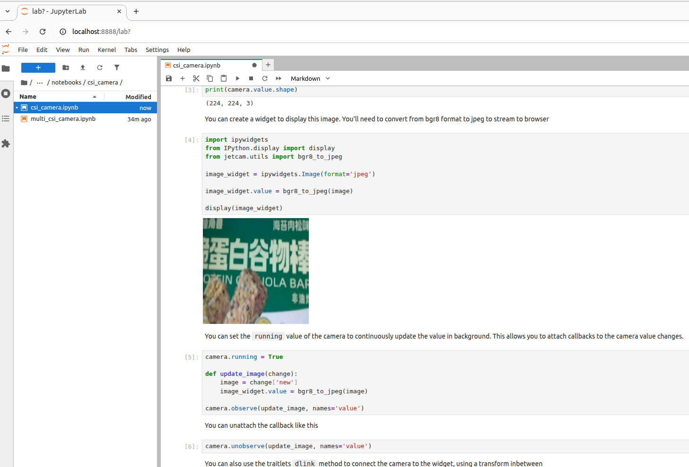
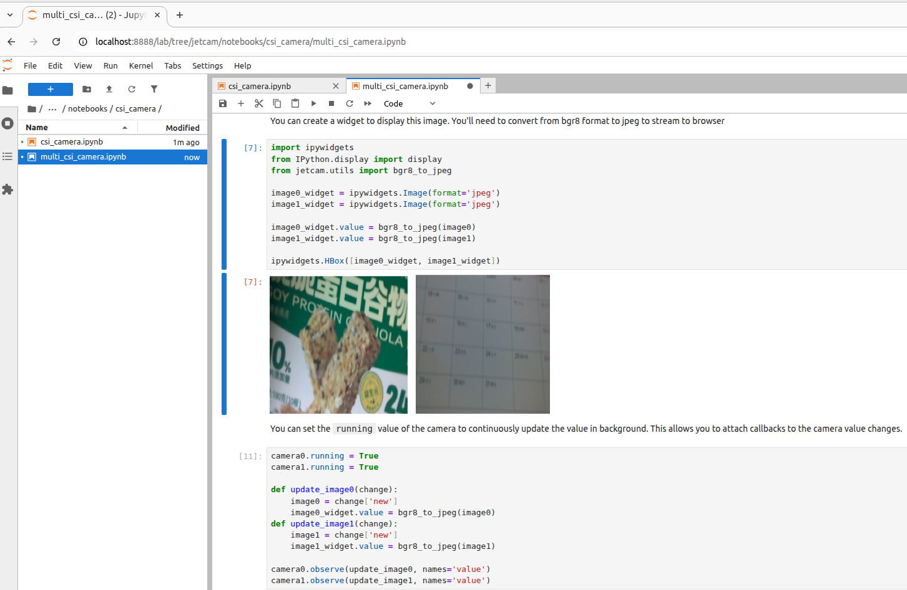
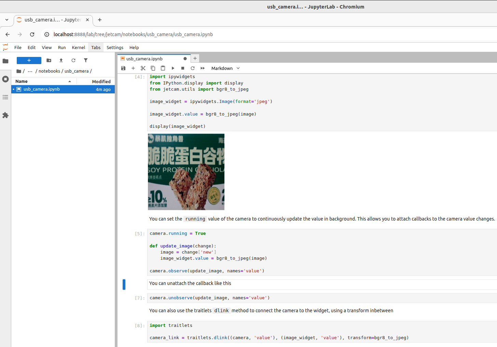

# Using JetCam

JetCam Usage

1. JetCam Installation

2. JetCam Usage

2.1. CSI Camera

Main Code Explanation

Call the Camera

Get the Camera Image

2.1.1. Single Camera

2.1.2. Multiple Cameras

2.2. USB Camera

References


JetCam is an easy-to-use Python library developed by NVIDIA for the Jetson platform, used to integrate and operate USB cameras or CSI cameras

## 1. JetCam Installation

```Plain Text
git clone https://github.com/NVIDIA-AI-IOT/jetcam
cd jetcam
sudo python3 setup.py install
sudo pip3 install ipywidgets
```

## 2. JetCam Usage

JetCam provides typical example programs to demonstrate to users how to use CSI and USB cameras.

The examples need to be run using Jupyter Lab. With our factory image system, you can access them directly via board IP:8888!

### 2.1. CSI Camera

On the Jupyter Lab web page, enter the folder where the CSI camera is located and open the corresponding folder:

`/home/jetson/jetcam/notebooks/csi_camera`

**Note: if you are not very familiar with Jupyter Lab, you can refer to the Jupyter Lab Usage Tutorial to understand the basic operations!**

#### Main Code Explanation

##### Call the Camera

width: image output width

height: image output height

`from jetcam.csi_camera import CSICamera`

`camera = CSICamera(width=224, height=224)`

##### Get the Camera Image

`image = camera.read()`

#### 2.1.1. Single Camera

> **Source Code Path**
> 
> 

`/home/jetson/jetcam/notebooks/csi_camera/csi_camera.ipynb`

> **Running Result**
> 
> 

After opening the program file, run the cells one by one from top to bottom:



#### 2.1.2. Multiple Cameras

> **Source Code Path**
> 
> 

`/home/jetson/jetcam/notebooks/csi_camera/multi_csi_camera.ipynb`

> **Running Result**
> 
> 

After opening the program file, run the cells one by one from top to bottom:



### 2.2. USB Camera

In Jupyter Lab, enter the folder where the USB camera is located and open the file; the folder path in the factory image system is:

`/home/jetson/jetcam/notebooks/usb_camera`



## References

[https://github.com/NVIDIA-AI-IOT/jetcam](https://github.com/NVIDIA-AI-IOT/jetcam)

<RelatedProducts slugs="imx219-csi-camera" />
