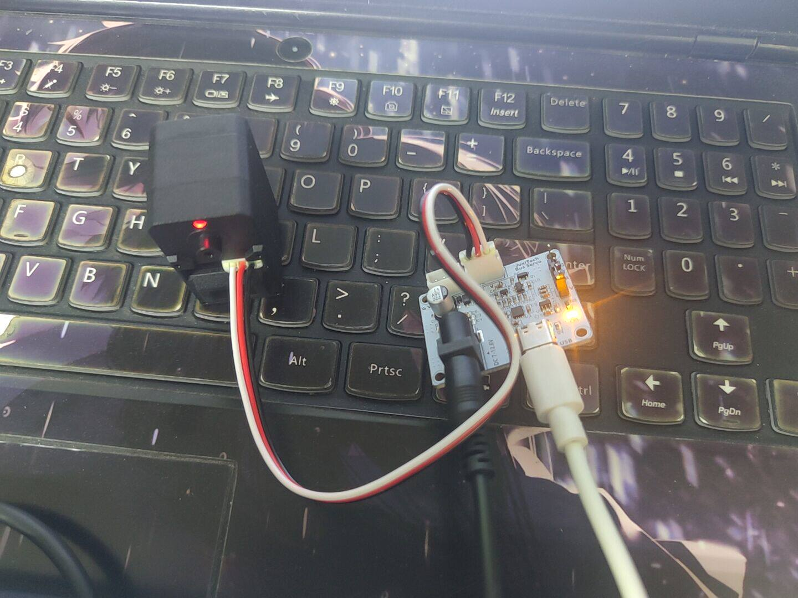
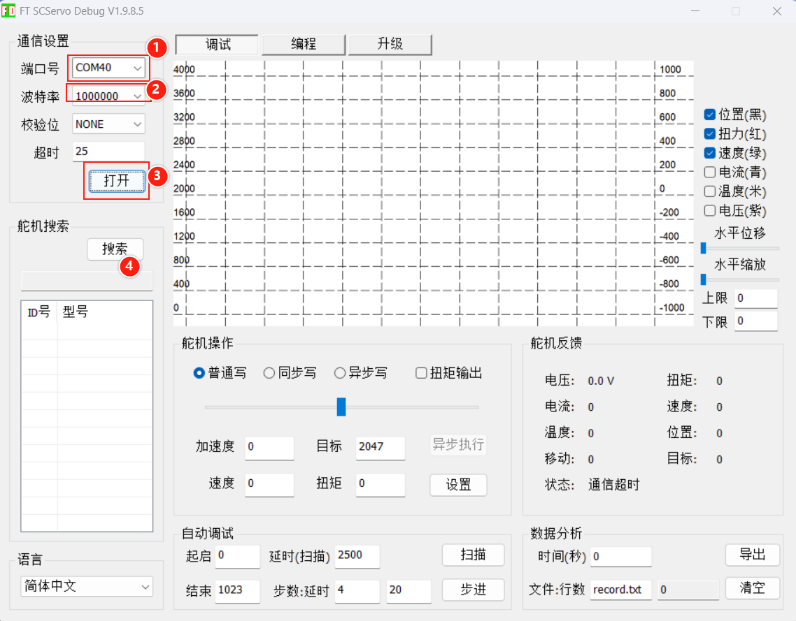

# STS3215 & SCS0009 Tutorial

> **[Buy in Store](https://www.juxitech.com/products/feetech-scs0009-serial-bus-servo)**

[FEETECH Host Computer FD Software](https://gitee.com/ftservo)

[STS3215 舵机调试资料.zip](/downloads/STS3215%20舵机调试资料.zip)

[SCS009 舵机调试资料.zip](/downloads/SCS009%20舵机调试资料.zip)

