# Running Tutorial for AmazingHand Official Example

> **[Buy in Store](https://www.juxitech.com/products/amazinghand)**


## 1. Code Download

It is recommended to download the Compressed Packet of the code under this usage tutorial for Demo example demonstration, or clone the official open source code repository  https://github.com/pollen-robotics/AmazingHand.git . Please note that there may be errors or omissions in the official open source code. 

[Running Tutorial for AmazingHand Official Example](https://juxitech.feishu.cn/wiki/SfUCweM6ni4IookxjOMcLf5cnwd)

Windows Code Compressed Packet

[AmazingHand-main.zip]

Linux Code Compressed Packet

[AmazingHand-main.zip]

```Plain Text
git clone https://github.com/pollen-robotics/AmazingHand.git
```

## 2. Environment Installation

Install Rust, uv, and dora-rs according to the system's self-installation process 

**1. Install Rust:** [https://www.rust-lang.org/tools/install](https://www.rust-lang.org/tools/install)

Reference for Rust Environment Variable Setup on Windows (Important!) https://zhuanlan.zhihu.com/p/1958936613276087180

Linux Environment Variable Settings:

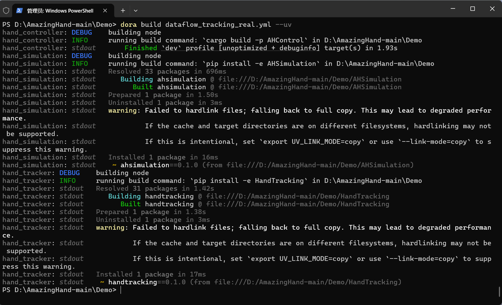

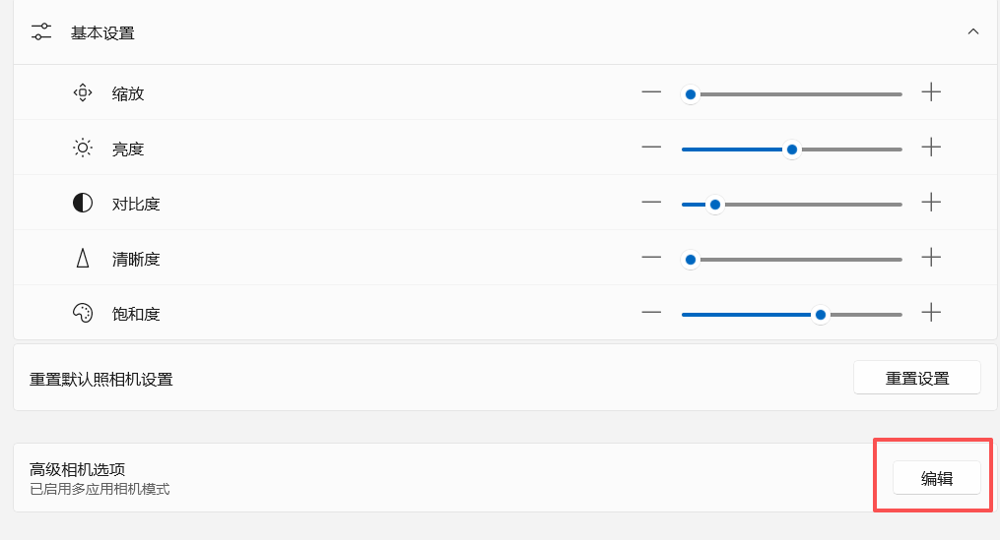

Visual Studio Installer may be required for the first installation

**Configure Cargo mirroring source**

Create the `config.toml` configuration file in the `.cargo` folder, and configure the Tsinghua `crates.io-index` mirroring so that Cargo will use Tsinghua University's mirror source to download crates.

```Bash
[source.crates-io]
replace-with = 'tuna'

[source.tuna]
registry = "https://mirrors.tuna.tsinghua.edu.cn/git/crates.io-index.git"
```

**2. Install uv:** [https://docs.astral.sh/uv/getting-started/installation/](https://docs.astral.sh/uv/getting-started/installation/)

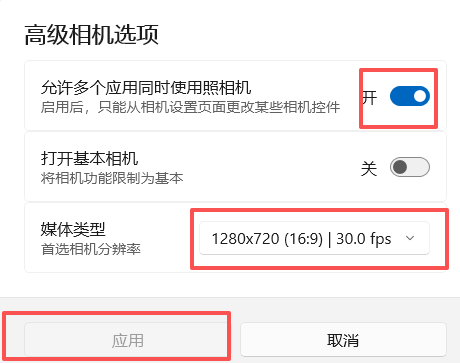

Open thePowershellterminal on the Windows side, copy and then enter this command to install

**Linux Environment Variable Settings:**

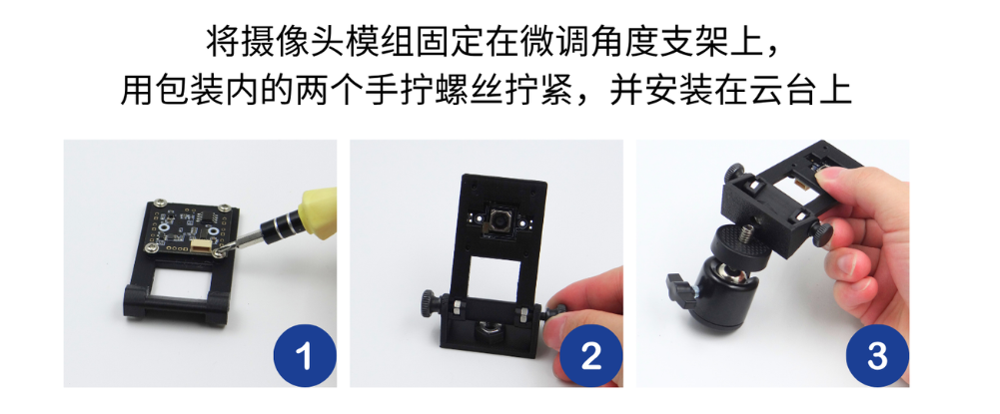

**3. Install dora-rs:**Please refer to [https://dora-rs.ai/docs/guides/Installation/installing](https://dora-rs.ai/docs/guides/Installation/installing) for download and installation

Linux Environment Variable Settings:

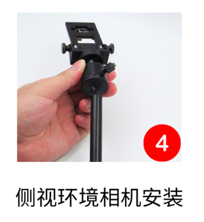

## 3. Wiring Method

The power supply requires at least 5V3A, is externally connected to a servo driver board, and is connected to the computer via USB 


## 4. Example Demonstration

### **1. Check the Port Number of the Servo Driver Board**

- The Windows system is generally COM11, and the Port Number of the servo driver board can be found through Device Manager or Feite Servo Host Computer 


- Ubuntu and Linux systems are generally /dev/ttyACM0

Check the port number of the servo driver board via the command line: 

```Bash
ls /dev/ttyUSB* /dev/ttyACM*
```

```Plain Text
sudo chmod 666 /dev/ttyACM*
```

```Plain Text
sudo usermod -aG dialout $USER
```

If the command "ls /dev/ttyUSB\* /dev/ttyACM\*" fails to find the directory in the virtual machine, please check if the dexterous hand is connected to the computer in the lower right corner of the virtual machine. If so, please choose to disconnect it and connect it to the virtual machine. 

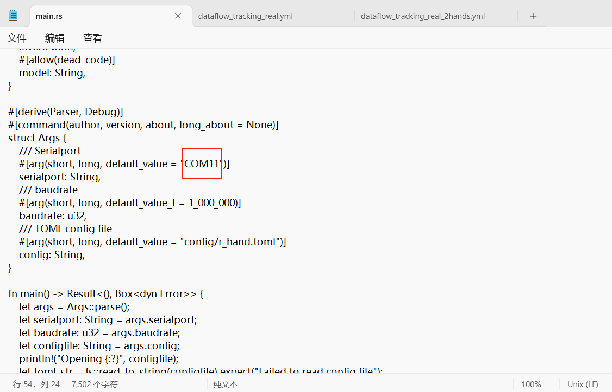

### **2. Modify the Port Number in the code**

① Locate the main.rs code file under the AmazingHand-main\\Demo\\AHControl\\src directory, open it in a text editor, and modify it to the port number found on your own host (COM\* for Windows, and generally /dev/ttyACM\* for Ubuntu and Linux systems)

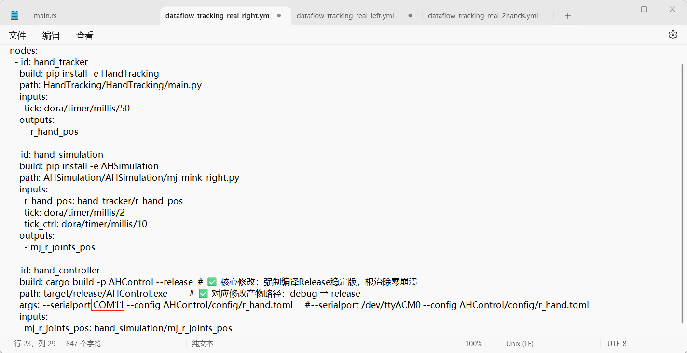

② Locate the corresponding instance file 

**Right Dexterous Hand** Find dataflow_tracking_real_right.yml under the AmazingHand-main\\Demo directory

**Left Dexterous Hand** Find dataflow_tracking_real_left.yml under the AmazingHand-main\\Demo directory

**Dual Dexterous Hands ** Find dataflow_tracking_real_2hands.yml under the AmazingHand-main\\Demo directory 

Open in text format and modify it to the port number found on your own host (COM\* for Windows, and generally /dev/ttyACM\* for Ubuntu and Linux systems) 

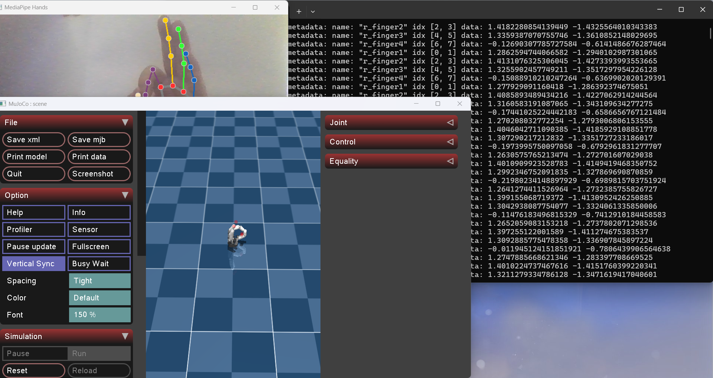

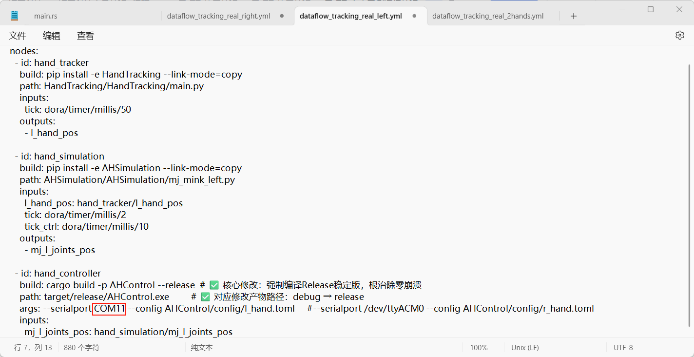

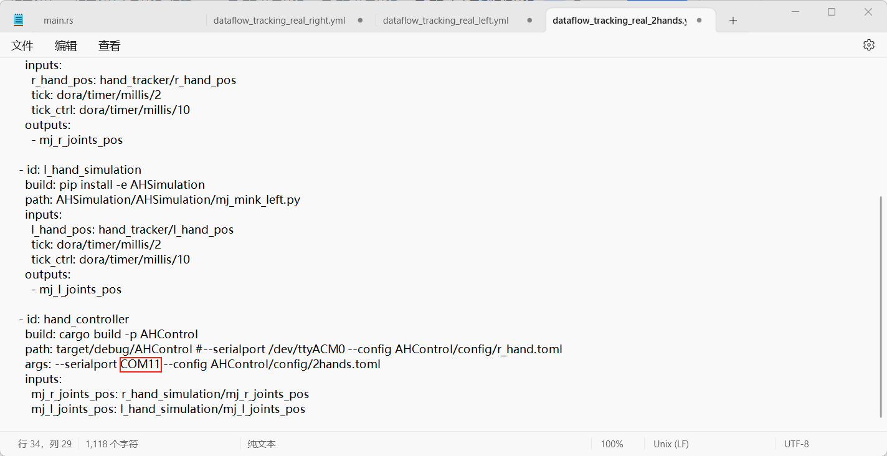

### **3. Code Deployment**

- Open the Demo folder

On the Windows system, in the directory, enter Powershell and press Enter to open it, then start the daemon process (each time):

For Linux systems, directly open via the Console and start the daemon process (each time): 

```Plain Text
dora up
```

- Then run from this directory in the Console (when setting up the environment, you can run it once!! Running it again will overwrite the virtual environment!! ) Create a virtual environment:

```Plain Text
uv venv --python 3.12
```

- Activate the virtual environment (every time) by entering and running the following according to the system: 

```Plain Text
Set-ExecutionPolicy -ExecutionPolicy Bypass -Scope Process

.venv\Scripts\activate
```

```Plain Text
source .venv/bin/activate
```

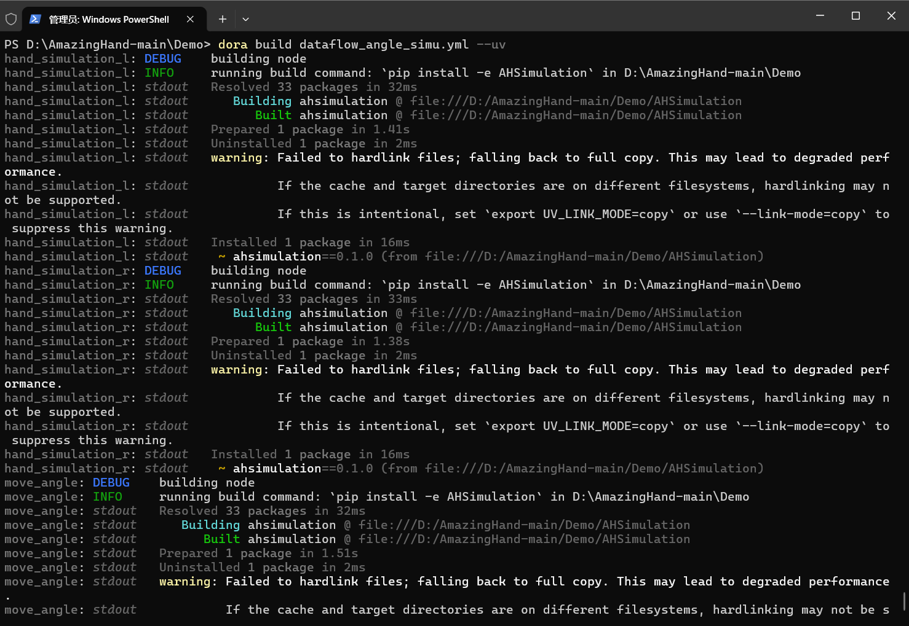

Ensure that the Console has activated the virtual environment!

- Execute dependency synchronization and enter the AHControl folder

```Plain Text
cd AHControl
```

```Plain Text
cargo build --release
```

- Then enter ` cd.. ` and press Enter  to return to the Demo directory!  Enter the AHSimulation folder 

```Plain Text
cd AHSimulation
```

```Plain Text
uv sync
```

- Then enter`cd..`and press Enter to returnto the Demo directory!Enter the HandTracking folder

```Plain Text
cd HandTracking
```

```Plain Text
uv sync
```

### 4. Running Results

- Openthe Demofolder! Enter Powershell in the directory and press Enter to open it, then start the daemon process (every time):

```Plain Text
dora up
```

- Activate the virtual environment (every time) Please input and run according to the system: 

Command to activate a virtual environment on the Windows platform:

```Python
Set-ExecutionPolicy -ExecutionPolicy Bypass -Scope Process
```

```Plain Text
.venv\Scripts\activate
```

Command to activate a virtual environment on the Linux platform:

```Plain Text
source .venv/bin/activate
```

### Simulation Environment

- Run the webcam hand tracking demo only in the simulation environment:

```Plain Text
dora build dataflow_tracking_simu.yml --uv   *#(Execute only once)*
```

```Plain Text
dora run dataflow_tracking_simu.yml --uv
```

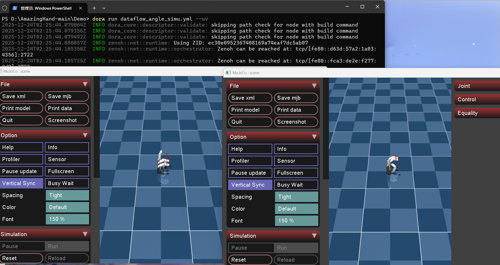

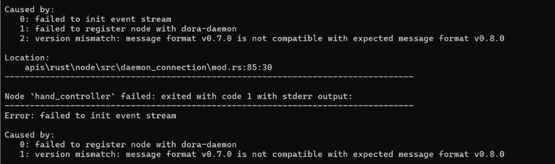

### Real hardware operation (hand tracking)

- Run the webcam hand tracking demo using real hardware:

    #### Right Dexterous Hand

    ```Plain Text
    dora build dataflow_tracking_real_right.yml --uv   *#(Execute only once)*
    ```

    ```Plain Text
    dora run dataflow_tracking_real_right.yml --uv
    ```

    #### Left Dexterous Hand

    ```Plain Text
    dora build dataflow_tracking_real_left.yml --uv   *#(Execute only once)*
    ```

    ```Plain Text
    dora run dataflow_tracking_real_left.yml --uv
    ```

    #### Dual dexterous hands (note that both are connected to a servo driver board) 

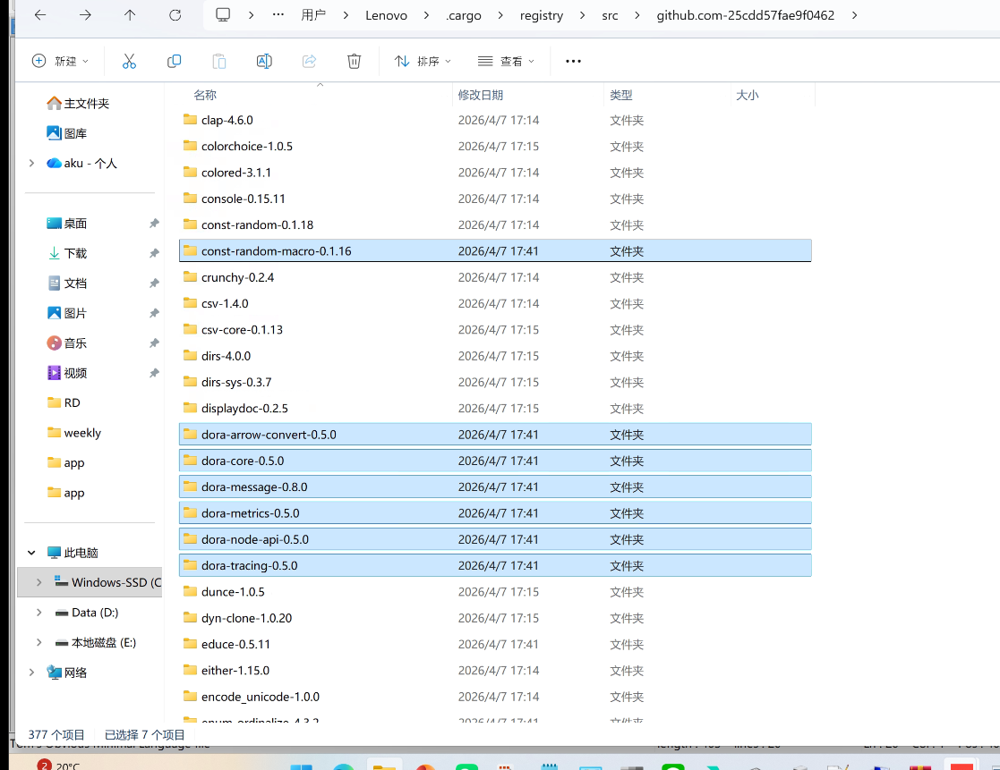

    ```Plain Text
    dora build dataflow_tracking_real_2hands.yml --uv   *#(Execute only once)*
    ```

    ```Plain Text
    dora run dataflow_tracking_real_2hands.yml --uv
    ```

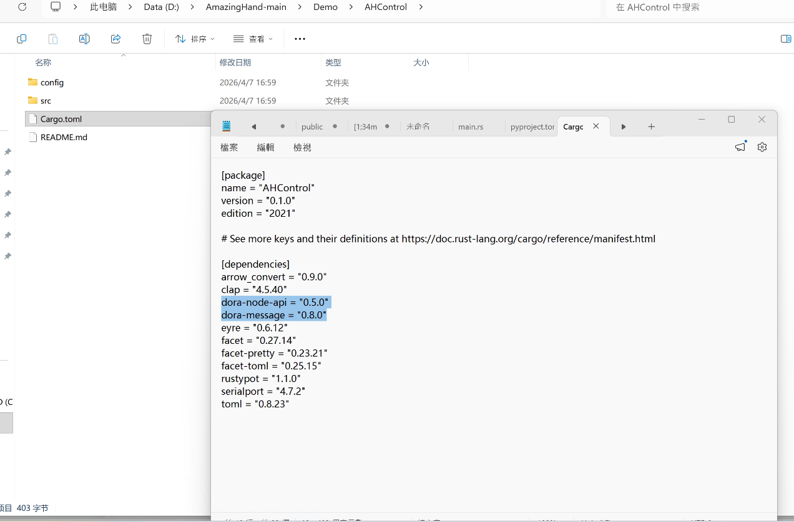

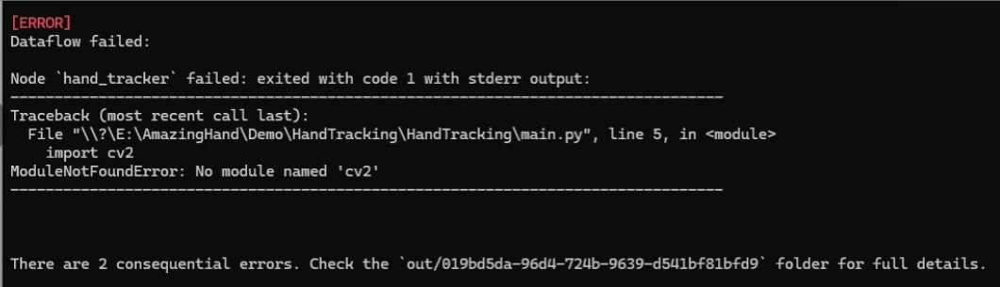

### Simple example to control the angle of the simulated finger

- Run a simple example to control the finger angle in the simulation:

    ```Plain Text
    dora build dataflow_angle_simu.yml --uv   *#(Execute only once)*
    ```

    ```Plain Text
    dora run dataflow_angle_simu.yml --uv
    ```

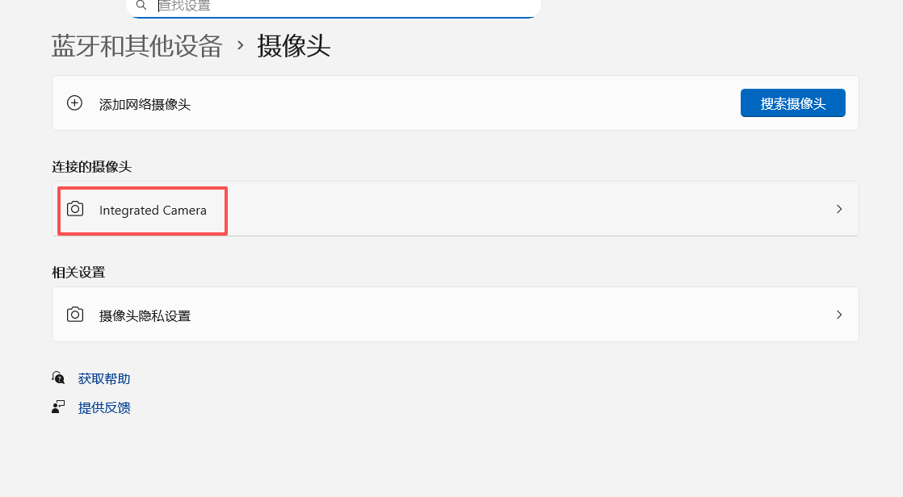


Description

- [AHControl](https://github.com/pollen-robotics/AmazingHand/blob/main/Demo/AHControl) includes a dora-rs node to control the motor, as well as some utilities for configuring the motor.

- [AHSimulation](https://github.com/pollen-robotics/AmazingHand/blob/main/Demo/AHSimulation) includes a dora-rs node for simulating hand motion and obtaining inverse kinematics.

- [HandTracking](https://github.com/pollen-robotics/AmazingHand/blob/main/Demo/HandTracking) includes a dora-rs node that tracks hands from a webcam and uses them as targets to control AH!


## Precautions 

### 1. mediapipe version issue

In pyproject.toml, mediapipe\>=0.10.14 is configured, but the installed mediapipe package is missing the solutions submodule. Most likely, the mediapipe version is incompatible with Python 3.12 (higher versions of mediapipe have issues with Python 3.12 support), or the package files were corrupted during installation. 

```Plain Text
uv pip uninstall mediapipe
```

```Plain Text
uv pip install mediapipe==0.10.14
```

### 2. Dora version incompatibility, message format (v0.7.0 vs v0.8.0)


Answer: ① First, under the.cargo/registry/src/github.xxxxxxxx/ directory in the C drive user directorydelete onlythe corresponding dependency package!

**`dora-message-0.7.0`** (Core! This is the folder for the old message format and must be deleted)

`dora-core-0.4.1`

`dora-node-api-0.4.1`

`dora-arrow-convert-0.4.1`

`dora-metrics-0.4.1`

`dora-tracing-0.4.1`

`const-random-macro-0.1.16` (Dora's dependent auxiliary library, to be deleted along with the old version)

② Open the Demo/AHControl folder and modify dora-node-api="0.5.0" and dora-message="0.8.0" in Cargo.toml 

③ In the Console, navigate to the AHControl directory and re-run cargo build --release

④ Re-follow the " [real hardware operation ](https://juxitech.feishu.cn/docx/FnF9dE1w7oFLtSx2p2ocU96Knpe#doxcnI3XybJ3CPPpdlSk5iH8wug)" to rebuild

Modify the corresponding version according to the actual error reporting situation. For example, if dora-message requires version 0.6.0, change it to dora-node-api="0.4.0" dora-message="0.6.0".


### 3. No openCV dependency library


Enter the following command in the HandTracking directory 

```Python
python -m pip install opencv-contrib-python numpy mediapipe -i https://mirrors.aliyun.com/pypi/simple/
```

### 4.  Camera Permission Enabled  (Computer) 


### 5. Virtual Machine 22.04 calls the camera

Reference https://blog.csdn.net/qq_19731521/article/details/124954288

### 6. Desktop Camera Installation

#### Installation Steps for Environmental Camera Kit Bracket

1. First, fix the fine-tuning angle bracket


2. Side View Environment Camera Kit


## Virtual Machine 22.04 directly runs hand tracking 

Download these four files and place them in the same English directory, then use virtual machine software to directly open the.ovf file to enter the system

Password ubuntu

[ubuntu22.04_amazinghand.ovf]

[ubuntu22.04_amazinghand-disk1.vmdk]

[ubuntu22.04_amazinghand.mf]

[ubuntu22.04_amazinghand-file1.iso]

**1. Open the Console under the Demo directory:**

```Plain Text
dora up
```

**And activate the virtual environment: **

```Plain Text
source .venv/bin/activate
```

**2. Virtual Machine Camera Permission Call**

Reference for Virtual Machine 22.04 to Call Camera https://blog.csdn.net/qq_19731521/article/details/124954288

**3. Check the port of the servo driver board via the command line:**

```Bash
ls /dev/ttyUSB* /dev/ttyACM*
```

```Plain Text
sudo chmod 666 /dev/ttyACM*
```

```Plain Text
sudo usermod -aG dialout $USER
```

**4. Modify the Port Number in the code file**

① Locate the main.rs code file under the AmazingHand-main\\Demo\\AHControl\\src directory, open it in text mode, and modify it to the port number found on your own host (COM\* for Windows, and generally /dev/ttyACM\* for Ubuntu and Linux systems)


② Find the corresponding instance file 

**Right Dexterous Hand** Find dataflow_tracking_real_right.yml under the AmazingHand-main\\Demo directory

**Left Dexterous Hand** Find dataflow_tracking_real_left.yml under the AmazingHand-main\\Demo directory

**Dual Dexterous Hands ** Find the dataflow_tracking_real_2hands.yml file under the AmazingHand-main\\Demo directory 

Open in text format and modify it to the port number found on your own host (COM\* for Windows, and generally /dev/ttyACM\* for Ubuntu and Linux systems) 


**5. Run right hand tracking**

```Plain Text
dora run dataflow_tracking_real_right.yml --uv
```

<RelatedProducts slugs="amazinghand,servo-driver-board" />
