# Lekiwi Mobile Robot Assembly Tutorial

> **[Buy in Store](https://www.juxitech.com/products/lekiwi-embodied-intelligence-mobile-robotic-car)**

[*Precise component positions can be visualized in Fusion360 Online CAD*](https://a360.co/4k1P8yO)*.*

[URDF File](https://gitcode.com/gh_mirrors/le/LeKiwi/tree/main)

Online URDF Preview https://urdf.d-robotics.cc/

# 1. Assemble the wheel module (3 per robot)

1. Secure the drive motor to the motor bracket using 12 **M2x6** self-tapping screws. (Supplied with the servo box)

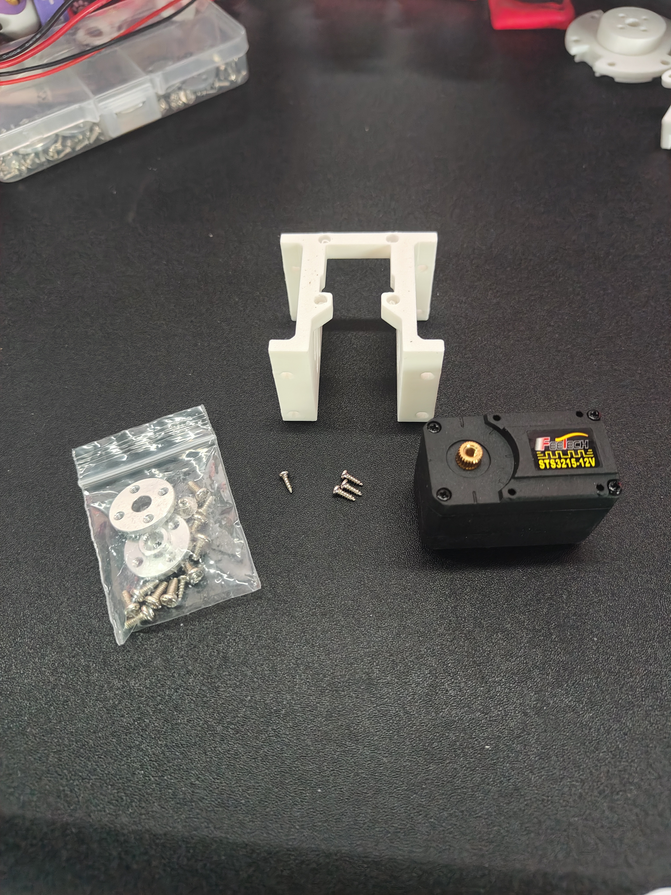

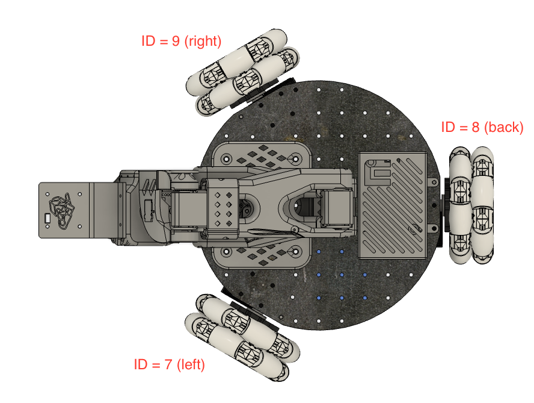

2. Use 12 **M3x16 machine screws and 12 ** to secure the drive motor bracket to the base plate.

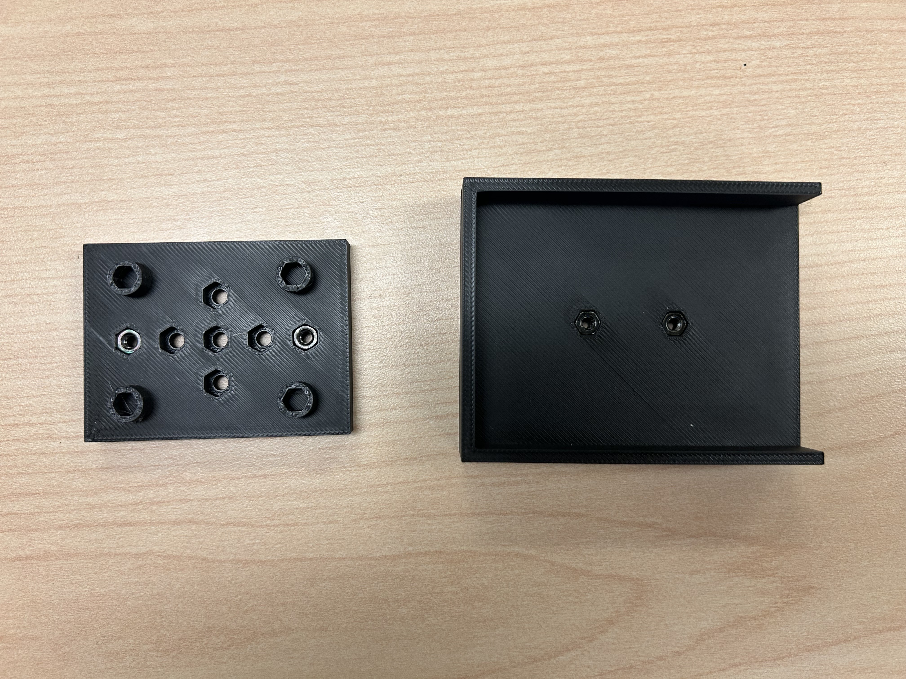

3. Remove the machine screws and nuts of the 82mm omnidirectional wheel

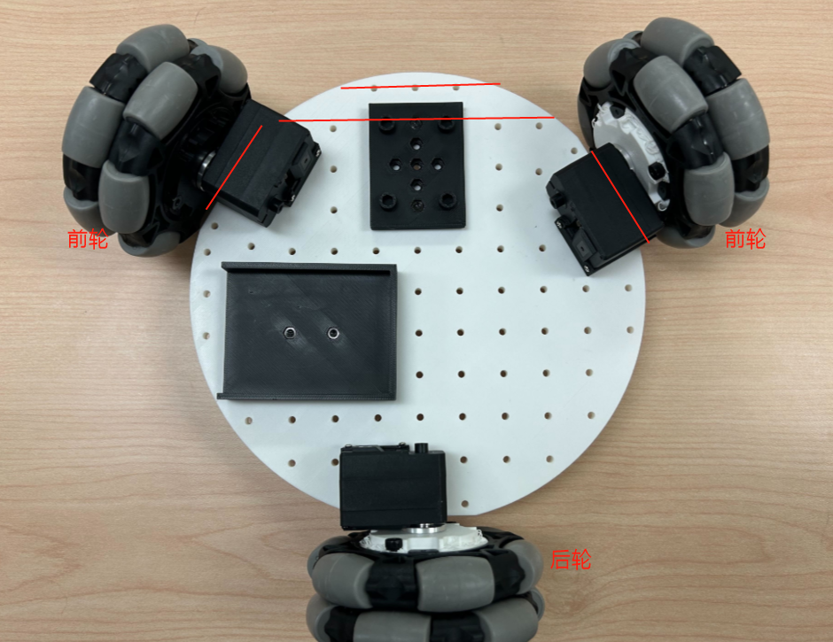

4. Use m3\*6 screws to secure the steering wheel to the servo

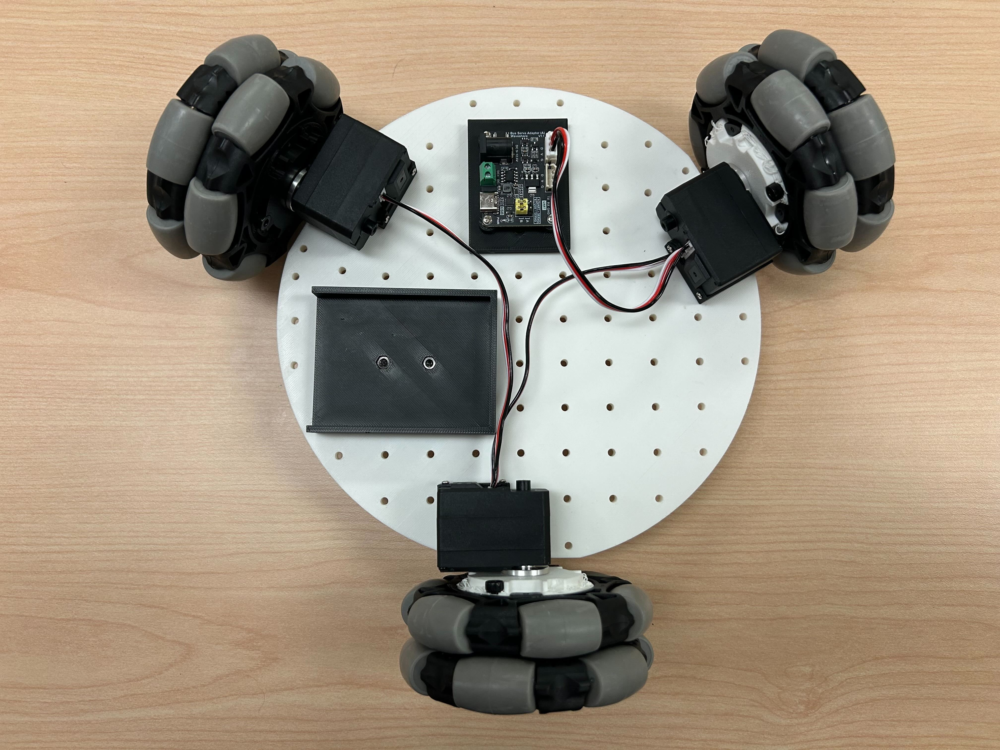

5. Install 4 locknuts into the coupling, and use 4 M3\*6 screws to secure the coupling to the steering wheel.

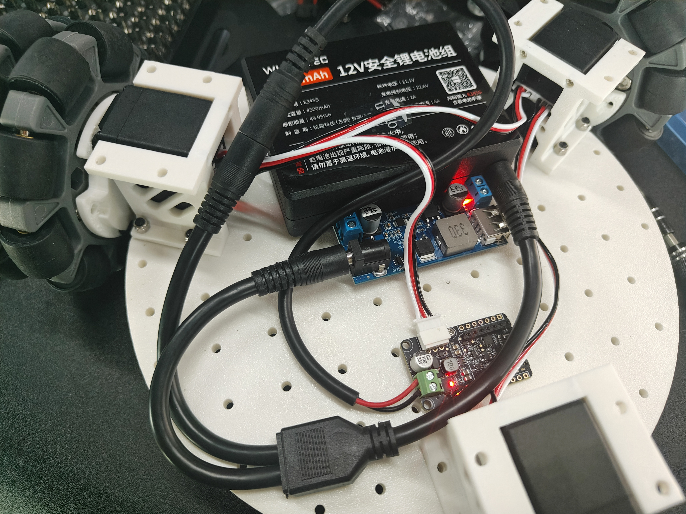

6. Use M3\*25 machine screws and locknuts to secure the 82mm omnidirectional wheel to the coupling

After all three wheels are installed on the base plate: 

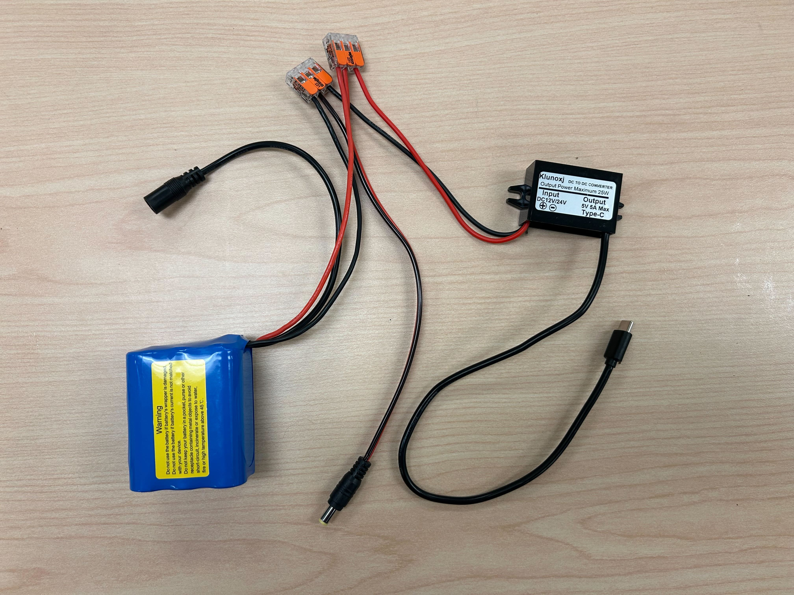

# 2. Base Plate Assembly

1. Insert M3 nuts into the holes of the servo driver board and battery mount. Secure both to the base plate with 4 M3x12 machine screws.

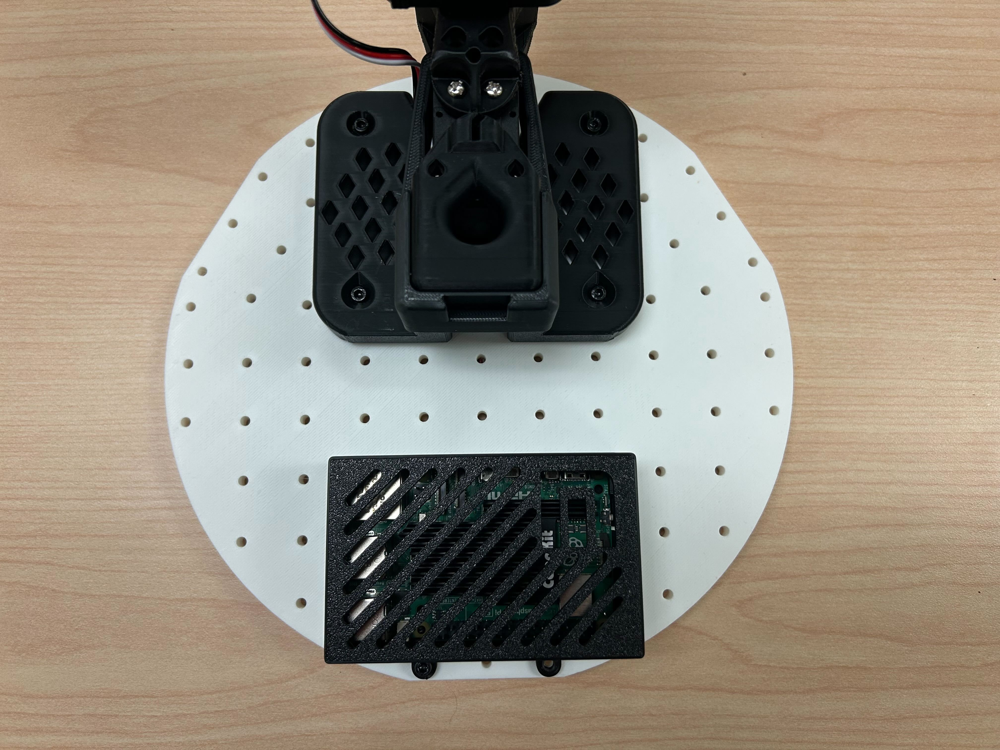

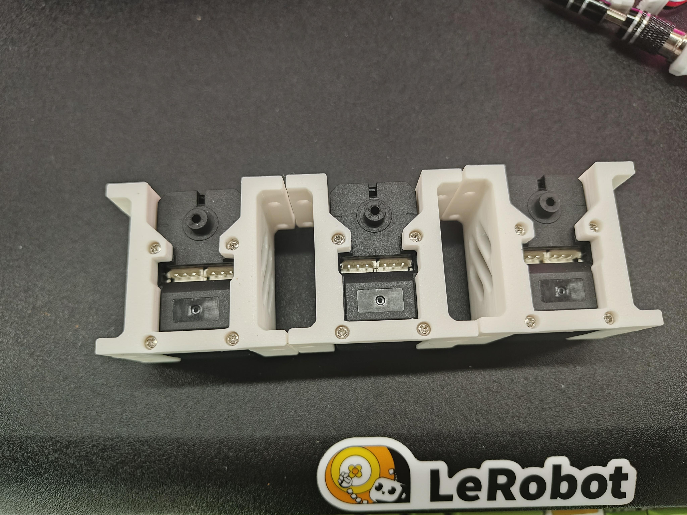

2. Install the servo driver board using four M2.5\*6.5 copper pillars and four M2.5\*8 screws, and connect it to 3 servos.

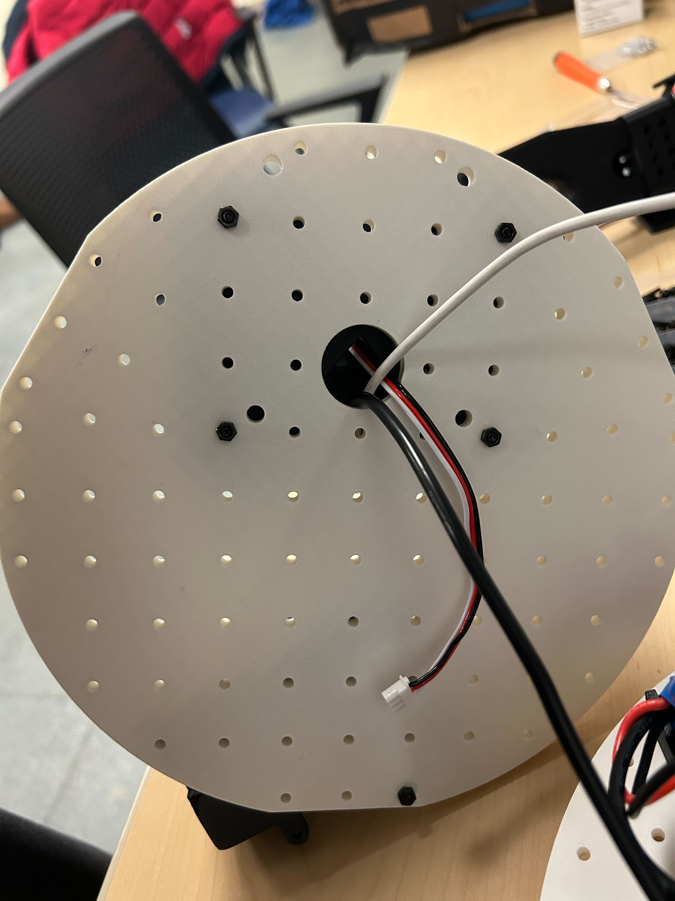

Mobile Power Cable Connection

- **Power input ** directly connected to the power supply 

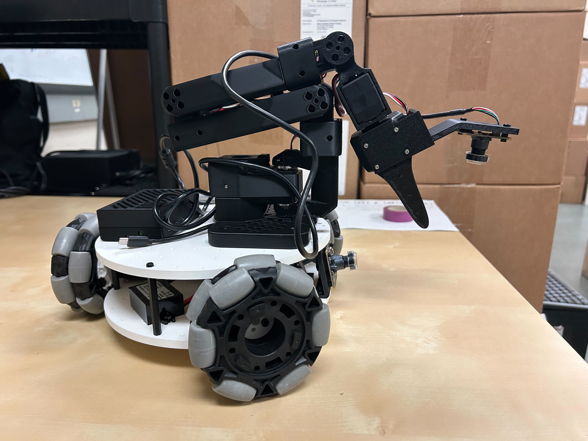

- **USB-C** interface provides 5V power to the Raspberry Pi

- If using ** 12V robotic arm **, directly use ** DC power distributor ** to power ** servo motor board **. 

The cable can be connected as shown in the figure below: 

# 3. Roof Panel Assembly

1. Place the Raspberry Pi 5 into the bottom of the Raspberry Pi case, then snap on the top of the case.

2. Secure the Raspberry Pi to the top base plate using two M3x12 machine screws and two M3 locknuts, and install the SO-101 robotic arm base using four M4x25 machine screws and four M4 locknuts. You can use either our improved SO-101 base or the original base, as mounting holes for both types of bases are pre-drilled on the base plate.

# IV.

1. Thread the USB-C to USB-A cable of the servo driver board, the 5V USB-C power cable, and the SO0-101 servo cable through the holes in the top and bottom plates.

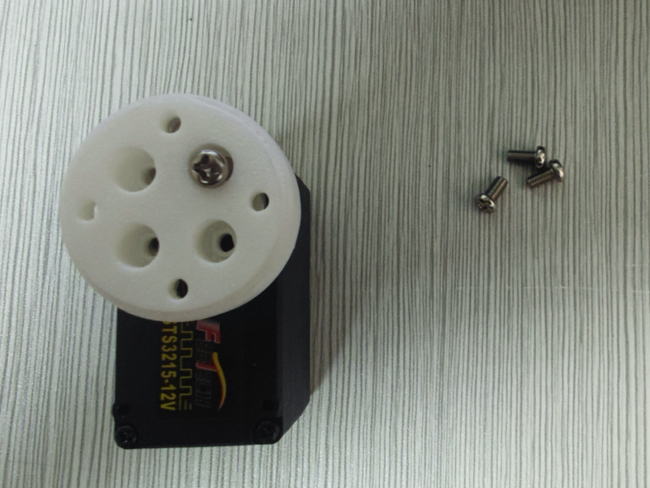

2. Install the top and bottom plates onto the motor bracket using 6 M3x12 machine screws and 6 M3 locknuts.

3. Connect the top plate and bottom plate using 6 M3\*50 copper pillars and 6 M3\* machine screws

# 5. Install the camera

*Note: The bracket we designed is specifically tailored for the camera we selected. Modifications may be required for different camera modules.*

## (Option 1) Install the front-view camera 

Install the front-view camera bracket to the base plate using 3 M3\*12 machine screws and 3 M3 nuts 

Secure the camera module with 4 m2\*5\*5 washer screws 

## (Option 2) Install an arm-mounted camera 

Secure the camera module with 4 m2\*5\*5 washer screws 

# 6. Plug in the power supply

Insert the DC cylindrical plug adapter into the servo driver board, and insert the 5V USB-C connector into the Raspberry Pi 5 to power the electronic devices. The USB data cables of the servo driver board and camera can be directly plugged into the Raspberry Pi.

