# Lekiwi Assembly

> **[Buy in Store](https://www.juxitech.com/products/lekiwi-embodied-intelligence-mobile-robotic-car)**

[*In Fusion360 online CAD*](https://a360.co/4k1P8yO)* you can visualize exact component positions.*

[URDF file](https://gitcode.com/gh_mirrors/le/LeKiwi/tree/main)

Online URDF preview https://urdf.d-robotics.cc/

## 1. Assembling the Wheel Modules (3 per robot)

1. Use 12 **M2x6** self-tapping screws to fasten the drive motor to the motor bracket. (Included with the servo box.)

2. Use 12 **M3x16** machine screws and 12 **M3 nuts** to fasten the servos to the base plate using the drive motor brackets.

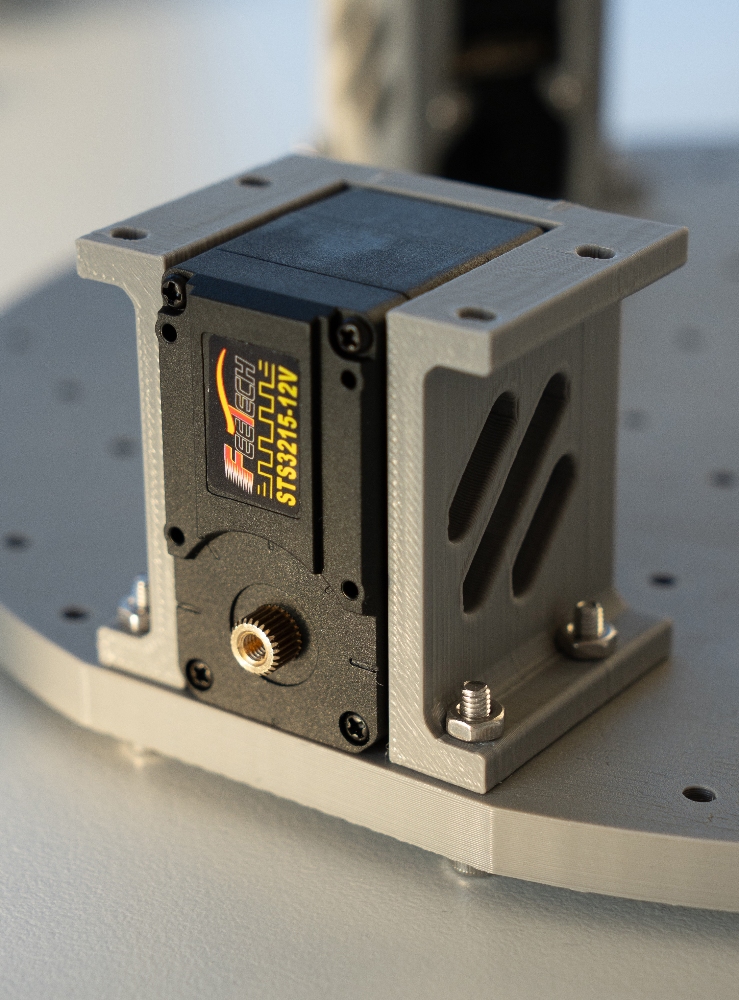

3. Remove the machine screws and nuts from the 82mm omni wheels.

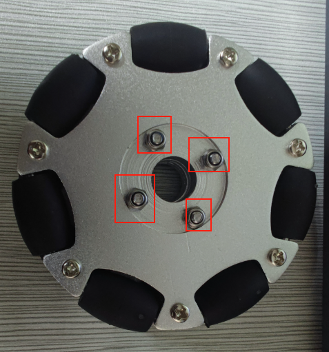

4. Use m3\*6 screws to fasten the servo horn to the servo.

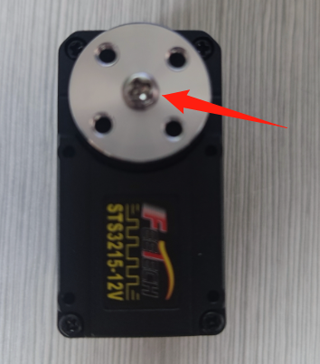

5. Install 4 lock nuts into the coupling. First, use 4 m3\*6 screws to fasten the coupling to the servo horn.

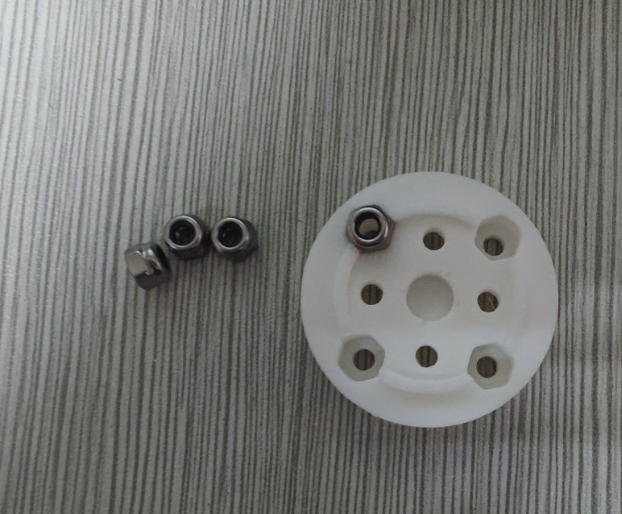

6. Use m3\*25 machine screws and lock nuts to secure the 82mm omni wheels to the coupling.

Once all three wheels are installed on the base plate:

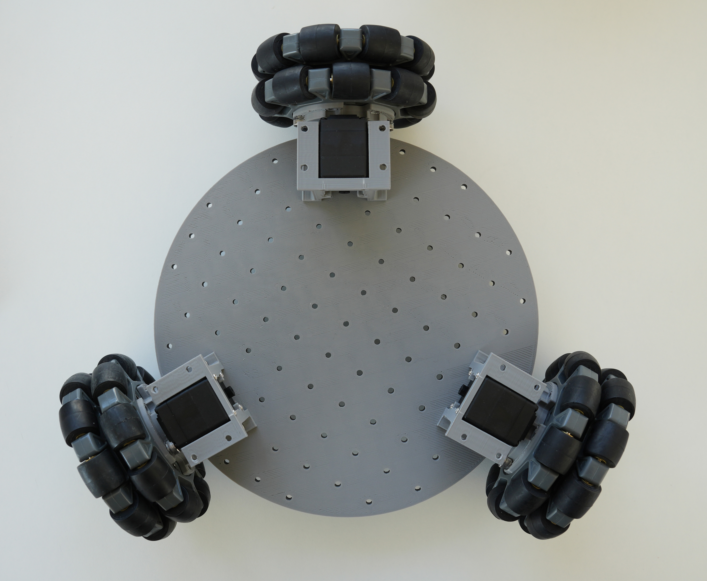
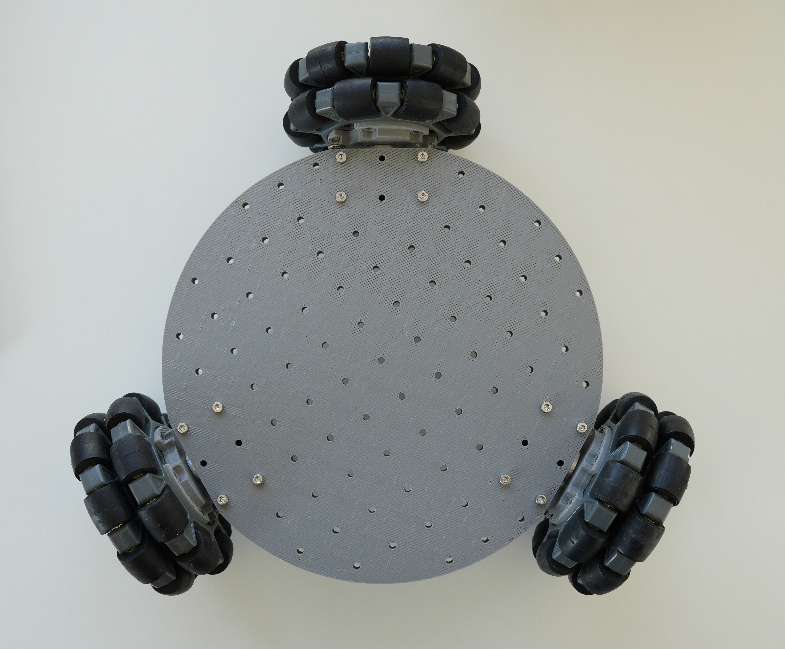

## 2. Base Plate Assembly

1. Insert 2 M3 nuts into the holes of the servo driver board and battery mount. Use 4 M3x12 hex screws to fasten both to the base plate.

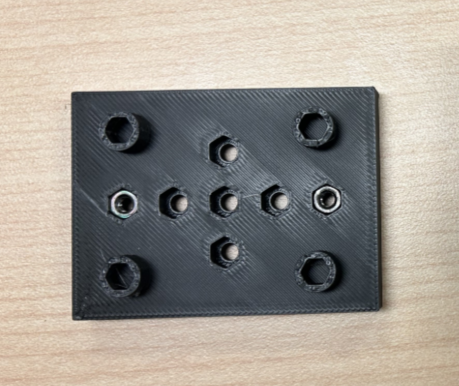

2. Use 2 M3\*12 hex screws and 2 M3 nuts to install the servo driver board and connect it to the 3 servos.

Portable power supply cable connections

- The **power input** connects directly to the power supply

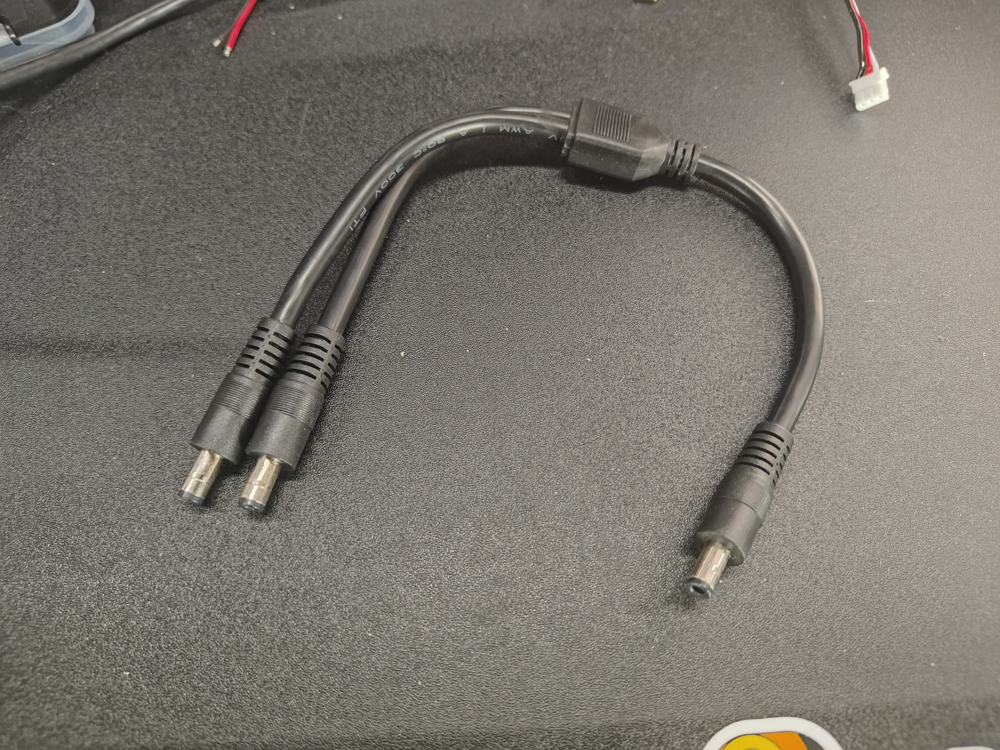

- The **USB-C** interface supplies 5V power to the Raspberry Pi
- If you use a **12V robot arm**, power the **servo motor board** directly with the **DC power distributor**

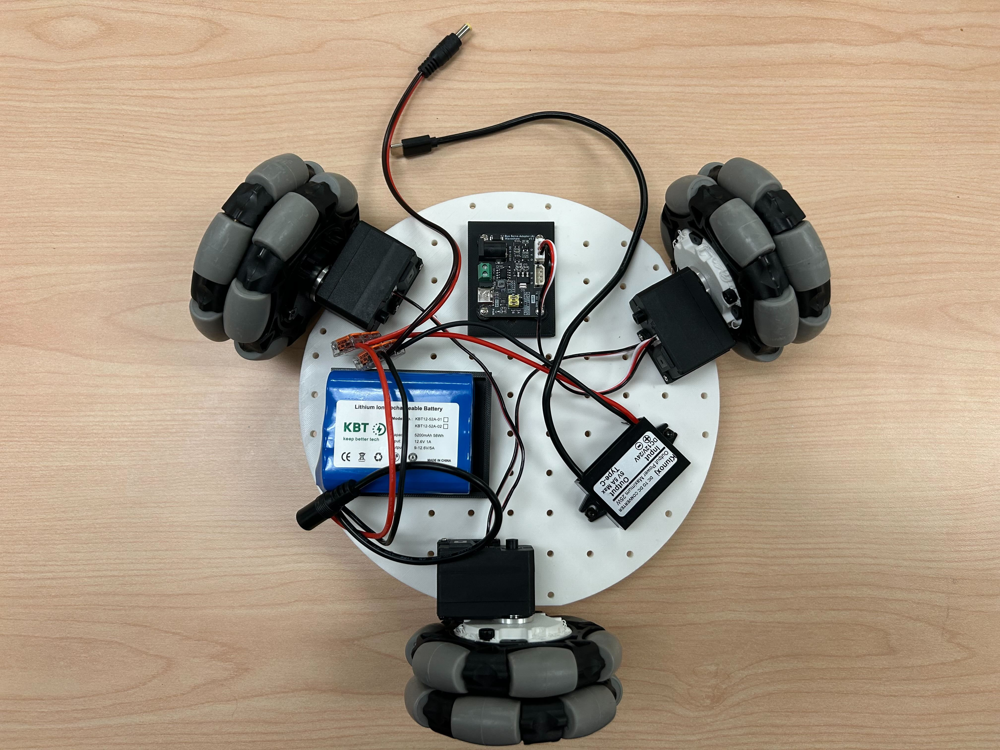

The cables can be connected as shown in the figure below:

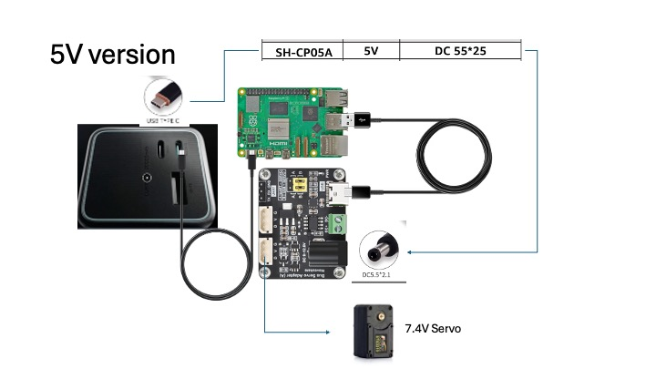

## 3. Top Plate Assembly

1. Place the Raspberry Pi 5 into the bottom of the Raspberry Pi case, then snap on the top of the case.

2. Use two M3x16 hex screws and two M3 nuts to fasten the Raspberry Pi to the top base plate, and use four M4x25 machine screws and four M4 nuts to install the SO-101 robot arm base.

## 4.

1. Route the servo driver board USB-C to USB-A cable, the 5V USB-C power cable, and the servo cables through the holes in the top plate.

2. Use 8 m3x16 machine screws and 4 m3 nuts to install the top plate onto the motor brackets.

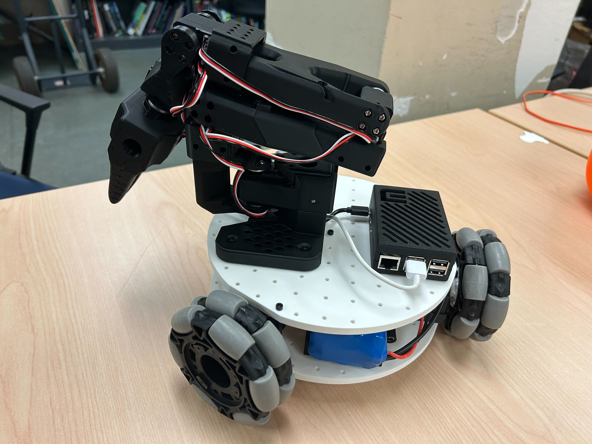

## 5. Installing the Cameras

*Note: the bracket we designed is tailored to the camera we selected. Different camera modules may require modifications.*

## (Option 1) Installing the Front-Facing Camera

①Use 4 m2\*5\*5 spacer screws to fasten the camera module

②Use 2 m3\*12 machine screws and 2 m3 nuts to install the front-facing camera bracket onto the base plate

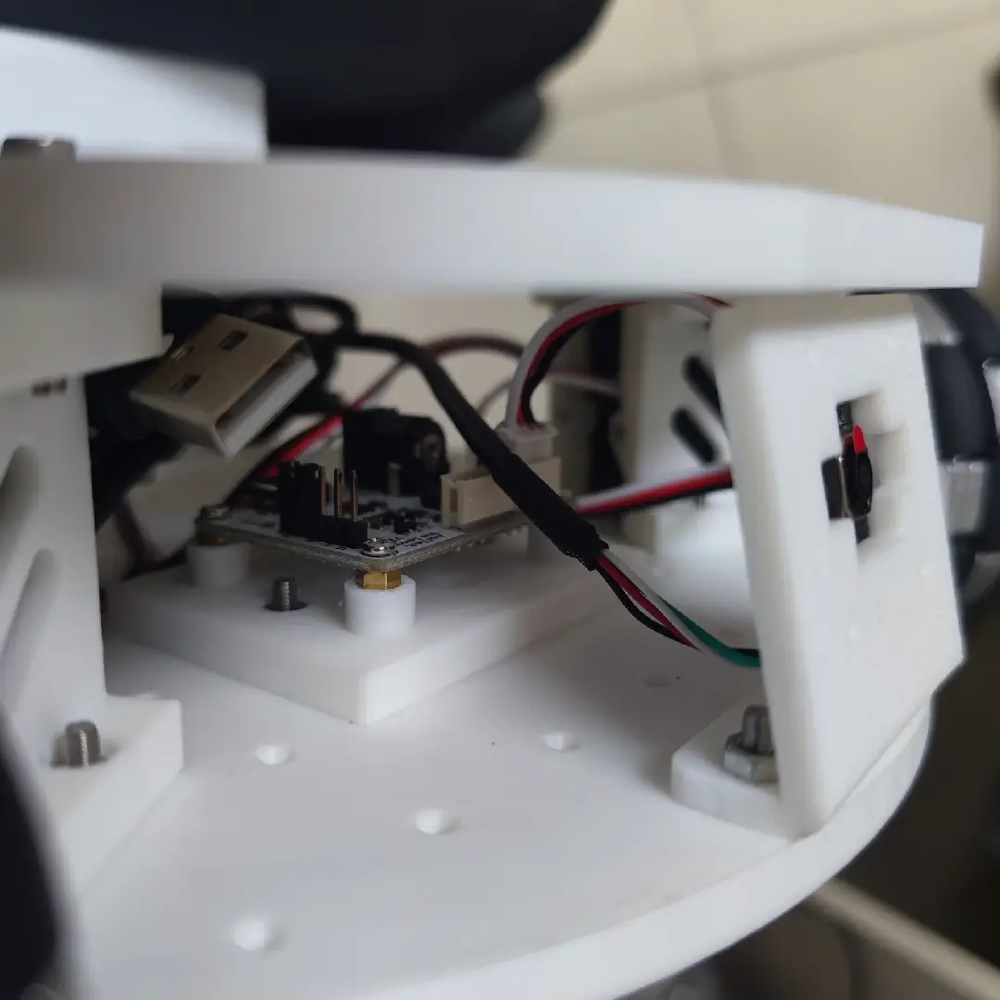
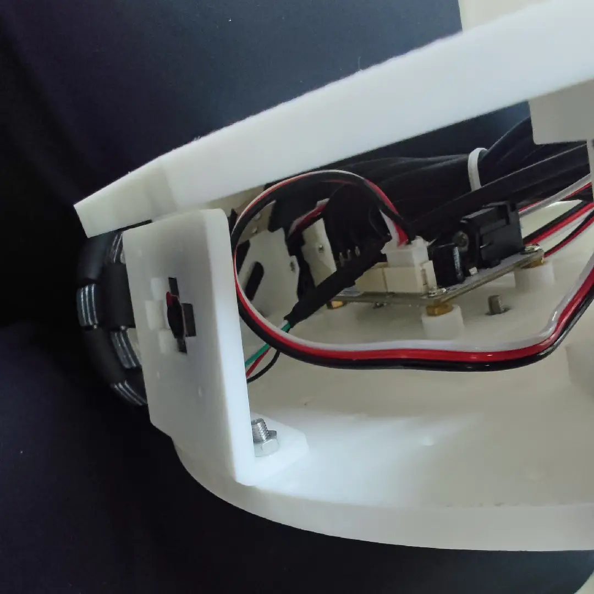

## (Option 2) Installing the Arm-Mounted Camera

Use 4 m2\*5\*5 spacer screws to fasten the camera module

This bracket supports cameras with a hole spacing of 24\*25mm or 28\*28mm

## 6. Plugging In Power and Wiring

Plug the DC barrel plug adapter into the **servo driver board**;

Plug the 5V USB-C connector into the **Raspberry Pi 5** to power the electronics;

The USB data cables for the servo driver board and the cameras can be plugged directly into the Raspberry Pi.

