# Lekiwi Tutorial

> **[Buy in Store](https://www.juxitech.com/products/lekiwi-embodied-intelligence-mobile-robotic-car)**

The black leader arm uses a 5V 6A power adapter, and the white follower arm uses a 12V 5A power adapter.

[lerobot-Lekiwi.zip](/downloads/lerobot-Lekiwi.zip)

The code in this tutorial repository is kept at the tested, stable version of LeRobot from before October 1, 2026. Hugging Face has since carried out a very large upgrade to LeRobot, adding a great many new features. If you want to try the latest tutorial, follow the [official documentation](https://huggingface.co/docs/lerobot/lekiwi).


[Lekiwi](https://github.com/SIGRobotics-UIUC/LeKiwi) is a fully open-source robot car project initiated by [SIGRobotics-UIUC](https://github.com/SIGRobotics-UIUC). It includes detailed 3D-printing files and operating instructions, and is designed to be compatible with the [LeRobot](https://github.com/huggingface/lerobot/tree/main) imitation-learning framework. It supports the SO101 robot arm, enabling a complete imitation-learning workflow.

[*In Fusion360 online CAD*](https://a360.co/4k1P8yO)* you can visualize exact component positions.*

[URDF file](https://gitcode.com/gh_mirrors/le/LeKiwi/tree/main)

Online URDF preview https://urdf.d-robotics.cc/

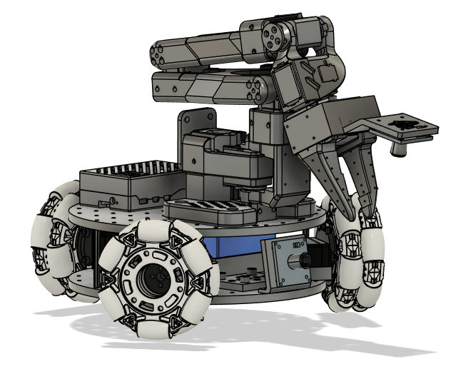

## Key Features

1. **Open source and low cost**: [Lekiwi](https://github.com/SIGRobotics-UIUC/LeKiwi) provides an open-source, low-cost robot car solution.
2. **LeRobot integration**: Designed for integration with the [LeRobot platform](https://github.com/huggingface/lerobot).
3. **Rich learning resources**: Comprehensive open-source learning resources, including assembly and calibration guides plus tutorials for testing, data collection, training, and deployment, helping users get started quickly and build robot applications.
4. **Nvidia compatible**: Can be used with the reComputer Mini J4012 Orin NX 16 GB.
5. **Multi-scenario applications**: Suitable for education, scientific research, automated production, and robotics, helping users achieve efficient, precise robot operation across a variety of complex tasks.

JUXI is responsible only for the quality of the hardware itself. This tutorial is updated strictly in line with the official documentation. If you run into software or environment-dependency problems that you truly cannot resolve, please report them promptly to the [LeRobot platform](https://github.com/huggingface/lerobot) or the [LeRobot Discord channel](https://discord.gg/8TnwDdjFGU).

**Note**
- All servos in the Lekiwi chassis require a 12V power supply. For users with a 5V robot arm, we provide a 12V-to-5V step-down converter module. Note that you will need to modify the wiring yourself.
- 12V power supply – you can select this option at checkout if needed. If you already have a 12V power supply, you just need to convert its power output connector to a 5521 DC plug.
- Raspberry Pi controller and cameras – these must be purchased separately through the order page.

## Bill of Materials (BOM)


## Initial System Environment

**For Ubuntu x86:**

- Ubuntu 22.04
- CUDA 12+
- Python 3.10
- Torch 2.6

**For Jetson Orin:**

- Jetson JetPack 6.0
- Python 3.10
- Torch 2.3+

**For Raspberry Pi:**

- Raspberry Pi 5, 4G\~16G

### Setting Up SSH

After setting up the Raspberry Pi, you should enable and configure [SSH](https://www.raspberrypi.com/news/coding-on-raspberry-pi-remotely-with-visual-studio-code/) (Secure Shell) so that you can log in to the Raspberry Pi from your laptop without connecting a screen, keyboard, and mouse to the Pi. You can find a great tutorial [here](https://www.raspberrypi.com/documentation/computers/remote-access.html#ssh). You can log in to the Raspberry Pi through the command prompt (cmd), or if you use VSCode, you can use [this](https://marketplace.visualstudio.com/items?itemName=ms-vscode-remote.remote-ssh) extension.

## 3D Printing Guide

### Parts

We provide printable STL files for the following 3D-printed parts. These parts can be printed on consumer-grade FDM printers using general-purpose PLA filament. We tested them on a Bambu Lab P1S printer. For every component, we simply load it into Bambu Studio, let it auto-rotate and arrange, enable any recommended supports, and print.


### Print Settings

The provided STL files can be printed directly on many FDM printers. Below are the tested and recommended settings; other settings may also work.

- Material: PLA+
- Nozzle diameter and precision: 0.2mm nozzle diameter, 0.2mm layer height
- Infill density: 15%
- Print speed: 150 mm/s
- If needed, upload the G-code (sliced file) to the printer and print

## A. Installing LeRobot on the Raspberry Pi

On your Raspberry Pi:

### 1. [Install Miniconda](https://docs.anaconda.com/miniconda/install/#quick-command-line-install):

```Python
mkdir -p ~/miniconda3
wget https://repo.anaconda.com/miniconda/Miniconda3-latest-Linux-aarch64.sh -O ~/miniconda3/miniconda.sh
bash ~/miniconda3/miniconda.sh -b -u -p ~/miniconda3
rm ~/miniconda3/miniconda.sh
```

### 2. Restart the Shell

Copy and paste the following command into your shell: `source ~/.bashrc`, or for Mac users: `source ~/.bash_profile` or `source ~/.zshrc` (if you use zshell).

### 3. Create and activate a new Conda environment for LeRobot

```Python
conda create -y -n lerobot python=3.10
```

Then activate your Conda environment (you need to do this every time you open a shell to use LeRobot!):

```Bash
conda activate lerobot
```

### 4. Clone LeRobot:

```Bash
git clone https://github.com/huggingface/lerobot.git ~/lerobot
```

### 5. Install ffmpeg in your environment:

When using `miniconda`, install `ffmpeg` in your environment:

```PowerShell
conda install ffmpeg -c conda-forge
```

This usually installs ffmpeg 7.X built with the libsvtav1 encoder for your platform. If libsvtav1 is not supported (you can check the supported encoders with `ffmpeg -encoders`), you can:
[For all platforms] Explicitly install ffmpeg 7.X:
`conda install ffmpeg=7.1.1 -c conda-forge`
[Linux only] Install ffmpeg's build dependencies and compile ffmpeg with libsvtav1 support from source, and make sure the ffmpeg executable in use is the right one, which you can confirm with `which ffmpeg`.
If you run into the error below, the commands above can also fix it.


### 6. Install LeRobot with the feetech motor dependency:

```Bash
cd ~/lerobot && pip install --no-binary=av -e ".[feetech]"
pip install -e ".[lekiwi]"
```

### 7. Set the connection time

Find config_lekiwi.py in the `lerobot\src\lerobot\robots\lekiwi` directory.

 connection_time_s: int = 7200 # i.e. 2 hours

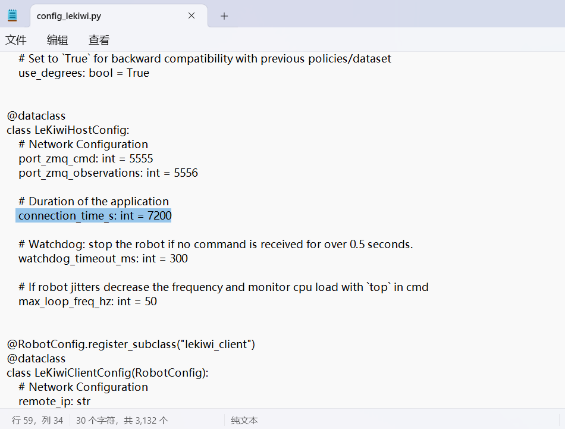

## B. Installing LeRobot on a Laptop

If you have already installed LeRobot on your laptop, you can skip this step; otherwise, follow the **same steps** we used on the Raspberry Pi.

> [!Tip] We will use the command prompt (cmd) frequently. If you are not familiar with cmd, or would like to review command-line usage, you can refer to this: [Command line crash course](https://developer.mozilla.org/en-US/docs/Learn_web_development/Getting_started/Environment_setup/Command_line)

On your computer:

### 1. [Install Miniconda](https://docs.anaconda.com/miniconda/install/#quick-command-line-install):

anaconda.com/download/success

Or click this link to download the installer directly

https://repo.anaconda.com/miniconda/Miniconda3-latest-Windows-x86_64.exe

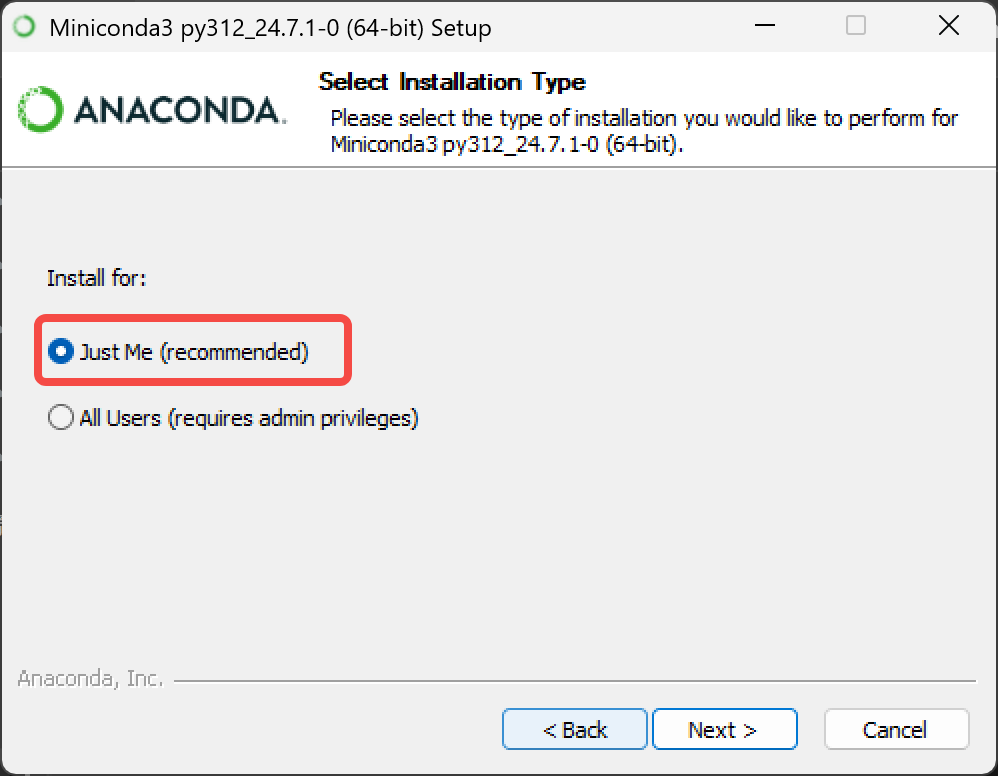
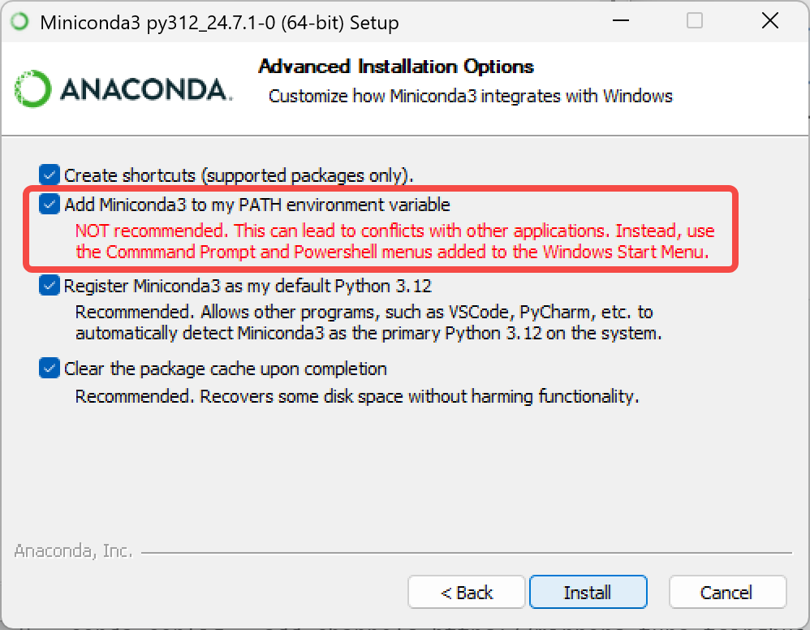

## Changing conda's package sources

```Shell
# First clear the existing source configuration (to avoid conflicts)
conda config --remove-key channels

# Replace conda's default sources and common third-party sources with the Tsinghua mirror
# Add the default package sources (main/r/msys2)
conda config --add channels https://mirrors.tuna.tsinghua.edu.cn/anaconda/pkgs/main/
conda config --add channels https://mirrors.tuna.tsinghua.edu.cn/anaconda/pkgs/r/
conda config --add channels https://mirrors.tuna.tsinghua.edu.cn/anaconda/pkgs/msys2/

# Add common third-party sources
conda config --add channels https://mirrors.tuna.tsinghua.edu.cn/anaconda/cloud/conda-forge/
conda config --add channels https://mirrors.tuna.tsinghua.edu.cn/anaconda/cloud/msys2/
conda config --add channels https://mirrors.tuna.tsinghua.edu.cn/anaconda/cloud/bioconda/
conda config --add channels https://mirrors.tuna.tsinghua.edu.cn/anaconda/cloud/menpo/
conda config --add channels https://mirrors.tuna.tsinghua.edu.cn/anaconda/cloud/pytorch/

# Show the download source, so installing packages displays the specific download URL
conda config --set show_channel_urls yes

# Clear the index cache so the new sources take effect
conda clean -i

# Show the current configuration (to verify the sources were added successfully)
conda config --show-sources
```

### 2. Restart the Shell

Copy and paste the following command into your shell: `source ~/.bashrc`, or for Mac users: `source ~/.bash_profile` or `source ~/.zshrc` (if you use zshell).

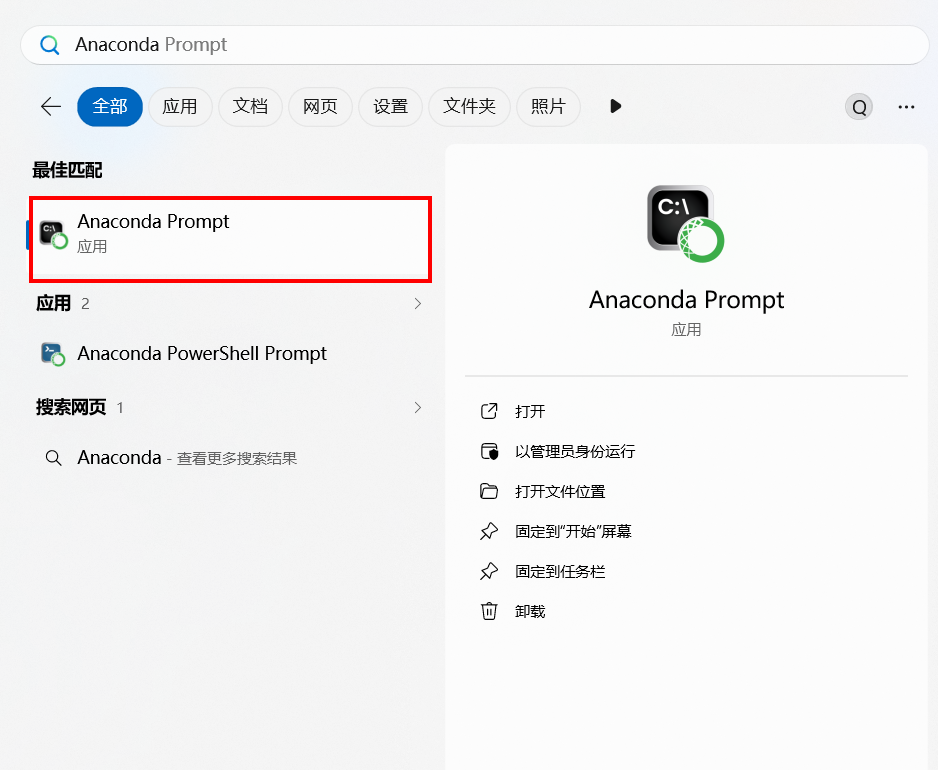

### 3. Create and activate a new Conda environment for LeRobot

```Bash
conda create -y -n lerobot python=3.10
```

Then activate your Conda environment (you need to do this every time you open a shell to use LeRobot!):

```Bash
conda activate lerobot
```

### 4. Clone LeRobot:

```Bash
git clone https://github.com/huggingface/lerobot.git ~/lerobot
```

### 5. Install ffmpeg in your environment:

When using `miniconda`, install `ffmpeg` in your environment:

```PowerShell
conda install ffmpeg -c conda-forge
```

This usually installs ffmpeg 7.X built with the libsvtav1 encoder for your platform. If libsvtav1 is not supported (you can check the supported encoders with `ffmpeg -encoders`), you can:
[For all platforms] Explicitly install ffmpeg 7.X:
`conda install ffmpeg=7.1.1 -c conda-forge`
[Linux only] Install ffmpeg's build dependencies and compile ffmpeg with libsvtav1 support from source, and make sure the ffmpeg executable in use is the right one, which you can confirm with `which ffmpeg`.
If you run into the error below, the commands above can also fix it.

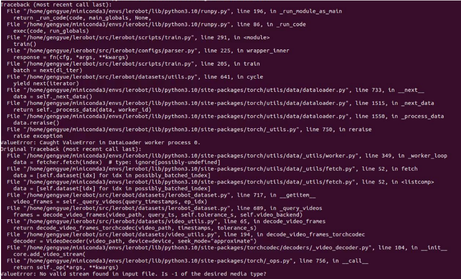

### 6. Install LeRobot with the feetech motor dependency:

```Bash
cd ~/lerobot && pip install --no-binary=av -e ".[feetech]"
pip install -e ".[lekiwi]"
```

## C. Configuring the Motors

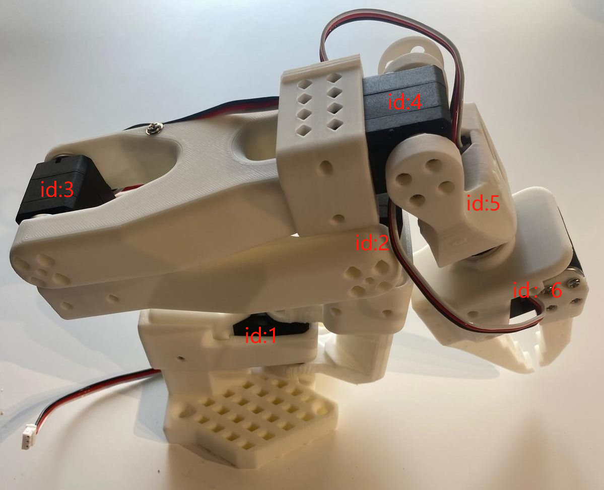
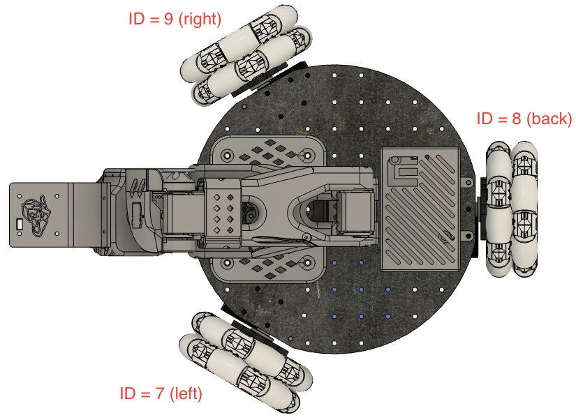

### **1. Find the USB port associated with the robot arm**

To find the correct port for an individual motor, run the following utility script twice:

```Bash
lerobot-find-port
```

Example output (for example, `/dev/tty.usbmodem575E0031751` on Mac, or possibly `/dev/ttyACM0` on Linux):

Example output (for example, `/dev/tty.usbmodem575E0032081` on Mac, or possibly `/dev/ttyACM1` on Linux):

Troubleshooting: On Linux, you may need to grant access to the USB port with the following commands:

```Bash
sudo chmod 666 /dev/ttyACM0
sudo chmod 666 /dev/ttyACM1
```

### **2. Configure your motors (skip this step for a finished unit)**

Plug in each motor of your chassis one at a time and run the following script. It first initializes the servos of the robot arm (ID 6..1), then initializes the chassis servos, setting their IDs to (ID 9..7). If you have already calibrated the robot arm, you can keep pressing Enter to overwrite and skip:

```Bash
lerobot-setup-motors \
    --robot.type=lekiwi \
    --robot.port=/dev/tty.usbmodem58760431551 # <- paste here the port found at previous step
```


### 3. Set up the Hugging Face China mirror

- Ubuntu

```Shell
sudo nano ~/.bashrc

# Add at the end of the file
export HF_ENDPOINT=https://hf-mirror.com
```

```Shell
source ~/.bashrc
echo $HF_ENDPOINT

# Output
# https://hf-mirror.com
```

- Mac

```Shell
sudo nano ~/.zshrc

# Add at the end of the file
export HF_ENDPOINT=https://hf-mirror.com
```

```Shell
source ~/.zshrc

# Output
# https://hf-mirror.com
```

#### ① Create a Token

https://huggingface.co/settings/tokens

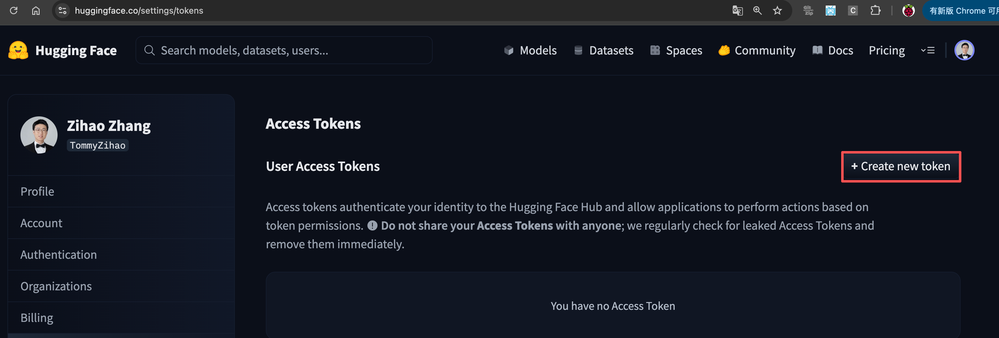

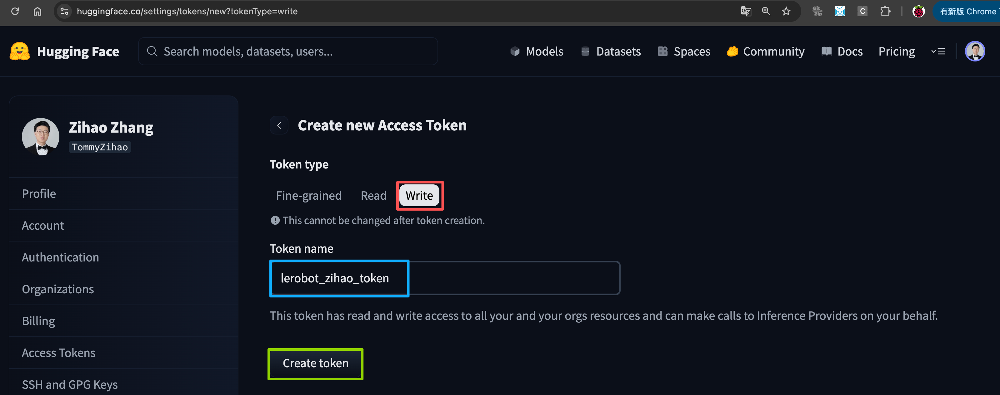

#### ② Record the Token

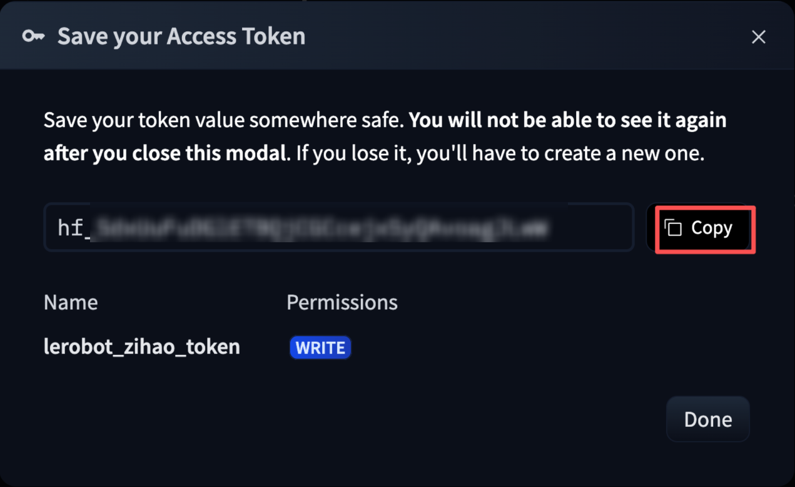

#### ③ Bind the Token

```Shell
hf auth login

hf auth whoami
```

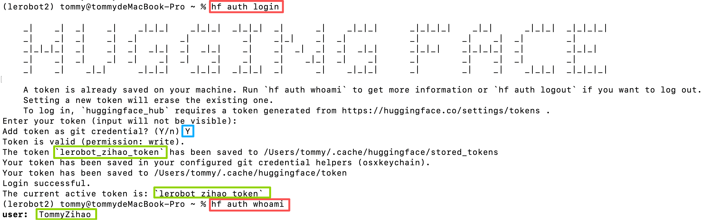

#### ④ Create a Dataset Repo

**Note down the Owner and Dateset name, i.e. the <hf_username> and <dateset_repo_id> you will need later**

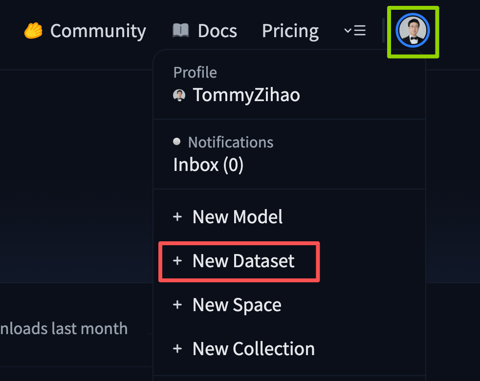


### 4. Update the configuration!!!

The configuration files on the LeKiwi LeRobot and on the laptop must stay consistent. First, we need to find the **IP address** of the Raspberry Pi that drives the mobile arm. This is the same IP address used for SSH. We also need to find the **USB port** of the leader arm's servo driver board on the laptop and the **port of the servo driver board on the LeKiwi**. You can find these ports with the following script.

On Linux, you may need to grant access to the USB port by running the following commands:

```Bash
sudo chmod 666 /dev/ttyACM0
sudo chmod 666 /dev/ttyACM1
```

Important: now that you have the leader arm's port and the IP address of the Lekiwi's arm, update the **ip** in the network configuration, the **port** in the leader arm configuration, and the **port, remote_ip** in the LeKiwi configuration.

Modify these four files in the example\lekiwi directory

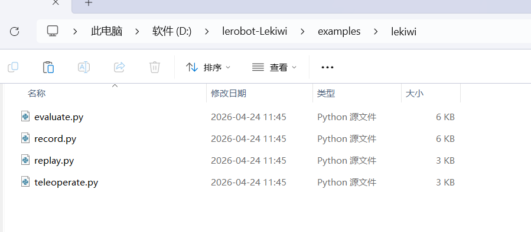

#### ① Modify teleoperate.py

remote_ip: the Raspberry Pi's IP address

port: the port number when the leader arm is connected to the computer or Linux


#### ② Modify record.py

HF_REPO_ID: [Hugging Face username and dataset name](https://juxitech.feishu.cn/wiki/A2orwQ9xzidMCjk10SVcAAWVnhd?fromScene=spaceOverview#share-TYrIdHmPPobd1mx9xB7c75WEn0d)

remote_ip: the Raspberry Pi's IP address

port: the port number when the leader arm is connected to the computer or Linux

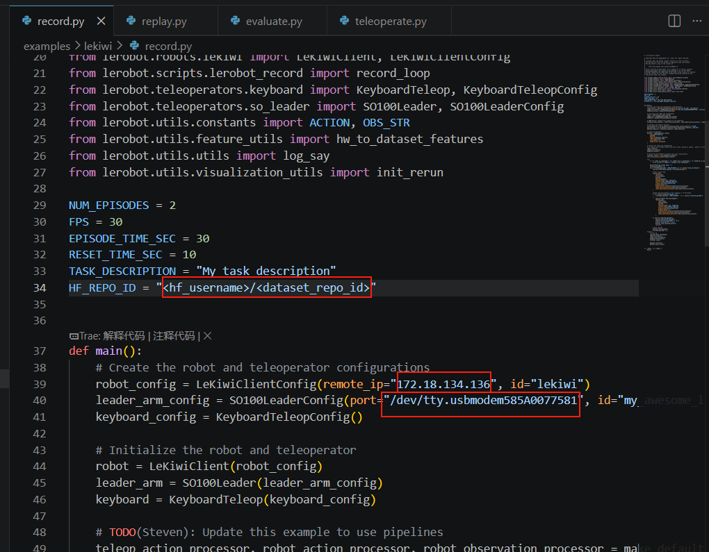

#### ③ Modify replay.py

remote_ip: the Raspberry Pi's IP address

<hf_username>/<dataset_repo_id>, i.e. the [Hugging Face username and dataset name](https://juxitech.feishu.cn/wiki/A2orwQ9xzidMCjk10SVcAAWVnhd?fromScene=spaceOverview#share-TYrIdHmPPobd1mx9xB7c75WEn0d)

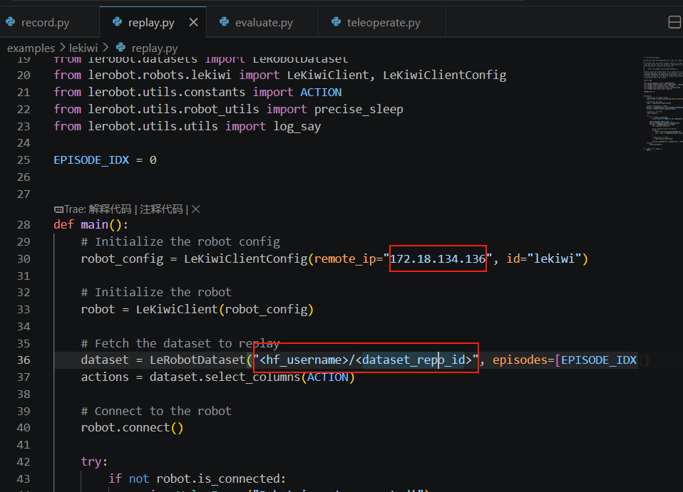

## D. Calibration

Now we need to calibrate the leader arm and the follower arm. The omni-wheel servos do not need calibration.

### Calibrating the follower arm (mounted on the Lekiwi base)

Run the following command on your computer to calibrate the leader arm. Note: the images shown here are examples for the SO101 model.

```Bash
lerobot-calibrate \
    --teleop.type=so100_leader \
    --teleop.port=/dev/tty.usbmodem58760431551 \ # change to the port you found
    --teleop.id=my_awesome_leader_arm
```

Now run the following command on your Raspberry Pi to calibrate the follower arm on the LeKiwi. Ignore its current position on the table — proper calibration should be done with it mounted on the Lekiwi chassis.

```Bash
lerobot-calibrate \
    --robot.type=lekiwi \
    --robot.id=my_awesome_kiwi
```

We have standardized the calibration method across most robots. First, we need to move the robot so that every joint is at the **middle of its range of motion**, then press the button. Second, we move all joints through their **full range of motion** once. You can find a video of the same calibration process for the SO101 [here](https://huggingface.co/docs/lerobot/en/so101#calibration-video) `Enter`.

## E. Teleoperation

Open a new Anaconda Prompt

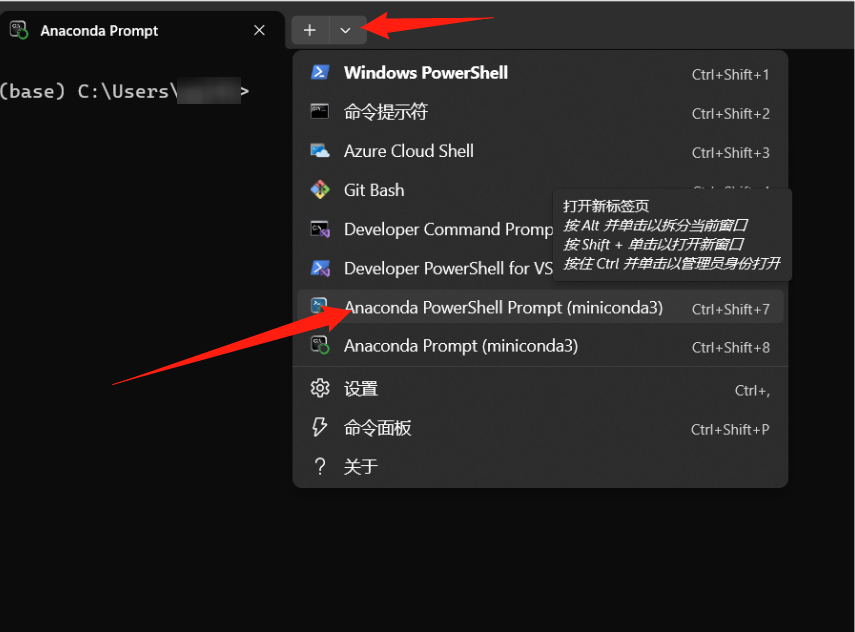

> If you are using a Mac, you may need to grant "Terminal" permission to access the keyboard for teleoperation. Go to "System Preferences" > "Security & Privacy" > "Input Monitoring" and check the "Terminal" checkbox.

To teleoperate, log in to your Raspberry Pi over SSH, run the following command to activate the environment `conda activate lerobot`, then run the following script:

```Bash
python -m lerobot.robots.lekiwi.lekiwi_host --robot.id=my_awesome_kiwi
```

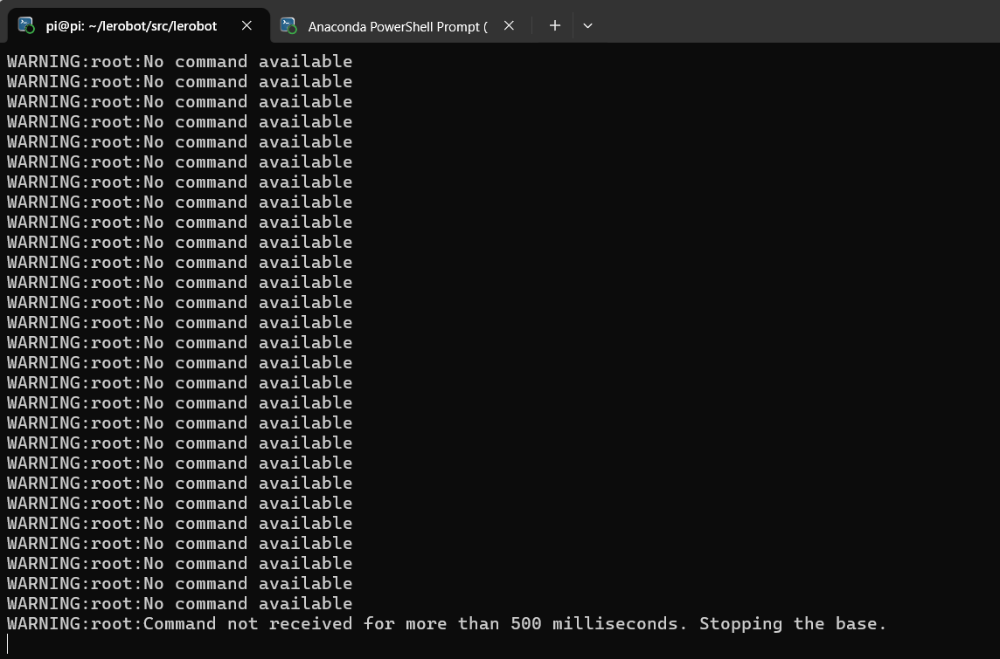

Next, on your laptop, also run the following command to activate the environment `conda activate lerobot`, then run the following script:

```Bash
python examples/lekiwi/teleoperate.py
```

Your laptop screen should display something like this: `[INFO] Connected to remote robot at tcp://172.17.133.91:5555 and video stream at tcp://172.17.133.91:5556.` Now you can move the control arm and use the (W, A, S, D) keys on the keyboard to drive the robot forward, left, backward, and right. Use the (Z, X) keys to turn the robot left or right. Use the (R, F) keys to increase or decrease the robot's speed. There are three speed modes; see the table below:


If you use a different keyboard, you can change the key binding for each command in [`LeKiWiClientConfig`](https://github.com/huggingface/lerobot/blob/main/src/lerobot/robots/lekiwi/config_lekiwi.py).

## Communication Troubleshooting

If you have trouble connecting the SO101 mobile robot, follow the steps below to diagnose and fix the problem.

### 1. Verify the IP address configuration

Make sure the correct Raspberry Pi IP address is set in the configuration file. To check the Raspberry Pi's IP address, run the following command (in the Pi's command line):

```Bash
hostname -I
```

### 2. Check whether the laptop/PC can reach the Pi

Try pinging the Raspberry Pi from the laptop:

```Bash
ping <your_pi_ip_address>
```

If the ping fails:

- Make sure the Pi is powered on and connected to the same network.
- Check whether SSH is enabled on the Pi.

### 3. Try an SSH connection

If you cannot log in to the Pi over SSH, the connection may be incorrect. Use the following command:

```Bash
ssh <your_pi_user_name>@<your_pi_ip_address>
```

For example `ssh pi@192.168.0.106`

If you get a connection error:

- Make sure SSH is enabled on the Pi; you can run the following command:

```Bash
sudo raspi-config
```

- Then navigate to: **Interfacing Options -> SSH** and enable it.

### 4. Configuration file consistency!!!

Make sure the configuration files on the laptop/PC and the Raspberry Pi are exactly the same.

## F. Recording a Dataset

Once you are comfortable with teleoperation, you can use the LeKiwi to record your first dataset.

To start the program on the LeKiwi, connect to your Raspberry Pi over SSH and run the following commands to activate the environment and start the script:

```Bash
conda activate lerobot

python -m lerobot.robots.lekiwi.lekiwi_host --robot.id=my_awesome_kiwi
```

If you want to use the Hugging Face Hub to upload datasets and have not logged in before, make sure to log in with a write-access token, which you can generate in [Hugging Face settings](https://huggingface.co/settings/tokens):

```Bash
hf auth login
```

Store your Hugging Face repository name in a variable to run the following command:

```Bash
hf auth whoami
```

Then run the following command on your laptop to record 2 episodes and upload the dataset to the Hub:

```Bash
python examples/lekiwi/record.py
```

## G. Visualizing a Dataset

If you uploaded the dataset, you can [visualize your dataset online](https://huggingface.co/spaces/lerobot/visualize_dataset); copy and paste the repository ID produced by the following command:

```Bash
echo ${HF_USER}/my_lekiwi_dataset
```

If you did not upload the dataset, you can also visualize it locally (the visualization tool opens in a browser window at `http://127.0.0.1:9090`):

```Bash
python lerobot/scripts/visualize_dataset_html.py \
  --repo-id ${HF_USER}/lekiwi_test \
  --local-files-only 1
```

### Visualize a dataset (optional, worth trying)

```Bash
echo ${HF_USER}/my_lekiwi_dataset
```

If you uploaded the dataset, you can also visualize it locally with the following command:

```Python
lerobot-dataset-viz \
  --repo-id ${HF_USER}/my_lekiwi_dataset \
```

If you did not upload the dataset, you can also visualize it locally with the following command:

```Python
lerobot-dataset-viz \
  --repo-id juxi/my_lekiwi_dataset \
```

Here, `juxi` is a custom `repo_id` name set during data collection.


#### Data Collection Tips

Once you are comfortable with data recording, you can create larger datasets for training. A good starting task is to pick up objects from different positions and place them into a container. We recommend recording at least 50 episodes, 10 per position. Keep the camera position fixed and keep the grasping motion consistent throughout the recording. Also, make sure the objects you are manipulating are clearly visible in the camera frame. A simple rule of thumb: you should be able to complete the task just by watching the camera feed.

In the following sections, you will train your neural network. Once you achieve reliable grasping performance, you can start introducing more variation into the data collection, such as adding grasp positions, using different grasping techniques, and changing the camera positions.

Avoid adding too much variation too quickly, as it may hurt your results.

If you want to dig deeper into this important topic, check out our [blog post on what makes a good dataset.](https://huggingface.co/blog/lerobot-datasets#what-makes-a-good-dataset)

#### Troubleshooting:

On Linux, if the left/right arrow keys and the Esc key do not work during data recording, make sure the `$DISPLAY` environment variable is set. See [pynput's limitations](https://pynput.readthedocs.io/en/latest/limitations.html#linux)

## H. Replaying an Episode

Now try replaying the first episode on your robot:

```Bash
python examples/lekiwi/replay.py
```

Congratulations 🎉 — your robot is ready to learn tasks on its own. Follow the training section of this tutorial to start training it: [Getting started with real-world robots](https://huggingface.co/docs/lerobot/il_robots)

## I. Evaluating Your Policy

Make sure to change remote_ip, port, HF_MODEL_ID

### Modify evaluate.py

HF_MODEL_ID="<hf_username>/<model_repo_id>" change this to the name of the dataset uploaded to Hugging Face after training (if you uploaded it to Hugging Face), or to the local directory where the model was exported after training

HF_DATASET_ID="<hf_username>/<eval_dataset_id>" change this to the username you created and the eval_ dataset name

remote_ip: the Raspberry Pi IP address

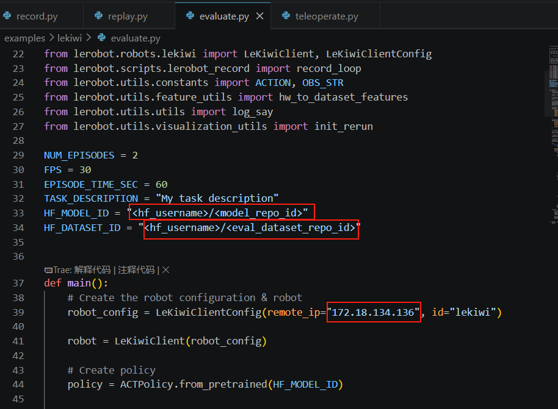

Then run the following command:

```Bash
python examples/lekiwi/evaluate.py
```

1. The dataset name starts with `eval` to reflect that you are running inference (e.g. `${HF_USER}/eval_act_lekiwi_test`).
2. If during evaluation you encounter `File exists: 'home/xxxx/.cache/huggingface/lerobot/xxxxx/juxi/eval_xxxx'`, first delete the folder whose name starts with `eval_` and run the program again.


For simulation training, see

https://github.com/Ekumen-OS/lekiwi/tree/main

https://github.com/SIGRobotics-UIUC/LeKiwi-sim


## Help 🙋‍

For hardware issues, contact customer service. For usage questions, join Discord.

[LeRobot platform](https://github.com/huggingface/lerobot)

[LeRobot Discord channel](https://discord.gg/8TnwDdjFGU)

##   
  
Installing Miniconda on a Mac

## Granting permissions


## Install Miniconda

https://www.anaconda.com/download

## Changing pip's package source

```Shell
pip config set global.index-url https://mirrors.aliyun.com/pypi/simple
```

## Changing conda's package source

```Shell
# Clear the existing .condarc configuration (optional, to avoid conflicts)
echo "" > ~/.condarc

# Write the Tsinghua mirror configuration
cat << EOF > ~/.condarc
channels:
  - defaults
show_channel_urls: true
default_channels:
  - https://mirrors.tuna.tsinghua.edu.cn/anaconda/pkgs/main
  - https://mirrors.tuna.tsinghua.edu.cn/anaconda/pkgs/r
  - https://mirrors.tuna.tsinghua.edu.cn/anaconda/pkgs/msys2
custom_channels:
  conda-forge: https://mirrors.tuna.tsinghua.edu.cn/anaconda/cloud
  msys2: https://mirrors.tuna.tsinghua.edu.cn/anaconda/cloud
  bioconda: https://mirrors.tuna.tsinghua.edu.cn/anaconda/cloud
  menpo: https://mirrors.tuna.tsinghua.edu.cn/anaconda/cloud
  pytorch: https://mirrors.tuna.tsinghua.edu.cn/anaconda/cloud
  pytorch-lts: https://mirrors.tuna.tsinghua.edu.cn/anaconda/cloud
  simpleitk: https://mirrors.tuna.tsinghua.edu.cn/anaconda/cloud
EOF

# Clear the cache to apply the configuration
conda clean -i
```

<RelatedProducts slugs="lekiwi,so-arm101,servo-driver-board" />

