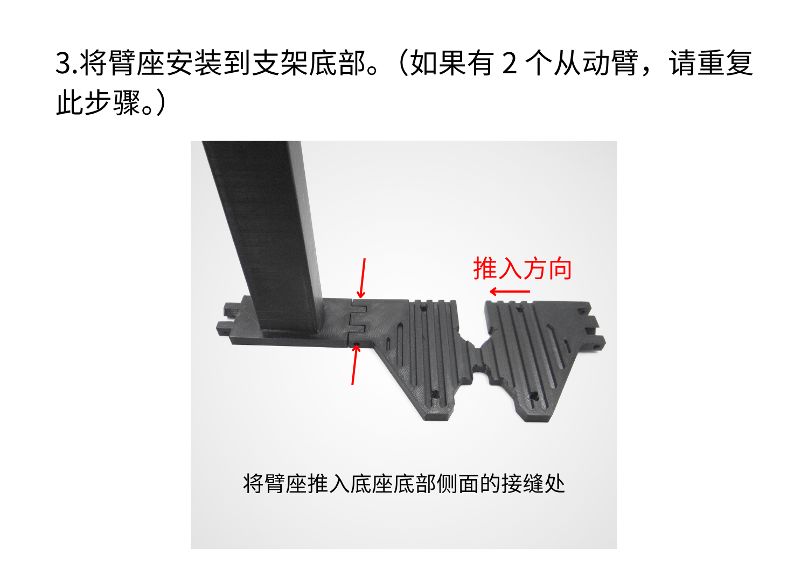
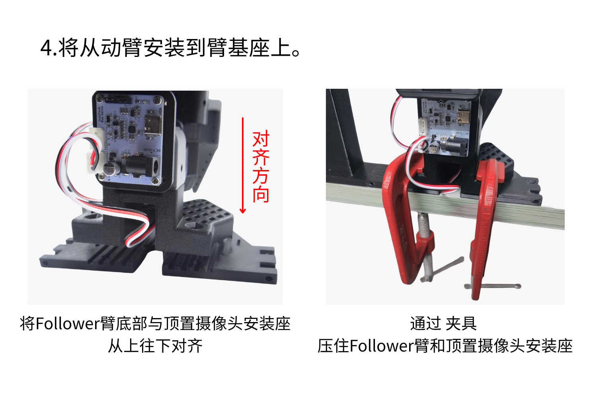

# Overhead Camera Mount Installation

> **[Buy in Store](https://www.juxitech.com/products/overhead-camera-mount-for-so-arm100-so-arm101-realsense-compatible)**

Please refer to this tutorial for debugging the USB auto-docking camera[USB Auto-Focus Camera Tutorial](https://juxitech.feishu.cn/wiki/EangwaLy2ig8oGkqHsFc83tznuc)

Users who purchase the D405C Depth Camera Kit can inquire about the \<a i=1\>RealSense D405C Tutorial password  by sending the order number via Taobao customer service \</a\>

Requires[Official Model File](https://github.com/TheRobotStudio/SO-ARM100/tree/main/Optional/Overhead_Cam_Mount_Webcam)

