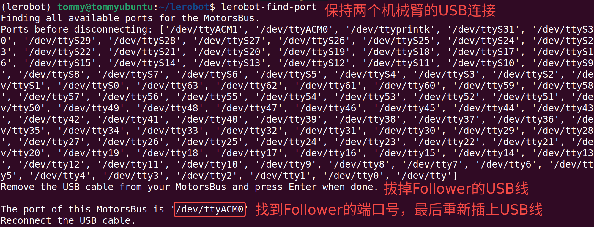

# Step 2: Serial Port Check (Ubuntu)

## Method 1: Check directly from the Linux command line

### View the serial device port

```Shell
ls /dev/ttyACM*
```

### Connect the USB ports of the computer and the robot arm

First plug in the Follower arm, then plug in the Leader arm


## Method 2: LeRobot official tool

```Shell
lerobot-find-port
```




## Record my ports

`/dev/ttyACM0` is the serial device port of the Follower arm

`/dev/ttyACM1` is the serial device port of the Leader arm

## Grant permissions to the port

Grant all users read/write permission for these serial devices

```Shell
sudo chmod 666 /dev/ttyACM*
```

<RelatedProducts slugs="so-arm101" />
