# Jetson: AGNSS Positioning

**1. Learning Objectives**

In this lesson, we will mainly learn to use Jetson Orin, a GPS module, and an AGNSS server to implement position information reading and parsing under weak signals.

**2. AGNSS Description**

2.1. **Why Use AGNSS**

• The conditions for an autonomous GNSS receiver to determine a position include:

- Acquiring and tracking satellite signals, and parsing time

- Obtaining the navigation message from satellites

• In a strong-signal environment, an autonomous GNSS receiver can achieve a cold-start fix in about 30 seconds; however, in a weak-signal environment, a receiver without external assistance acquires satellites very slowly and has difficulty obtaining the navigation message from satellites, so it takes a long time to get a fix, or it may even be unable to obtain one.

• AGNSS can provide the receiver with the assistance information required for positioning, such as the navigation message, a coarse position, and time. Whether in a strong-signal or weak-signal environment, this information can significantly shorten the time to first fix.

2.2. **AGNSS Solution**

• The AGNSS server obtains and manages AGNSS assistance information from multiple GNSS data sources. The server constantly listens for and responds to AGNSS requests from clients (a username and password are required).

• Users obtain assistance information from the AGNSS server via the TCP/IP protocol, and the obtained assistance information can be transmitted directly to the GNSS receiver.

• Users can also set up their own proxy server.

 

2.3. **AGNSS Process**

• Connect to the AGNSS server

–The server address is 121.41.40.95 (domain name: www.gnss-aide.com)

–The port number is 2621

• Send an AGNSS request

–Request string: (the username and password fields are required)

–user=pm@juxi.com;pwd=juxi;cmd=full;gnss=gps+bd;lat=60.0;lon=55.0;alt=0;

• Obtain the AGNSS assistance information

• Send the AGNSS assistance information to the receiver

2.4. **AGNSS Request Parameters**

• The client sends a request to the AGNSS server; the format of the request string is as follows

–The request string is a combination of multiple key=value; groups, e.g.: key=value;key=value;

• Example: user=pm@juxi.com;pwd=juxi;cmd=full;gnss=gps+bd;lat=60.0;lon=55.0;alt=0;

• The specific definitions of key and value are as follows

| Keyword (Key) | Value (value) | Optionality | Remarks                                                         |
| ----------- | ----------- | ------ | ------------------------------------------------------------ |
| **user**    | String      | Required | Username. It is strongly recommended that the username be a valid email address; important AGNSS server maintenance information will be sent to that email address. |
| **pwd**     | String      | Required | User password                                                     |
| **gnss**    | String      | Optional | A comma-separated list of GNSS. Currently GPS is supported. Valid values are: gps,bds,glo"gnss=gps;" means requesting GPS assistance information; gnss=gps,bds;" means requesting GPS and BDS assistance information; |
| **cmd**     | String      | Optional | full: all information, including ephemeris, estimated time and positioneph: only ephemeris information is providedaid: assistance time, position, and other informationIf this item is not filled in, the default is full |
| **lat**     | Numeric     | Optional | Estimated value of the user's latitude. Unit of latitude: degrees. The value range is -90~90 degrees. There are two position assistance formats, the lat-lon-alt format and the ECEF format; choose one. A valid lat-lon-alt position assistance format is "lat=30;lon=120.3;alt=100;"; all three fields must be complete. |
| **lon**     | Numeric     | Optional | Estimated value of the user's longitude. Unit of longitude: degrees. The value range is -180~180 degrees. |
| **alt**     | Numeric     | Optional | Estimated value of the user's altitude. Unit: meters.                              |
| **x**       | Numeric     | Optional | Estimated value of the user's position (X,Y,Z in the ECEF coordinate system). Unit: meters. A valid ECEF position assistance format is "x=30000;y=1111120.3;z=3345100;"; all three fields must be complete. |
| **y**       | Numeric     | Optional | Estimated value of the user's position (X,Y,Z in the ECEF coordinate system). Unit: meters.           |
| **z**       | Numeric     | Optional | Estimated value of the user's position (X,Y,Z in the ECEF coordinate system). Unit: meters.           |
| **pacc**    | Numeric     | Optional | The accuracy of the user's position. Unit: meters.                                 |

2.5. **Information Returned by the Server**

 

• Example of the data returned by the AGNSS server: data header + assistance data content

• The binary data is the assistance data required by the GNSS receiver, and this binary data carries its own data checksum. For the binary data format, refer to ZKW's receiver protocol specification.

• If the data header is also sent to the GNSS receiver, it will not affect the GNSS receiver.

2.6. **AGNSS Performance Comparison**

• Compared with an ordinary standalone GNSS receiver, an AGNSS receiver shows a significant improvement in TTFF performance, especially under weak-signal conditions.

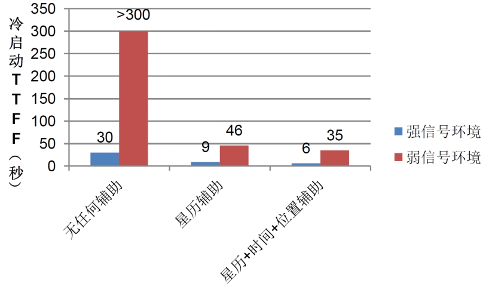 

2.7. **Precautions**

• The coarse position assistance needs to be obtained by the client through other means, such as

–GSM/GPRS/3G communication modules; these modules can all use the CELL ID method to obtain the current coarse position

–WiFi and other wireless modules, which can also provide coarse positioning

• The coarse position is required to be accurate to within 15km; an incorrect position assistance will affect the receiver's performance

• If the coarse position cannot be obtained, omit the position fields (lat,lon,alt,x,y,z) in the AGNSS request string, and the receiver will automatically select a valid position from the historical fixes

• There is no need to use the position output by the GNSS receiver itself as the coarse position

2.8. **When Is AGNSS Needed**

• There is no need to download from the server every time the device is powered on, saving data traffic

–The ZKW chip has a battery-backed SRAM and a permanent backup FLASH internally, both of which can automatically save the received ephemeris data and so on

–During normal operation, the chip continuously downloads the latest ephemeris data from the satellites

• By querying the receiver's status, decide whether AGNSS data needs to be downloaded from the server

–The receiver can output a navigation message status sentence (not output by default, only output after configuration)

2.9. **Introduction to the Navigation Message Status Sentence**

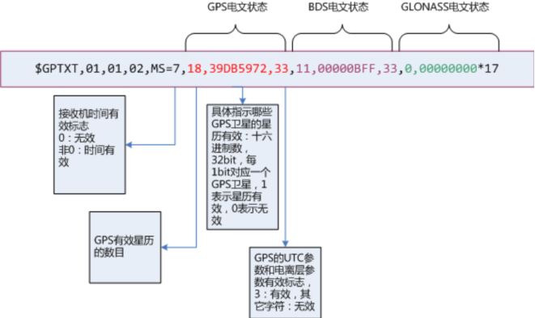 

 

• This sentence outputs the current internal time of the receiver + the navigation message status.

• You can send the command $PCAS03,,,,,,,,,,,1*1F to output the navigation message status sentence once per second

• You can send the command $PCAS03,,,,,,,,,,,0*1E to stop outputting the navigation message status sentence

• Note: Every sentence must be terminated by \r\n (0x0D,0x0A), and the sentence contains 11 commas

• If the time flag is valid (non-zero) and the number of valid ephemerides is large (greater than 8), there is no need to download the AGNSS ephemeris.

 

**3. Preparation**

**3.1. Wiring**

The GPS module uses UART communication or USB communication; here, USB communication is taken as an example.

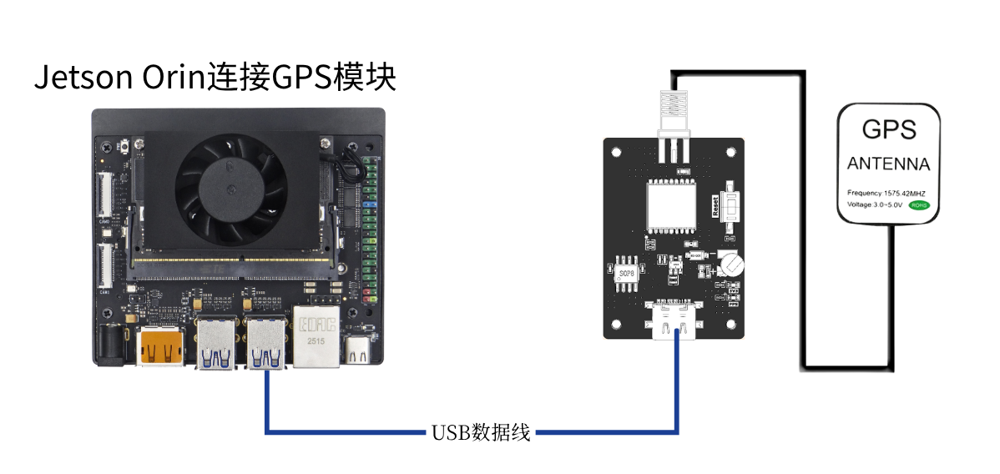

Use a type-c cable to connect the Jetson Orin and the GPS module, run the command ls /dev | grep 'ttyUSB' , and you can see that the GPS module is recognized as USB0

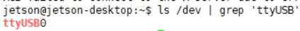 

**3.2. Apply for a Baidu Maps ak**

Please see the document [Baidu Maps API Application Tutorial](./Jetson-Baidu-Map-API.md)

 

**4. Program**

For the program in this lesson, please refer to: GPS-agnss.py

Initialize USB:

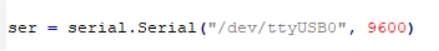 

The ak in the materials needs to be filled in with the ak value you applied for, and then you can obtain the current coarse latitude and longitude information through Baidu Maps

 

Here, the coarse latitude and longitude information obtained from Baidu Maps is sent to the server. The login account we use is the official Juxi account. After the acquisition is complete, the entire packet is sent to the module

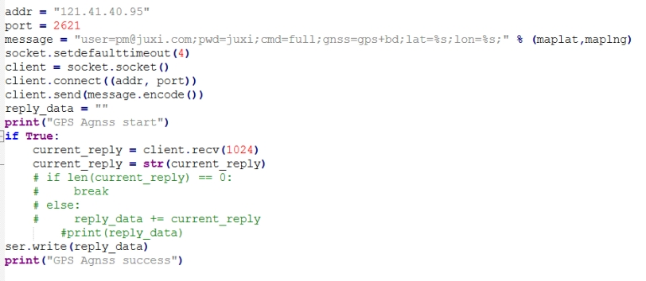 

 

Position information acquisition and parsing function. In the figure below, the position information starting with GNGGA is filtered out from the position information, and then the data is parsed and stored in various global variables.

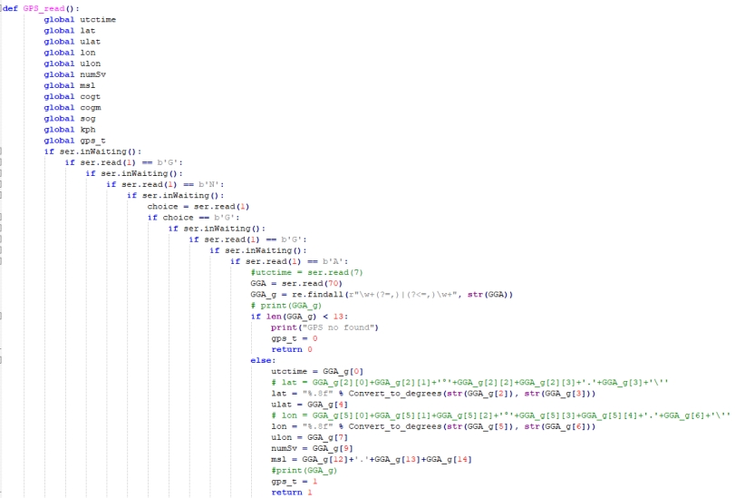 

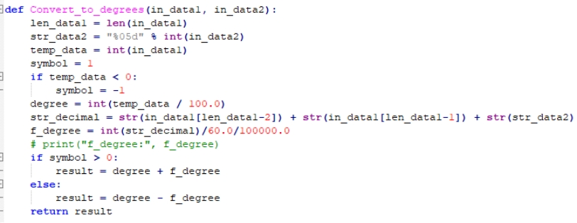 

In the same way, the GNVTG heading information is obtained and parsed.

 

The parsed data is printed in a loop

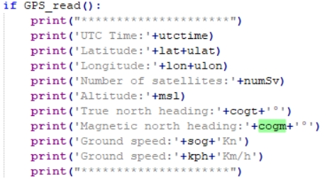 

**5.Run the Program**

Enter sudo python2 GPS-agnss.py in the terminal to run the program.

**6.Experimental Results**

**Note: Under assisted positioning, the Jetson Orin must be connected to the network.**

After the module is powered on under weak signals, it starts to initialize USB. If initialization succeeds, it displays "GPS Serial Opened! Baudrate=9600"; otherwise it displays "GPS Serial Open Failed!". If there is an error, check the wiring or the USB port.

Afterwards it displays "GPS Agnss start" and begins sending the assisted positioning information to the server; after sending is complete, it displays "GPS Agnss success"

If the GPS signal has not yet been read for a period of time after sending, it displays "GPS no found" at this point and prints the coarse latitude and longitude information read from Baidu Maps.

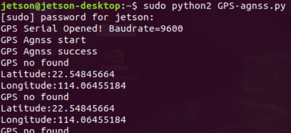 

After a period of time, once GPS is recognized, it will print the position and heading information in a loop.

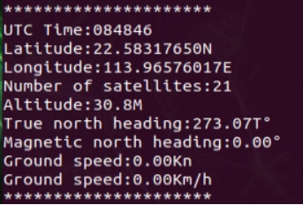 

Press Ctrl+C to exit information reading.

<RelatedProducts slugs="gps-beidou-module" />
