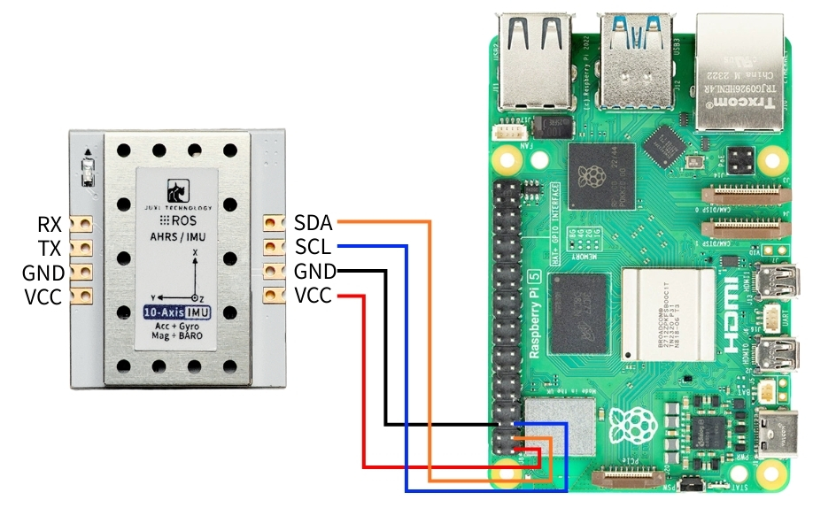
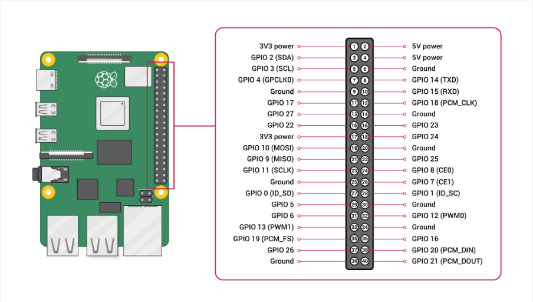
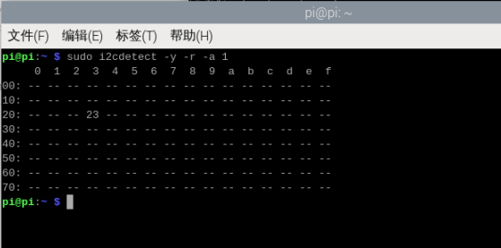
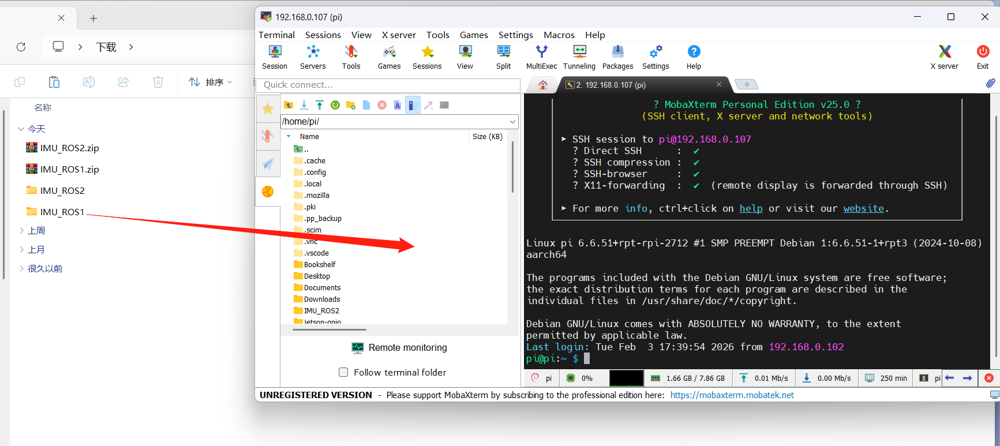
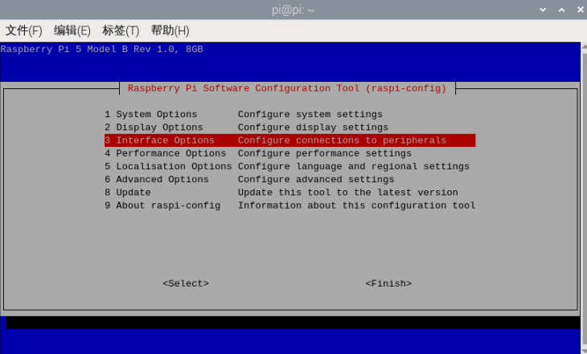
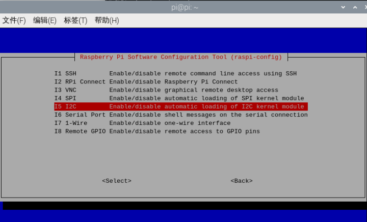
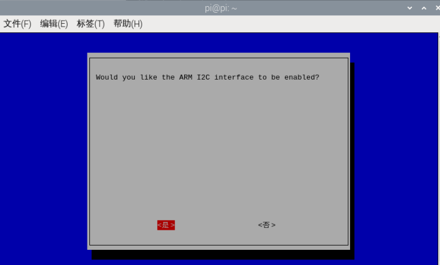
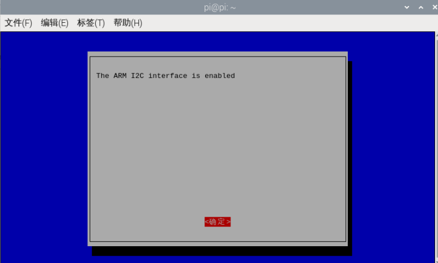
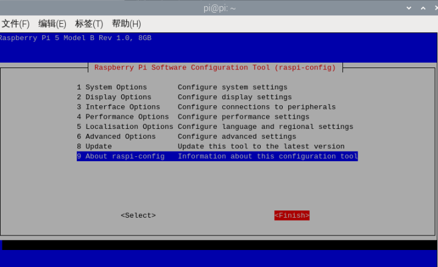

# Raspberry Pi

## 1. Connect the device

This tutorial takes the Raspberry Pi 5 motherboard and the official 64-bit version of the mirroring as an example. 

Connect the IMU attitude sensor to the I2C interface of Raspberry Pi 5 as shown in the figure below. 





## 2. Check device status

First, install I2Ctool, then enter the following in the terminal: 

```PowerShell
sudo apt-get update
sudo apt-get install -y i2c-tools
```

View I2C Devices 

```PowerShell
sudo i2cdetect -y -r -a 1
```



## 3. Install the driver library

3.1** Install the Python libraries required for the code **

```PowerShell
sudo apt update
sudo apt install -y python3-serial
sudo apt install -y python3-smbus2
```

3.2 Transfer Files

IMU_ROS2.zip

Friends who are not yet familiar with using MobaXterm to transfer files, please refer to the following webpage for detailed installation and operation methods of MobaXterm:[文件远程传输](https://juxitech.feishu.cn/wiki/KB0Jw2o6Wis9f0ksyeFceVmgnfd)

Drag the decompressed files onto Raspberry Pi 5 via MobaXterm software. 



## 4. View IMU data

**Enter the ~/IMU_Library directory and run the IMU_Serial_Library.py file **

```PowerShell
cd ~/imu_ros2/src/IMU_ROS1/IMU_Library

# 运行 IMU 数据打印文件
python3 -m IMU_Library.IMU_I2C_Library
```


Note: The above is the data reading for a 10-axis IMU. The 6-axis has no Magnetometer and Barometer data, and the 9-axis has no Barometer data.

## **5. IMU Calibration**

**Enter the ~/IMU_Library directory and run the imu_calibration_tool.py file **

```PowerShell
cd ~/IMU_Library

# 运行 IMU 校准代码文件 --I2C通讯校准
# 执行所有校准（整体、磁力计、温度）
python3 -m IMU_Library.imu_calibration_tool --mode i2c --port 1

# 仅整体校准
python3-m IMU_Library.imu_calibration_tool --mode i2c --port 1 --calibrate imu

# 仅磁力计校准
python3-m IMU_Library.imu_calibration_tool --mode i2c --port 1 --calibrate mag

# 仅温度校准
python3-m IMU_Library.imu_calibration_tool --mode i2c --port 1 --calibrate temp
```


## 6. Precautions

Raspberry Pi 5 needs to enable the i2c pin in advance. 

The opening operation is as follows: 

Terminal run command

```PowerShell
sudo raspi-config
```

Select using the arrow keys on the keyboard, and press the Enter key on the keyboard to enter after selection



Select I2C, and after selection, press the Enter key on the keyboard to enter.



After selecting I2C, press the Enter key on the keyboard, use the arrow keys to select Yes, and then press the Enter key to confirm. 



Press Enter to confirm



Press the arrow keys to select Finish, then press Enter to exit the configuration.




