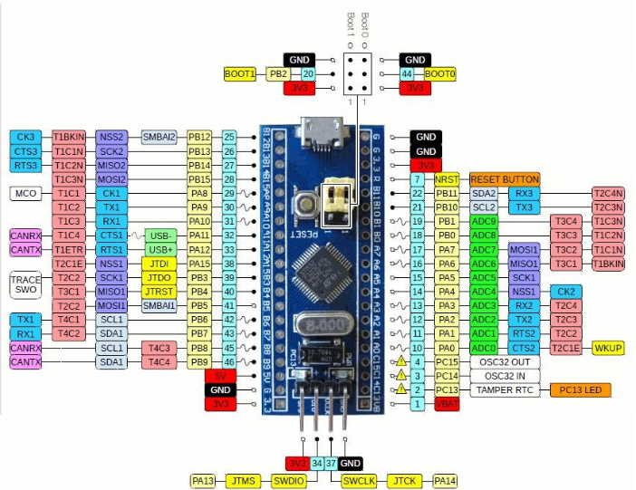

# STM32

This routine uses an STM32F103C8T6, a Windows computer, several DuPont wires, and an IMU attitude sensor. 

[STM32.zip](/downloads/STM32.zip)

Open I2C.uvprojx using Keil5 software and burn the program into the STM32F103C8T6 core board 

## 1. Connect the device




## 2. Key Code Analysis

Please refer to the source code in the materials for the specific code.

```C++
/**
 * @brief 通用读取传感器数据的辅助函数
 *        Generic helper function to read sensor data
 */
static int read_sensor_data(uint8_t reg, uint8_t *buffer, uint16_t length, float out[], uint8_t out_size, float scale_factor, bool is_float)
{
    if (read_register(reg, buffer, length) != 0) {
        return -1;
    }
    
    if (out != NULL) {
        if (is_float) {
            // Process floating-point data
            for (uint8_t i = 0; i < out_size; i++) {
                out[i] = to_float(&buffer[i * 4]);
            }
        } else {
            // Process integer data and apply the scaling factor
            for (uint8_t i = 0; i < out_size; i++) {
                out[i] = to_int16(&buffer[i * 2]) * scale_factor;
            }
        }
    }
    return 0;
}

/**
 * @brief 读取加速度数据（单位 g）
 *        Read acceleration in g.
 */
int IMU_I2C_ReadAccelerometer(float out[3])
{
    uint8_t register_data[6];
    return read_sensor_data(IMU_FUNC_RAW_ACCEL, register_data, 6, out, 3, ACCEL_SCALE_FACTOR, false);
}

/**
 * @brief 读取角速度（单位 rad/s）
 *        Read angular velocity in rad/s.
 */
int IMU_I2C_ReadGyroscope(float out[3])
{
    uint8_t register_data[6];
    return read_sensor_data(IMU_FUNC_RAW_GYRO, register_data, 6, out, 3, GYRO_SCALE_FACTOR, false);
}

/**
 * @brief 读取磁场强度（单位 uT）
 *        Read magnetic field strength in micro tesla.
 */
int IMU_I2C_ReadMagnetometer(float out[3])
{
    uint8_t register_data[6];
    return read_sensor_data(IMU_FUNC_RAW_MAG, register_data, 6, out, 3, MAG_SCALE_FACTOR, false);
}

/**
 * @brief 读取四元数
 *        Read quaternion (w, x, y, z).
 */
int IMU_I2C_ReadQuaternion(float out[4])
{
    uint8_t register_data[16];
    return read_sensor_data(IMU_FUNC_QUAT, register_data, 16, out, 4, 1.0f, true);
}

/**
 * @brief 读取欧拉角（弧度）
 *        Read Euler angles (rad).
 */
int IMU_I2C_ReadEuler(float out[3])
{
    uint8_t register_data[12];
    int result = read_sensor_data(IMU_FUNC_EULER, register_data, 12, out, 3, 1.0f, true);
    
    // Convert to degrees
    if (result == 0 && out != NULL) {
        out[0] *= RAD2DEG;
        out[1] *= RAD2DEG;
        out[2] *= RAD2DEG;
    }
    
    return result;
}
/**
 * @brief 读取气压相关数据：高度、温度、气压、气压差
 *        Read barometric data: height, temperature, pressure, delta.
 */
int IMU_I2C_ReadBarometer(float out[4])
{
    uint8_t register_data[16];
    if (read_register(IMU_FUNC_BARO, register_data, 16) != 0) {
        return -1;
    }
    if (out != NULL) {
        out[0] = to_float(&register_data[0]);
        out[1] = to_float(&register_data[4]);
        out[2] = to_float(&register_data[8]);
        out[3] = to_float(&register_data[12]);
    }
    return 0;
}

```

read_sensor_data(): A generic helper function for reading sensor data

IMU_I2C_ReadAccelerometer(): Read acceleration data (unit: g)

IMU_I2C_ReadGyroscope(): Read angular velocity (unit: rad/s)

IMU_I2C_ReadQuaternion(): Read Quaternion

IMU_I2C_ReadEuler(): Read Euler angles (radians)

IMU_I2C_ReadBarometer(): Read barometer-related data: altitude, temperature, barometric pressure, and pressure difference

## 3. Read IMU data

After the program is downloaded into the STM32, open the serial port assistant (with configuration parameters as shown in the figure below), and you can see that the data of the IMU module is continuously printed. When we change the attitude of the IMU module, the data will change. 


Note: The above is the data reading for a 10-axis IMU. The 6-axis has no Magnetometer and Barometer data, and the 9-axis has no Barometer data.

