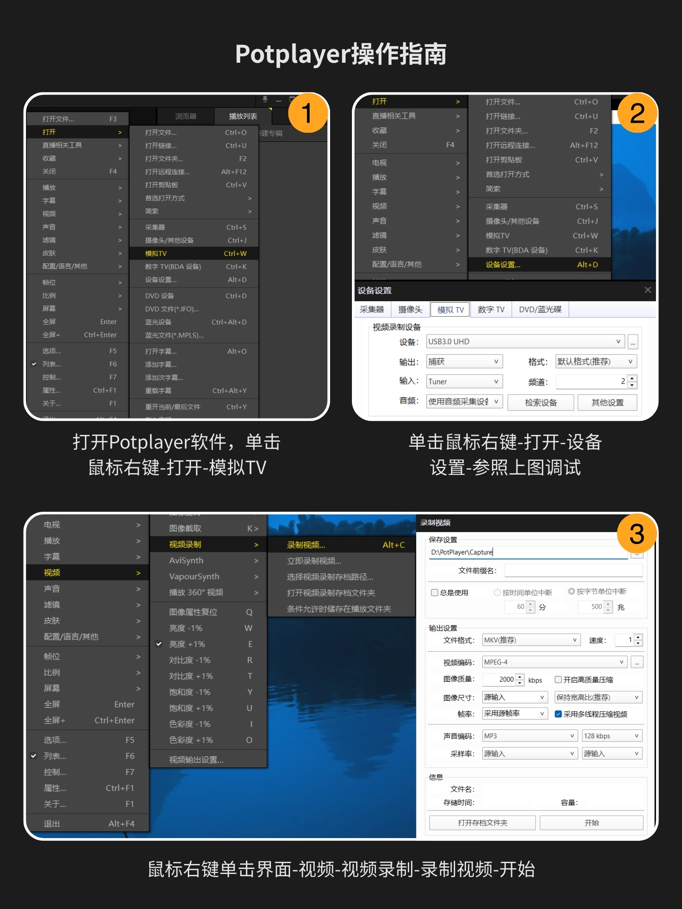

# 4K HDMI 采集器

> **[ 淘宝店铺 ](https://juxitechnology.taobao.com)**

## 接线操作

根据主板的接口分以下三种接线操作

**HDMI接口**——&gt;HDMI线——&gt;采集器的HDMI接口——&gt; USB/Type-C ——&gt;笔记本、电脑、一体机、手机/平板等显示器

**Micro HAMI接口**——&gt;Micro转HDMI转接头——&gt;HDMI线——&gt;采集器的HDMI接口——&gt; USB/Type-C ——&gt;笔记本、电脑、一体机、手机/平板等显示器

**DP接口**——&gt;DP转HDMI转接头——&gt;HDMI线——&gt;采集器的HDMI接口——&gt; USB/Type-C ——&gt;笔记本、电脑、一体机、手机/平板等显示器

## OBS操作指南

## **Potplayer操作指南**

