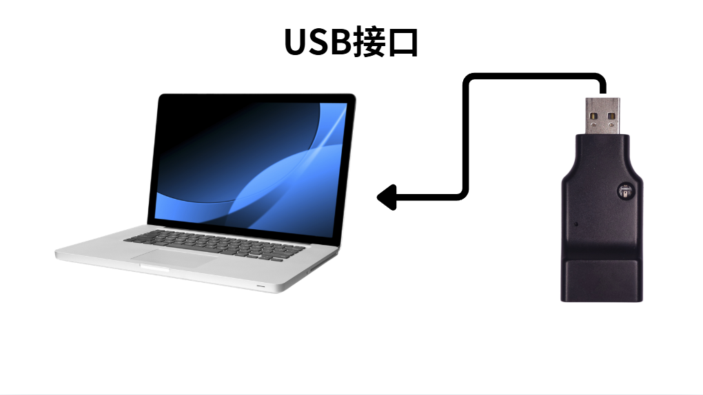
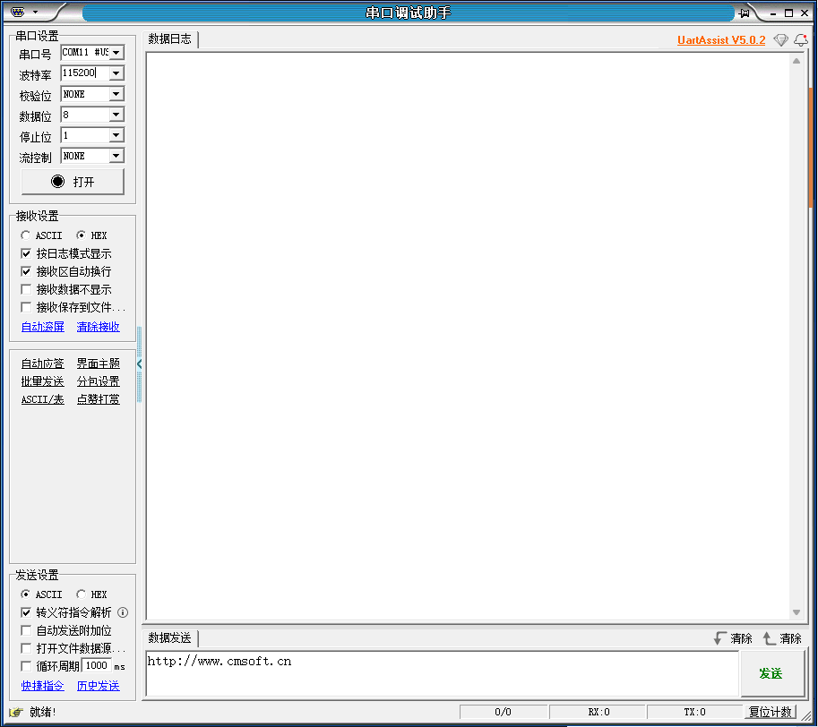
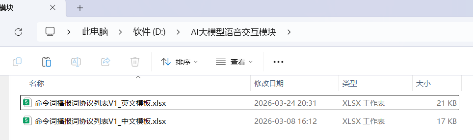
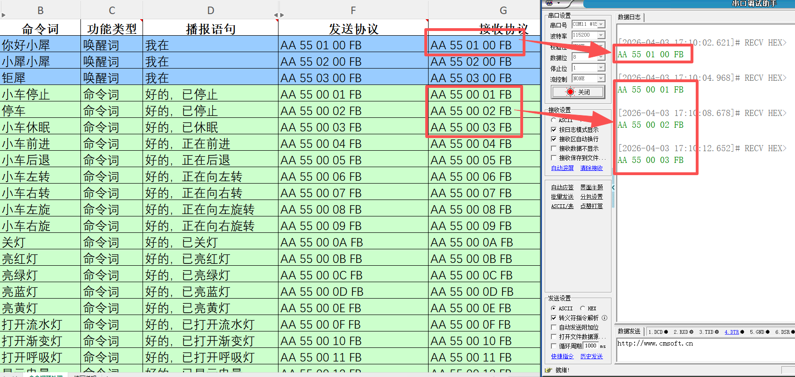

# PC串口通信

## 1、下载串口助手

[uartassist5.0.2.zip]

---

## 2、接入设备

## 3、设置串口助手配置

#### 选择对应串口号，波特率选择115200

#### 打开“命令词播报词协议列表V1_中文模板”文件

> 选择烧录固件对应的语言模板
> 
> 

## 4、根据烧录内容进行唤醒测试

> 根据文档协议，查看输出内容
> 
> 

