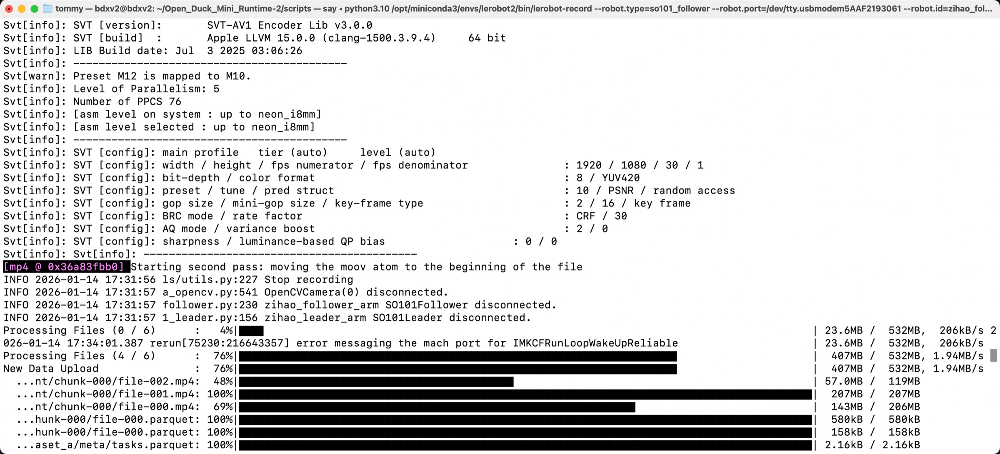
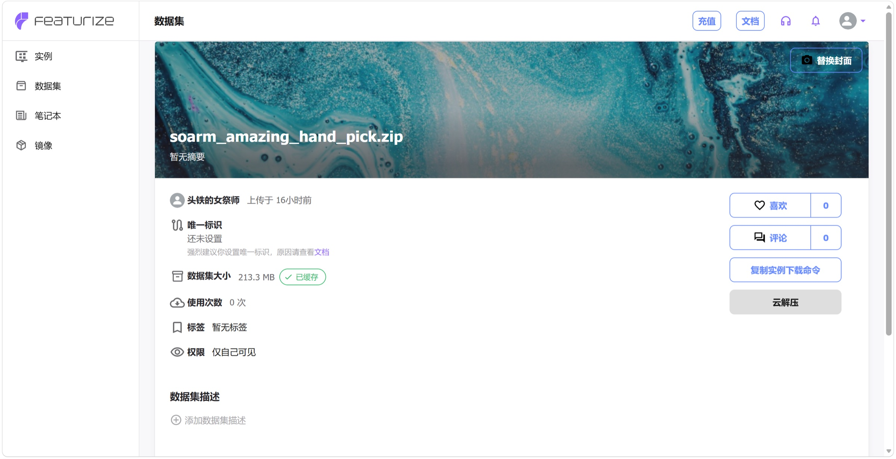
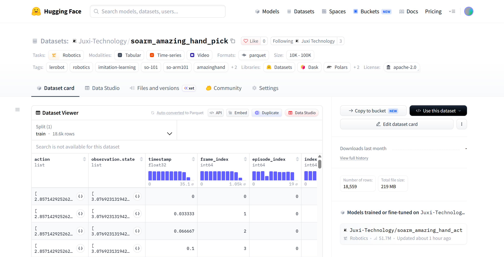
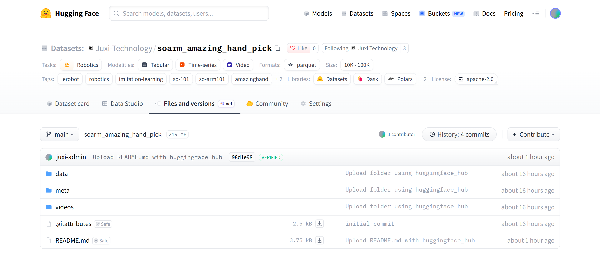

# 第六步:采集数据集(真机)——上传数据集到 Hugging Face(可选)

## 方法一：本地上传（不推荐，上传网速慢）

- 自动上传

在采集数据集时设置`push_to_hub=true`，采集完毕后自动上传



- 手动上传

在采集数据集时设置`push_to_hub=false`，采集完毕后手动上传

```Shell
hf upload <你的用户名>/lerobot_my_dataset_a /Users/<你的用户名>/.cache/huggingface/lerobot/<你的用户名>/lerobot_my_dataset_a / --repo-type=dataset
```

无论自动上传还是手动上传，上传速度都很慢（每秒钟一百KB）

因为HuggingFace服务器在国外

## 方法二：云GPU平台上传（推荐）

### 登录云GPU平台Featurize

https://featurize.cn?s=d7ce99f842414bfcaea5662a97581bd1

### 开启一个云GPU实例

### 上传数据集压缩包到`数据集`

### 复制实例下载命令



### 在云GPU实例的命令行中运行

```Shell
pip install httpx

unzip your_datasets.zip

hf auth login
```

### 上传数据集到HuggingFace

创建`upload_dataset.py`文件，内容如下

```Python
from huggingface_hub import HfApi

api = HfApi()

api.upload_folder(
    folder_path="~/lerobot_my_dataset_a",
    repo_id="<你的用户名>/lerobot_my_dataset_a",
    repo_type="dataset"
)

api.create_tag("<你的用户名>/lerobot_my_dataset_a", tag="v0.4.0", repo_type="dataset")
```

运行文件

```Shell
python upload_dataset.py
```


- 另一种上传方法（不推荐）

```Shell
hf upload <你的用户名>/lerobot_my_dataset_a lerobot_my_dataset_a / --repo-type=dataset
```


## 查看HuggingFace上的数据集

https://huggingface.co/datasets/Juxi-Technology/soarm_amazing_hand_pick





<RelatedProducts slugs="so-arm101" />
