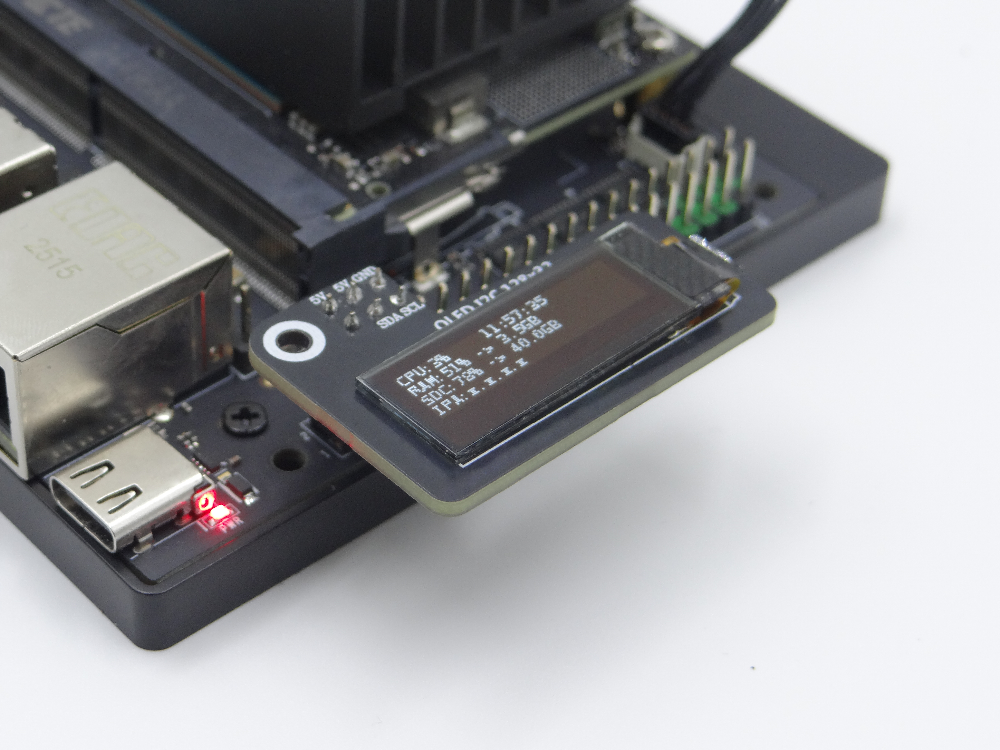
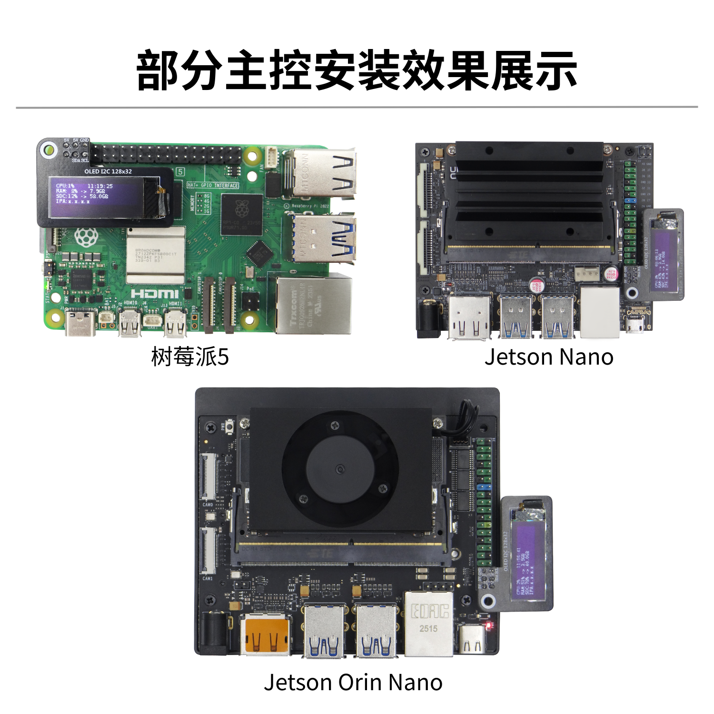

# 0.91 吋 OLED 屏幕

## Jetson系列主控

### 1、GPIO引腳圖

使用0.91寸OLED測試I2C通訊功能，按照下面接線進行連接：

**注意：請勿接錯或者造成引腳短路，失誤可能導致主板硬件損壞！**


### 2、I2C測試

#### 2.1、安裝依賴

```PowerShell
sudo apt install -y python3-pip
sudo pip3 install smbus
sudo pip3 install Adafruit_SSD1306
```


#### 2.2、I2C設備

正常開發過程中，我們需要查找I2C設備掛載的設備總線以及設備地址。

#### （1）查詢I2C總線

終端輸入下面命令可以列出設備所有總線：

```PowerShell
i2cdetect -l
```

#### （2）查詢I2C設備

終端輸入下面命令可以列出指定總線下的I2C設備：oled對應的I2C地址是 0x3c

```PowerShell
i2cdetect -y -r *
```


### 4、查看ip地址端口

使用 `ifconfig `查看ip地址端口


根據實際端口更改代碼


### 3、實驗效果

創建創建Oled_i2c.py文件

```PowerShell
sudo gedit Oled_i2c.py
```

複製粘貼以下代碼

```Python
#!/usr/bin/env python3
# coding=utf-8
import time
import os
import sys

i2c_num = 7
if len(sys.argv) > 1:
    if str(sys.argv[1]).isdigit():
        i2c_num = int(sys.argv[1])

print("i2c_num=", i2c_num)

passwd = "juxi"
cmd_i2c = "sudo i2cdetect -y -r " + str(i2c_num)
os.system('echo %s | sudo -S %s' % (passwd, cmd_i2c))


import Adafruit_SSD1306 as SSD

from PIL import Image
from PIL import ImageDraw
from PIL import ImageFont

import subprocess


class Juxi_OLED:
    def __init__(self, i2c_bus=1, debug=False):
        self.__debug = debug
        self.__i2c_bus = i2c_bus
        self.__top = -2
        self.__x = 0

        self.__total_last = 0
        self.__idle_last = 0
        self.__str_CPU = "CPU:0%"


    def __del__(self):
        if self.__debug:
            print("---OLED-DEL---")

    # 初始化OLED，成功返回:True，失败返回:False
    # Initialize OLED, return True on success, False on failure
    def begin(self):
        try:
            self.__oled = SSD.SSD1306_128_32(
                rst=None, i2c_bus=self.__i2c_bus, gpio=1)
            self.__oled.begin()
            self.__oled.clear()
            self.__oled.display()
            self.__width = self.__oled.width
            self.__height = self.__oled.height
            self.__image = Image.new('1', (self.__width, self.__height))
            self.__draw = ImageDraw.Draw(self.__image)
            self.__font = ImageFont.truetype("DejaVuSansMono.ttf",8)    # ImageFont.load_default()
            if self.__debug:
                print("---OLED begin ok!---")
            return True
        except:
            # if self.__i2c_bus == 1:
            #     self.__i2c_bus = 8
            # elif self.__i2c_bus == 8:
            #     self.__i2c_bus = 1
            if self.__debug:
                print("---OLED no found!---")
            return False

    # 清除显示。refresh=True立即刷新，refresh=False不刷新。
    # Clear the display.  Refresh =True Refresh immediately, refresh=False refresh not
    def clear(self, refresh=False):
        self.__draw.rectangle(
            (0, 0, self.__width, self.__height), outline=0, fill=0)
        if refresh:
            self.refresh()

    # 增加字符。start_x start_y表示开始的点。text是要增加的字符。
    # refresh=True立即刷新，refresh=False不刷新。
    # Add characters.  Start_x Start_y indicates the starting point.  Text is the character to be added
    # Refresh =True Refresh immediately, refresh=False refresh not
    def add_text(self, start_x, start_y, text, refresh=False):
        if start_x > 128 or start_x < 0 or start_y < 0 or start_y > 32:
            if self.__debug:
                print("oled text: x, y input error!")
            return
        x = int(start_x + self.__x)
        y = int(start_y + self.__top)
        self.__draw.text((x, y), str(text), font=self.__font, fill=255)
        if refresh:
            self.refresh()

    # 写入一行字符text。refresh=True立即刷新，refresh=False不刷新。
    # line=[1, 4]
    # Write a line of character text.  Refresh =True Refresh immediately, refresh=False refresh not.
    def add_line(self, text, line=1, refresh=False):
        if line < 1 or line > 4:
            if self.__debug:
                print("oled line input error!")
            return
        y = int(8 * (line - 1))
        self.add_text(0, y, text, refresh)

    # 刷新OLED，显示内容
    # Refresh the OLED to display the content
    def refresh(self):
        self.__oled.image(self.__image)
        self.__oled.display()

    # 读取CPU占用率
    # Read the CPU usage rate
    def getCPULoadRate(self, index):
        count = 10
        if index == 0:
            f1 = os.popen("cat /proc/stat", 'r')
            stat1 = f1.readline()
            data_1 = []
            for i in range(count):
                data_1.append(int(stat1.split(' ')[i+2]))
            self.__total_last = data_1[0]+data_1[1]+data_1[2]+data_1[3] + \
                data_1[4]+data_1[5]+data_1[6]+data_1[7]+data_1[8]+data_1[9]
            self.__idle_last = data_1[3]
        elif index == 4:
            f2 = os.popen("cat /proc/stat", 'r')
            stat2 = f2.readline()
            data_2 = []
            for i in range(count):
                data_2.append(int(stat2.split(' ')[i+2]))
            total_now = data_2[0]+data_2[1]+data_2[2]+data_2[3] + \
                data_2[4]+data_2[5]+data_2[6]+data_2[7]+data_2[8]+data_2[9]
            idle_now = data_2[3]
            total = int(total_now - self.__total_last)
            idle = int(idle_now - self.__idle_last)
            usage = int(total - idle)
            usageRate = int(float(usage / total) * 100)
            self.__str_CPU = "CPU:" + str(usageRate) + "%"
            self.__total_last = 0
            self.__idle_last = 0
            # if self.__debug:
            #     print(self.__str_CPU)
        return self.__str_CPU

    # 读取系统时间
    # Read system time
    def getSystemTime(self):
        cmd = "date +%H:%M:%S"
        date_time = subprocess.check_output(cmd, shell=True)
        str_Time = str(date_time).lstrip("b'")
        str_Time = str_Time.rstrip("\\n'")
        # print(date_time)
        return str_Time

    # 读取内存占用率 和 总内存
    # Read the memory usage and total memory
    def getUsagedRAM(self):
        cmd = "free | awk 'NR==2{printf \"RAM:%2d%% -> %.1fGB \", 100*($2-$7)/$2, ($2/1048576.0)}'"
        FreeRam = subprocess.check_output(cmd, shell=True)
        str_FreeRam = str(FreeRam).lstrip("b'")
        str_FreeRam = str_FreeRam.rstrip("'")
        return str_FreeRam

    # 读取空闲的内存 / 总内存
    # Read free memory/total memory
    def getFreeRAM(self):
        cmd = "free -h | awk 'NR==2{printf \"RAM: %.1f/%.1fGB \", $7,$2}'"
        FreeRam = subprocess.check_output(cmd, shell=True)
        str_FreeRam = str(FreeRam).lstrip("b'")
        str_FreeRam = str_FreeRam.rstrip("'")
        return str_FreeRam

    # 读取TF卡空间占用率 / TF卡总空间
    # Read the TF card space usage/TOTAL TF card space
    def getUsagedDisk(self):
        cmd = "df -h | awk '$NF==\"/\"{printf \"SDC:%s -> %.1fGB\", $5, $2}'"
        Disk = subprocess.check_output(cmd, shell=True)
        str_Disk = str(Disk).lstrip("b'")
        str_Disk = str_Disk.rstrip("'")
        return str_Disk

    # 读取空闲的TF卡空间 / TF卡总空间
    # Read the free TF card space/total TF card space
    def getFreeDisk(self):
        cmd = "df -h | awk '$NF==\"/\"{printf \"Disk:%.1f/%.1fGB\", $4,$2}'"
        Disk = subprocess.check_output(cmd, shell=True)
        str_Disk = str(Disk).lstrip("b'")
        str_Disk = str_Disk.rstrip("'")
        return str_Disk

    # 获取本机IP
    # Read the local IP address
    def getLocalIP(self):
        ip = os.popen(
            "/sbin/ifconfig enP8p1s0 | grep 'inet' | awk '{print $2}'").read()
        ip = ip[0: ip.find('\n')]
        if(ip == ''):
            ip = os.popen(
                "/sbin/ifconfig wlP1p1s0 | grep 'inet' | awk '{print $2}'").read()
            ip = ip[0: ip.find('\n')]
            if(ip == ''):
                ip = 'x.x.x.x'
        if len(ip) > 15:
            ip = 'x.x.x.x'
        return ip

    # oled主要运行函数，在while循环里调用，可实现热插拔功能。
    # Oled mainly runs functions that are called in a while loop and can be hot-pluggable
    def main_program(self):
        state = False
        try:
            cpu_index = 0
            state = self.begin()
            while state:
                self.clear()
                str_CPU = self.getCPULoadRate(cpu_index)
                str_Time = self.getSystemTime()
                if cpu_index == 0:
                    str_FreeRAM = self.getUsagedRAM()
                    str_Disk = self.getUsagedDisk()
                    str_IP = "IPA:" + self.getLocalIP()
                self.add_text(0, 0, str_CPU)
                self.add_text(50, 0, str_Time)
                self.add_line(str_FreeRAM, 2)
                self.add_line(str_Disk, 3)
                self.add_line(str_IP, 4)
                # Display image.
                self.refresh()
                cpu_index = cpu_index + 1
                if cpu_index >= 5:
                    cpu_index = 0
                time.sleep(.1)
        except:
            if self.__debug:
                print("!!!---OLED refresh error---!!!")
            pass


if __name__ == "__main__":
    try:

        oled = Juxi_OLED(i2c_num, debug=True)
        while True:
            oled.main_program()
            time.sleep(2)
    except KeyboardInterrupt:
        oled.clear(True)
        del oled
        print(" Program closed! ")
        pass
```

啓動程序後，OLED會顯示系統CPU佔用率、系統時間以及內存佔用率等系統信息：




## 樹莓派、香橙派


### 1.打開I2C選項

進入樹莓派系統設置，選擇：首選項→Raspberry Pi Configuration→Interfaces→找到I2C選項打開 然後會重啓系統即可。（參考下圖）

如果你在命令模式下，可輸入`sudo raspi-config`依然可以找到該選項打開I2C然後重啓一下系統即可。


### 2.安裝I2C庫文件

```PowerShell
sudo apt install -y python3-dev
sudo apt install -y python3-smbus i2c-tools
sudo apt install -y python3-pil
sudo apt install -y python3-pip
sudo apt install -y python3-setuptools
sudo apt install -y python3-rpi.gpio
sudo apt install -y python3-venv
```

我這裏使用的是Python3，安裝I2C庫後，使用i2cdetect命令查詢顯示屏模塊是否被識別

```PowerShell
i2cdetect -y 1
```

顯示該設備已被檢測到地址爲“0x3c”（如下圖）此類型設備的默認是十六進制地址。


### 3.字體文件配置

代碼中使用了 `DejaVuSansMono.ttf` 字體：

```PowerShell
sudo apt-get install -y fonts-dejavu-core
```

或修改代碼爲系統已有的字體（如 `ImageFont.load_default()`）

### 4.權限配置

確保 I2C 設備文件權限正確：

```PowerShell
sudo chmod a+rw /dev/i2c-*  # 临时生效，永久生效需配置 udev 规则
```

### 5.查看ip地址端口

使用` ifconfig `查看實際的ip地址端口

```PowerShell
# （如未安装net-tools）sudo apt install net-tools
ifconfig
```


根據實際端口更改代碼中以下兩個框選的內容


### 6.創建Oled_i2c.py文件

在Home目錄下創建Oled_i2c.py文件

```PowerShell
# （如未安装gedit） sudo apt install gedit
sudo gedit Oled_i2c.py
```

複製以下代碼粘貼到文件裏面，保存關閉

```Python
#!/usr/bin/env python3
# coding=utf-8
import time
import os
import sys

i2c_num = 7
if len(sys.argv) > 1:
    if str(sys.argv[1]).isdigit():
        i2c_num = int(sys.argv[1])

print("i2c_num=", i2c_num)

passwd = "juxi"
cmd_i2c = "sudo i2cdetect -y -r " + str(i2c_num)
os.system('echo %s | sudo -S %s' % (passwd, cmd_i2c))


import Adafruit_SSD1306 as SSD

from PIL import Image
from PIL import ImageDraw
from PIL import ImageFont

import subprocess


class Juxi_OLED:
    def __init__(self, i2c_bus=1, debug=False):
        self.__debug = debug
        self.__i2c_bus = i2c_bus
        self.__top = -2
        self.__x = 0

        self.__total_last = 0
        self.__idle_last = 0
        self.__str_CPU = "CPU:0%"


    def __del__(self):
        if self.__debug:
            print("---OLED-DEL---")

    # 初始化OLED，成功返回:True，失败返回:False
    # Initialize OLED, return True on success, False on failure
    def begin(self):
        try:
            self.__oled = SSD.SSD1306_128_32(
                rst=None, i2c_bus=self.__i2c_bus, gpio=1)
            self.__oled.begin()
            self.__oled.clear()
            self.__oled.display()
            self.__width = self.__oled.width
            self.__height = self.__oled.height
            self.__image = Image.new('1', (self.__width, self.__height))
            self.__draw = ImageDraw.Draw(self.__image)
            self.__font = ImageFont.truetype("DejaVuSansMono.ttf",8)    # ImageFont.load_default()
            if self.__debug:
                print("---OLED begin ok!---")
            return True
        except:
            # if self.__i2c_bus == 1:
            #     self.__i2c_bus = 8
            # elif self.__i2c_bus == 8:
            #     self.__i2c_bus = 1
            if self.__debug:
                print("---OLED no found!---")
            return False

    # 清除显示。refresh=True立即刷新，refresh=False不刷新。
    # Clear the display.  Refresh =True Refresh immediately, refresh=False refresh not
    def clear(self, refresh=False):
        self.__draw.rectangle(
            (0, 0, self.__width, self.__height), outline=0, fill=0)
        if refresh:
            self.refresh()

    # 增加字符。start_x start_y表示开始的点。text是要增加的字符。
    # refresh=True立即刷新，refresh=False不刷新。
    # Add characters.  Start_x Start_y indicates the starting point.  Text is the character to be added
    # Refresh =True Refresh immediately, refresh=False refresh not
    def add_text(self, start_x, start_y, text, refresh=False):
        if start_x > 128 or start_x < 0 or start_y < 0 or start_y > 32:
            if self.__debug:
                print("oled text: x, y input error!")
            return
        x = int(start_x + self.__x)
        y = int(start_y + self.__top)
        self.__draw.text((x, y), str(text), font=self.__font, fill=255)
        if refresh:
            self.refresh()

    # 写入一行字符text。refresh=True立即刷新，refresh=False不刷新。
    # line=[1, 4]
    # Write a line of character text.  Refresh =True Refresh immediately, refresh=False refresh not.
    def add_line(self, text, line=1, refresh=False):
        if line < 1 or line > 4:
            if self.__debug:
                print("oled line input error!")
            return
        y = int(8 * (line - 1))
        self.add_text(0, y, text, refresh)

    # 刷新OLED，显示内容
    # Refresh the OLED to display the content
    def refresh(self):
        self.__oled.image(self.__image)
        self.__oled.display()

    # 读取CPU占用率
    # Read the CPU usage rate
    def getCPULoadRate(self, index):
        count = 10
        if index == 0:
            f1 = os.popen("cat /proc/stat", 'r')
            stat1 = f1.readline()
            data_1 = []
            for i in range(count):
                data_1.append(int(stat1.split(' ')[i+2]))
            self.__total_last = data_1[0]+data_1[1]+data_1[2]+data_1[3] + \
                data_1[4]+data_1[5]+data_1[6]+data_1[7]+data_1[8]+data_1[9]
            self.__idle_last = data_1[3]
        elif index == 4:
            f2 = os.popen("cat /proc/stat", 'r')
            stat2 = f2.readline()
            data_2 = []
            for i in range(count):
                data_2.append(int(stat2.split(' ')[i+2]))
            total_now = data_2[0]+data_2[1]+data_2[2]+data_2[3] + \
                data_2[4]+data_2[5]+data_2[6]+data_2[7]+data_2[8]+data_2[9]
            idle_now = data_2[3]
            total = int(total_now - self.__total_last)
            idle = int(idle_now - self.__idle_last)
            usage = int(total - idle)
            usageRate = int(float(usage / total) * 100)
            self.__str_CPU = "CPU:" + str(usageRate) + "%"
            self.__total_last = 0
            self.__idle_last = 0
            # if self.__debug:
            #     print(self.__str_CPU)
        return self.__str_CPU

    # 读取系统时间
    # Read system time
    def getSystemTime(self):
        cmd = "date +%H:%M:%S"
        date_time = subprocess.check_output(cmd, shell=True)
        str_Time = str(date_time).lstrip("b'")
        str_Time = str_Time.rstrip("\\n'")
        # print(date_time)
        return str_Time

    # 读取内存占用率 和 总内存
    # Read the memory usage and total memory
    def getUsagedRAM(self):
        cmd = "free | awk 'NR==2{printf \"RAM:%2d%% -> %.1fGB \", 100*($2-$7)/$2, ($2/1048576.0)}'"
        FreeRam = subprocess.check_output(cmd, shell=True)
        str_FreeRam = str(FreeRam).lstrip("b'")
        str_FreeRam = str_FreeRam.rstrip("'")
        return str_FreeRam

    # 读取空闲的内存 / 总内存
    # Read free memory/total memory
    def getFreeRAM(self):
        cmd = "free -h | awk 'NR==2{printf \"RAM: %.1f/%.1fGB \", $7,$2}'"
        FreeRam = subprocess.check_output(cmd, shell=True)
        str_FreeRam = str(FreeRam).lstrip("b'")
        str_FreeRam = str_FreeRam.rstrip("'")
        return str_FreeRam

    # 读取TF卡空间占用率 / TF卡总空间
    # Read the TF card space usage/TOTAL TF card space
    def getUsagedDisk(self):
        cmd = "df -h | awk '$NF==\"/\"{printf \"SDC:%s -> %.1fGB\", $5, $2}'"
        Disk = subprocess.check_output(cmd, shell=True)
        str_Disk = str(Disk).lstrip("b'")
        str_Disk = str_Disk.rstrip("'")
        return str_Disk

    # 读取空闲的TF卡空间 / TF卡总空间
    # Read the free TF card space/total TF card space
    def getFreeDisk(self):
        cmd = "df -h | awk '$NF==\"/\"{printf \"Disk:%.1f/%.1fGB\", $4,$2}'"
        Disk = subprocess.check_output(cmd, shell=True)
        str_Disk = str(Disk).lstrip("b'")
        str_Disk = str_Disk.rstrip("'")
        return str_Disk

    # 获取本机IP
    # Read the local IP address
    def getLocalIP(self):
        ip = os.popen(
            "/sbin/ifconfig enP8p1s0 | grep 'inet' | awk '{print $2}'").read()
        ip = ip[0: ip.find('\n')]
        if(ip == ''):
            ip = os.popen(
                "/sbin/ifconfig wlP1p1s0 | grep 'inet' | awk '{print $2}'").read()
            ip = ip[0: ip.find('\n')]
            if(ip == ''):
                ip = 'x.x.x.x'
        if len(ip) > 15:
            ip = 'x.x.x.x'
        return ip

    # oled主要运行函数，在while循环里调用，可实现热插拔功能。
    # Oled mainly runs functions that are called in a while loop and can be hot-pluggable
    def main_program(self):
        state = False
        try:
            cpu_index = 0
            state = self.begin()
            while state:
                self.clear()
                str_CPU = self.getCPULoadRate(cpu_index)
                str_Time = self.getSystemTime()
                if cpu_index == 0:
                    str_FreeRAM = self.getUsagedRAM()
                    str_Disk = self.getUsagedDisk()
                    str_IP = "IPA:" + self.getLocalIP()
                self.add_text(0, 0, str_CPU)
                self.add_text(50, 0, str_Time)
                self.add_line(str_FreeRAM, 2)
                self.add_line(str_Disk, 3)
                self.add_line(str_IP, 4)
                # Display image.
                self.refresh()
                cpu_index = cpu_index + 1
                if cpu_index >= 5:
                    cpu_index = 0
                time.sleep(.1)
        except:
            if self.__debug:
                print("!!!---OLED refresh error---!!!")
            pass


if __name__ == "__main__":
    try:

        oled = Juxi_OLED(i2c_num, debug=True)
        while True:
            oled.main_program()
            time.sleep(2)
    except KeyboardInterrupt:
        oled.clear(True)
        del oled
        print(" Program closed! ")
        pass
```

### 7.創建虛擬環境

```PowerShell
# 安装虚拟环境工具（如果未安装）sudo apt-get install -y python3-venv

# 创建虚拟环境
python3 -m venv oled_env

# 激活虚拟环境source oled_env/bin/activate  # 激活后命令行前会显示 (oled_env)# 在虚拟环境中安装依赖
# 使用阿里云镜像安装
pip install Adafruit_SSD1306 -i https://mirrors.aliyun.com/pypi/simple/

# 同时安装 pillow（依赖库）
pip install pillow -i https://mirrors.aliyun.com/pypi/simple/

# 运行代码（需在虚拟环境中）

# 进入到对应的simple文件夹下
cd /home/pi/oled-screen/luma.examples/examples
python3 oled_i2c.py  # 默认总线 7
# 或指定总线（如总线 1）
python3 oled_i2c.py 1
#若提示权限错误，检查 sudo 配置或 I2C 设备权限
```



## 官方倉庫示例

鉅犀科技為 OLED 螢幕提供開源驅動代碼：[GitHub](https://github.com/Juxi-Technology/OLED-Secondary-Display-RaspberryPi-Jetson)

### I2C 驅動示例

```bash
sudo apt install -y python3-pip
sudo pip3 install smbus Adafruit_SSD1306
```

```python
import Adafruit_SSD1306
from PIL import Image, ImageDraw, ImageFont

# 初始化 OLED (128x32)
disp = Adafruit_SSD1306.SSD1306_128_32(rst=None)
disp.begin()
disp.clear()
disp.display()

# 绘制文字
image = Image.new('1', (disp.width, disp.height))
draw = ImageDraw.Draw(image)
draw.text((0, 0), 'Hello Juxi!', font=ImageFont.load_default(), fill=255)
disp.image(image)
disp.display()
```
