# 中英文識別詞固件下載及燒錄

> **[ 淘寶店鋪 ](https://juxitechnology.taobao.com)**

> 模塊出廠已經燒錄語音識別功能固件，資料附件裏面也提供了出廠固件，如果需要重新制作固件可以根據下面步驟進行固件製作
> 
> 

## 進入[啓英泰倫語音AI平臺](https://aiplatform.chipintelli.com/home/index.html)

#### 註冊啓英泰倫官網賬號

#### 點擊頂部菜單“平臺功能”，選擇“產品固件及SDK深度開發”

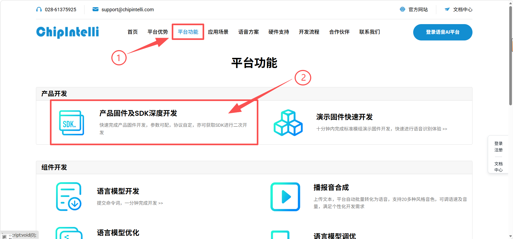

---

#### 點擊“離線語音識別大模型應用”

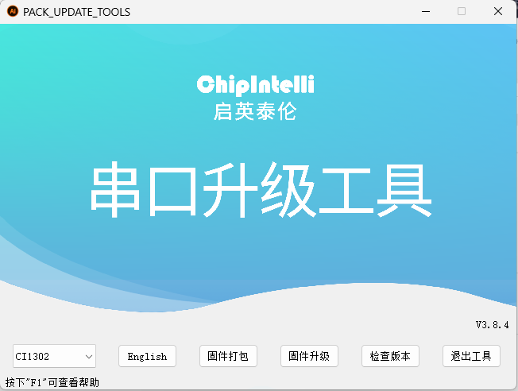

---

#### 點擊“語音識別固件及SDK開發”

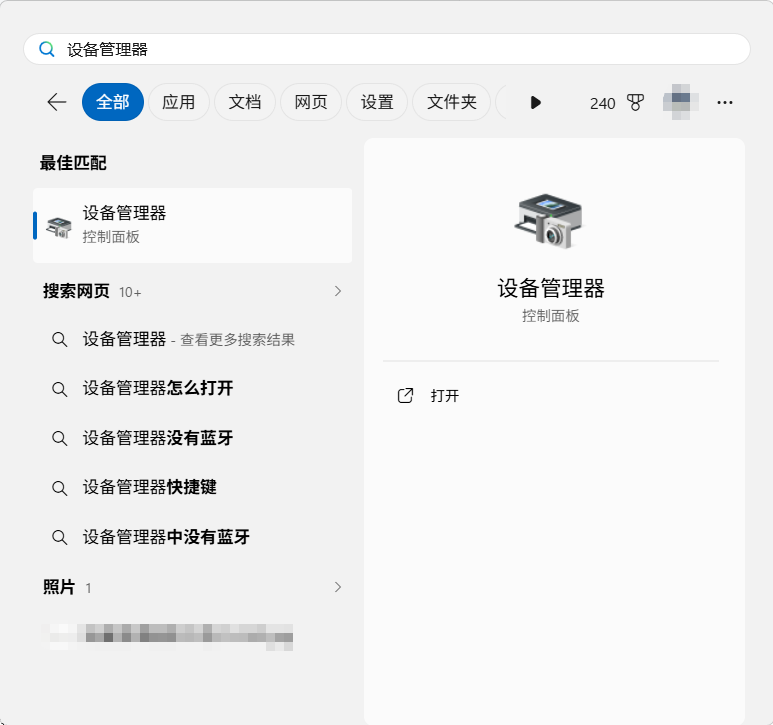

---

#### 新建項目

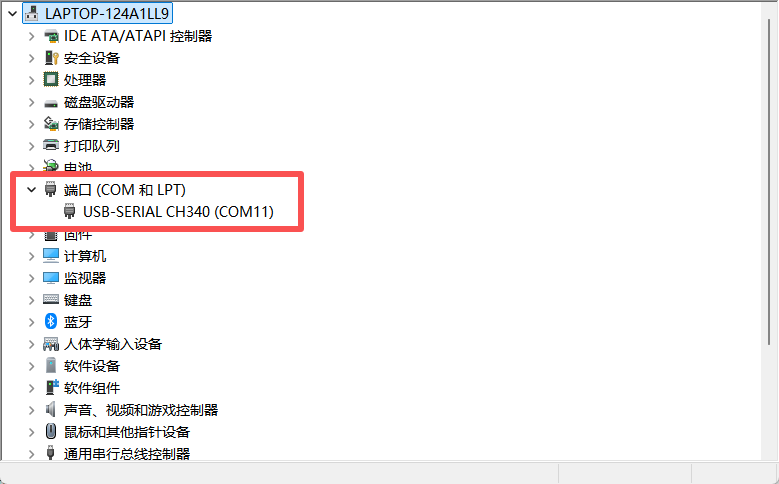

---

#### 產品信息填寫

1. **產品名稱：**按自己名稱規則來即可

2. **應用方案：**選擇“單麥語音識別”

3. **產品類型：**“通用-\>智能中控”

4. **芯片型號：**Cl1302

5. **SDK名稱：**Cl13XX_SDK_ASR_Offline

6. **sdk版本：**1.12.16

7. **描述：**按自己描述規則來即可

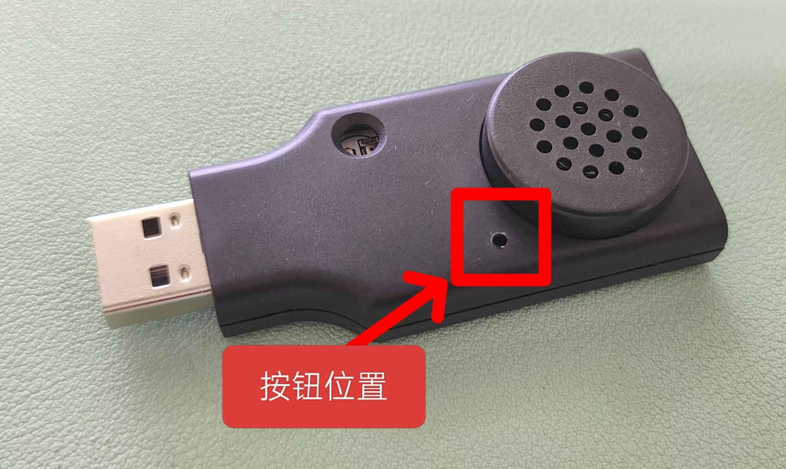

---

#### 固件信息選擇

> 在這裏可以選擇中文或者英文
> 
> 

1. **版本名稱：**按自己版本規則即可

2. **語言類型：**按自己需求選擇

3. **選擇聲學類型：**

    1. **中文選擇：**VO0681_中文_ASR_通用_0.9M

    2. **英文選擇：**VO0916_英文_ASR_通用_1.1M

4. **模塊板選擇：**CI-D02GS02S

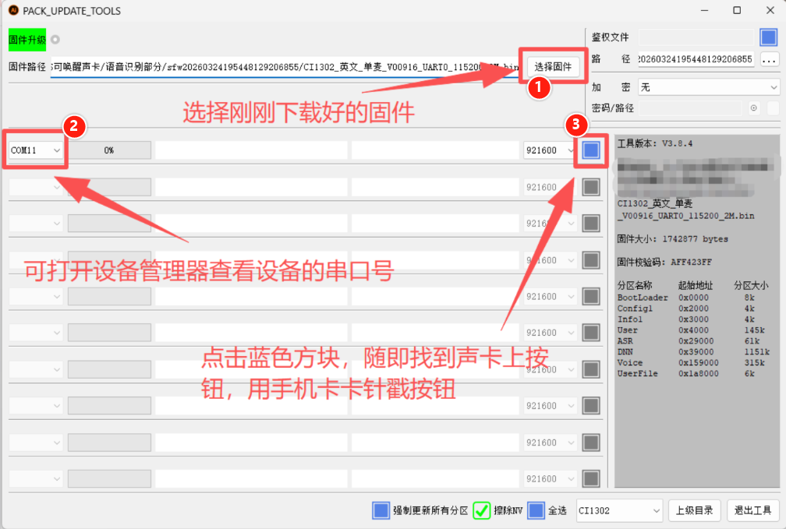

---

#### 固件配置

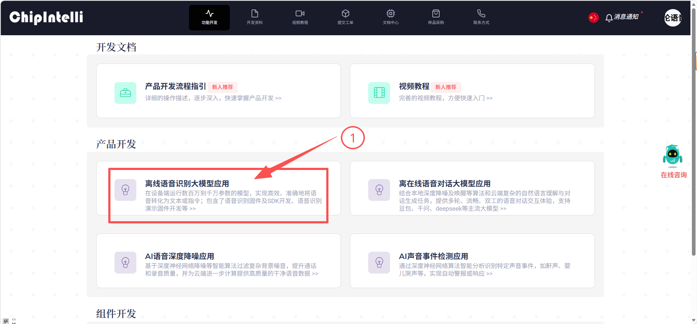

---

#### 下載喚醒詞固件

1. 上傳-選擇對應語言的喚醒詞表格

2. 點擊“立即提交”

3. 等待幾分鐘即可下載固件

4. 這裏提供了兩份命令詞播報詞協議列表，有需要的可以根據這份表格自行更改

    [命令词播报词协议列表V3_中文模板.xlsx]

    [命令词播报词协议列表V3_英文模板.xlsx]

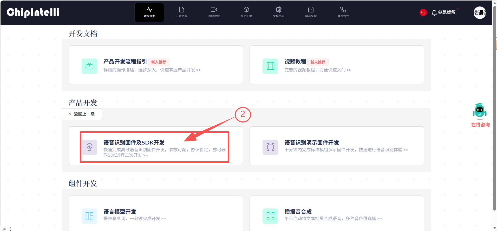

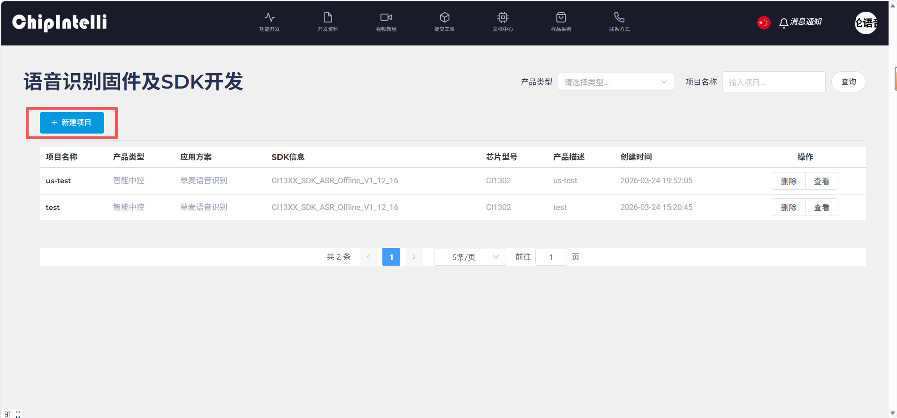

---

## 語音模塊燒錄固件

#### 下載語音模塊燒錄軟件壓縮包

[语音模块固件烧录软件.7z]

1. 解壓後打開軟件

> 固件選擇“CI1302”，點擊“固件升級”
> 
> 

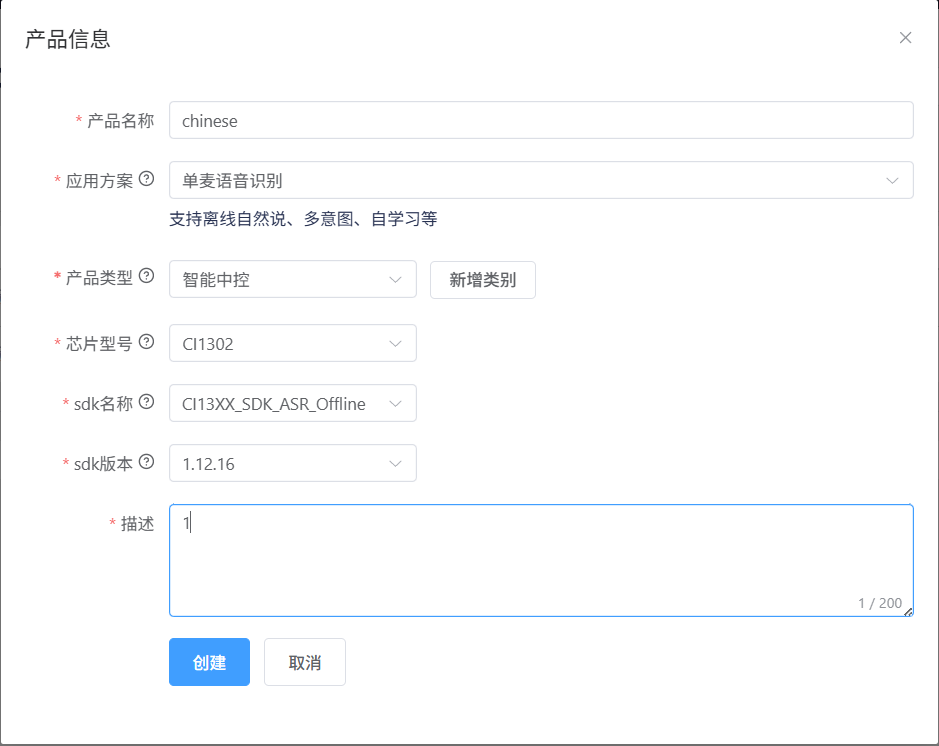

2. 將聲卡插上電腦，打開設備管理器

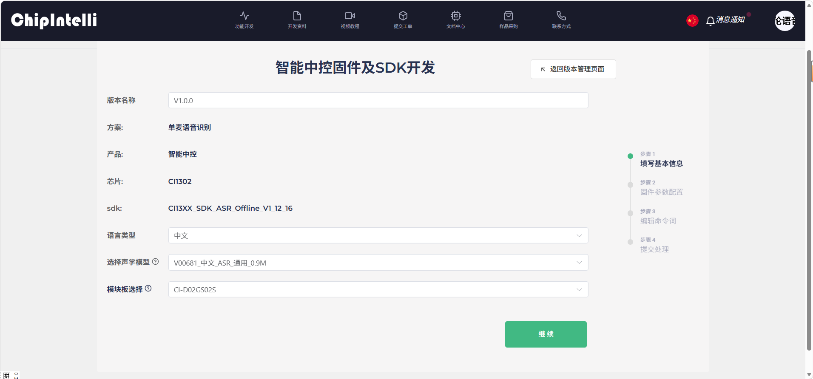

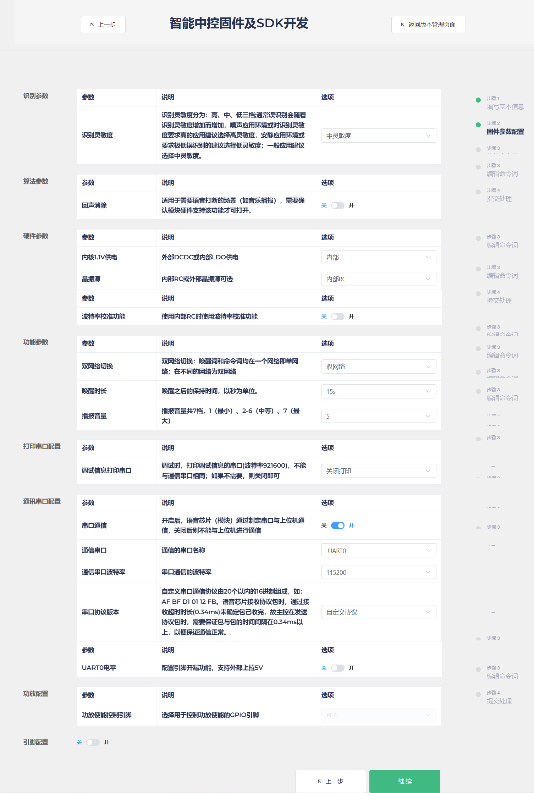

3. 移至固件燒錄軟件頁面

> 聲卡按鍵位置
> 
> 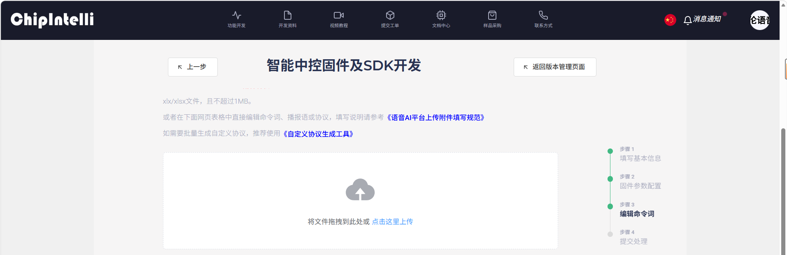
> 
> 

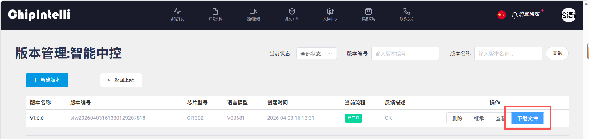

#### 完成後可移步到左側對應的其他教程

#### 這裏有準備好的固件資料，可直接燒錄

[CI1302_中文_单麦_V00681_UART0_115200_2M.bin]

[CI1302_英文_单麦_V00916_UART0_115200_2M.bin]

## 注意事項

1. CH341驅動安裝（以管理員身份安裝）

https://www.wch.cn/downloads/CH341SER_EXE.html

若在設備管理器被識別成未知設備usb single serial 或usb serial，請先右鍵卸載，再安裝驅動！

