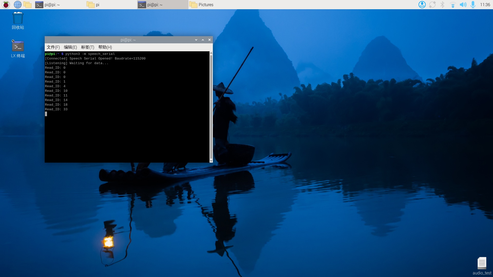

# 樹莓派串口通信

注意：語音交互模塊需要燒錄出廠固件，語音芯片到手之後沒有刷過固件的則不需要 

## 1.查看端口

通過USB接口插到樹莓派上。


終端輸入，出現ttyUSB0設備表示正常識別到了（正常都是ttyUSB0,也有可能是其他設備號）

```Plain Text
ls /dev/ttyUSB*
```


## 2.代碼實現

將speech_serial.py下載到對應的目錄下

```Python
#!/usr/bin/env python3
# -*- coding: utf-8 -*-

import time
import serial
from typing import Optional, Tuple


class SpeechModule:
    """
    語音模塊串口通信控制器
    封裝了與語音模塊的交互邏輯
    """
    
    # 串口配置常量
    DEFAULT_PORT = "/dev/ttyUSB0"
    DEFAULT_BAUDRATE = 115200
    
    # 命令字定義 (播報詞/功能ID)
    CMD_THIS_RED = 0x60
    CMD_THIS_GREEN = 0x61
    CMD_THIS_YELLOW = 0x62
    CMD_RECOGNIZE_YELLOW = 0x63
    CMD_RECOGNIZE_GREEN = 0x64
    CMD_RECOGNIZE_BLUE = 0x65
    CMD_RECOGNIZE_RED = 0x66
    CMD_INIT = 0x67

    def __init__(self, port: str = DEFAULT_PORT, baudrate: int = DEFAULT_BAUDRATE):
        self._port = port
        self._baudrate = baudrate
        self._serial_conn: Optional[serial.Serial] = None

    def connect(self) -> bool:
        """建立串口連接"""
        try:
            self._serial_conn = serial.Serial(self._port, self._baudrate, timeout=0.1)
            if self._serial_conn.is_open:
                print(f"[Connected] Speech Serial Opened! Baudrate={self._baudrate}")
                return True
            return False
        except serial.SerialException as e:
            print(f"[Error] Speech Serial Open Failed: {e}")
            return False

    def send_command(self, cmd_id: int) -> None:
        """
        發送指令幀
        協議格式: 0xAA 0x55 0xFF [Data] 0xFB
        """
        if not self._serial_conn or not self._serial_conn.is_open:
            return

        # 構造完整的數據幀
        frame = bytes([0xAA, 0x55, 0xFF, int(cmd_id), 0xFB])
        
        self._serial_conn.write(frame)
        time.sleep(0.005)
        self._serial_conn.reset_input_buffer()  # 等同於 flushInput

    def read_response(self) -> Optional[int]:
        """
        讀取並解析返回數據
        返回: Read_ID (第6個字節的數據)
        """
        if not self._serial_conn or not self._serial_conn.is_open:
            return None

        # 檢查緩衝區數據量
        bytes_available = self._serial_conn.in_waiting
        if bytes_available <= 0:
            return None

        raw_data = self._serial_conn.read(bytes_available)
        hex_str = raw_data.hex()

        # 校驗幀頭 'aa55'
        if hex_str.startswith('aa55'):
            try:
                # 簡單的索引提取邏輯 (與原代碼邏輯保持一致)
                # 注意：此處假設數據長度足夠，實際工業代碼建議加長度校驗
                # byte1 = hex_str[4:6] # 保留原邏輯中的第5字節但不使用
                byte2 = hex_str[6:8] # 提取第6字節
                
                read_id = int(byte2, 16)
                
                self._serial_conn.reset_input_buffer()
                time.sleep(0.005)
                print(f"Read_ID: {read_id}")
                return read_id
            except (IndexError, ValueError):
                pass
        
        return None

    def run(self):
        """主運行循環"""
        if not self.connect():
            return

        # 初始化模塊
        self.send_command(self.CMD_INIT)
        time.sleep(0.005)

        print("[Listening] Waiting for data...")
        try:
            while True:
                self.read_response()
        except KeyboardInterrupt:
            print("\n[Stopped] Program interrupted by user.")
        finally:
            if self._serial_conn and self._serial_conn.is_open:
                self._serial_conn.close()
                print("[Disconnected] Serial port closed.")


if __name__ == "__main__":
    module = SpeechModule()
    module.run()

```

## 3.實現效果

播報的內容可以根據附件提供的 命令詞播報詞協議列表V1_中文文件 查看協議。

其中第一第二個字節AA 55表示的是協議的幀頭，第三個字節00表示的是播報功能，第四個就是播報內容 的ID，這裏能看到“小車前進”是16進制的07，所以程序裏給寄存器0x03發送0x07即可播報對應內容。 第五個字節是結束幀。 


終端輸入以下指令運行程序

```Plain Text
python3 -m speech_serial
```

當說出喚醒詞喚醒之後，控制檯會回覆接收Read_ID：0

說“關燈”，控制檯會回覆接收Read_ID：13



這時候可以打開附件的 命令詞播報詞協議列表V1_中文文件 查看“關燈”的協議 


其中第一第二個字節AA 55表示的是協議的幀頭，第三個字節表示的是芯片的十個功能詞的ID，第四個就 是命令詞的ID，這裏能看到“關燈”是16進制的0D，十進制是13。第五個字節是結束幀。

說其他的命令詞，控制檯也會打印相對應得命令詞ID，可以自行嘗試


