# 自訂協定詞條製作

## 1.語音晶片韌體製作

## 1.1注意事項

模組出廠已經燒錄語音辨識功能韌體，資料壓縮包裡面也提供了出廠韌體，如果需要重新製作韌體可以根據下面步驟進行韌體製作。

## 1.2韌體製作

首先需要開啟“[啟英泰倫語音AI平台](https://aiplatform.chipintelli.com/)”這個連結，進入韌體製作官網。  點擊選單欄的“功能開發”，之後點擊產品開發欄下的“離線語音辨識大模型應用”。

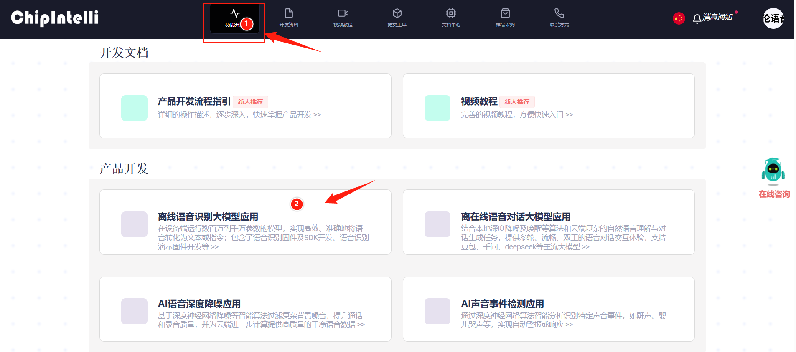

這個時候會提示需要登入，這裡需要使用自己的資訊註冊一個平台帳號，這裡教學時已經提前註冊好了的，登入之後再次點擊 “語音辨識韌體及SDK開發”。

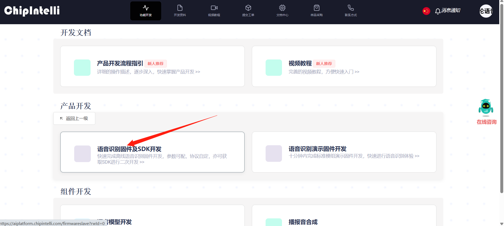

頁面跳轉之後，在左側點擊新建專案，按照下圖新建一個產品，其中產品名稱和描述都可以自訂，其餘資訊需要按照紅框內容進行選擇，產品類型需要選擇 “通用->智慧中控”，完成後點擊建立。

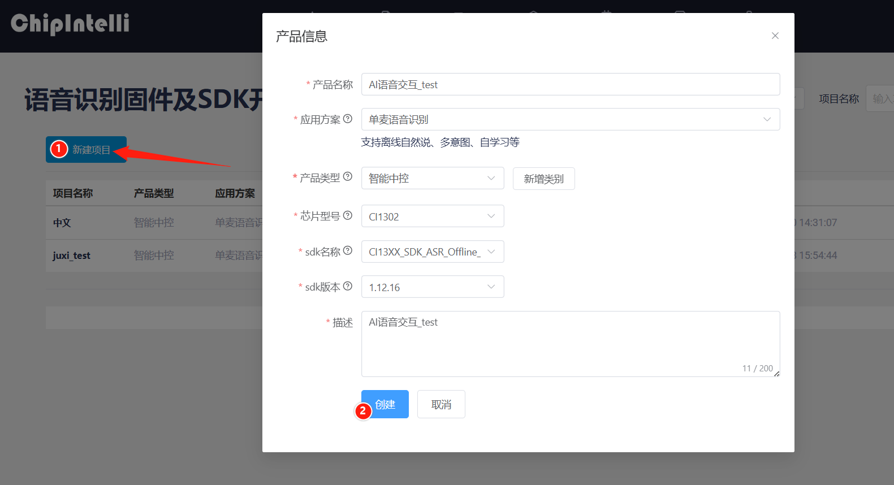

接下來需要填寫專案的基礎資訊，我們需要辨識中文，所以語言類型選擇 “中文”，若需要辨識英文也可以進行相應的修改，其他部分資訊按照下圖選擇即可，完成點擊繼續。

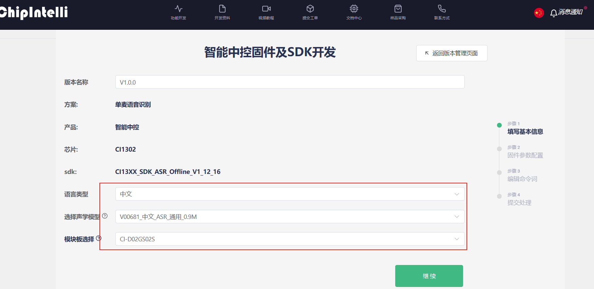

然後需要對韌體進行配置，這裡我們只對需要修改的部分進行說明，將演算法參數的回聲消除打開。

硬體參數中，需要將晶振源選擇為“內部 RC”。

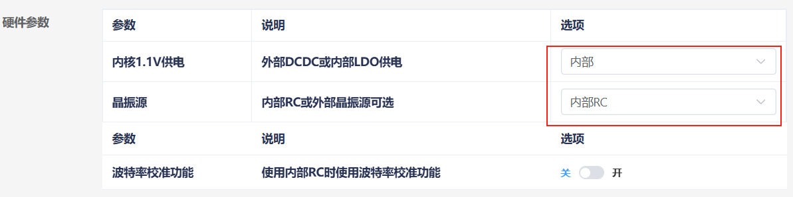

在列印串列埠配置中，將 UART0 電平配置為開漏功能，支援外部上拉 5V。

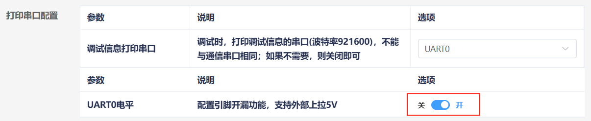

對通訊串列埠配置進行修改，設定鮑率為 115200，並配置 UART1 電平為開漏功能，支援外部上拉 5V，配置完成後點擊“繼續”進入下一步。

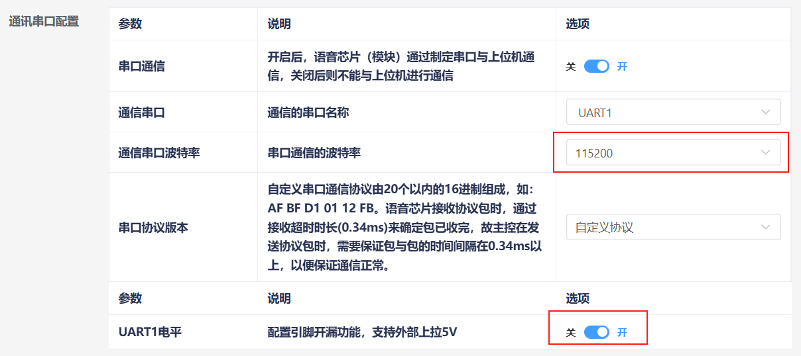

下面進入到編輯命令詞功能中，首先需要選擇播放的音色，這裡我們選擇“小蝶-清新女声 Ver.3”。

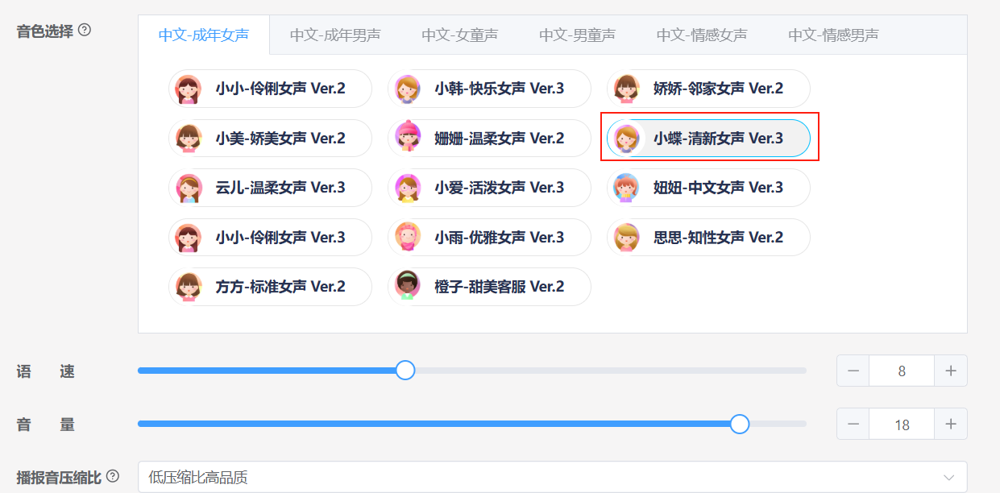

接著我們將命令詞附件進行上傳，找到本文檔同路徑下的“命令词播报词协议列表V1_中文”表格，直接拖入到網頁中進行上傳。

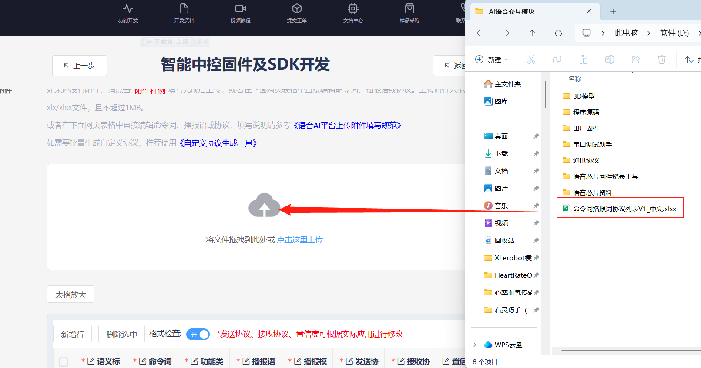

上傳檔案後，即可在下方的表格中看到我們的命令詞資料。

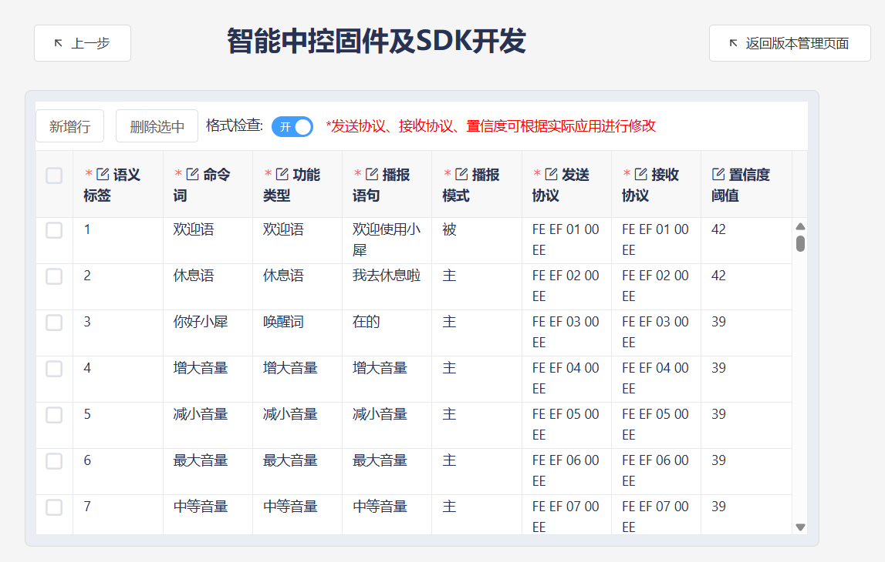

開啟自學習功能選擇指定學習，此時系統會自動產生 4 個自學習指令，我們這裡不做修改。

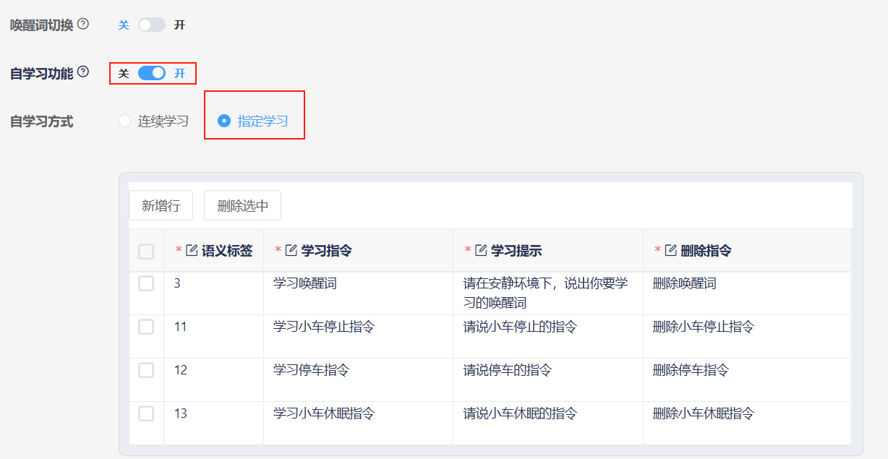

提交後等待幾分鐘即可完成韌體製作，完成後點擊下載韌體即可取得製作的韌體了。

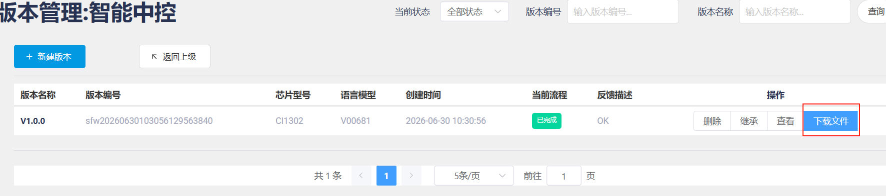

燒錄韌體步驟可以查看《[模組韌體燒錄](https://juxitech.feishu.cn/wiki/FfE8wbL1wipUWgkUKW6cbsw2nOe)》。

## 2.修改功能性詞條

開啟附件中的命令词播报词协议列表V1_中文檔案。

找到表格中的功能性詞條，也就是表格中的前 10 項。需要注意的是，這裡的前 10條功能性詞條均為固定詞條，無法新增，只能進行修改。

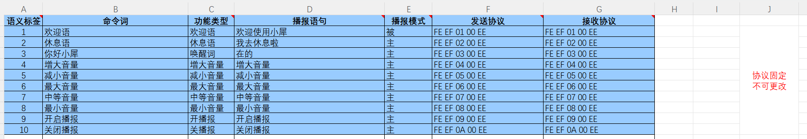

這裡我們以修改喚醒詞的播報語為例，將原先辨識到 “你好，小犀” 後播報 “在的” ，修改為播報“我在”。

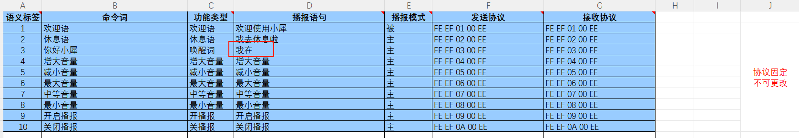

修好完後保存，接著按照“1.2 韌體製作”中的步驟，將表格匯入到網站中。如果已經製作過一次韌體了，那麼可以點擊之前專案中的“繼承”按鍵，這樣可以省去參數配置的步驟。

重新製作韌體後，還需要將韌體燒錄到語音互動模組中，這樣就能實現修改功能性詞條了。

## 3.新增命令詞條

開啟附件中的命令词播报词协议列表V1_中文檔案。

在表格的最下方，增加新的命令詞條，這裡以新增一個“打掃房間”的命令詞為例。

這裡需要將功能類型選擇為“命令词”，同時播報模式需要設定為“主”，這樣才能在辨識到“打掃房間”後主動播報“好的”。

下面我們來了解一下發送協定，資料中的第 1 位和第 2 位是資料訊框標頭，不需要修改。當我們選擇了功能類型為命令詞，那麼根據發送協定，第 3 位資料必須要為“00”，這是為了區分指令為“命令词”還是“播报语”。

第 4 位資料則是命令詞的資料 ID，這是一個十六進位資料，因為前一個命令詞的ID 是“8B”，所以我們這一位需要設定為“8C”。在特殊情況下資料 ID 也可以相同，例如下面兩個命令詞的返回的結果一致時。

協定中的第 5 位固定為“EE”，同樣也不需要修改。在表格中，需要使發送協定和接收協定一致。

修好完後保存，接著按照“1.2 韌體製作”中的步驟，將表格匯入到網站中。如果已經製作過一次韌體了，那麼可以點擊之前專案中的“繼承”按鍵，這樣可以省去參數配置的步驟

重新製作韌體後，還需要將韌體燒錄到語音互動模組中，這樣就能實現新增命令詞條的功能了。

## 4.新增播報語

開啟附件中的命令词播报词协议列表V1_中文檔案。

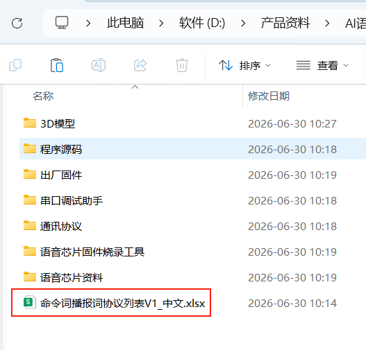

在表格的最下方，增加新的命令詞條，這裡以新增一個“現在是晚上”的播報語為例。

這裡需要將功能類型選擇為“播报语”，同時播報模式需要設定為“被”。

下面我們來了解一下發送協定，資料中的第 1 位和第 2 位是資料訊框標頭，不需要修改。當我們選擇了功能類型為播報語，那麼根據發送協定，第 3 位資料必須要為“FF”，這是為了區分指令為“播报语”。

第 4 位資料則是命令詞的資料 ID，這是一個十六進位資料，因為前一個播報語的ID 是“8B”，所以我們這一位需要設定為“8C”。

協定中的第 5 位固定為“EE”，同樣也不需要修改。在表格中，需要使發送協定和接收協定一致。

修好完後保存，接著按照“1.2 韌體製作”中的步驟，將表格匯入到網站中。如果已經製作過一次韌體了，那麼可以點擊之前專案中的“繼承”按鍵，這樣可以省去參數配置的步驟。

重新製作韌體後，還需要將韌體燒錄到語音互動模組中，這樣就能實現新增命令詞條的功能了。

