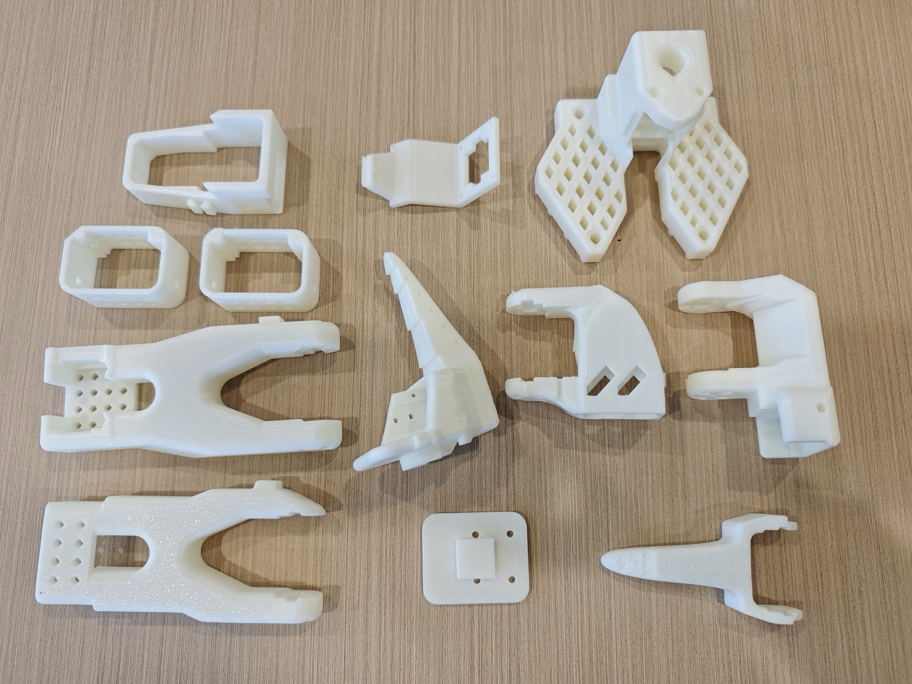
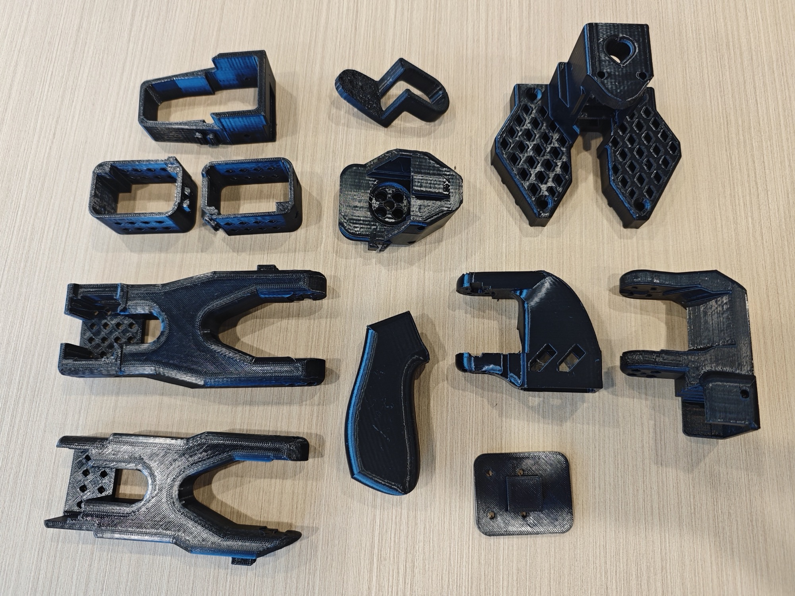
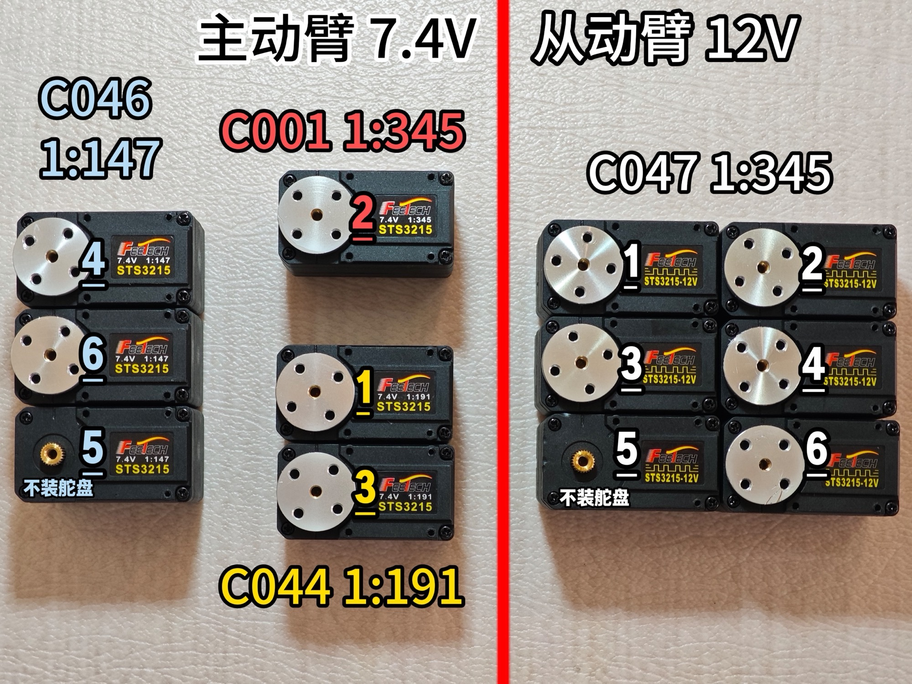
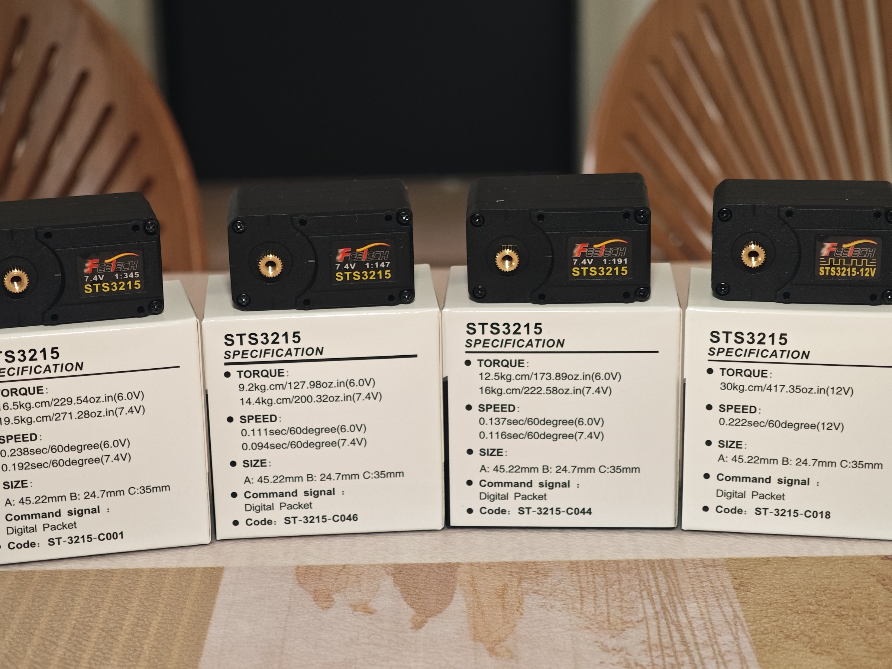
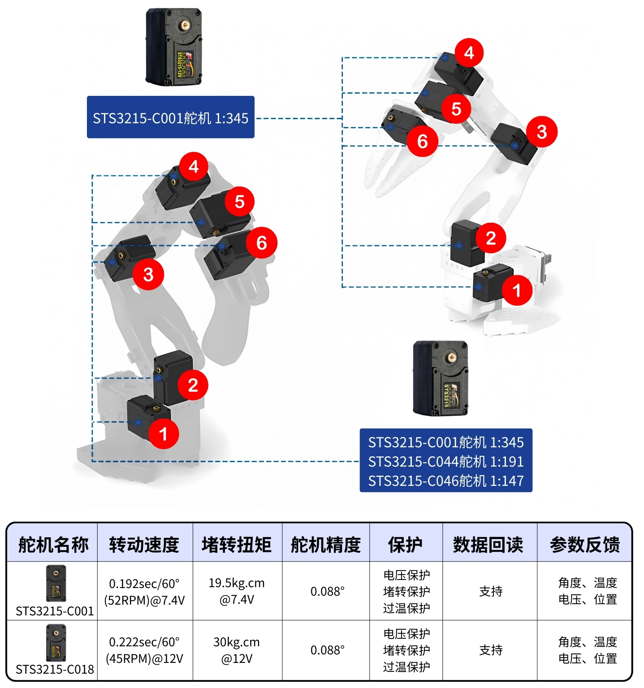
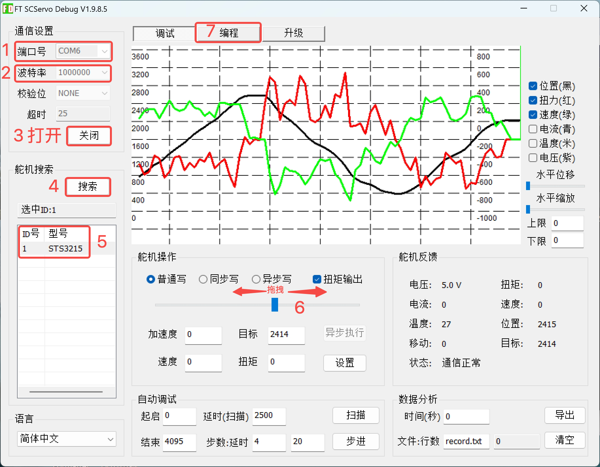
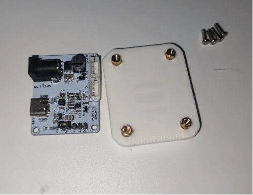
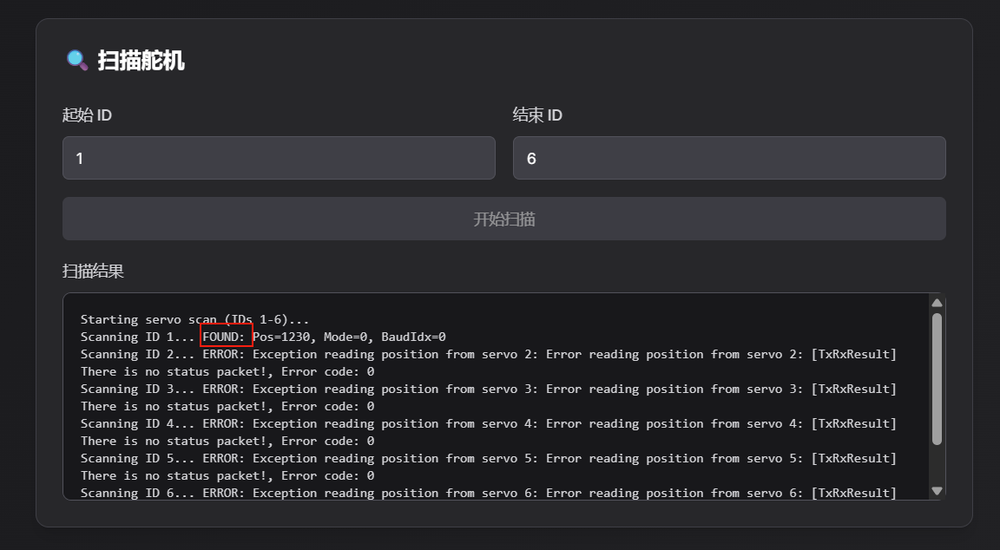

# SO-ARM101 組裝教程

注意：成品機械臂請跳過本教程

## 從動臂的3D列印件



## 主動臂的3D列印件



主動臂和從動臂非常類似，只有末端不一樣

主動臂是把手和扳機，從動臂是夾爪

## 拆除3D列印件上殘留的支撐

檢查每一個孔、洞、槽、網格，特別是類似麻將“五筒”的五個孔

這一步非常重要，不然後面擰螺絲擰不進去

## 四種舵機區分

|大型號|小型號|電壓（V）|減速比|機械臂關節|數量|
|---|---|---|---|---|---|
|STS-3215|C001|7.4|1:345|主動臂2|1|
||C044|7.4|1:191|主動臂1、3|2|
||C046|7.4|1:147|主動臂4、5、6|3|
||C047|12|1:345|從動臂所有關節|6|

> 減速比是 “電機轉速：舵機輸出軸轉速” 的比值，比如 1:345 代表電機轉 345 圈，舵機輸出軸才轉 1 圈。
> 
> 大減速比會通過齒輪組放大扭矩，所以能帶動更重的負載（比如從動臂）
> 
> 但同時，輸出軸的轉動速度會更慢（因為被“減速”了）
> 
> 如果拖拽關節，會更費力
> 
> 

下面是本項目所有舵機的型號、減速比，下劃線是它們的編號





## 區分兩種電壓的電源適配器

5V 6A 30W的電源適配器：給7.4V舵機供電（主動臂）黑色

12V 5A 60W的電源適配器，給12V舵機供電（從動臂）白色

## 下載飛特舵機除錯工具

### Windows電腦

https://gitee.com/ftservo/fddebug

下載[`FD1.9.8.5(250729).7z`](https://gitee.com/ftservo/fddebug/blob/master/FD1.9.8.5(250729).7z)，解壓，運行裡面的exe程式

### Ubuntu電腦和Mac電腦（壓縮包含教程）

[Juxi_ServoController.zip](/downloads/Juxi_ServoController.zip)



**Pro版 主動臂使用5V6A電源適配器，從動臂使用12V5A電源適配器**

舵機ID設定和舵機角度校準及組裝要提前做好，可參考[官方組裝教程](https://huggingface.co/docs/lerobot/so101)

## 第一步：設定舵機ID，安裝舵盤（除5號舵機）





1. 打開飛特上位機除錯工具，選擇COM連接埠號，波特率為一百萬，點“打開”

2. 點“搜索”，出現“STS3215”後，點“停止”，點“STS3215”

3. 選擇上方“除錯”，可以拖拽滑條讓舵機旋轉，也可以點“掃描”讓舵機往復運動。確認舵機運行正常

4. 選擇上方“編程”

5. 點“中位校準”，設定此時舵機旋轉軸位置為中位（0-4095）

6. 點“ID”，在右下角設定對應舵機的ID編號，點“儲存”。注意編號是純阿拉伯數字，不加字母。

7. 拔掉舵機連接控制板的線

8. 在舵機上插上舵機線

1號舵機插兩根線，其它舵機先只插一根線


再次提醒，請確保舵機關節 ID 和齒輪比與 **SO-ARM101** 的嚴格對應。

總線上每個電機都有一個唯一的ID。新電機通常帶有一個預設ID `1`。為了確保電機和控制器之間的通信正常，我們首先需要為每個電機設定一個唯一的ID。此外，總線上的數據傳輸速度由波特率決定。為了能夠相互通信，控制器和所有電機都需要配置相同的波特率，本機械臂舵機的波特率為100000。

為此，我們首先需要將控制器分別連接到每個電機，以便進行設定。由於我們會將這些參數寫入電機內部存儲器（EEPROM）的非易失性區域，因此只需操作一次即可。

如果您要重新利用其他機器人的電機，您可能還需要執行此步驟，因為 ID 和波特率可能不匹配。

下面的影片展示了設定電機 ID 的步驟順序。

### Windows系統

[飛特舵機上位機.zip](/downloads/飞特舵机上位机.zip)

使用飛特舵機上位機設定舵機ID並校準中位，ID設定是從1到6的！

**機械臂舵機設定ID-Windows系統.mp4**（机械臂舵机设置ID-Windows系统.mp4, larger than the site's per-file size limit — request it from support@juxitech.com）

### Linux/ubuntu系統和Mac電腦

如需飛特舵機上位機可參考上面的 [飛特舵機除錯工具](https://juxitech.feishu.cn/wiki/HllBwhjJ1iayMdkUTGgcyKbgn8g#share-Jvk1dRRl8oY0Skxrt2VczA9jnNb)

請先按照 [官方Lerobot環境安裝](https://huggingface.co/docs/lerobot/installation) 這一頁完成環境部署

注意激活虛擬環境並進入到對應的src/lerobot目錄下

conda activate lerobot

cd lerobot/src/lerobot

1、查找機械臂對應的 USB 連接埠 為了找到每個機械臂正確的連接埠，請運行實用腳本兩次：：

```Plain Text
lerobot-find-port
```

識別Leader機械臂連接埠時的示例輸出（例如，Mac 上為 `/dev/tty.usbmodem575E0031751`，或 Linux 上可能為 `/dev/ttyACM0`）：

```PowerShell
Finding all available ports for the MotorBus.
['/dev/ttyACM0', '/dev/ttyACM1']
Remove the usb cable from your MotorsBus and press Enter when done.

[...Disconnect corresponding leader or follower arm and press Enter...]

The port of this MotorsBus is /dev/ttyACM1
Reconnect the USB cable.
```

識別Follower機械臂連接埠時的示例輸出（例如，`/dev/tty.usbmodem575E0032081`，或在 Linux 上可能為 `/dev/ttyACM1`）：

```PowerShell
Finding all available ports for the MotorBus.
['/dev/ttyACM0', '/dev/ttyACM1']
Remove the usb cable from your MotorsBus and press Enter when done.

[...Disconnect corresponding leader or follower arm and press Enter...]

The port of this MotorsBus is /dev/ttyACM0
Reconnect the USB cable.
```

請記住要拔出 USB 接頭，否則將無法檢測到接口。

2、使用 USB 數據線從電腦連接到從動臂的舵機驅動板，並接通電源。然後，運行以下命令。請將命令中的--robot.port=/dev/ttyACM0 修改為找到的連接埠號。如查找的連接埠為/dev/ttyACM1，則修改為--robot.port=/dev/ttyACM1

```Python
lerobot-setup-motors \
    --robot.type=so101_follower \
    --robot.port=/dev/ttyACM0
```

您會看到以下輸出。

```Python
Connect the controller board to the 'gripper' motor only and press enter.
```

依照指示，連接夾爪的舵機。請確保它是唯一連接到舵機驅動板的舵機，並且該舵機尚未與其他任何舵機進行連接。當您按下 **[Enter]** 鍵後，腳本將自動設定該舵機的 ID 和波特率，ID設定是從6到1的！

之後，您應該會看到以下資訊：

```Python
'gripper' motor id set to 6
```

接著是下一條輸出是:

```Python
Connect the controller board to the 'wrist_roll' motor only and press enter.
```

**注意 **根據指示，對每個舵機重複上述操作。

與之前的舵機一樣，請確保它是唯一連接到驅動板的舵機，並且舵機本身沒有連接到任何其他舵機。

在每次按 **Enter** 鍵之前，請務必檢查您的線纜連接。例如，在操作電路板時，電源線可能會斷開。

當您完成所有步驟後，腳本將自動結束，此時舵機即可投入使用。現在，您可以將每根舵機的 3 針接口依次連接，並將第一個舵機（ID 為 1 的“shoulder pan”舵機）的線纜連接到驅動板。現在可以將驅動板安裝到機械臂的底座上。

對主動臂重複相同的步驟。

```Python
lerobot-setup-motors \
    --teleop.type=so101_leader \
    --teleop.port=/dev/ttyACM0
```

**機械臂舵機設定ID-Linux系統.mp4**（机械臂舵机设置ID-Linux系统.mp4, larger than the site's per-file size limit — request it from support@juxitech.com）

## 第二步：組裝

- 從動臂的組裝步驟與主動臂基本相同。唯一的區別在於第12步之後，末端執行器（夾爪和手柄）的安裝方式有所不同。

**SO-ARM101機械臂組裝教程.mp4**（SO-ARM101机械臂组装教程.mp4, larger than the site's per-file size limit — request it from support@juxitech.com）

舵機驅動板的安裝：先安裝4個銅柱，然後用四個M2.5*8的螺絲固定驅動板


**Pro版 黑色主動臂使用5V6A電源適配器，白色從動臂使用12V5A電源適配器**

## 網頁端設定舵機ID和中位校準

https://bambot.org/feetech.js?lang=zh

1、根據舵機型號輸入0或1，點擊“連接”


2、掃描ID 1~6 的舵機，可以根據掃描結果裡的FOUND確認對應ID舵機。例如圖片裡舵機 ID 1 被掃描到了



3、ID設定和中位校準

①當前舵機ID輸入為被掃描到的舵機ID

②在“ID管理”中輸入數字，點擊“更改ID”即可設定ID

③中位校準（STS3215舵機中位是2047，SCS0009舵機中位是511）

STS舵機：在“位置控制”輸入2047，並點擊“Set”

SCS舵機：在“位置控制”輸入511，並點擊“Set”


