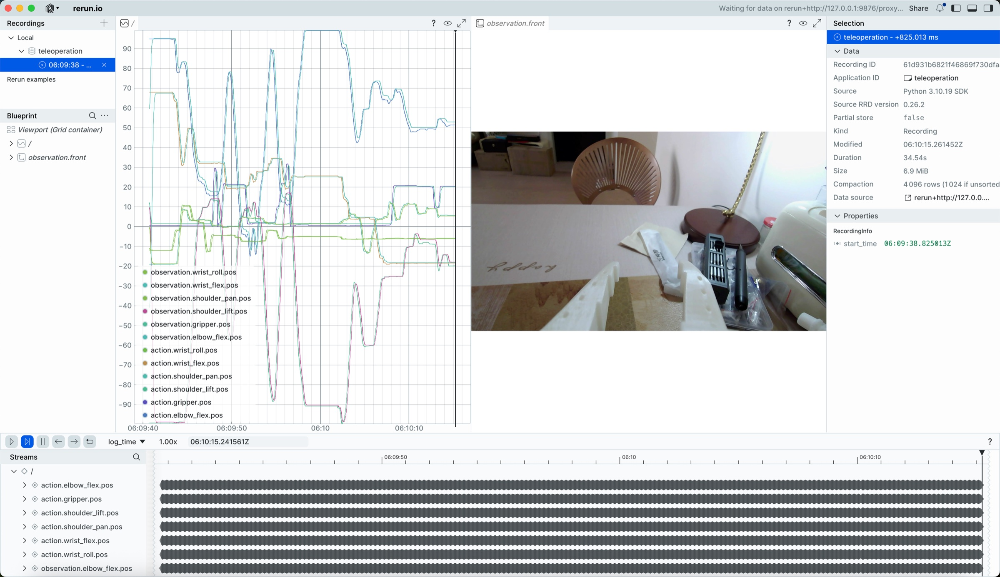
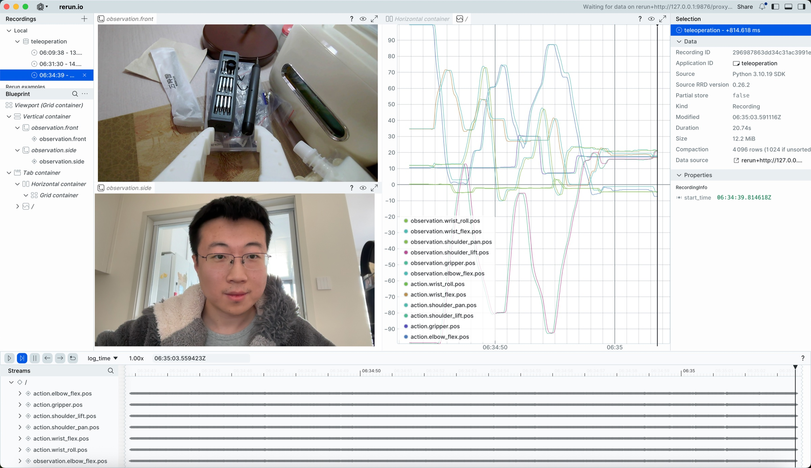

# 第五步:連接攝像頭的遙操作(macOS)

## 連接攝像頭和電腦

```Shell
lerobot-find-cameras opencv
```

運行後會列出每個攝像頭的編號，記下來填到下面命令的 `index_or_path` 裡。

> 相機參數（解像度、fps、寬高比）在採集數據集和部署模型時必須保持一致，原因見[示教採集數據集](/zh-hant/tutorials/robot-arms/so-arm101/lerobot/06-Data-Collection/Teaching-and-Recording)裡的說明。本教程統一使用 `1280×720@30`。


## 一個攝像頭，遙操作並顯示攝像頭畫面

```Shell
lerobot-teleoperate \
    --robot.type=so101_follower \
    --robot.port=/dev/tty.usbmodem5AAF2193061 \
    --robot.id=my_follower_arm \
    --robot.cameras="{ front: {type: opencv, index_or_path: 0, width: 1280, height: 720, fps: 30, fourcc: "MJPG"}}" \
    --teleop.type=so101_leader \
    --teleop.port=/dev/tty.usbmodem5AAF2194741 \
    --teleop.id=my_leader_arm \
    --display_data=true
```

運行後啟動遙操作

會打開rerun.io畫面，實時顯示各個舵機關節的軌跡，以及攝像頭實時畫面

並儲存圖像至`~/用户名/outputs/captured_images`目錄



## 多個攝像頭，遙操作並顯示攝像頭畫面

```Shell
lerobot-teleoperate \
    --robot.type=so101_follower \
    --robot.port=/dev/tty.usbmodem5AAF2193061 \
    --robot.id=my_follower_arm \
    --robot.cameras="{ front: {type: opencv, index_or_path: 0, width: 1280, height: 720, fps: 30, fourcc: "MJPG"}, side: {type: opencv, index_or_path: 1, width: 1280, height: 720, fps: 30, fourcc: "MJPG"}}" \
    --teleop.type=so101_leader \
    --teleop.port=/dev/tty.usbmodem5AAF2194741 \
    --teleop.id=my_leader_arm \
    --display_data=true
```



<RelatedProducts slugs="so-arm101" />
