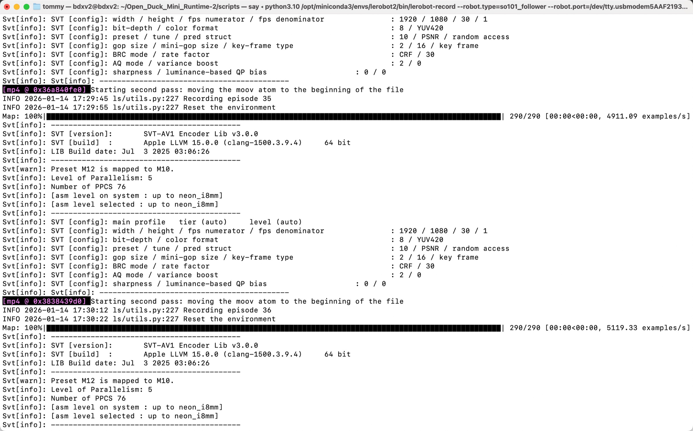
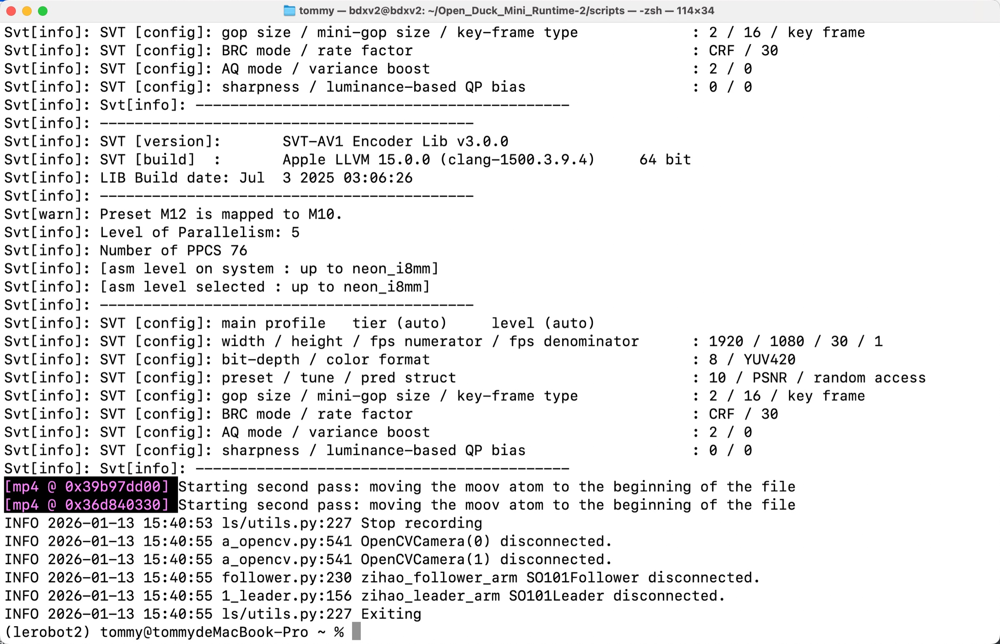

# 第六步:示教採集數據集

## 命令中的佔位符，請先替換成你自己的資訊

教程寫的是通用的操作步驟，所以從這一步開始，命令裡會用到兩個佔位符，代表只有你才有的資訊。請根據下面的說明替換，替換時**連尖括號一起去掉**：

| 佔位符 | 它代表什麼 | 怎麼替換 |
|---|---|---|
| `<你的使用者名稱>` | 你電腦的系統使用者名稱，也就是家目錄的名稱 | 在終端裡輸入 `whoami` 就能看到 |
| `<你的使用者名稱>` | 你的 HuggingFace 賬號名 | 登錄 HuggingFace 後，看右上角頭像旁的賬號名 |

舉個例子。假設終端的 `whoami` 輸出是 `zhangsan`，你的 HuggingFace 賬號名也是 `zhangsan`，那麼

- `/Users/<你的使用者名稱>/.cache/huggingface/lerobot/<你的使用者名稱>/` 就應該寫成 `/Users/zhangsan/.cache/huggingface/lerobot/zhangsan/`
- `<你的使用者名稱>/lerobot_my_dataset_a` 就應該寫成 `zhangsan/lerobot_my_dataset_a`

> 後面所有命令裡的這兩個佔位符，也按同樣的方式替換。

> **注意**：下面第一條命令是 `sudo rm -rf`，作用是刪除目錄。請務必確認路徑已經替換成你自己的，再按回車。

## 刪除之前已經有的同名數據集（如果有）

```Shell
sudo rm -rf /Users/<你的使用者名稱>/.cache/huggingface/lerobot/<你的使用者名稱>/lerobot_my_dataset_a
```

## 一個攝像頭，採集數據集-Mac電腦

```Shell
lerobot-record \
    --robot.type=so101_follower \
    --robot.port=/dev/tty.usbmodem5AAF2193061 \
    --robot.id=my_follower_arm \
    --robot.cameras="{ front: {type: opencv, index_or_path: 0, width: 1280, height: 720, fps: 30, fourcc: "MJPG"}}" \
    --teleop.type=so101_leader \
    --teleop.port=/dev/tty.usbmodem5AAF2194741 \
    --teleop.id=my_leader_arm \
    --display_data=true \
    --dataset.repo_id=<你的使用者名稱>/lerobot_my_dataset_a \
    --dataset.num_episodes=40 \
    --dataset.single_task="Grab Oranges" \
    --dataset.push_to_hub=false \
    --dataset.episode_time_s=10 \
    --dataset.reset_time_s=2
```

## 兩個攝像頭，採集數據集-Mac電腦

```Shell
lerobot-record \
    --robot.type=so101_follower \
    --robot.port=/dev/tty.usbmodem5AAF2193061 \
    --robot.id=my_follower_arm \
    --robot.cameras="{ front: {type: opencv, index_or_path: 0, width: 1280, height: 720, fps: 30, fourcc: "MJPG"}, side: {type: opencv, index_or_path: 1, width: 1280, height: 720, fps: 30, fourcc: "MJPG"}}" \
    --teleop.type=so101_leader \
    --teleop.port=/dev/tty.usbmodem5AAF2194741 \
    --teleop.id=my_leader_arm \
    --display_data=true \
    --dataset.repo_id=<你的使用者名稱>/lerobot_my_dataset_a \
    --dataset.num_episodes=40 \
    --dataset.single_task="Grab Oranges" \
    --dataset.push_to_hub=true \
    --dataset.episode_time_s=10 \
    --dataset.reset_time_s=2
```

## 採集中





鍵盤方向鍵操作：
→（右箭頭）提前終止當前episode；進入下一個episode。
←（左箭頭）取消當前episode；重新錄製。
ESC，立即停止，編碼影片，並上傳數據集。

## 採集完畢，數據集儲存目錄

```Shell
/Users/<你的使用者名稱>/.cache/huggingface/lerobot/<你的使用者名稱>/lerobot_my_dataset_a
```

## 握手

```Shell
lerobot-record \
    --robot.type=so101_follower \
    --robot.port=/dev/tty.usbmodem5AAF2193061 \
    --robot.id=my_follower_arm \
    --robot.cameras="{ front: {type: opencv, index_or_path: 0, width: 1280, height: 720, fps: 30, fourcc: "MJPG"}}" \
    --teleop.type=so101_leader \
    --teleop.port=/dev/tty.usbmodem5AAF2194741 \
    --teleop.id=my_leader_arm \
    --display_data=true \
    --dataset.repo_id=<你的使用者名稱>/lerobot_my_dataset_shake_hands \
    --dataset.num_episodes=30 \
    --dataset.single_task="Shanke Hands" \
    --dataset.push_to_hub=false \
    --dataset.episode_time_s=12 \
    --dataset.reset_time_s=1
```

採集完畢後，握手數據集會儲存在：

```Shell
/Users/<你的使用者名稱>/.cache/huggingface/lerobot/<你的使用者名稱>/lerobot_my_dataset_shake_hands
```

## 關於教程裡用到的兩個數據集

本篇示範了兩個任務，各自的用途不同：

- **抓橘子 `lerobot_my_dataset_a`**：對應前面"一個攝像頭""兩個攝像頭"兩條採集命令，也是[本地Ubuntu訓練](/zh-hant/tutorials/robot-arms/so-arm101/lerobot/07-Training/Local-Ubuntu)那篇用的例子
- **握手 `lerobot_my_dataset_shake_hands`**：對應上面的"握手"命令。從第七步訓練到第八步部署，教程統一以它為例子，所以你會看到訓練命令裡的 `--dataset.repo_id` 和 `--dataset.root` 都指向它

也就是說，**握手這份數據集才是後半段教程的主線示例**，請按它去採集。至於命令裡的 `--dataset.num_episodes=30`、`--dataset.episode_time_s=12` 這些參數，按你自己的任務調整即可。

## 採集時需要注意的幾點

- 主動臂不要出現在畫面裡，否則模型會把主動臂也當成特徵學進去，具體可參考[採集數據集注意事項](/zh-hant/tutorials/robot-arms/so-arm101/lerobot/06-Data-Collection/Collection-Notes)
- 每一輪採集結束後都要把物體擺回起點，動作儘量保持一致，數據集的一致性比數量更重要
- **採集和推理時的相機參數（解像度、fps、寬高比）必須完全一致**。解像度會被寫進數據集的元數據，訓練和推理時會做校驗，不一致會直接報錯；就算不報錯，解像度不同也意味着視野（取景範圍）不同，模型看到的世界和你示教時的對不上。本教程統一使用 `1280×720@30`，想改成別的值的話，採集、遙操、部署三處命令要一起改
- 中途退出不要停在 reset 階段，否則這一輪會因為沒有任何幀而儲存失敗（不影響已採集的數據）
- 如果中途退出想接着採，用 `--resume=true`，並且 `--dataset.root` 和 `--dataset.repo_id` 要和第一次完全一致

## 採集完成後

數據預設儲存在 `~/.cache/huggingface/lerobot/<你的使用者名稱>/` 下。接下來：

1. 想把數據集備份到雲端，見[上傳數據集到HuggingFace（可選）](/zh-hant/tutorials/robot-arms/so-arm101/lerobot/06-Data-Collection/HF-Dataset-Upload)
2. 準備開始訓練，請接着看[第七步：訓練模型](/zh-hant/tutorials/robot-arms/so-arm101/lerobot/07-Training/Cloud-GPU)，那篇會先帶你在雲GPU平台上把數據傳上去、把環境裝好

<RelatedProducts slugs="so-arm101" />
