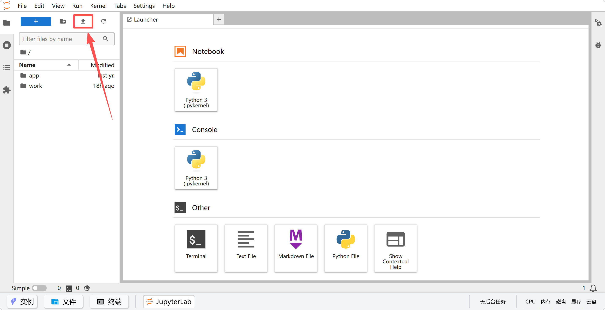
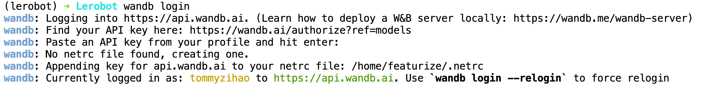

# 第七步:雲端 GPU 訓練環境設定

## 訓練之前，先看這裡

數據集已經在第六步採集好了，接下來就是訓練模型。這一步包含三件事，本篇負責前兩件：

1. **準備訓練環境**：在雲GPU平台開通實例，裝好 LeRobot、ffmpeg、wandb 等（本篇）
2. **把數據集傳到雲GPU上**：第六步採的數據還在你自己的電腦裡（本篇的"掛載數據集"一節）
3. **執行訓練命令**：算法怎麼選、參數怎麼調，見下面各篇

## 教程用到的數據集

訓練和推理的命令裡，數據集用的是**握手任務 `lerobot_my_dataset_shake_hands`**（第六步的第三篇演示的就是它），本地路徑是 `~/lerobot_my_dataset_shake_hands`。執行訓練命令前，請確認這個目錄確實存在、名字完全一致。

如果你想訓練的是自己採的任務，把命令裡所有 `lerobot_my_dataset_shake_hands` 替換成你自己的數據集名即可。

## 訓練算法怎麼選

| 算法 | 文檔 | 特點 |
|---|---|---|
| ACT | [訓練命令列-ACT](/zh-hant/tutorials/robot-arms/so-arm101/lerobot/07-Training/Command-ACT) | 推薦入門，模型小、訓練快，單卡一小時能看到效果 |
| SmolVLA | [訓練命令列-smolvla](/zh-hant/tutorials/robot-arms/so-arm101/lerobot/07-Training/Command-smolvla) | 推薦進階，可基於預訓練模型微調 |
| pi0 | [訓練命令列-pi0](/zh-hant/tutorials/robot-arms/so-arm101/lerobot/07-Training/Command-pi0) | 效果最好，但顯存佔用大、訓練慢 |
| pi0.5 | [訓練命令列-pi0.5](/zh-hant/tutorials/robot-arms/so-arm101/lerobot/07-Training/Command-pi0.5) | pi0 的改進版 |
| pi0fast | [訓練命令列-pi0fast](/zh-hant/tutorials/robot-arms/so-arm101/lerobot/07-Training/Command-pi0fast) | 推理速度更快 |

建議先從 ACT 跑通一遍完整流程，熟悉之後再換其它算法。

## 訓練之後

- 想把訓練好的模型傳到 Hugging Face（備份、換機器、分享給別人），見[上傳模型到HuggingFace（可選）](/zh-hant/tutorials/robot-arms/so-arm101/lerobot/07-Training/HF-Model-Upload)
- 想把模型下載回本地電腦，見[獲得模型權重檔案](/zh-hant/tutorials/robot-arms/so-arm101/lerobot/07-Training/Model-Weights)

## 本機訓練

如果你的電腦本身就有英偉達顯卡，也可以不用雲GPU，直接在本機訓練，見[本地Ubuntu訓練](/zh-hant/tutorials/robot-arms/so-arm101/lerobot/07-Training/Local-Ubuntu)。

## 關閉自己電腦的網絡代理

不然可能打不開Jupyter的命令列

## 登錄雲GPU平台Featurize

https://featurize.cn?s=d7ce99f842414bfcaea5662a97581bd1

## 開啟一個雲GPU實例




> 點擊下方的“JupyterLab”，左上角有個上傳按鈕，可以在這裡上傳代碼和數據集
> 
> 

## 安裝配置環境

```Shell
conda create -y -n lerobot python=3.12
conda activate lerobot
conda install ffmpeg=7.1.1 -c conda-forge -y
# git clone https://github.com/Seeed-Projects/lerobot.git ~/work/Lerobot
git clone https://github.com/huggingface/lerobot.git
cd lerobot
pip install -e ".[pi]"
pip install wandb --upgrade
# export HF_ENDPOINT=https://hf-mirror.com
hf auth login

# 不上傳到Huggingface和不需要wandb則不用安裝
```

> 如果在模型安裝的時候缺少了training，需要額外安裝一下
> 
> `pip install -e ".[training]"`
> 
> 

## 登錄wandb

```Shell
wandb login
複製粘貼API Key，回車
```



## 掛載數據集

第一步，把第六步採集好的數據集壓縮成 zip，上傳到雲GPU平台的"數據集"裡（JupyterLab 左上角有上傳按鈕）。平台處理完之後，會給你一條下載命令。

第二步，在實例的命令列裡執行這條下載命令並解壓：

```Shell
複製實例下載命令，類似：
featurize dataset download 7f40bdaa-b1a4-4c00-9652-ff26fd079109

unzip lerobot_my_dataset_shake_hands.zip
```

數據集出現在`~`目錄下。

解壓後可以用 `ls ~` 確認一下，目錄名要和訓練命令裡的 `--dataset.root` 完全一致（本篇和後面各篇用的都是 `~/lerobot_my_dataset_shake_hands`）。如果解壓出來多了一層同名目錄，比如 `~/lerobot_my_dataset_shake_hands/lerobot_my_dataset_shake_hands`，就把裡面那層的內容移到外層，或者直接把 `--dataset.root` 指向實際的層級。

## 修改權重儲存頻率（選做）

打開`lerobot/src/lerobot/configs/train.py`

將save_freq，從20_000修改為5_000

這樣能在訓練更早期獲得模型權重檔案

<RelatedProducts slugs="so-arm101" />
