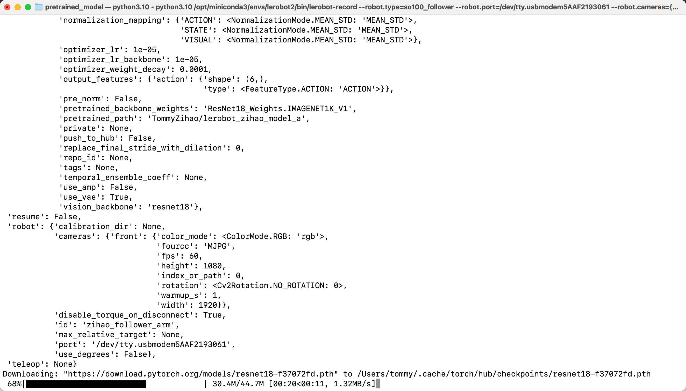

# 第八步:推論命令列說明

## 版本說明（重要，請先讀）

從 LeRobot **0.6.0** 開始，訓練好的模型要用 `lerobot-rollout` 來部署。原來的 `lerobot-record --policy.path=...` 寫法，在 **0.5.2** 版本就已經被移除了。

本教程第一步是用 `git clone` 安裝 LeRobot 的，拿到的是當前最新版本，所以請使用下面 `lerobot-rollout` 的命令列。如果堅持用 `lerobot-record`，程式會直接報錯，並提示你改用 `lerobot-rollout`。

兩個命令的分工是這樣的：

- `lerobot-record`：只負責**採集示教數據**（第六步用的就是它），它現在會拒絕 `eval_` 開頭的數據集名
- `lerobot-rollout`：負責**部署訓練好的模型**，用 `--strategy.type` 選擇工作方式

## rollout 命令列參數

| 參數 | 說明 |
|---|---|
| `--strategy.type` | 工作方式。`base` 只跑模型、不錄數據，用於現場看效果；`episodic` 按 episode 錄製並帶 reset 階段，行為接近舊版的 `lerobot-record` |
| `--policy.path` | 模型路徑，指向訓練輸出裡的 `checkpoints/last/pretrained_model` |
| `--task` | 任務描述，配合 `--strategy.type=base` 使用 |
| `--duration` | 執行秒數，`0` 表示不限時 |
| `--interactive` | 需要中途接管時加上它，可在終端用 `/stop`、`/reset` 等命令控制 |
| `--display_data` | 是否啟動 rerun.io 可視化介面 |
| `--policy.device` | 計算裝置，比如 `cuda`、`cpu` |

## 相機參數必須和採集時一致

下面所有命令裡的 `--robot.cameras` 用的都是 `1280×720@30`，這是和[示教採集數據集](/zh-hant/tutorials/robot-arms/so-arm101/lerobot/06-Data-Collection/Teaching-and-Recording)統一過的值。部署時必須沿用採集時的解像度、fps 和寬高比：解像度會寫進數據集元數據並參與校驗，不一致會直接報錯；即便僥倖通過，視野不同也會讓模型"看到的世界"和你示教時不一樣，效果會明顯變差。

## 關於可視化

`--display_data=true` 會啟動 rerun.io 的可視化介面，同時在 `/Users/<你的使用者名稱>/.cache/huggingface/lerobot/rollout_lerobot_my_dataset_a/images/observation.images.front/episode-000000` 目錄下儲存每一幀的圖片，比較佔空間，正式使用時可以設成 `--display_data=false`。

## 以抓橘子任務為例

- 現場評估（帶實時可視化）

```Shell
lerobot-rollout  \
  --strategy.type=base \
  --robot.type=so101_follower \
  --robot.port=/dev/tty.usbmodem5AAF2193061 \
  --robot.cameras="{ front: {type: opencv, index_or_path: 0, width: 1280, height: 720, fps: 30, fourcc: "MJPG"}}" \
  --robot.id=my_follower_arm \
  --policy.path=/Users/<你的使用者名稱>/Downloads/7-lerobot/checkpoints/last/pretrained_model \
  --task="Grab Oranges" \
  --duration=60 \
  --display_data=true
```

- 現場評估（不帶實時可視化）

```Shell
lerobot-rollout  \
  --strategy.type=base \
  --robot.type=so101_follower \
  --robot.port=/dev/tty.usbmodem5AAF2193061 \
  --robot.cameras="{ front: {type: opencv, index_or_path: 0, width: 1280, height: 720, fps: 30, fourcc: "MJPG"}}" \
  --robot.id=my_follower_arm \
  --policy.path=/Users/<你的使用者名稱>/Downloads/7-lerobot/checkpoints/last/pretrained_model \
  --task="Grab Oranges" \
  --duration=60 \
  --display_data=false
```

- 推理 HuggingFace 模型 Repo 上的模型

```Shell
lerobot-rollout  \
  --strategy.type=base \
  --robot.type=so101_follower \
  --robot.port=/dev/tty.usbmodem5AAF2193061 \
  --robot.cameras="{ front: {type: opencv, index_or_path: 0, width: 1280, height: 720, fps: 30, fourcc: "MJPG"}}" \
  --robot.id=my_follower_arm \
  --policy.path=<你的使用者名稱>/lerobot_my_model_a \
  --task="Grab Oranges" \
  --duration=60 \
  --display_data=true
```

執行後會下載模型



- 評估並錄製數據（`--strategy.type=episodic`）

想邊跑邊把過程錄成數據集，就把 `base` 換成 `episodic`。這個模式下不寫 `--task`，改用 `--dataset.single_task`，並且必須給出 `--dataset.repo_id`：

```Shell
lerobot-rollout  \
  --strategy.type=episodic \
  --robot.type=so101_follower \
  --robot.port=/dev/tty.usbmodem5AAF2193061 \
  --robot.cameras="{ front: {type: opencv, index_or_path: 0, width: 1280, height: 720, fps: 30, fourcc: "MJPG"}}" \
  --robot.id=my_follower_arm \
  --policy.path=/Users/<你的使用者名稱>/Downloads/7-lerobot/checkpoints/last/pretrained_model \
  --dataset.repo_id=<你的使用者名稱>/rollout_lerobot_my_dataset_a \
  --dataset.num_episodes=10 \
  --dataset.single_task="Grab Oranges" \
  --display_data=false
```

<RelatedProducts slugs="so-arm101" />
