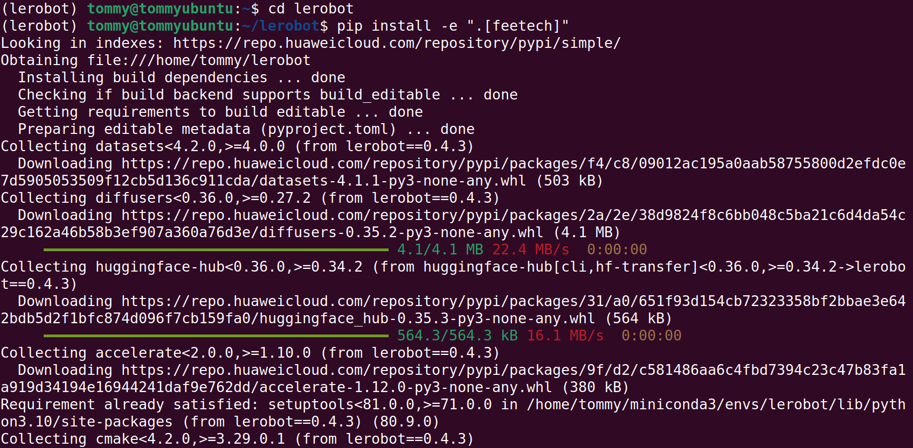
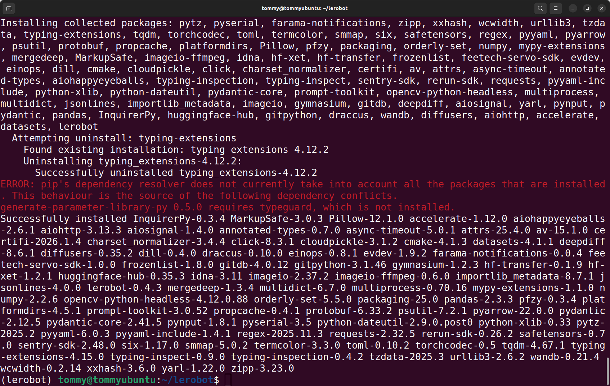
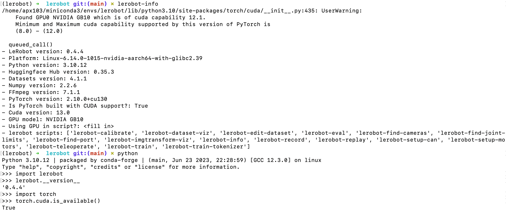

# Ubuntu電腦

黑色主動臂使用 5V6A 電源適配器

白色從動臂使用 12V5A 電源適配器

## 安裝Miniconda

https://www.anaconda.com/download

## pip換源

```Shell
pip config set global.index-url https://mirrors.aliyun.com/pypi/simple
```

## conda換源

```Shell
# 清空原有 .condarc 配置（可选，避免冲突）
echo "" > ~/.condarc

# 写入清华源配置
cat << EOF > ~/.condarc
channels:
  - defaults
show_channel_urls: true
default_channels:
  - https://mirrors.tuna.tsinghua.edu.cn/anaconda/pkgs/main
  - https://mirrors.tuna.tsinghua.edu.cn/anaconda/pkgs/r
  - https://mirrors.tuna.tsinghua.edu.cn/anaconda/pkgs/msys2
custom_channels:
  conda-forge: https://mirrors.tuna.tsinghua.edu.cn/anaconda/cloud
  msys2: https://mirrors.tuna.tsinghua.edu.cn/anaconda/cloud
  bioconda: https://mirrors.tuna.tsinghua.edu.cn/anaconda/cloud
  menpo: https://mirrors.tuna.tsinghua.edu.cn/anaconda/cloud
  pytorch: https://mirrors.tuna.tsinghua.edu.cn/anaconda/cloud
  pytorch-lts: https://mirrors.tuna.tsinghua.edu.cn/anaconda/cloud
  simpleitk: https://mirrors.tuna.tsinghua.edu.cn/anaconda/cloud
EOF

# 清除缓存使配置生效
conda clean -i
```

## 建立虛擬環境

```Shell
conda create -y -n lerobot python=3.12 -y
```

## 進入虛擬環境

```Shell
conda activate lerobot
```

## 安裝ffmpeg

```Shell
conda install *ffmpeg*=7.1.1 *-c* conda-forge -y
```

驗證安裝成功

```Shell
ffmpeg
```


## 下載LeRobot官方程式碼庫

```Shell
git clone https://github.com/huggingface/lerobot.git
```

## 安裝程式碼倉庫

```Shell
#cd lerobot-main
cd lerobot

pip install -e ".[feetech]"
```





## 驗證安裝成功

```Shell
lerobot-info

python

import lerobot
lerobot.__version__

import torch
torch.cuda.is_available()
import scservo_sdk
```

## 在4090主機上執行的結果


## 在輝達DGX Spark上執行的結果




