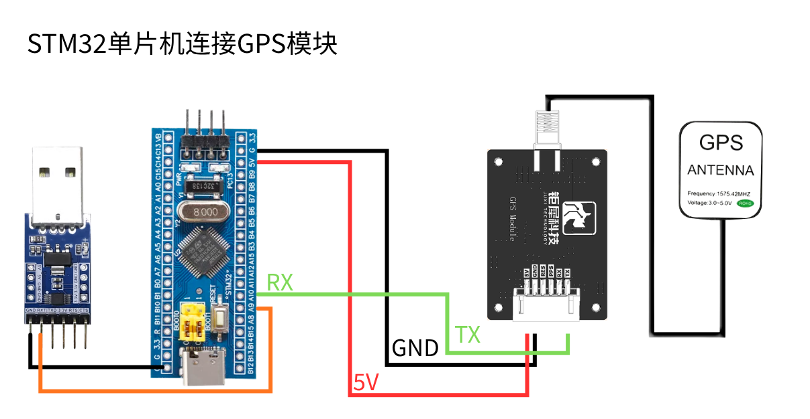
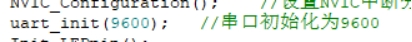
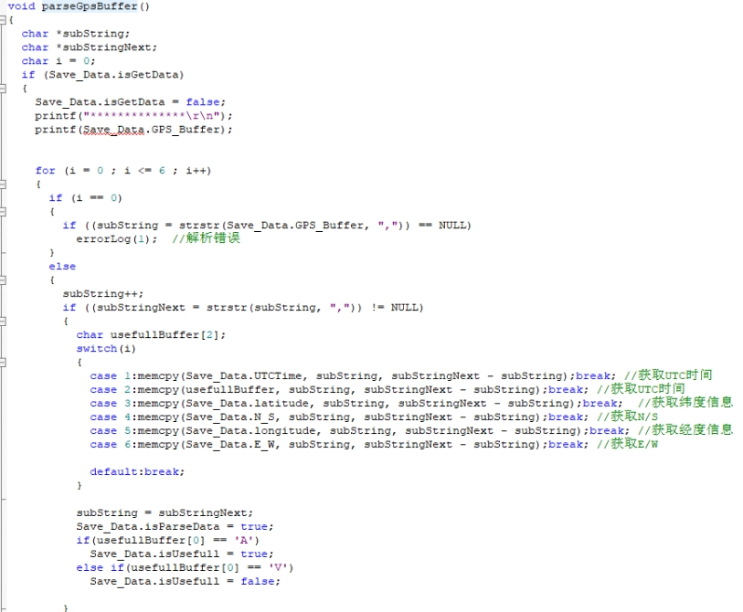
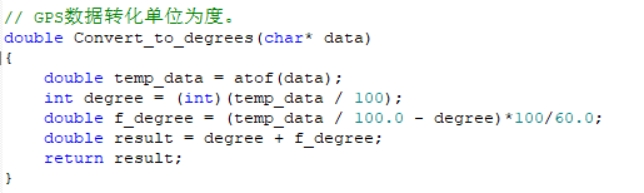
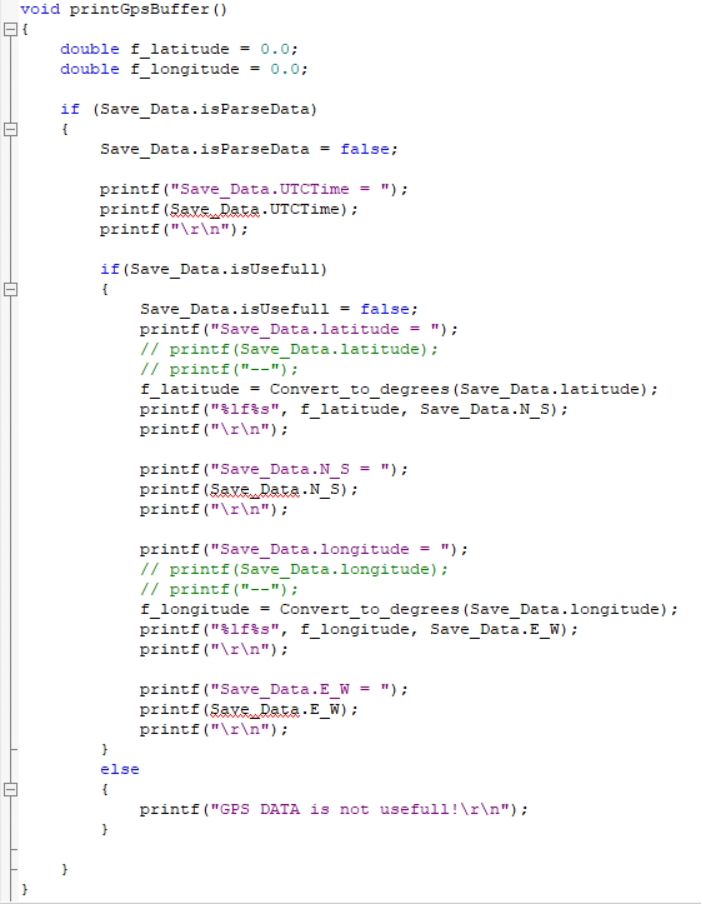
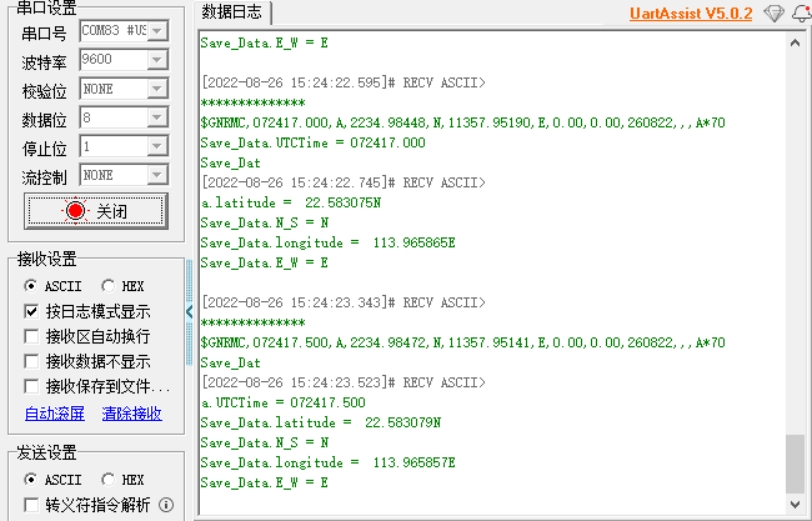

# STM32F103:GPS 解析輸出

**1. 學習目標**

本次課程我們主要學習使用STM32F103C8T6和GPS模組模組實現位置資訊解析輸出功能。

**2. 課前準備**

GPS模組採用的是UART和USB通訊，這裏使用STM32的UART口讀取資訊，將模組的TXD連接STM32F103C8T6板子的PA10引腳。VCC和GND分別連接STM32F103C8T6的5V和GND；TTL模組的GND和RXD分別與STM32的GND和PA9連接。

**3.** **程式**

模組的波特率為9600。

 

讀取並解析接收到的數據。

 

將經緯度資訊的單位轉化為度

 

通過串口列印接收到的數據。

 

注意：其實GPS/北斗定位的座標系值並不是簡單的100倍關係，而是需要做一次度分秒的轉換的。則我們獲取的GPS/北斗座標值，如北緯2429.53531，東經11810.78036，需要做如下計算：24+（29.53531/60）≈ 24.49225517 118+（10.78036/60）≈118.17967267。並且不同單片機可能存在數據轉化精度的問題而存在一定誤差。

**4. 實驗現象**

模組通電後，需要32s左右的時間啓動，之後模組上的串口列印狀態燈會持續閃爍，此時可以正常接收數據。

程式下載後執行，打開串口軟件，波特率設定為9600，串口會循環列印現在的位置資訊。

 

注意，模組天線需要在室外，否則可能搜索不到GPS信號。

<RelatedProducts slugs="gps-beidou-module" />
