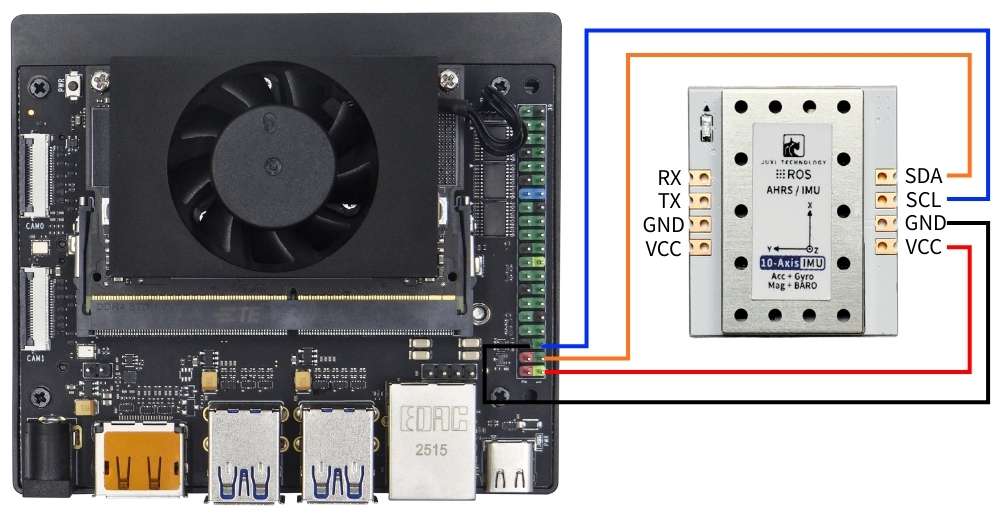
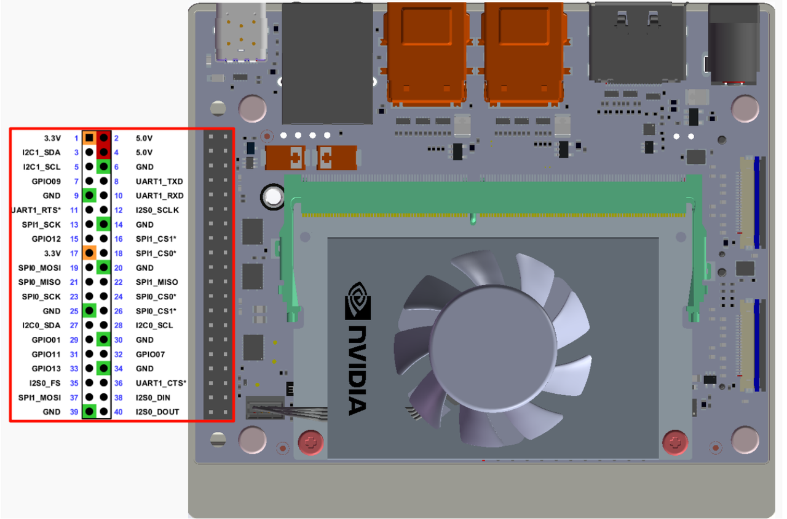
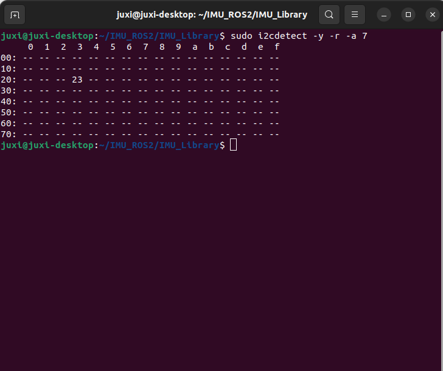
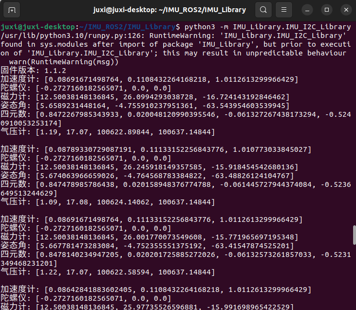
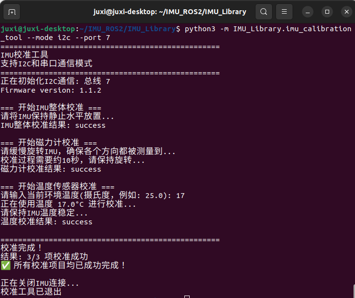
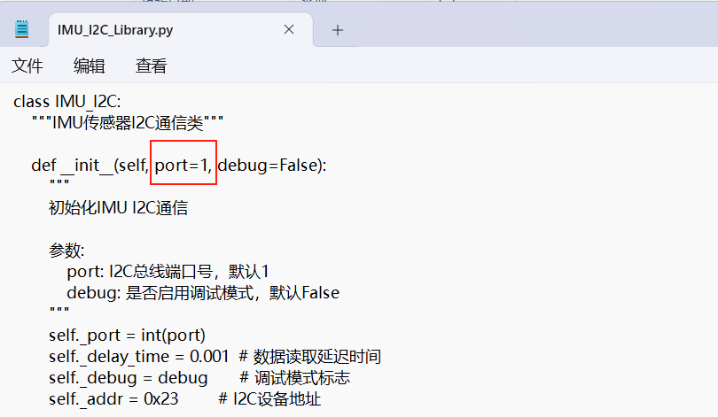

# Jetson

## 1.連接設備

本教程以Jetson Orin NX主板爲例。

將IMU姿態傳感器按照下圖連接到Jetson Orin NX的I2C接口。





## 2.查看設備狀態

首先安裝 I2Ctool，終端輸入：

```PowerShell
sudo apt-get update
sudo apt-get install -y i2c-tools
```

查看I2C設備

```PowerShell
sudo i2cdetect -y -r -a 7
```



## 3.安裝驅動庫

3.1**安裝代碼所需python庫**

```PowerShell
sudo apt update
sudo apt install -y python3-serial
sudo apt install -y python3-smbus2
```

3.2傳輸文件

IMU_ROS2.zip

如果還不會使用MobaXterm傳輸文件的朋友，請查看以下網頁MobaXterm詳細安裝和操作方法：[文件远程传输](https://juxitech.feishu.cn/wiki/KB0Jw2o6Wis9f0ksyeFceVmgnfd)

通過MobaXterm軟件將 解壓後的文件 拖入 樹莓派5 上。


## 4.查看imu數據

**進入 ~/IMU_Library目錄，運行IMU_Serial_Library.py文件**

```PowerShell
cd ~/imu_ros2/src/IMU_ROS2/IMU_Library

# 运行 IMU 数据打印文件
python3 -m IMU_Library.IMU_I2C_Library
```



注意：以上爲10軸IMU的數據讀取，6軸無磁力計（Magnetometer）與氣壓計（Barometer）數據，9軸無氣壓計（Barometer）數據。

## **5.IMU校準**

**進入 ~/IMU_Library目錄，運行imu_calibration_tool.py文件**

```PowerShell
cd ~/IMU_Library

# 运行 IMU 校准代码文件 --I2C通讯校准
# 执行所有校准（整体、磁力计、温度）
python3 -m IMU_Library.imu_calibration_tool --mode i2c --port 7

# 仅整体校准
python3-m IMU_Library.imu_calibration_tool --mode i2c --port 7 --calibrate imu

# 仅磁力计校准
python3-m IMU_Library.imu_calibration_tool --mode i2c --port 7 --calibrate mag

# 仅温度校准
python3-m IMU_Library.imu_calibration_tool --mode i2c --port 7 --calibrate temp
```



## 6.注意事項

使用 orin系列主板 時，需要根據實際情況修改I2C的總線的序號，修改位置如下圖。通常是7號總線




